# Authorization Integration

Off-chain services -- the OPS backend, Governance API, and relayer -- each interact with the on-chain authorization system differently. This guide covers how each service integrates, how Go bindings are generated, and how third-party partners can be onboarded with scoped permissions and zero code changes.

## OPS Backend Integration

### Architecture

The OPS backend uses role-scoped wallets. Each API tier maps to a dedicated wallet with a specific on-chain role. The `RaylsAccessManagerV1` validates every call through `canCall()`.

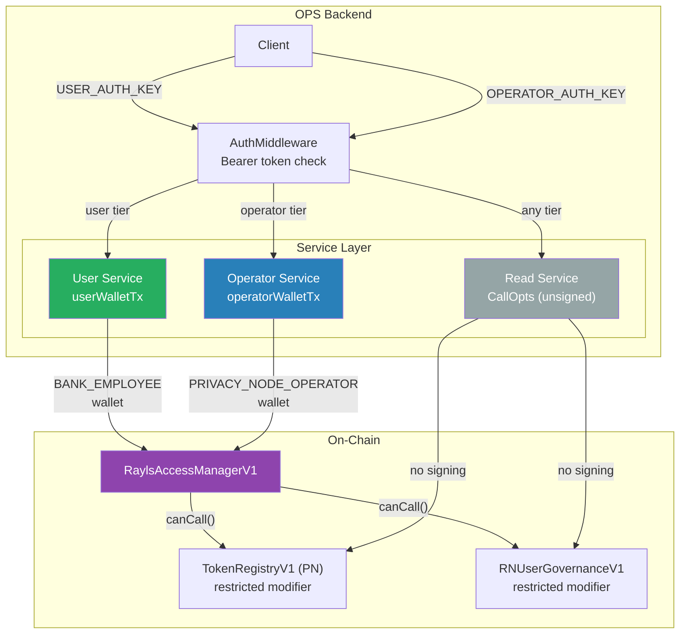
```mermaid
graph TD
    subgraph "OPS Backend"
        CLIENT["Client"]
        AUTH["AuthMiddleware<br/>Bearer token check"]

        subgraph "Service Layer"
            USER_SVC["User Service<br/>userWalletTx"]
            OP_SVC["Operator Service<br/>operatorWalletTx"]
            READ_SVC["Read Service<br/>CallOpts (unsigned)"]
        end
    end

    subgraph "On-Chain"
        MGR["RaylsAccessManagerV1"]
        TG["TokenRegistryV1 (PN)<br/>restricted modifier"]
        UG["RNUserGovernanceV1<br/>restricted modifier"]
    end

    CLIENT -->|"USER_AUTH_KEY"| AUTH
    CLIENT -->|"OPERATOR_AUTH_KEY"| AUTH

    AUTH -->|"user tier"| USER_SVC
    AUTH -->|"operator tier"| OP_SVC
    AUTH -->|"any tier"| READ_SVC

    USER_SVC -->|"BANK_EMPLOYEE<br/>wallet"| MGR
    OP_SVC -->|"PRIVACY_NODE_OPERATOR<br/>wallet"| MGR

    MGR -->|"canCall()"| TG
    MGR -->|"canCall()"| UG

    READ_SVC -->|"no signing"| TG
    READ_SVC -->|"no signing"| UG

    style USER_SVC fill:#27ae60,color:#fff
    style OP_SVC fill:#2980b9,color:#fff
    style READ_SVC fill:#95a5a6,color:#fff
    style MGR fill:#8e44ad,color:#fff
```

### Implementation Steps

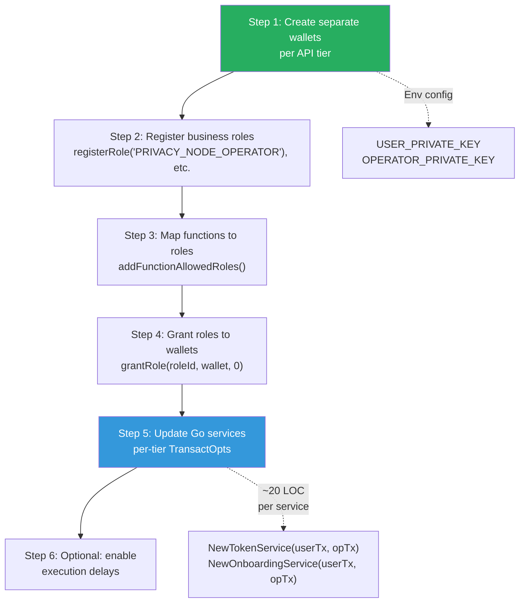
```mermaid
flowchart TD
    S1["Step 1: Create separate wallets<br/>per API tier"]
    S2["Step 2: Register business roles<br/>registerRole('PRIVACY_NODE_OPERATOR'), etc."]
    S3["Step 3: Map functions to roles<br/>addFunctionAllowedRoles()"]
    S4["Step 4: Grant roles to wallets<br/>grantRole(roleId, wallet, 0)"]
    S5["Step 5: Update Go services<br/>per-tier TransactOpts"]
    S6["Step 6: Optional: enable<br/>execution delays"]

    S1 --> S2 --> S3 --> S4 --> S5 --> S6

    S1 -.->|"Env config"| N1["USER_PRIVATE_KEY<br/>OPERATOR_PRIVATE_KEY"]
    S5 -.->|"~20 LOC<br/>per service"| N2["NewTokenService(userTx, opTx)<br/>NewOnboardingService(userTx, opTx)"]

    style S1 fill:#27ae60,color:#fff
    style S5 fill:#3498db,color:#fff
```

### Go Code Example

```go
// Role-scoped wallets
type TokenService struct {
    bankEmployeeTx *bind.TransactOpts  // BANK_EMPLOYEE role
    operatorTx     *bind.TransactOpts  // PRIVACY_NODE_OPERATOR role
    readOpts       *bind.CallOpts      // unsigned reads
    registry       *TokenRegistryV1    // PN TokenRegistryV1
}

func (s *TokenService) RegisterToken(params TokenParams) error {
    // Uses BANK_EMPLOYEE wallet - can only call registerToken()
    _, err := s.registry.RegisterToken(s.bankEmployeeTx, params.TokenAddress)
    return err
}

func (s *TokenService) ApproveOnPrivacyNode(params StatusParams) error {
    // Uses PRIVACY_NODE_OPERATOR wallet - can approve locally (updatePrivacyNodeStatus)
    // but cannot register a token
    _, err := s.registry.UpdatePrivacyNodeStatus(s.operatorTx, params.TokenAddress, params.Status)
    return err
}
```

## Governance API Integration

The Governance API is **read-only** from a blockchain perspective. Integration is about consuming authorization data, not enforcing it.

### Architecture

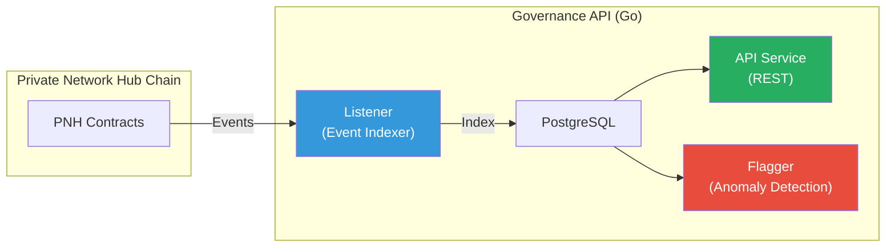
```mermaid
graph LR
    subgraph "Governance API (Go)"
        LISTENER["Listener<br/>(Event Indexer)"]
        DB["PostgreSQL"]
        API["API Service<br/>(REST)"]
        FLAGGER["Flagger<br/>(Anomaly Detection)"]
    end

    subgraph "Private Network Hub Chain"
        CONTRACTS["PNH Contracts"]
    end

    CONTRACTS -->|"Events"| LISTENER
    LISTENER -->|"Index"| DB
    DB --> API
    DB --> FLAGGER

    style LISTENER fill:#3498db,color:#fff
    style API fill:#27ae60,color:#fff
    style FLAGGER fill:#e74c3c,color:#fff
```

### Enhancement Opportunities

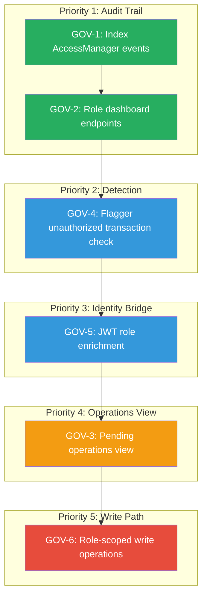
```mermaid
graph TD
    subgraph priority1 ["Priority 1: Audit Trail"]
        GOV1["GOV-1: Index AccessManager events"]
        GOV2["GOV-2: Role dashboard endpoints"]
    end

    subgraph priority2 ["Priority 2: Detection"]
        GOV4["GOV-4: Flagger unauthorized transaction check"]
    end

    subgraph priority3 ["Priority 3: Identity Bridge"]
        GOV5["GOV-5: JWT role enrichment"]
    end

    subgraph priority4 ["Priority 4: Operations View"]
        GOV3["GOV-3: Pending operations view"]
    end

    subgraph priority5 ["Priority 5: Write Path"]
        GOV6["GOV-6: Role-scoped write operations"]
    end

    GOV1 --> GOV2
    GOV2 --> GOV4
    GOV4 --> GOV5
    GOV5 --> GOV3
    GOV3 --> GOV6

    style GOV1 fill:#27ae60,color:#fff
    style GOV2 fill:#27ae60,color:#fff
    style GOV4 fill:#3498db,color:#fff
    style GOV5 fill:#3498db,color:#fff
    style GOV3 fill:#f39c12,color:#fff
    style GOV6 fill:#e74c3c,color:#fff
```

### New Events to Index

The authorization system emits events that the Governance API listener should index into new database tables.

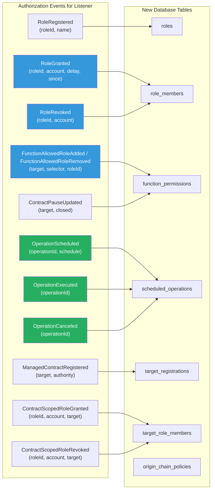
```mermaid
graph LR
    subgraph "Authorization Events for Listener"
        E1["RoleGranted<br/>(roleId, account, delay, since)"]
        E2["RoleRevoked<br/>(roleId, account)"]
        E3["FunctionAllowedRoleAdded / FunctionAllowedRoleRemoved<br/>(target, selector, roleId)"]
        E4["OperationScheduled<br/>(operationId, schedule)"]
        E5["OperationExecuted<br/>(operationId)"]
        E6["OperationCanceled<br/>(operationId)"]
        E7["ContractPauseUpdated<br/>(target, closed)"]
        E8["RoleRegistered<br/>(roleId, name)"]
        E9["ManagedContractRegistered<br/>(target, authority)"]
        E10["ContractScopedRoleGranted<br/>(roleId, account, target)"]
        E11["ContractScopedRoleRevoked<br/>(roleId, account, target)"]
    end

    subgraph "New Database Tables"
        T1["roles"]
        T2["role_members"]
        T3["function_permissions"]
        T4["scheduled_operations"]
        T5["target_registrations"]
        T6["target_role_members"]
        T7["origin_chain_policies"]
    end

    E1 --> T2
    E2 --> T2
    E3 --> T3
    E4 --> T4
    E5 --> T4
    E6 --> T4
    E7 --> T3
    E8 --> T1
    E9 --> T5
    E10 --> T6
    E11 --> T6

    style E1 fill:#3498db,color:#fff
    style E2 fill:#3498db,color:#fff
    style E3 fill:#3498db,color:#fff
    style E4 fill:#27ae60,color:#fff
    style E5 fill:#27ae60,color:#fff
    style E6 fill:#27ae60,color:#fff
```

### Priority Table

| # | Opportunity | Type | Effort | Value |
|---|---|---|---|---|
| GOV-1 | Index AccessManager events | Read-only | Medium | Complete audit trail of all permission changes |
| GOV-2 | Role dashboard endpoints | Read-only | Medium | Operators can see who has what role |
| GOV-3 | Scheduled operations view | Read-only | Medium | Pending delayed operations |
| GOV-4 | Flagger: unauthorized transaction detection | Read-only | Low | Detect unauthorized attempts |
| GOV-5 | JWT role enrichment | Read-only | Low | Bridge JWT auth with on-chain roles |
| GOV-6 | Write operations via role-scoped wallet | Write | High | Governance actions from dashboard |

## Relayer Integration

### Relayer Authorization Flow

The relayer receives its `RELAYER` role during deployment. The Cryptographic Trust Suite (CTS) provides the relayer addresses, which are then granted the role on the AccessManager. The relayer polls until authorized before beginning message processing.

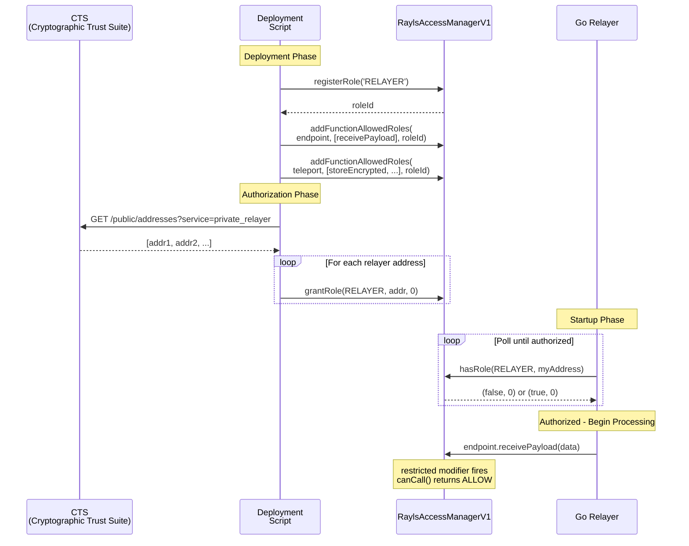
```mermaid
sequenceDiagram
    participant CTS as CTS<br/>(Cryptographic Trust Suite)
    participant Deploy as Deployment<br/>Script
    participant Manager as RaylsAccessManagerV1
    participant Relayer as Go Relayer

    Note over Deploy: Deployment Phase
    Deploy->>Manager: registerRole('RELAYER')
    Manager-->>Deploy: roleId

    Deploy->>Manager: addFunctionAllowedRoles(<br/>endpoint, [receivePayload], roleId)
    Deploy->>Manager: addFunctionAllowedRoles(<br/>teleport, [storeEncrypted, ...], roleId)

    Note over Deploy: Authorization Phase
    Deploy->>CTS: GET /public/addresses?service=private_relayer
    CTS-->>Deploy: [addr1, addr2, ...]

    loop For each relayer address
        Deploy->>Manager: grantRole(RELAYER, addr, 0)
    end

    Note over Relayer: Startup Phase
    loop Poll until authorized
        Relayer->>Manager: hasRole(RELAYER, myAddress)
        Manager-->>Relayer: (false, 0) or (true, 0)
    end

    Note over Relayer: Authorized - Begin Processing
    Relayer->>Manager: endpoint.receivePayload(data)
    Note over Manager: restricted modifier fires<br/>canCall() returns ALLOW
```

### Token Handler Auth Pattern

Dynamically deployed token handlers verify the caller's `RELAYER` role by querying the AccessManager through the endpoint's `authority()` reference.

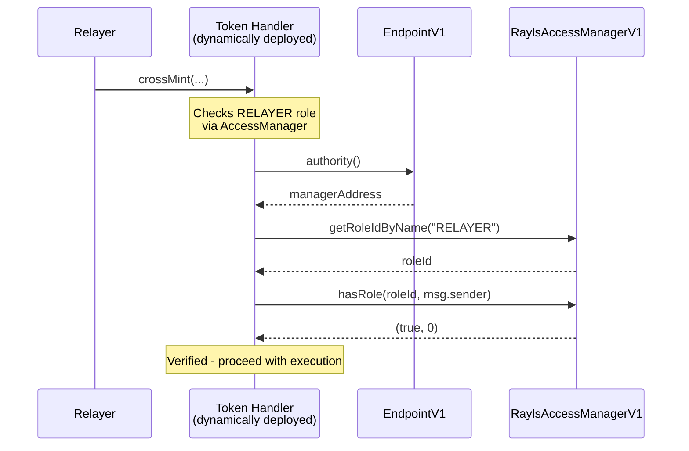
```mermaid
sequenceDiagram
    participant Relayer
    participant Handler as Token Handler<br/>(dynamically deployed)
    participant Endpoint as EndpointV1
    participant Manager as RaylsAccessManagerV1

    Relayer->>Handler: crossMint(...)

    Note over Handler: Checks RELAYER role<br/>via AccessManager

    Handler->>Endpoint: authority()
    Endpoint-->>Handler: managerAddress

    Handler->>Manager: getRoleIdByName("RELAYER")
    Manager-->>Handler: roleId

    Handler->>Manager: hasRole(roleId, msg.sender)
    Manager-->>Handler: (true, 0)

    Note over Handler: Verified - proceed with execution
```

### Relayer Startup Sequence

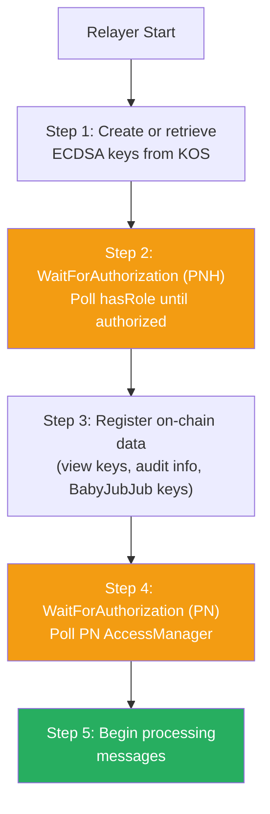
```mermaid
flowchart TD
    START["Relayer Start"] --> K1["Step 1: Create or retrieve<br/>ECDSA keys from KOS"]
    K1 --> K2["Step 2: WaitForAuthorization (PNH)<br/>Poll hasRole until authorized"]
    K2 --> K3["Step 3: Register on-chain data<br/>(view keys, audit info, BabyJubJub keys)"]
    K3 --> K4["Step 4: WaitForAuthorization (PN)<br/>Poll PN AccessManager"]
    K4 --> K5["Step 5: Begin processing<br/>messages"]

    style K2 fill:#f39c12,color:#fff
    style K4 fill:#f39c12,color:#fff
    style K5 fill:#27ae60,color:#fff
```

## Go Bindings

After any authorization-related contract changes, regenerate Go bindings:

```bash
# 1. Compile contracts
npx hardhat compile

# 2. Generate bindings for the relayer
node scripts/generate-bindings.js relayer

# 3. Move to relayer repo
./scripts/move-bindings.sh /path/to/rayls-sovereign-relayer/contracts
```

### Key Contracts in Bindings

| Contract | Authorization-Related Functions |
|---|---|
| EndpointV1 | `authority()` returns the AccessManager address |
| TokenRegistryV1 | `initialize(...)` sets the authority |
| TeleportV1 | `initialize(...)` sets the authority |
| ParticipantStorageV1 | `initialize(...)` sets the authority |
| EnygmaTeleport | Authority set in constructor |
| DvpTeleport | Authority set in constructor |
| EnygmaFactory | Authority set in constructor |
| RaylsAccessManagerV1 | Central authorization contract -- role management, permission queries |

### Go Usage Example

```go
import (
    manager "bindings/RaylsAccessManagerV1"
)

// Check if an address has a role
func checkRole(mgr *manager.RaylsAccessManagerV1, roleId uint64, addr common.Address) (bool, error) {
    result, err := mgr.HasRole(nil, roleId, addr)
    if err != nil {
        return false, err
    }
    return result.IsMember, nil
}

// Get role ID by name
func getRoleId(mgr *manager.RaylsAccessManagerV1, name string) (uint64, error) {
    return mgr.GetRoleIdByName(nil, name)
}

// Grant a role (requires ADMIN or role-admin wallet)
func grantRole(mgr *manager.RaylsAccessManagerV1, auth *bind.TransactOpts,
    roleId uint64, account common.Address, delay uint32) error {
    _, err := mgr.GrantRole(auth, roleId, account, delay)
    return err
}
```

## Flow-Based Permissions

The authorization system implements the Ops PRD requirement that Operators can "select what flows" a Bank Employee has access to. Each "flow" is a set of on-chain function selectors that the `PRIVACY_NODE_OPERATOR` maps to a role using `addFunctionAllowedRoles()`.

### Available Flows

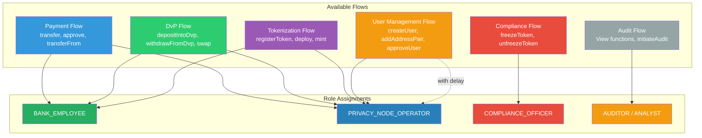
```mermaid
graph TD
    subgraph "Available Flows"
        PF["Payment Flow<br/>transfer, approve, transferFrom"]
        DVP["DvP Flow<br/>depositIntoDvp, withdrawFromDvp, swap"]
        TF["Tokenization Flow<br/>registerToken, deploy, mint"]
        CF["Compliance Flow<br/>freezeToken, unfreezeToken"]
        UF["User Management Flow<br/>createUser, addAddressPair, approveUser"]
        AF["Audit Flow<br/>View functions, initiateAudit"]
    end

    subgraph "Role Assignments"
        BE["BANK_EMPLOYEE"]
        OP["PRIVACY_NODE_OPERATOR"]
        CO["COMPLIANCE_OFFICER"]
        AU["AUDITOR / ANALYST"]
    end

    PF --> BE
    PF --> OP
    DVP --> BE
    DVP --> OP
    TF --> BE
    TF --> OP
    CF --> CO
    UF --> OP
    AF --> AU
    UF -.->|"with delay"| OP

    style PF fill:#3498db,color:#fff
    style DVP fill:#2ecc71,color:#fff
    style TF fill:#9b59b6,color:#fff
    style CF fill:#e74c3c,color:#fff
    style UF fill:#f39c12,color:#fff
    style AF fill:#95a5a6,color:#fff
    style BE fill:#27ae60,color:#fff
    style OP fill:#2980b9,color:#fff
    style CO fill:#e74c3c,color:#fff
    style AU fill:#f39c12,color:#fff
```

### Flow Composition Example

This sequence shows how the `PRIVACY_NODE_OPERATOR` grants a role and how the `restricted` modifier enforces permissions at call time.

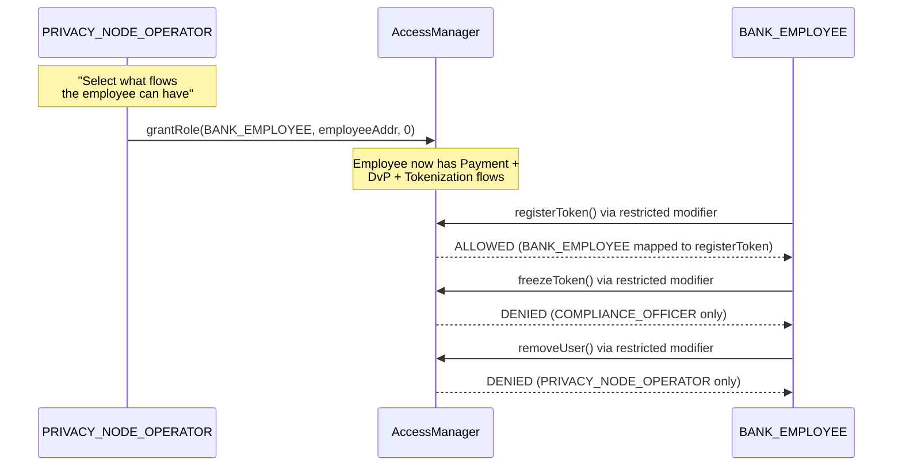
```mermaid
sequenceDiagram
    participant Operator as PRIVACY_NODE_OPERATOR
    participant Manager as AccessManager
    participant Employee as BANK_EMPLOYEE

    Note over Operator: "Select what flows<br/>the employee can have"

    Operator->>Manager: grantRole(BANK_EMPLOYEE, employeeAddr, 0)
    Note over Manager: Employee now has Payment +<br/>DvP + Tokenization flows

    Employee->>Manager: registerToken() via restricted modifier
    Manager-->>Employee: ALLOWED (BANK_EMPLOYEE mapped to registerToken)

    Employee->>Manager: freezeToken() via restricted modifier
    Manager-->>Employee: DENIED (COMPLIANCE_OFFICER only)

    Employee->>Manager: removeUser() via restricted modifier
    Manager-->>Employee: DENIED (PRIVACY_NODE_OPERATOR only)
```

!!! info "Multiple Roles per Function"
    Each function can be mapped to multiple roles simultaneously via `addFunctionAllowedRole()`. ADMIN always bypasses, but all other roles -- including PRIVACY_NODE_OPERATOR -- only pass if the caller holds at least one of the mapped roles. The "admin-of" relationship allows granting/revoking membership but does NOT inherit the subordinate role's function permissions. To grant different subsets of flows to different employees, create granular roles such as `BANK_EMPLOYEE_PAYMENTS`, `BANK_EMPLOYEE_DVP`, or `BANK_EMPLOYEE_FULL`. This is a configuration decision, not a code change.

## Third-Party Integration

The authorization system unlocks safe third-party integration by scoping permissions to exactly the functions each partner needs -- nothing more. Each integration gets its own dedicated role with the minimum blast radius required for its business purpose.

### Compliance / AML Engine

A Compliance or AML engine (e.g., Chainalysis, Elliptic) monitors transactions for suspicious activity. When a positive alert fires, the engine needs to freeze the affected token immediately. The `COMPLIANCE_TOOL` role is scoped to exactly two functions. Even if the engine's API key is compromised, the attacker can only freeze or unfreeze tokens -- they cannot transfer funds, create users, or modify governance.

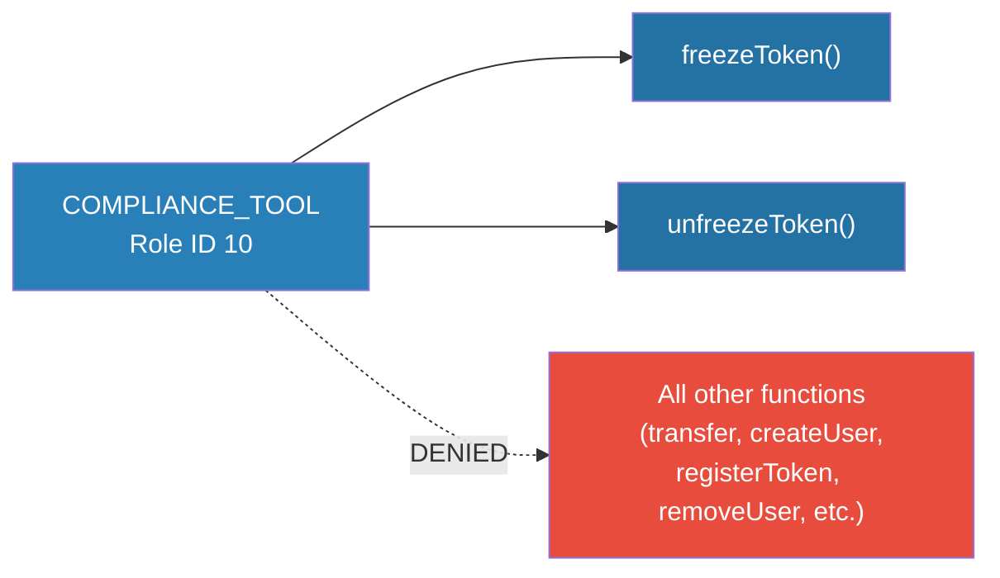
```mermaid
graph LR
    CT["COMPLIANCE_TOOL<br/>Role ID 10"] --> CTF1["freezeToken()"]
    CT --> CTF2["unfreezeToken()"]
    CT -.->|"DENIED"| CTX["All other functions<br/>(transfer, createUser,<br/>registerToken, removeUser, etc.)"]

    style CT fill:#2980b9,color:#fff
    style CTF1 fill:#2471a3,color:#fff
    style CTF2 fill:#2471a3,color:#fff
    style CTX fill:#e74c3c,color:#fff
```

### Custody Provider

A Custody or User Management provider (e.g., Fireblocks, BitGo) handles wallet provisioning and KYC onboarding. The `CUSTODY_MANAGER` role is scoped to user creation and approval functions. The provider cannot remove or reject users -- those destructive operations remain with the `PRIVACY_NODE_OPERATOR`.

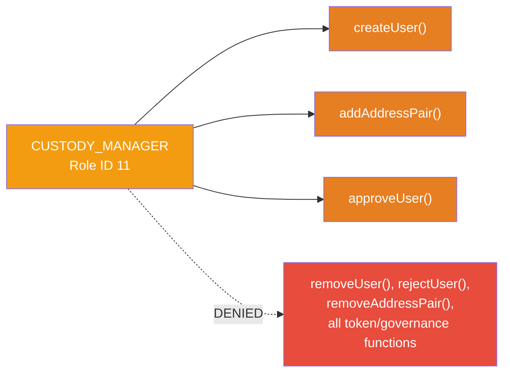
```mermaid
graph LR
    CM["CUSTODY_MANAGER<br/>Role ID 11"] --> CMF1["createUser()"]
    CM --> CMF2["addAddressPair()"]
    CM --> CMF3["approveUser()"]
    CM -.->|"DENIED"| CMX["removeUser(), rejectUser(),<br/>removeAddressPair(),<br/>all token/governance functions"]

    style CM fill:#f39c12,color:#fff
    style CMF1 fill:#e67e22,color:#fff
    style CMF2 fill:#e67e22,color:#fff
    style CMF3 fill:#e67e22,color:#fff
    style CMX fill:#e74c3c,color:#fff
```

### Tokenization Platform

A Tokenization platform (e.g., Securitize, Tokeny) creates digital representations of real-world assets. The `TOKENIZER` role is scoped to `registerToken()` only. The platform can register new tokens on the Privacy Node but cannot approve them, freeze them, or perform any governance action. PN approval (`updatePrivacyNodeStatus`) remains a separate step controlled by the `PRIVACY_NODE_OPERATOR`.

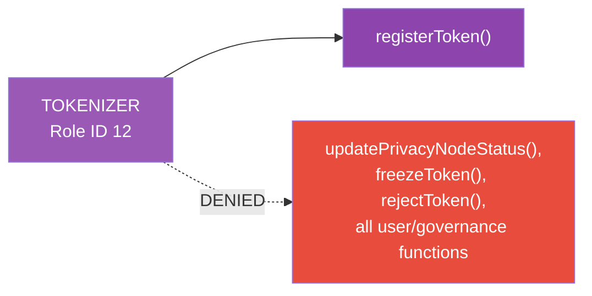
```mermaid
graph LR
    TK["TOKENIZER<br/>Role ID 12"] --> TKF1["registerToken()"]
    TK -.->|"DENIED"| TKX["updatePrivacyNodeStatus(),<br/>freezeToken(), rejectToken(),<br/>all user/governance functions"]

    style TK fill:#9b59b6,color:#fff
    style TKF1 fill:#8e44ad,color:#fff
    style TKX fill:#e74c3c,color:#fff
```

### Audit Dashboard

An Audit or Reporting dashboard (e.g., Dune Analytics, custom compliance dashboard) indexes on-chain data for compliance reporting. The `AUDITOR_TOOL` role provides a formal designation that the integration has zero write capability. Since view functions are typically unrestricted (PUBLIC), this role serves as a boundary marker. If any view functions become restricted in the future, only those specific views are granted.

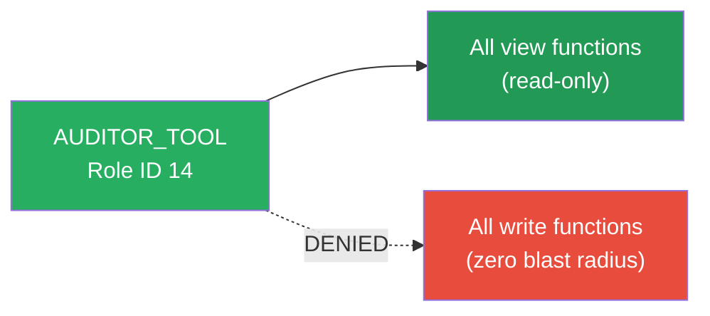
```mermaid
graph LR
    AD["AUDITOR_TOOL<br/>Role ID 14"] --> ADF1["All view functions<br/>(read-only)"]
    AD -.->|"DENIED"| ADX["All write functions<br/>(zero blast radius)"]

    style AD fill:#27ae60,color:#fff
    style ADF1 fill:#229954,color:#fff
    style ADX fill:#e74c3c,color:#fff
```

### Blast Radius Comparison

Each integration role is scoped to the minimum number of write functions required for its purpose:

| Integration | Write Functions Accessible | Scope |
|---|---|---|
| Compliance / AML Engine | 2 | 1 contract |
| Custody Provider | 3 | 1 contract |
| Tokenization Platform | 1 | 1 contract |
| Audit Dashboard | 0 | Read-only |

### Adding a New Integration (Zero Code Changes)

New third-party integrations can be onboarded entirely through AccessManager configuration -- no Solidity changes, recompilation, or redeployment required.

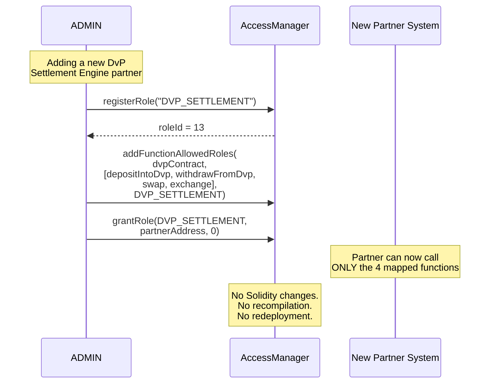
```mermaid
sequenceDiagram
    participant Admin as ADMIN
    participant Manager as AccessManager
    participant Partner as New Partner System

    Note over Admin: Adding a new DvP<br/>Settlement Engine partner

    Admin->>Manager: registerRole("DVP_SETTLEMENT")
    Manager-->>Admin: roleId = 13

    Admin->>Manager: addFunctionAllowedRoles(<br/>dvpContract,<br/>[depositIntoDvp, withdrawFromDvp,<br/>swap, exchange],<br/>DVP_SETTLEMENT)

    Admin->>Manager: grantRole(DVP_SETTLEMENT,<br/>partnerAddress, 0)

    Note over Partner: Partner can now call<br/>ONLY the 4 mapped functions

    Note over Manager: No Solidity changes.<br/>No recompilation.<br/>No redeployment.
```

## Temporal Controls (Maker-Checker)

The authorization system implements the banking industry's **four-eyes principle** on-chain through execution delays and scheduled operations. This is the same maker-checker workflow used in SWIFT, treasury management systems, and custody platforms -- now expressed as a cryptographically verifiable on-chain primitive.

### Operation Lifecycle

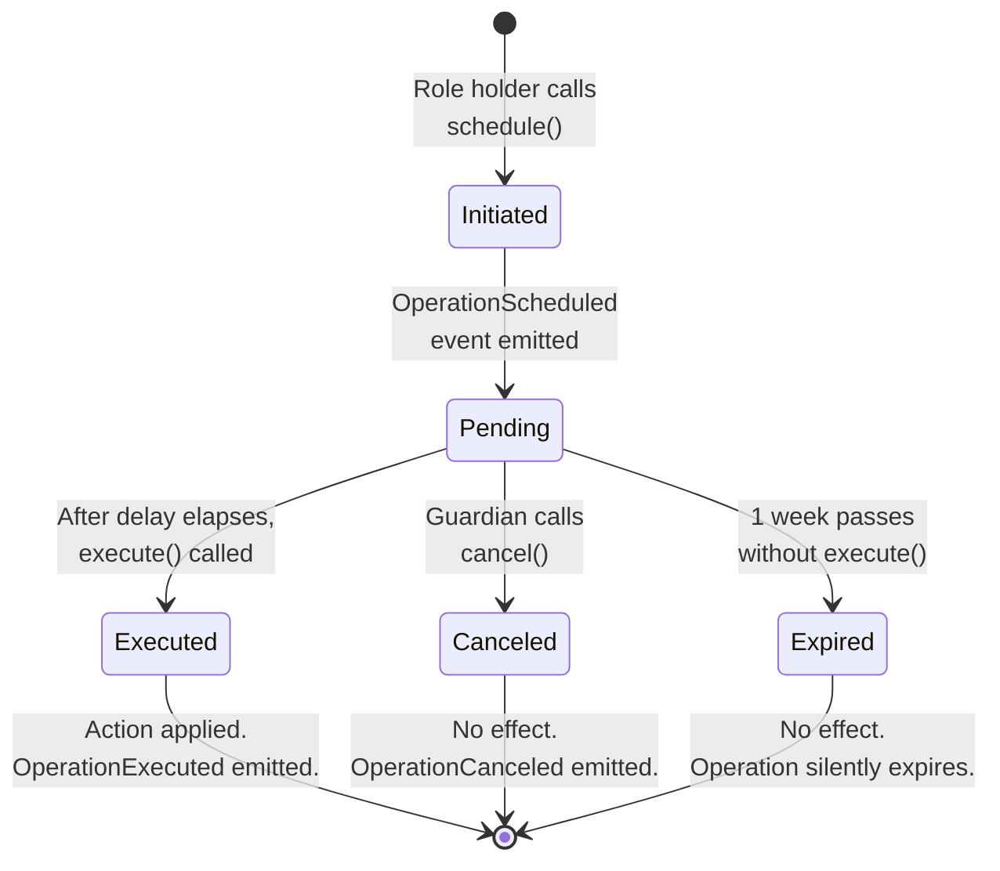
```mermaid
stateDiagram-v2
    [*] --> Initiated: Role holder calls<br/>schedule()
    Initiated --> Pending: OperationScheduled<br/>event emitted
    Pending --> Executed: After delay elapses,<br/>execute() called
    Pending --> Canceled: Guardian calls<br/>cancel()
    Pending --> Expired: 1 week passes<br/>without execute()
    Executed --> [*]: Action applied.<br/>OperationExecuted emitted.
    Canceled --> [*]: No effect.<br/>OperationCanceled emitted.
    Expired --> [*]: No effect.<br/>Operation silently expires.
```

### Real-World Scenario

A Compliance Officer schedules a token freeze. The Operator, acting as Guardian, reviews the pending operation and either lets it execute or cancels it.

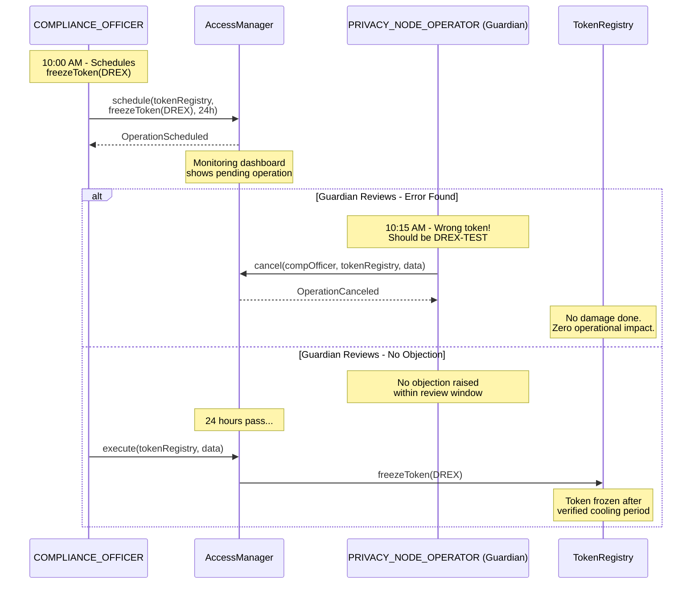
```mermaid
sequenceDiagram
    participant CompOfficer as COMPLIANCE_OFFICER
    participant Manager as AccessManager
    participant Guardian as PRIVACY_NODE_OPERATOR (Guardian)
    participant TokenReg as TokenRegistry

    Note over CompOfficer: 10:00 AM - Schedules<br/>freezeToken(DREX)

    CompOfficer->>Manager: schedule(tokenRegistry,<br/>freezeToken(DREX), 24h)
    Manager-->>CompOfficer: OperationScheduled

    Note over Manager: Monitoring dashboard<br/>shows pending operation

    alt Guardian Reviews - Error Found
        Note over Guardian: 10:15 AM - Wrong token!<br/>Should be DREX-TEST
        Guardian->>Manager: cancel(compOfficer, tokenRegistry, data)
        Manager-->>Guardian: OperationCanceled
        Note over TokenReg: No damage done.<br/>Zero operational impact.
    else Guardian Reviews - No Objection
        Note over Guardian: No objection raised<br/>within review window
        Note over Manager: 24 hours pass...
        CompOfficer->>Manager: execute(tokenRegistry, data)
        Manager->>TokenReg: freezeToken(DREX)
        Note over TokenReg: Token frozen after<br/>verified cooling period
    end
```

### Configurable Delay Recommendations

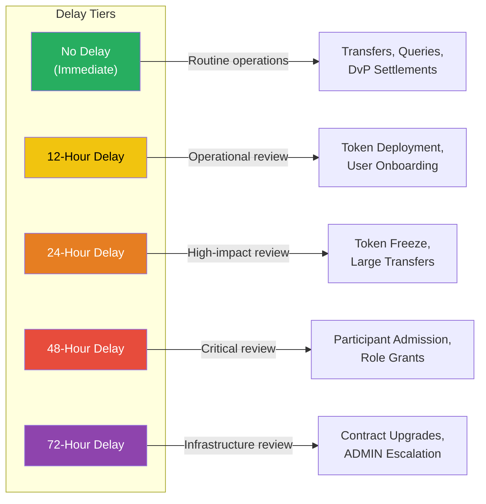
```mermaid
graph LR
    subgraph "Delay Tiers"
        D0["No Delay<br/>(Immediate)"]
        D12["12-Hour Delay"]
        D24["24-Hour Delay"]
        D48["48-Hour Delay"]
        D72["72-Hour Delay"]
    end

    D0 -->|"Routine operations"| E0["Transfers, Queries,<br/>DvP Settlements"]
    D12 -->|"Operational review"| E12["Token Deployment,<br/>User Onboarding"]
    D24 -->|"High-impact review"| E24["Token Freeze,<br/>Large Transfers"]
    D48 -->|"Critical review"| E48["Participant Admission,<br/>Role Grants"]
    D72 -->|"Infrastructure review"| E72["Contract Upgrades,<br/>ADMIN Escalation"]

    style D0 fill:#27ae60,color:#fff
    style D12 fill:#f1c40f,color:#000
    style D24 fill:#e67e22,color:#fff
    style D48 fill:#e74c3c,color:#fff
    style D72 fill:#8e44ad,color:#fff
```

### Grant Delay -- Preventing Instant Privilege Escalation

Grant delays are a separate mechanism from execution delays. When a grant delay is configured for a role, newly granted memberships do not activate until the delay elapses. This creates a detection window: even if an attacker compromises an admin key, they cannot instantly create a functional privileged account.

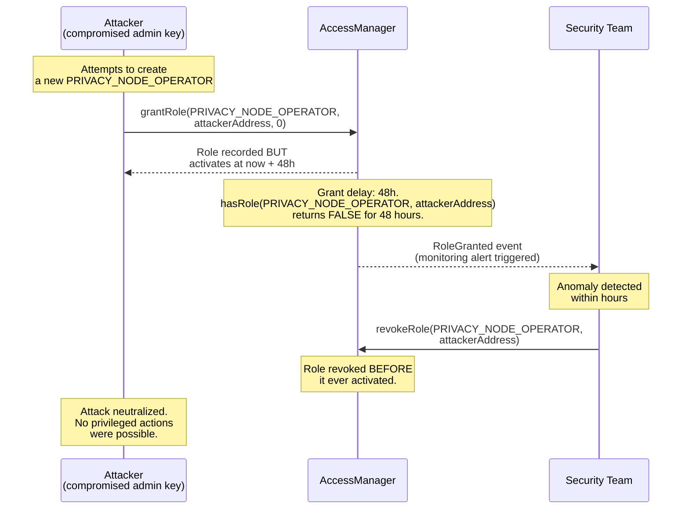
```mermaid
sequenceDiagram
    participant Attacker as Attacker<br/>(compromised admin key)
    participant Manager as AccessManager
    participant Security as Security Team

    Note over Attacker: Attempts to create<br/>a new PRIVACY_NODE_OPERATOR

    Attacker->>Manager: grantRole(PRIVACY_NODE_OPERATOR,<br/>attackerAddress, 0)
    Manager-->>Attacker: Role recorded BUT<br/>activates at now + 48h

    Note over Manager: Grant delay: 48h.<br/>hasRole(PRIVACY_NODE_OPERATOR, attackerAddress)<br/>returns FALSE for 48 hours.

    Manager-->>Security: RoleGranted event<br/>(monitoring alert triggered)

    Note over Security: Anomaly detected<br/>within hours

    Security->>Manager: revokeRole(PRIVACY_NODE_OPERATOR,<br/>attackerAddress)
    Note over Manager: Role revoked BEFORE<br/>it ever activated.

    Note over Attacker: Attack neutralized.<br/>No privileged actions<br/>were possible.
```

!!! warning "Grant Delays Are Not Execution Delays"
    Grant delays protect against instant privilege escalation by delaying when a newly granted role becomes active. Execution delays protect against hasty or malicious operations by requiring a cooling period before the action takes effect. Both mechanisms can be combined for defense in depth.

## Compliance and Audit

### Audit Trail Events

The authorization system emits 16 distinct event types covering every permission change. These events form an immutable, queryable on-chain audit trail that regulators can independently verify without trusting the bank's off-chain processes.


```mermaid
graph TD
    subgraph "Authorization Events"
        E1["RoleGranted"]
        E2["RoleRevoked"]
        E3["RoleAdminChanged"]
        E4["RoleGuardianChanged"]
        E5["RoleGrantDelayChanged"]
        E6["RoleLabelSet"]
        E7["RoleRegistered"]
    end

    subgraph "Permission Events"
        E8["FunctionAllowedRoleAdded / FunctionAllowedRoleRemoved"]
        E9["ContractPauseUpdated"]
        E10["ManagedContractRegistered"]
        E11["ContractScopedRoleGranted"]
        E12["ContractScopedRoleRevoked"]
    end

    subgraph "Temporal Events"
        E14["OperationScheduled"]
        E15["OperationExecuted"]
        E16["OperationCanceled"]
    end

    E1 --> Q["Queryable On-Chain<br/>Audit Trail"]
    E2 --> Q
    E3 --> Q
    E4 --> Q
    E5 --> Q
    E6 --> Q
    E7 --> Q
    E8 --> Q
    E9 --> Q
    E10 --> Q
    E11 --> Q
    E12 --> Q
    E14 --> Q
    E15 --> Q
    E16 --> Q

    Q --> R["Regulators can verify<br/>authorization state<br/>at any historical date"]

    style Q fill:#3498db,color:#fff
    style R fill:#27ae60,color:#fff
```

### Compliance Requirement Mapping

| Regulatory Requirement | Capability | On-Chain Evidence |
|---|---|---|
| Segregation of duties | Different roles for different operations | `FunctionAllowedRoleAdded / FunctionAllowedRoleRemoved` events prove function-to-role mapping |
| Least-privilege access | Function-level scoping per role | `canCall()` returns false for unmapped functions |
| Cooling-off periods | Execution delays (12h, 24h, 48h, 72h) | `OperationScheduled` and `OperationExecuted` timestamps prove delay was enforced |
| Four-eyes principle (maker-checker) | Schedule + Execute lifecycle with Guardian cancel | `OperationScheduled` / `OperationExecuted` / `OperationCanceled` event sequence |
| Authorization audit trail | 16 event types covering all permission changes | On-chain, cryptographically verifiable, immutable |
| Emergency response | Per-contract pause via `setContractPaused()` | `ContractPauseUpdated` event; paused calls revert with `ContractPaused` error |
| Key compromise detection window | Grant delays on high-privilege roles | `RoleGranted` event shows activation timestamp in the future |

### Identity Isolation

The Private Network never sees internal bank roles. Each Privacy Node's `AccessManager` is local to that node -- internal role assignments (`PRIVACY_NODE_OPERATOR`, `BANK_EMPLOYEE`, `AUDITOR`, etc.) never cross the privacy boundary. The Private Network sees only a single `PARTICIPANT` identity per Privacy Node.

```mermaid
graph TB
    subgraph "Privacy Node (Internal)"
        OP2["PRIVACY_NODE_OPERATOR"]
        BE2["BANK_EMPLOYEE"]
        AUD2["AUDITOR"]
        COMP2["COMPLIANCE_OFFICER"]
        AM["AccessManager<br/>(Local to Privacy Node)"]

        OP2 --> AM
        BE2 --> AM
        AUD2 --> AM
        COMP2 --> AM
    end

    subgraph "Private Network (External)"
        PART["PARTICIPANT<br/>(Single Address)"]
        NET["Network sees ONLY<br/>this identity"]
    end

    AM -.->|"Internal roles<br/>NEVER cross this boundary"| WALL["Privacy<br/>Boundary"]
    WALL -.-> PART

    style WALL fill:#e74c3c,color:#fff,stroke-dasharray: 5 5
    style PART fill:#3498db,color:#fff
    style AM fill:#27ae60,color:#fff
```

!!! info "Why This Matters"
    Identity isolation ensures that a bank's internal organizational structure -- who is an operator, who is a compliance officer, who is an auditor -- is never leaked to the shared network. Regulators auditing a specific bank examine that bank's local AccessManager. Network-level auditors see only participant-level actions, preserving institutional privacy.

---

**Navigate:**

- [Back to Build Overview](../index.md)
- [Authorization Overview](../../learn/governance/authorization/index.md)
- [Role Reference](../reference/role-reference.md)
- [Security Model](../../learn/governance/authorization/security-model.md)
