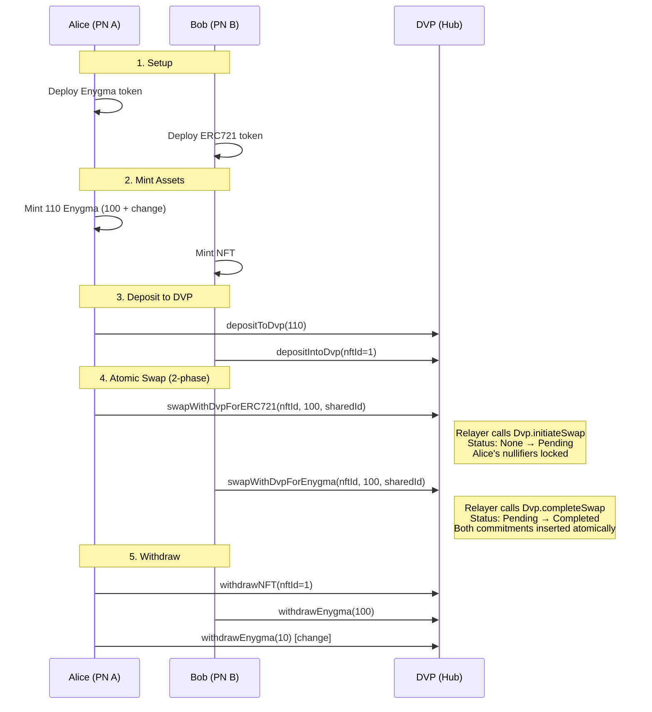

# Building with DVP Atomic Swaps

Build atomic swap applications that exchange assets with cryptographic guarantees using DVP on Rayls.

## Prerequisites

Before starting, ensure you have:

- [ ] Completed the [Enygma Privacy Guide](enygma-privacy.md)
- [ ] Understanding of DVP concepts ([Learn: DVP Overview](../../learn/protocols/dvp/index.md))
- [ ] Rayls development environment running ([Docker Setup](../beginner/docker-setup.md))

**Key terms:** This guide uses cryptographic concepts. See the [DVP Glossary](../../learn/protocols/dvp/glossary.md) for swap-specific terms and the [Enygma Glossary](../../learn/protocols/enygma/glossary.md) for [commitments](../../learn/protocols/enygma/glossary.md#commitment), [nullifiers](../../learn/protocols/enygma/glossary.md#nullifier), and related cryptographic terms.

## Overview

DVP (Zero-Knowledge Delivery vs Payment) enables atomic exchanges between different asset types. Either both sides of a trade execute, or neither does.

### Why Atomic Swaps?

Traditional asset exchanges have a fundamental problem: someone must go first. If Alice sends her NFT to Bob, she trusts Bob will send payment. This creates counterparty risk.

DVP solves this with a **two-phase contract state machine**:

- Both parties deposit assets into the DVP contract
- The first party's swap call hits `Dvp.initiateSwap` — the contract **locks** their input nullifiers and emits a `SwapInitiated` event with the encrypted trade data
- The second party's swap call hits `Dvp.completeSwap` — the contract unlocks the initiator's nullifiers, spends them, and inserts both new commitments in a single transaction
- If the second party never shows up, either party's relayer can call `Dvp.cancelSwap` (manual cancel, requires a [cancel preimage](../../learn/protocols/dvp/glossary.md#cancel-preimage) that the contract verifies against the [passphrase](../../learn/protocols/dvp/glossary.md#passphrase-cancel) committed at initiation) or `Dvp.expireSwap` (after `validityTime` elapses) — a pre-computed `revertCommitment` baked into the initiator's proof is added back to their vault, recovering their funds with no second proof needed

**The guarantee:** the locked input can only ever be spent through `completeSwap` (settlement) or `cancelSwap` / `expireSwap` (refund). Partial execution is impossible.

**Supported Swaps:**

| Asset A | Asset B | Use Case |
|---------|---------|----------|
| ERC721 (NFT) | Enygma | Buy NFT with private payment |
| ERC1155 | Enygma | Trade semi-fungible tokens |

---

## Quick Start

### 1. Deploy NFT Token

```bash
npx hardhat dvp:erc721:deploy \
  --pl B \
  --symbol VNFT \
  --name "Vehicle NFT" \
  --uri "https://api.example.com/nft/" \
  --network pl-b
```

### 2. Mint and Deposit NFT

```bash
# Mint NFT
npx hardhat dvp:erc721:mint \
  --pl B \
  --symbol VNFT \
  --to 0xOwnerAddress \
  --id 1 \
  --network pl-b

# Deposit to DVP
npx hardhat dvp:erc721:deposit \
  --pl B \
  --symbol VNFT \
  --id 1 \
  --network pl-b
```

### 3. Execute Swap

```bash
# NFT holder initiates swap for Enygma
npx hardhat dvp:erc721:enygma:swap \
  --pl B \
  --nft-id 1 \
  --nft-symbol VNFT \
  --enygma-amount 100 \
  --enygma-resource-id 0x... \
  --dest-chain-id 1001 \
  --shared-id 0x... \
  --network pl-b
```

---

## Hardhat Tasks Reference

### ERC721 (NFT) Tasks

| Task | Description | Key Parameters |
|------|-------------|----------------|
| `dvp:erc721:deploy` | Deploy NFT contract | `--pl`, `--symbol`, `--name`, `--uri` |
| `dvp:erc721:mint` | Mint NFT | `--pl`, `--symbol`, `--to`, `--id` |
| `dvp:erc721:burn` | Burn NFT | `--pl`, `--symbol`, `--id` |
| `dvp:erc721:deposit` | Deposit to DVP | `--pl`, `--symbol`, `--id` |
| `dvp:erc721:withdraw` | Withdraw from DVP | `--pl`, `--symbol`, `--id` |
| `dvp:erc721:enygma:swap` | Swap NFT for Enygma | `--nft-id`, `--enygma-amount`, `--shared-id` |

### ERC1155 Tasks

| Task | Description | Key Parameters |
|------|-------------|----------------|
| `dvp:erc1155:deploy` | Deploy ERC1155 contract | `--pl`, `--name`, `--uri` |
| `dvp:erc1155:mint` | Mint tokens | `--pl`, `--name`, `--to`, `--id`, `--amount` |
| `dvp:erc1155:deposit` | Deposit to DVP | `--pl`, `--name`, `--id`, `--amount` |
| `dvp:erc1155:withdraw` | Withdraw from DVP | `--pl`, `--name`, `--id`, `--amount` |
| `dvp:erc1155:enygma:swap` | Swap ERC1155 for Enygma | `--nft-id`, `--nft-amount`, `--enygma-amount` |

### Enygma DVP Tasks

| Task | Description | Key Parameters |
|------|-------------|----------------|
| `dvp:enygma:deposit` | Deposit Enygma to DVP | `--pl`, `--symbol`, `--amount` |
| `dvp:enygma:withdraw` | Withdraw Enygma from DVP | `--pl`, `--symbol`, `--amount` |
| `dvp:enygma:erc721:swap` | Swap Enygma for NFT | `--amount`, `--nft-id`, `--nft-resource-id` |
| `dvp:enygma:erc1155:swap` | Swap Enygma for ERC1155 | `--amount`, `--nft-id`, `--nft-amount` |

---

## Complete Swap Workflow

Understanding the full workflow is essential before implementing. A swap involves multiple parties, multiple chains, and cryptographic coordination.

### The Shared ID

The **[shared ID](../../learn/protocols/dvp/glossary.md#shared-id)** is the user-facing identifier for the swap. It's a random bytes32 value that both parties agree on off-chain before the swap. Both swap transactions must use identical `sharedId` values — the contract uses it as the lookup key for the swap state machine (`_sharedIdToDvpId[sharedId]`).

```typescript
// Generate shared ID - both parties must use the same value
const sharedId = ethers.keccak256(ethers.randomBytes(32));
```

Atomicity itself is enforced by the contract `SwapStatus` state machine, not by the shared ID — see [The Atomic Swap](../../learn/protocols/dvp/the-atomic-swap.md) for details.

### Initiator vs. Responder

Whoever submits their swap transaction first becomes the **initiator** (their relayer calls `Dvp.initiateSwap`). The other party becomes the **responder** (their relayer calls `Dvp.completeSwap`).

You don't choose your role — your relayer decides based on whether a swap row already exists for this `sharedId`. Both parties run the same CLI command pattern (`dvp:erc721:enygma:swap` for the NFT side, `dvp:enygma:erc721:swap` for the Enygma side); the unified handler in the relayer routes to initiate or complete based on persisted swap status.

### Scenario: Alice (Enygma) ↔ Bob (NFT)

Alice wants to buy Bob's NFT with 100 Enygma tokens.



### Step-by-Step Implementation

#### Step 1: Setup Tokens

```typescript
// Deploy Enygma on PL A
const enygmaToken = await deployEnygmaToken(privacyLedgerA);

// Deploy NFT on PL B
const nftToken = await deployERC721Token(privacyLedgerB);

// Register both tokens
await shouldRegisterAndApproveToken(commitChain, privacyLedgerA, enygma);
await shouldRegisterAndApproveToken(commitChain, privacyLedgerB, nft);
```

#### Step 2: Mint Assets

```typescript
// Mint Enygma tokens (100 for payment + 10 for change)
await shouldMintEnygma(110, commitChain, privacyLedgerA, enygma);

// Mint NFT
await shouldMintNft(commitChain, privacyLedgerB, nft);
```

#### Step 3: Deposit to DVP

```typescript
// Alice deposits Enygma
await shouldDepositEnygmaToDvp(
    110,              // amount
    1,                // deposit number
    0,                // expected balance after (burned)
    commitChain,
    privacyLedgerA,
    enygma
);

// Bob deposits NFT
await shouldDepositNftToDvp(
    commitChain,
    privacyLedgerB,
    nft
);
```

#### Step 4: Execute Atomic Swap

```typescript
// Generate shared ID for atomic linking
const sharedId = ethers.keccak256(ethers.randomBytes(32));

// Execute swap - order determines who initiates first
await shouldSwapNftForEnygma(
    100,                    // payment amount
    commitChain,
    privacyLedgerA,         // Enygma holder
    privacyLedgerB,         // NFT holder
    enygma,
    nft,
    SwapOrder.nft_enygma    // NFT side initiates first
);
```

#### Step 5: Withdraw Assets

```typescript
// Alice withdraws NFT (she bought it)
await shouldWithdrawNftFromDvp(
    commitChain,
    privacyLedgerA,
    nft
);

// Bob withdraws Enygma (payment received)
await shouldWithdrawEnygmaFromDvp(
    100,              // amount
    1,                // withdraw number
    100,              // expected balance
    commitChain,
    privacyLedgerB,
    enygma
);

// Alice withdraws change
await shouldWithdrawEnygmaFromDvp(
    10,               // change amount
    2,                // withdraw number
    10,               // expected balance
    commitChain,
    privacyLedgerA,
    enygma
);
```

---

## Swap Types

DVP uses two [proof types](../../learn/protocols/dvp/glossary.md#proof-types) depending on the asset:

- **[Ownership proof](../../learn/protocols/dvp/glossary.md#ownership-proof)**: For NFTs (ERC721) - proves you own a specific unique asset
- **[JoinSplit proof](../../learn/protocols/dvp/glossary.md#joinsplit-proof)**: For fungible assets (Enygma, ERC1155) - can combine up to 10 inputs into 2 outputs

Both proof types are submitted via the **same** unified `IDvp.ProofReceipt` struct and routed to the right verifier by the `Dvp` contract based on `SwapProofType`.

### The 2-phase Swap API

```solidity
enum SwapProofType { Payment, Delivery }
enum SwapStatus   { None, Pending, Completed, Failed, Cancelled, TimedOut }

// Initiator's relayer submits this transaction.
// Locks the initiator's input nullifiers, stores the passphrase, and emits SwapInitiated.
function initiateSwap(
    bytes32 sharedId,
    bytes calldata encryptedData,   // AES-GCM(message, salt)
    bytes calldata ciphertext,      // ML-KEM-768 ciphertext (so the responder can derive `salt`)
    address tokenAddress,
    IDvp.SwapProofType proofType,   // Payment (fungibles) or Delivery (NFT)
    IDvp.ProofReceipt memory proof, // Includes revertCommitment
    uint64 validityTime,            // Seconds until expiry; clamped to [5h, 14d]
    uint256 passphrase              // poseidon([preimage, preimage]) — gates future cancelSwap
) public returns (bytes32 dvpId);

// Responder's relayer submits this transaction.
// Unlocks the initiator's nullifiers, spends them, inserts both commitments.
function completeSwap(
    bytes32 sharedId,
    address tokenAddress,
    IDvp.SwapProofType proofType,
    IDvp.ProofReceipt memory proof,
    bytes calldata encryptedData
) public;

// Manual cancel — verifies poseidon([preimage, preimage]) == stored passphrase,
// reverts the initiator's funds, emits SwapCancelled.
function cancelSwap(bytes32 sharedId, uint256 preimage) public;

// Timeout — requires block.timestamp >= expiresAt. Reverts funds, emits SwapTimedOut.
function expireSwap(bytes32 sharedId) public;

// Read-only — true once block.timestamp >= expiresAt.
function isSwapExpired(bytes32 sharedId) public view returns (bool);
```

**How atomicity works:**

The contract enforces atomicity through the `SwapStatus` state machine, not through paired-proof message checks:

```text
None ──initiateSwap──► Pending ──completeSwap──► Completed
                              │
                              ├── cancelSwap(sharedId, preimage) ──► Cancelled
                              └── expireSwap(sharedId) ────────────► TimedOut
                                  (also auto-reached if completeSwap is called past expiresAt)
```

`initiateSwap` locks the initiator's input nullifiers via `IAbstractCoinVault.lockCoin(...)` — they are reserved for this swap and cannot be spent elsewhere. `completeSwap` is the only way to actually spend them; it unlocks, nullifies, and inserts both new commitments in a single transaction. If completion never happens, `cancelSwap` or `expireSwap` releases the lock and registers the initiator's `revertCommitment` (which was bound into their proof at initiation time).

The two on-chain calls are bound together via `dvpId = keccak256(commitments[0], message)` — asymmetric across the two calls so that the responder's `(message, commitments[0])` pair must equal the initiator's `(commitments[0], message)`. The relayer wires this binding as part of proof generation; users never see it.

### Trade Data Privacy

The full trade payload (token addresses, amounts, recipient hints) is encrypted before being put on-chain:

- The initiator's relayer derives a per-swap `salt` by ML-KEM-768 encapsulation against the responder's view public key. The 768-byte ciphertext travels in the `SwapInitiated` event.
- The trade message is AES-GCM encrypted under that `salt` and travels in the same event as `encryptedData`.
- Only the responder can decapsulate the ciphertext (with their view secret key), recover the `salt`, and decrypt the message. Other observers see opaque bytes.

---

## Advanced Patterns

### Multi-Deposit Consolidation

DVP tracks assets in [Merkle trees](../../learn/protocols/dvp/glossary.md#merkle-tree). Each deposit adds a leaf to the tree. After many deposits (~11+), the system **[consolidates](../../learn/protocols/dvp/glossary.md#tree-consolidation)** - it creates a new tree and migrates commitments.

**Why this matters:** Your proof must reference the correct tree number. If consolidation happens between your deposit and swap, you need to generate a new proof against the current tree.

```typescript
// Make 11+ deposits - system will consolidate
for (let i = 0; i < 11; i++) {
    await shouldDepositEnygmaToDvp(
        100,
        i + 1,
        0,
        commitChain,
        privacyLedger,
        enygma
    );
}

// Check current tree number - increments after consolidation
const merkle = await zkDvp.enygmaTree();
const treeNumber = await IMerkle.attach(merkle).getTreeNumber();
console.log("Tree number:", treeNumber);
```

**Best practice:** Execute swaps promptly after deposits to avoid consolidation complications.

### Change Handling

When swap amount doesn't equal deposit amount:

```typescript
const depositAmount = 150;
const paymentAmount = 100;
const changeAmount = 50;

// Deposit full amount
await shouldDepositEnygmaToDvp(depositAmount, ...);

// Swap for payment amount
await shouldSwapNftForEnygma(paymentAmount, ...);

// Withdraw change
await shouldWithdrawEnygmaFromDvp(changeAmount, 2, changeAmount, ...);
```

### Verify Ownership Without Withdrawing

Prove you own an asset without revealing which one:

```typescript
// Generate challenge
const challenge = ethers.keccak256(ethers.randomBytes(32));

// Verify ownership
await zkDvp.verifyOwnershipERC721(
    nftId,
    nftAddress,
    challenge,
    ownershipProof
);

// Emits: VerifyOwnershipReceipt(challenge, treeId, nftId, 1, nftAddress, sender)
```

---

## Data Structures

### `IDvp.ProofReceipt` (Unified)

Both fungible (JoinSplit) and non-fungible (Ownership) proofs share a single struct. The shape of the arrays differentiates the two:

```solidity
struct ProofReceipt {
    SnarkProof proof;            // Groth16 (a, b, c)
    uint256[] treeNumbers;       // Per-input tree number — len 1 (Ownership) or 10 (JoinSplit)
    uint256 message;             // Used to derive dvpId; binds the two-call swap together
    uint256[] merkleRoots;       // Per-input Merkle root (same length as treeNumbers)
    uint256[] commitments;       // Outputs — len 1 (Ownership) or 2 (JoinSplit)
    uint256[] nullifiers;        // Per-input nullifier (same length as treeNumbers)
    uint256 revertCommitment;    // NEW — registered to the initiator's vault on cancelSwap / expireSwap
}
```

JoinSplit receipts must always carry exactly 10 entries in `treeNumbers` / `merkleRoots` / `nullifiers` (padded with the dummy nullifier `Poseidon(0, 0)` in unused slots) and exactly 2 commitments. Ownership receipts carry exactly 1 of each.

The verifier's public-signal layout matches:

| Proof type | Signal count | Layout |
|------------|-------------|--------|
| JoinSplit (Enygma / ERC-1155) | 34 | `[0]` message · `[1..10]` merkleRoots · `[11..20]` nullifiers · `[21..30]` treeNumbers · `[31..32]` commitments · `[33]` revertCommitment |
| Ownership (ERC-721) | 6 | `[0]` message · `[1]` merkleRoot · `[2]` nullifier · `[3]` treeNumber · `[4]` commitment · `[5]` revertCommitment |

### Merkle Tree IDs

```solidity
uint256 constant TREE_ID_ERC721  = 0;  // NFTs
uint256 constant TREE_ID_ERC20   = 1;  // Reserved
uint256 constant TREE_ID_ERC1155 = 2;  // Semi-fungible
uint256 constant TREE_ID_ENYGMA  = 3;  // Privacy tokens
```

---

## Testing

### E2E Test Pattern

```typescript
import { RaylsNode, CommitChain, Token, ERC721 } from "@rayls/test-utils";

describe("DVP Swap: NFT for Enygma", function () {
    const DEPOSIT_AMOUNT = 100;
    const PAYMENT_AMOUNT = 100;

    const privacyLedgerA = new RaylsNode("A", hre);
    const privacyLedgerB = new RaylsNode("B", hre);
    const commitChain = new CommitChain(hre);

    const enygma = new Token();
    const nft = new ERC721();

    before(async function () {
        await dvpEnygmaSwap(commitChain, privacyLedgerA, privacyLedgerB, enygma, nft)();
    });

    it("registers tokens", async function () {
        await shouldRegisterAndApproveToken(commitChain, privacyLedgerA, enygma);
        await shouldRegisterAndApproveToken(commitChain, privacyLedgerB, nft);
    });

    it("mints assets", async function () {
        await shouldMintEnygma(DEPOSIT_AMOUNT, commitChain, privacyLedgerA, enygma);
        await shouldMintNft(commitChain, privacyLedgerB, nft);
    });

    it("deposits to DVP", async function () {
        await shouldDepositEnygmaToDvp(DEPOSIT_AMOUNT, 1, 0, commitChain, privacyLedgerA, enygma);
        await shouldDepositNftToDvp(commitChain, privacyLedgerB, nft);
    });

    it("executes atomic swap", async function () {
        await shouldSwapNftForEnygma(
            PAYMENT_AMOUNT, commitChain,
            privacyLedgerA, privacyLedgerB,
            enygma, nft, SwapOrder.nft_enygma
        );
    });

    it("withdraws assets", async function () {
        await shouldWithdrawNftFromDvp(commitChain, privacyLedgerA, nft);
        await shouldWithdrawEnygmaFromDvp(PAYMENT_AMOUNT, 1, PAYMENT_AMOUNT, commitChain, privacyLedgerB, enygma);
    });
});
```

### Test Utility Functions

```typescript
// Setup
dvpEnygmaSwap(commitChain, plEnygma, plNft, enygma, nft)
dvpEnygmaSwapERC1155(commitChain, plEnygma, plNft, enygma, nft1155)

// NFT operations
shouldMintNft(commitChain, privacyLedger, nft)
shouldDepositNftToDvp(commitChain, privacyLedger, nft)
shouldWithdrawNftFromDvp(commitChain, privacyLedger, nft)

// ERC1155 operations
shouldMintNftERC1155(commitChain, privacyLedger, nft, nftId, amount)
shouldDepositNft1155ToDvp(commitChain, privacyLedger, nft, nftId, amount)
shouldWithdrawNft1155FromDvp(commitChain, privacyLedger, nft, nftId, amount)

// Swaps
shouldSwapNftForEnygma(amount, commitChain, plEnygma, plNft, enygma, nft, order)
shouldSwapNft1155ForEnygma(amount, commitChain, plEnygma, plNft, enygma, nft, nftId, nftAmount, order)

// Swap order
enum SwapOrder {
    enygma_nft = 0,  // Enygma side initiates
    nft_enygma = 1   // NFT side initiates
}
```

---

## Reference

### Performance

| Operation | Latency | Gas Cost |
|-----------|---------|----------|
| Deposit ERC721 | ~5 sec | ~150k |
| Deposit ERC1155 | ~5 sec | ~180k |
| Deposit Enygma | 20-60 sec | Via Hub |
| Atomic Swap | ~10 sec | ~400k |
| Withdraw | ~5-10 sec | ~200k |

### Common Errors

| Error | Cause | Solution |
|-------|-------|----------|
| `Dvp__SwapAlreadyExists()` | A swap with this `sharedId` is already `Pending` | The other side initiated first — your relayer will fall through to the `completeSwap` path on the next event |
| `Dvp__SwapNotFound()` | `completeSwap`/`cancelSwap`/`expireSwap` called with an unknown `sharedId` | Verify `sharedId` matches what the initiator used; check the initiator's transaction landed |
| `Dvp__SwapNotPending()` | Trying to complete, cancel, or expire a swap that's already settled | Inspect on-chain state via `isSwapExpired` / `SwapStatus`; the swap is already `Completed`/`Cancelled`/`TimedOut` |
| `"withdrawERC721: Invalid opening"` | Wrong recipient or `salt` in proof | Withdraw proof must commit to the correct `(recipient, salt)` pair |
| `"Nullifier already used"` | Double-spend attempt | Each deposited asset can only be spent once |
| `"verifyOwnershipERC721: Rotten challenge"` | Challenge already used | Generate new unique challenge |

---

## Cancelling a Swap

Swaps can be cancelled manually or expire automatically after the validity period (default: 2 days, configurable between 5 hours and 14 days). Two dedicated on-chain functions handle this — `Dvp.cancelSwap(sharedId, preimage)` for manual cancellation and `Dvp.expireSwap(sharedId)` for timeout (requires `block.timestamp >= expiresAt`). Manual cancellation is passphrase-gated: the caller must supply a `preimage` such that `poseidon([preimage, preimage])` matches the `passphrase` committed at `initiateSwap` time. Both paths add the pre-computed `revertCommitment` (baked into the initiator's proof at `initiateSwap` time) back to the initiator's vault. The relayer needs no second proof to refund.

For conceptual background on how cancellation works, see [Learn: Swap Cancellation](../../learn/protocols/dvp/swap-cancellation.md).

### When to Cancel

- Counterparty hasn't confirmed and swap is stuck in `Pending` state
- Trade terms changed and both parties want to abort
- No action needed for timeout — `Dvp.completeSwap` auto-routes to `expireSwap` if called past `expiresAt`, and the relayer's expiration ticker (`IsSwapExpired(sharedId)` poll) will call `expireSwap(sharedId)` for any pending swap whose deadline has passed

### Cancel Tasks Reference

| Task | Description | Key Parameters |
|------|-------------|----------------|
| `dvp:enygma:erc721:cancel` | Cancel Enygma → ERC721 swap | `--pn`, `--symbol`, `--amount`, `--shared-id`, `--chain-id`, `--nft-id`, `--nft-resource-id` |
| `dvp:erc721:enygma:cancel` | Cancel ERC721 → Enygma swap | `--pn`, `--nft-symbol`, `--nft-id`, `--shared-id`, `--dest-chain-id`, `--enygma-amount`, `--enygma-resource-id` |
| `dvp:enygma:erc1155:cancel` | Cancel Enygma → ERC1155 swap | `--pn`, `--symbol`, `--amount`, `--shared-id`, `--chain-id`, `--nft-id`, `--nft-amount`, `--nft-resource-id` |
| `dvp:erc1155:enygma:cancel` | Cancel ERC1155 → Enygma swap | `--pn`, `--name`, `--shared-id`, `--chain-id`, `--token-id`, `--token-value`, `--enygma-resource-id`, `--enygma-amount` |

**All parameters must match the values used in the original swap transaction.**

### Cancel Enygma → ERC721 Swap

Cancels a swap where Enygma tokens were offered in exchange for an ERC721 NFT.

```bash
npx hardhat dvp:enygma:erc721:cancel \
  --pn A \
  --symbol enygma-rayls \
  --amount 1 \
  --shared-id 0xc43c1e24e1884c4e28a16bbd9506f60b5ca9f18fc90635e729d3cfe13abcf002 \
  --chain-id 12346 \
  --nft-id 10 \
  --nft-resource-id 0xb10e2d527612073b26eecdfd717e6a320cf44b4afac2b0732d9fcbe2b7fa0cf6
```

| Parameter | Description |
|-----------|-------------|
| `--pn` | Privacy Node identifier |
| `--symbol` | Enygma token symbol |
| `--amount` | Enygma amount from the original swap |
| `--shared-id` | Shared transaction ID to cancel |
| `--chain-id` | Destination chain ID |
| `--nft-id` | NFT ID from the original swap |
| `--nft-resource-id` | NFT resource ID from the original swap |

### Cancel ERC721 → Enygma Swap

Cancels a swap where an ERC721 NFT was offered in exchange for Enygma tokens.

```bash
npx hardhat dvp:erc721:enygma:cancel \
  --pn A \
  --shared-id 0xc43c1e24e1884c4e28a16bbd9506f60b5ca9f18fc90635e729d3cfe13abcf002 \
  --nft-id 10 \
  --nft-symbol ENYGMA_DVP721 \
  --dest-chain-id 600000 \
  --enygma-amount 100 \
  --enygma-resource-id 0xc43c1e24e1884c4e28a16bbd9506f60b5ca9f18fc90635e729d3cfe13abcf001
```

| Parameter | Description |
|-----------|-------------|
| `--pn` | Privacy Node identifier |
| `--shared-id` | Shared transaction ID to cancel |
| `--nft-id` | NFT ID to refund |
| `--nft-symbol` | NFT token symbol |
| `--dest-chain-id` | Destination chain ID |
| `--enygma-amount` | Enygma amount from the original swap |
| `--enygma-resource-id` | Enygma resource ID from the original swap |

### Cancel Enygma → ERC1155 Swap

Cancels a swap where Enygma tokens were offered in exchange for ERC1155 tokens.

```bash
npx hardhat dvp:enygma:erc1155:cancel \
  --pn A \
  --symbol enygma-rayls \
  --amount 1 \
  --shared-id 0xc43c1e24e1884c4e28a16bbd9506f60b5ca9f18fc90635e729d3cfe13abcf002 \
  --chain-id 12346 \
  --nft-id 10 \
  --nft-amount 5 \
  --nft-resource-id 0xb10e2d527612073b26eecdfd717e6a320cf44b4afac2b0732d9fcbe2b7fa0cf6
```

| Parameter | Description |
|-----------|-------------|
| `--pn` | Privacy Node identifier |
| `--symbol` | Enygma token symbol |
| `--amount` | Enygma amount from the original swap |
| `--shared-id` | Shared transaction ID to cancel |
| `--chain-id` | Destination chain ID |
| `--nft-id` | Token ID from the original swap |
| `--nft-amount` | Token amount from the original swap |
| `--nft-resource-id` | Token resource ID from the original swap |

### Cancel ERC1155 → Enygma Swap

Cancels a swap where ERC1155 tokens were offered in exchange for Enygma tokens.

```bash
npx hardhat dvp:erc1155:enygma:cancel \
  --pn B \
  --name enygma-dvp-erc1155-rayls \
  --shared-id 0xc43c1e24e1884c4e28a16bbd9506f60b5ca9f18fc90635e729d3cfe13abcf002 \
  --chain-id 600000 \
  --token-id 10 \
  --token-value 50 \
  --enygma-resource-id 0xc43c1e24e1884c4e28a16bbd9506f60b5ca9f18fc90635e729d3cfe13abcf001 \
  --enygma-amount 10
```

| Parameter | Description |
|-----------|-------------|
| `--pn` | Privacy Node identifier |
| `--name` | ERC1155 token name |
| `--shared-id` | Shared transaction ID to cancel |
| `--chain-id` | Destination chain ID |
| `--token-id` | Token ID to refund |
| `--token-value` | Token amount to refund |
| `--enygma-resource-id` | Enygma resource ID from the original swap |
| `--enygma-amount` | Enygma amount from the original swap |

---

## Troubleshooting

### Swap stuck - one party completed, other didn't

**Symptoms:** Initiator's `initiateSwap` landed (status `Pending`) but the responder's `completeSwap` never arrived.

**What happened:** This is the expected mid-state. The initiator's nullifiers are *locked* (reserved for this swap), but no commitments have been spent yet. Only `completeSwap` (settlement) or `cancelSwap` / `expireSwap` (refund) can move the state forward.

**Solution:** The responder needs to submit their swap transaction so the relayer can call `completeSwap`. Until then, the initiator's funds are recoverable but locked.

**Recovery if counterparty disappears:** Cancel manually using the [cancel tasks](#cancel-tasks-reference) (the relayer supplies the stored `CancelPreimage` automatically), or wait for automatic expiration. In both cases the initiator's vault gets the `revertCommitment` (baked into the original proof) and the locked input is freed — funds are never lost.

### `Dvp__SwapAlreadyExists` on initiate

**Symptoms:** Your `initiateSwap` reverted with `Dvp__SwapAlreadyExists()`.

**Cause:** The other party initiated first using the same `sharedId`. From the contract's perspective, the swap is already `Pending`.

**Solution:** Nothing to do — the relayer detects this and falls through to the `completeSwap` path on the next event. Your role just changed from initiator to responder.

### `Dvp__SwapNotFound` / `Dvp__SwapNotPending` on complete

**Symptoms:** `completeSwap` reverts.

**Cause:**
- `Dvp__SwapNotFound` — the `sharedId` was never initiated (or the responder's `(message, commitments[0])` doesn't match the initiator's `(commitments[0], message)` — the `dvpId` lookup failed).
- `Dvp__SwapNotPending` — the swap is already `Completed`, `Cancelled`, or `TimedOut`.

**Solution:**
1. Verify both parties use identical `sharedId`.
2. Regenerate proofs against current tree state (consolidation may have rotated tree numbers).
3. Inspect on-chain state via `isSwapExpired(sharedId)` and the `SwapInitiated` / `SwapCompleted` / `SwapCancelled` / `SwapTimedOut` events to confirm the current status.

### Withdrawal fails after successful swap

**Symptoms:** Swap completed but withdraw reverts

**Cause:** Proof commits to wrong recipient, or referencing old tree state

**Solution:**
```typescript
// Verify the commitment is for the correct recipient
const expectedCommitment = await poseidon([uniqueId, recipientAddress]);
// This must match what's in your proof
```

### Assets stuck in DVP

**Symptoms:** Can't withdraw deposited assets

**Cause:** Usually a proof generation issue

**Recovery:** Assets in DVP are never lost. You can always withdraw with a valid proof. Check:
1. You have the correct secret key for the commitment
2. The commitment exists in the current Merkle tree
3. The nullifier hasn't been used

### Atomicity Explained

```
┌──────────────────────────────────────────────────────────────────────┐
│                  2-PHASE ATOMIC SWAP STATE MACHINE                   │
├──────────────────────────────────────────────────────────────────────┤
│                                                                      │
│   Initiator                                  Responder               │
│   ──────────                                 ─────────               │
│   Dvp.initiateSwap(sharedId, ...)                                    │
│        │                                                             │
│        ▼                                                             │
│   ┌─────────────┐                                                    │
│   │ Pending     │  ◄── Initiator's nullifiers LOCKED                 │
│   │             │      (reserved; cannot spend elsewhere)            │
│   └──────┬──────┘                                                    │
│          │                       Dvp.completeSwap(sharedId, ...)     │
│          ├──────────────────────►       │                            │
│          │                              ▼                            │
│          │                      ┌──────────────┐                     │
│          │                      │  Completed   │                     │
│          │                      └──────────────┘                     │
│          │                      Both commitments inserted,           │
│          │                      both nullifiers spent (atomic)       │
│          │                                                           │
│          │  cancelSwap(sharedId, preimage)  or  expireSwap(sharedId)  │
│          ├───────────────────────────►                               │
│          │                              ▼                            │
│          │                      ┌──────────────────────┐             │
│          │                      │ Cancelled / TimedOut │             │
│          │                      └──────────────────────┘             │
│          │                      cancelSwap verifies passphrase;      │
│          │                      revertCommitment registered          │
│          │                      to initiator's vault; lock released  │
│          │                                                           │
└──────────────────────────────────────────────────────────────────────┘

The locked input can ONLY be spent through:
  - completeSwap (settlement, both sides receive new commitments)
  - cancelSwap (refund, requires valid preimage against stored passphrase)
  - expireSwap (refund after timeout, no preimage needed)

Partial execution is impossible.
```

---

## Next Steps

- [Learn: DVP Glossary](../../learn/protocols/dvp/glossary.md) - Term definitions
- [Learn: The Atomic Swap](../../learn/protocols/dvp/the-atomic-swap.md) - Detailed swap mechanics
- [Learn: Swap Cancellation](../../learn/protocols/dvp/swap-cancellation.md) - Cancellation mechanics and states
- [Learn: UTXO and Commitments](../../learn/protocols/dvp/utxo-and-commitments.md) - Commitment model
- [Learn: Enygma Integration](../../learn/protocols/dvp/enygma-integration.md) - How systems connect
