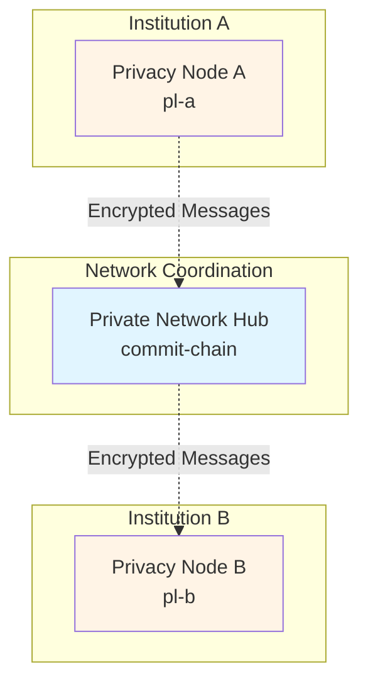
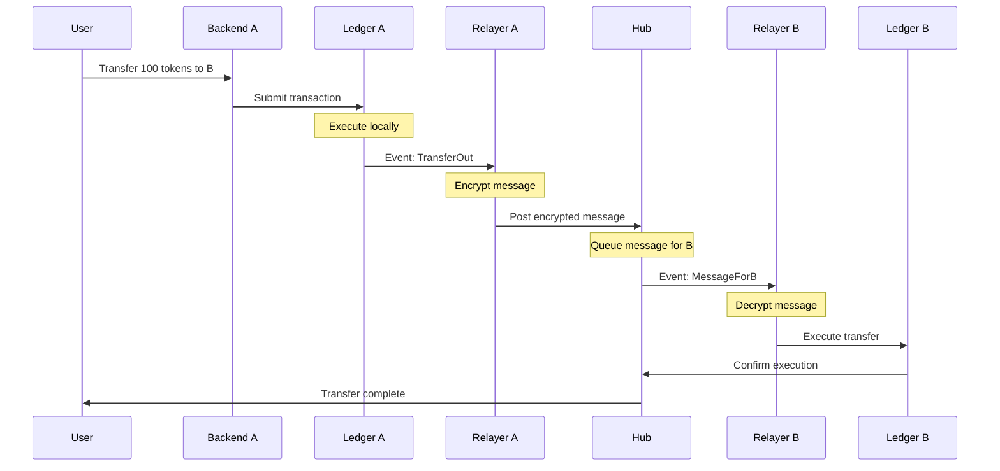

# Architecture Overview

Rayls is a privacy-preserving cross-chain infrastructure that enables financial institutions to transfer assets securely while maintaining confidentiality. This overview explains the system architecture and how the components work together.

## The Big Picture

Rayls uses a **hub-and-spoke architecture** where each institution runs its own Privacy Node (the "spoke"), and all nodes communicate through a central Private Network Hub (the "hub"). Messages between institutions are encrypted, ensuring transaction privacy.

**Key Points:**

- Each institution operates its own Privacy Node independently
- The hub coordinates cross-chain transfers without seeing transaction details
- All messages are encrypted before leaving an institution's infrastructure

## System Components

The Rayls platform consists of three architectural layers: Privacy Node Infrastructure (runs within each institution), Network Coordination (shared hub), and Specialized Services (proofs and governance). In the Docker development environment, up to 6 Privacy Nodes can run simultaneously.

### Privacy Node Components (Per Institution)

Each Privacy Node runs 6 services that work together to process transactions and communicate securely:

**1. Privacy Node Ledger** (`pl-a` through `pl-f`, ports 8545-8550)

- axyl chain (reth-based EVM) running a Narwhal + Bullshark multi-validator BFT committee
- Executes smart contracts and stores transaction data locally
- Each institution has complete control over their ledger

**2. Relayer** (`relayer-a` through `relayer-f`, ports 9000-9005)

- Bridges the Privacy Node Ledger with the Private Network Hub
- Encrypts outgoing messages and decrypts incoming messages
- Generates cryptographic proofs (Merkle trees) for verification

**3. Key Management Module** (`kos-a` through `kos-f`, ports 3000-3005)

- Manages cryptographic keys for blockchain signing and encryption
- Integrates with HSMs and cloud KMS providers (AWS, GCP, Azure)
- Handles Rayls Sign Keys (blockchain signing), Rayls View Keys (encryption, ML-KEM), and Payment Spend Keys (Enygma ZK proofs)
- Encrypts and Decrypts payload

**4. Atomic Service** (`atomic-a` through `atomic-f`, ports 9004-9009)

- Coordinates atomic swaps for trustless multi-party exchanges
- Ensures all legs of a swap execute together or all revert
- Locks funds during swap execution

**5. Backend API** (`backend-a` through `backend-f`, ports 3500-3505)

- REST API for user applications and integrations
- Manages user accounts, permissions, and authentication
- Simplifies blockchain interactions for developers

**6. Public Relayer** (`pubrelayer-a` through `pubrelayer-f`, ports 9007-9012)

- Bridges Privacy Node Ledgers to public blockchains (Ethereum, Polygon, etc.)
- Enables asset transfers between private and public networks
- Optional component for institutions needing public chain connectivity

### Network Coordination Layer

**Private Network Hub** (`commit-chain`, port 3445)

- Besu-based blockchain with Byzantine Fault Tolerant (BFT) consensus
- Coordinates cross-chain transfers between Privacy Nodes
- Stores encrypted transaction messages and proofs
- Maintains participant registry and token registry
- Validators run consensus to finalize hub transactions

**Public Chain** (`public-chain`, port 3446, optional)

- Simulated public blockchain for development/testing
- Represents Ethereum mainnet or other public networks
- Used for testing public-to-private and private-to-public transfers

### Specialized Services

**Zero-Knowledge Proofs Service** (`proofs-api`/`gnark-api`, port 3003)

- Generates Groth16 zero-knowledge proofs for Enygma privacy protocol
- Pre-compiled circuits for token transfers, swaps, and ownership proofs
- Each Privacy Node has its own ZK Proofs Service
- Enables private transactions where amounts and parties are hidden

**Governance Services** (optional, for audit and compliance)

- **Governance API** (`governance-api`, port 9100): REST API for querying audit data and participant balances
- **Governance Listener** (`governance-listener`, port 9101): Monitors hub events and decrypts messages using auditor keys
- **Governance Flagger** (`governance-flagger`, port 9102): Flags suspicious transactions based on configurable rules

**Data Flow:**

1. User submits transaction via Backend API
2. Backend forwards to Privacy Node Ledger
3. Ledger executes transaction and emits events
4. Relayer detects events, uses Key Management for encryption
5. Relayer posts encrypted message to Hub
6. Hub routes message to destination institution
7. Destination Relayer decrypts and executes on their Ledger

## How a Transfer Works

Here's what happens when Institution A sends tokens to Institution B:

**Step-by-Step:**

1. **Initiate**: User submits a transfer request to Backend A
2. **Execute Locally**: Ledger A processes the transaction (e.g., burns tokens)
3. **Encrypt & Send**: Relayer A encrypts the message and posts it to the Hub
4. **Route**: The Hub queues the encrypted message for Institution B
5. **Decrypt & Execute**: Relayer B decrypts and executes on Ledger B (e.g., mints tokens)
6. **Confirm**: Both sides confirm, and the transfer is complete

**Privacy Model:**

- Transaction details are visible within each institution's ledger
- Only encrypted messages are visible on the Hub
- The Hub routes messages but cannot read their contents
- Optional governance auditors can decrypt messages for compliance

## Key Takeaways

**Architecture:**

- **Hub-and-Spoke Model**: Central hub coordinates communication between independent Privacy Nodes
- **Docker Services**: Each Privacy Node runs multiple containers (ledger, relayer, keys, backend)
- **Encryption**: All cross-chain messages are encrypted before leaving an institution

**Privacy Guarantees:**

- Internal transactions are fully private within each institution's ledger
- Cross-chain messages are encrypted using public-key cryptography
- The Hub sees only encrypted payloads and routing information
- Auditors can view transactions with appropriate decryption keys

**Transaction Flow:**

- Transactions execute on the source ledger first (e.g., burn tokens)
- Relayers encrypt and route messages through the Hub
- Destination relayers decrypt and execute on their ledger (e.g., mint tokens)
- All operations are atomic: either all succeed or all revert

## Docker Service Mapping

When running the local development environment, the components map to these Docker services. The default configuration runs 2 participants (A and B), but can scale up to 6 (A through F).

### Privacy Node Services (Per Participant)

| Component               | Participants                          | Ports     | Description                  |
| ----------------------- | ------------------------------------- | --------- | ---------------------------- |
| **Privacy Node Ledger** | `pl-a` through `pl-f`                 | 8545-8550 | axyl chain                   |
| **Relayer**             | `relayer-a` through `relayer-f`       | 9000-9005 | Cross-chain message bridge   |
| **Key Management**      | `kos-a` through `kos-f`               | 3000-3005 | Cryptographic key operations |
| **Atomic Service**      | `atomic-a` through `atomic-f`         | 9004-9009 | Atomic swap coordination     |
| **Backend API**         | `backend-a` through `backend-f`       | 3500-3505 | REST API for applications    |
| **Public Relayer**      | `pubrelayer-a` through `pubrelayer-f` | 9007-9012 | Public chain bridge          |

### Network & Shared Services

| Component               | Docker Service             | Port  | Description                           |
| ----------------------- | -------------------------- | ----- | ------------------------------------- |
| **Private Network Hub** | `commit-chain`             | 3445  | Besu coordination blockchain          |
| **Public Chain**        | `public-chain`             | 3446  | Simulated public blockchain (testing) |
| **ZK Proofs Service**   | `proofs-api` / `gnark-api` | 3003  | Zero-knowledge proof generation       |
| **MongoDB**             | `mongodb`                  | 27017 | Document database (backend & service state) |

### Governance Services (Optional)

| Component               | Docker Service        | Port | Description               |
| ----------------------- | --------------------- | ---- | ------------------------- |
| **Governance API**      | `governance-api`      | 9100 | Audit data REST API       |
| **Governance Listener** | `governance-listener` | 9101 | Hub event monitoring      |
| **Governance Flagger**  | `governance-flagger`  | 9102 | Transaction flagging      |
| **Governance Database** | `governance-postgres` | 5432 | PostgreSQL for audit data |

### Example: 2-Participant Setup

For a typical development environment with 2 participants, these containers run:

- **Institution A**: pl-a, relayer-a, kos-a, atomic-a, backend-a, pubrelayer-a
- **Institution B**: pl-b, relayer-b, kos-b, atomic-b, backend-b, pubrelayer-b
- **Shared**: commit-chain, proofs-api, mongodb, governance-api, governance-listener, governance-flagger, governance-postgres

## Learn More

This overview covers the basics of Rayls architecture. For deeper technical details, see:

**Detailed Architecture:**
- [How It Works](../../learn/introduction/how-it-works.md) - Comprehensive technical architecture
- [What is Rayls](../../learn/introduction/what-is-rayls.md) - Platform overview and capabilities
- [Key Features](../../learn/introduction/key-features.md) - Core features and benefits

**Core Components:**
- [Privacy Node Components](../../learn/components/architecture/privacy-node-components.md) - Complete Privacy Node architecture
- [Privacy Nodes](../../learn/components/privacy-nodes/index.md) - Blockchain implementation details
- [Private Network Hub](../../learn/components/private-network-hub/index.md) - Hub architecture and consensus
- [Relayer](../../learn/components/relayer/index.md) - Cross-chain messaging and encryption

**Protocols:**
- [Atomic Teleport](../../learn/protocols/teleport-atomic/overview.md) - Cross-chain transfer protocol
- [Enygma](../../learn/protocols/enygma/index.md) - Zero-knowledge privacy protocol

**Next Steps:**
- [Docker Setup](docker-setup.md) - Deploy the local development environment
- [Prerequisites](prerequisites.md) - System requirements and installation
