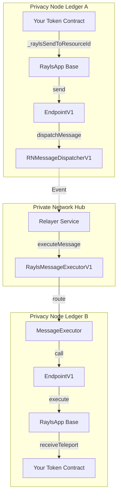
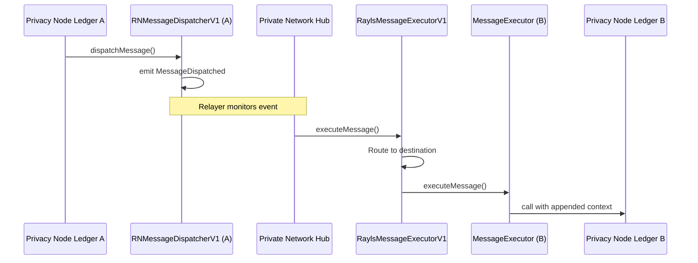

# EIP-5164 Cross-Chain Execution Standard

## Introduction

EIP-5164 is an Ethereum standard that defines interfaces for cross-chain execution. It provides a standardized way for smart contracts to dispatch messages on one chain and execute them on another, enabling composable cross-chain applications.

**Why EIP-5164 Matters:**

- **Standardization**: Common interface across different bridge implementations
- **Composability**: Contracts can interact across chains without knowing bridge specifics
- **Security**: Well-defined patterns for replay protection and sender verification
- **Interoperability**: Ecosystem-wide compatibility and tooling support

Rayls implements EIP-5164 as the foundation for all cross-chain operations. When you call `teleport()` or `teleportAtomic()` on your token contracts, EIP-5164 messaging is happening under the hood.

**Architectural Context**: This document focuses on the technical details of EIP-5164 and its implementation. For high-level architecture, see [Smart Contracts Overview](overview.md). For practical token implementation, see [Token Standards](token-standards.md).

!!! info "Prerequisites"
    Before diving into EIP-5164 technical details, you should understand:

    - [Overview](overview.md) - Three-layer architecture and cross-chain message flow fundamentals
    - [Token Standards](token-standards.md) - Handler patterns and atomic vs regular teleport differences
    - Basic Solidity and cross-chain messaging concepts

---

## The EIP-5164 Standard

EIP-5164 defines two core interfaces that work together to enable cross-chain execution:

### Core Interfaces

#### MessageDispatcher

The `MessageDispatcher` interface handles sending messages from the source chain:

```solidity
interface MessageDispatcher {
    /**
     * @notice Dispatch a message to another chain
     * @param toChainId The destination chain identifier
     * @param to The target contract address
     * @param data The calldata to execute on the target
     * @return messageId Unique identifier for this message
     */
    function dispatchMessage(
        uint256 toChainId,
        address to,
        bytes calldata data
    ) external returns (bytes32 messageId);

    event MessageDispatched(
        bytes32 indexed messageId,
        address indexed from,
        uint256 indexed toChainId,
        address to,
        bytes data
    );
}
```

#### MessageExecutor

The `MessageExecutor` interface handles executing messages on the destination chain:

```solidity
interface MessageExecutor {
    /**
     * @notice Execute a cross-chain message
     * @param to The target contract address
     * @param data The calldata to execute
     * @param messageId Unique message identifier
     * @param fromChainId The source chain identifier
     * @param from The sender address on source chain
     */
    function executeMessage(
        address to,
        bytes calldata data,
        bytes32 messageId,
        uint256 fromChainId,
        address from
    ) external;

    event MessageIdExecuted(
        uint256 indexed fromChainId,
        bytes32 indexed messageId
    );
}
```

### Message ID Generation

The standard recommends generating unique message IDs using:

```solidity
messageId = keccak256(abi.encode(
    from,           // Sender address
    toChainId,      // Destination chain
    to,             // Recipient address
    data,           // Message data
    nonce           // Incrementing nonce for uniqueness
));
```

This ensures each message has a globally unique identifier, preventing replay attacks.

### Security Guarantees

EIP-5164 provides critical security guarantees:

1. **Replay Protection**: Each `messageId` can only be executed once
2. **Sender Verification**: The original sender address is preserved and verifiable
3. **Chain Validation**: Source and destination chain IDs prevent cross-chain confusion
4. **Authorization**: Executors can restrict who can trigger message execution

---

## Rayls Implementation Architecture

Rayls implements EIP-5164 with a three-layer architecture optimized for Privacy Node Ledger to Privacy Node Ledger communication:



### Component Responsibilities

| Component                | Location            | EIP-5164 Role     | Purpose                     |
| ------------------------ | ------------------- | ----------------- | --------------------------- |
| `RNMessageDispatcherV1`  | Privacy Node Ledger | MessageDispatcher | Emit events for relayer     |
| `MessageExecutor`        | Privacy Node Ledger | MessageExecutor   | Execute received messages   |
| `RaylsMessageExecutorV1` | Private Network Hub | Orchestrator      | Route and validate messages |

---

## Complete Message Flow Walkthrough

Let's trace a `teleport()` call through the entire EIP-5164 flow:

**Step 1**: Developer calls `teleport()` on TokenExample (Privacy Node Ledger A)
```solidity
token.teleport(destinationChainId, recipientAddress, 1000);
```

**Step 2**: RaylsErc20Handler burns tokens and calls `_raylsSendToResourceId()`
```solidity
// From RaylsErc20Handler.sol:153-175
function teleport(uint256 destinationChainId, address to, uint256 value) {
    _burn(msg.sender, value);
    _raylsSendToResourceId(
        destinationChainId,
        resourceId,
        abi.encodeWithSignature("receiveTeleport(address,uint256)", to, value)
    );
}
```

**Step 3**: RaylsApp forwards to EndpointV1
```solidity
// From RaylsApp.sol:75-85
function _raylsSendToResourceId(
    uint256 _dstChainId,
    bytes32 _resourceId,
    bytes memory _payload
) internal virtual {
    endpoint.sendToResourceId(_dstChainId, _resourceId, _payload);
}
```

**Step 4**: EndpointV1 calls RNMessageDispatcherV1.dispatchMessage()
```solidity
// From RNMessageDispatcherV1.sol:85-90
function dispatchMessage(
    uint256 fromChainId,
    address from,
    uint256 toChainId,
    address to,
    RaylsNodeMessage memory data
) external onlyAuthorizedEndpoint returns (bytes32) {
    // Generate EIP-5164 compliant messageId
    bytes32 messageId = RNMessageLib.computeMessageId(
        fromChainId, from, toChainId, to,
        data.messageMetadata.nonce,
        abi.encode(data)
    );

    // Emit event for relayer
    emit MessageDispatched(messageId, from, toChainId, to, data);

    return messageId;
}
```

**Step 5**: Relayer picks up `MessageDispatched` event and submits to Private Network Hub

**Step 6**: RaylsMessageExecutorV1 validates and sets replay protection
```solidity
// From RaylsMessageExecutorV1.sol:29-36
function executeMessage(
    address to,
    bytes calldata data,
    bytes32 messageId,
    uint256 fromChainId,
    address from
) external virtual override {
    bool _executedMessageId = executed[messageId];
    executed[messageId] = true;  // Replay protection

    MessageLib.executeMessage(to, data, messageId, fromChainId, from, _executedMessageId);

    emit MessageIdExecuted(fromChainId, messageId);
}
```

**Step 7**: Private Network Hub routes to destination Privacy Node Ledger B

**Step 8**: MessageExecutor on Privacy Node Ledger B appends context and executes
```solidity
// From MessageExecutor.sol:40-50, 61-80
function executeMessage(
    address _to,
    bytes calldata _data,
    bytes32 _messageId,
    uint256 _fromChainId,
    address _from
) external {
    require(msg.sender == owner, "executeMessage called from unauthorized account");

    bool _executedMessageId = executed[_messageId];
    executed[_messageId] = true;

    executeMessage(_to, _data, _messageId, _fromChainId, _from, _executedMessageId);

    emit MessageIdExecuted(_fromChainId, _messageId);
}

function executeMessage(
    address to,
    bytes memory data,
    bytes32 messageId,
    uint256 fromChainId,
    address from,
    bool executedMessageId
) internal {
    if (executedMessageId) {
        revert MessageIdAlreadyExecuted(messageId);
    }

    require(to.code.length > 0, "No contract at target address");

    // Append EIP-5164 context to calldata
    (bool _success, bytes memory _returnData) = to.call(
        abi.encodePacked(data, messageId, fromChainId, from)
    );

    if (!_success) {
        revert MessageFailure(messageId, _returnData);
    }
}
```

**Step 9**: EndpointV1 on Privacy Node Ledger B receives the call

**Step 10**: Target contract's `receiveTeleport()` is called with context available
```solidity
function receiveTeleport(address to, uint256 value)
    external
    virtual
    receiveMethod
    returns (bool)
{
    // Context automatically available via RaylsApp helper methods
    bytes32 messageId = _getMessageIdOnReceiveMethod();
    uint256 fromChainId = _getFromChainIdOnReceiveMethod();
    address fromAddress = _getMsgSenderOnReceiveMethod();

    _mint(to, value);
    return true;
}
```

---

## RNMessageDispatcherV1 Deep Dive

**File**: `src/rayls-node/rayls-sovereign-ledger/RNMessageDispatcherV1.sol`

RNMessageDispatcherV1 is the Privacy Node Ledger's implementation of the EIP-5164 MessageDispatcher interface.

### Implementation Details

The dispatcher is extremely lean - its primary job is to emit events for the relayer:

```solidity
// RNMessageDispatcherV1.sol:85-90
function dispatchMessage(
    uint256 fromChainId,
    address from,
    uint256 toChainId,
    address to,
    RaylsNodeMessage memory data
) external onlyAuthorizedEndpoint returns (bytes32) {
    bytes32 messageId = RNMessageLib.computeMessageId(
        fromChainId, from, toChainId, to,
        data.messageMetadata.nonce,
        abi.encode(data)
    );
    emit MessageDispatched(messageId, from, toChainId, to, data);
    return messageId;
}
```

**Key Points**:

- **No state changes**: The Privacy Node Ledger dispatcher doesn't store messages
- **Event-driven**: Relayers monitor the `MessageDispatched` event
- **Nonce included**: Part of `RaylsNodeMessage.messageMetadata.nonce` ensures uniqueness
- **Authorization**: Only the authorized EndpointV1 can dispatch messages (line 38-43)

### Authorization Model

```solidity
// RNMessageDispatcherV1.sol:38-43
modifier onlyAuthorizedEndpoint() {
    if (msg.sender != authorizedEndpoint) {
        revert RNMessageDispatcherV1__UnauthorizedEndpoint(msg.sender);
    }
    _;
}
```

The dispatcher trusts only the configured EndpointV1 contract. This prevents arbitrary contracts from emitting fake cross-chain messages.

### Batch Support

RNMessageDispatcherV1 also supports batch message dispatch:

```solidity
// RNMessageDispatcherV1.sol:99-102
function dispatchMessageBatch(
    bytes32 batchId,
    address from,
    BatchMessage[] memory messages
) external onlyAuthorizedEndpoint returns (bytes32) {
    emit MessageBatchDispatched(batchId, from, messages);
    return batchId;
}
```

This enables gas-efficient multi-message operations, used by `teleportBatch()` implementations.

---

## MessageExecutor Deep Dive

**File**: `src/MessageExecutor.sol`

MessageExecutor is the base implementation for executing cross-chain messages on Privacy Node Ledgers.

### Execution Logic

The executor has two critical responsibilities:

1. Prevent replay attacks
2. Append EIP-5164 context to calldata

```solidity
// MessageExecutor.sol:40-50
function executeMessage(
    address _to,
    bytes calldata _data,
    bytes32 _messageId,
    uint256 _fromChainId,
    address _from
) external {
    require(msg.sender == owner, "executeMessage called from unauthorized account");

    bool _executedMessageId = executed[_messageId];
    executed[_messageId] = true;  // Mark as executed BEFORE execution

    executeMessage(_to, _data, _messageId, _fromChainId, _from, _executedMessageId);

    emit MessageIdExecuted(_fromChainId, _messageId);
}
```

**Security Pattern**: Notice that `executed[_messageId] = true` happens BEFORE the actual execution. This follows the checks-effects-interactions pattern and prevents reentrancy-based replay attacks.

### Context Appending Mechanism

The internal execution appends context to the calldata:

```solidity
// MessageExecutor.sol:61-80
function executeMessage(
    address to,
    bytes memory data,
    bytes32 messageId,
    uint256 fromChainId,
    address from,
    bool executedMessageId
) internal {
    if (executedMessageId) {
        revert MessageIdAlreadyExecuted(messageId);
    }

    require(to.code.length > 0, "No contract at target address");

    // Append context: messageId (32 bytes) + fromChainId (32 bytes) + from (20 bytes)
    (bool _success, bytes memory _returnData) = to.call(
        abi.encodePacked(data, messageId, fromChainId, from)
    );

    if (!_success) {
        revert MessageFailure(messageId, _returnData);
    }
}
```

**Why append instead of store?**
- **Gas efficiency**: No storage writes on destination chain
- **Stateless execution**: Target contract gets all context in one call
- **Standard compliance**: Follows EIP-5164 recommended pattern

### How Context Extraction Works

RaylsApp provides helper methods that extract this appended context:

```solidity
// RaylsApp.sol:279-291
function _getMessageIdOnReceiveMethod()
    internal
    pure
    returns (bytes32 _msgDataMessageId)
{
    if (msg.data.length >= 84) {
        assembly {
            // Read 32 bytes starting from (calldata_size - 84)
            _msgDataMessageId := calldataload(sub(calldatasize(), 84))
        }
    }
}
```

The context is located at the end of calldata:
- Last 20 bytes: `from` address
- Previous 32 bytes: `fromChainId`
- Previous 32 bytes: `messageId`

**Total**: 84 bytes appended to original calldata

---

## RaylsMessageExecutorV1 - Private Network Hub Orchestrator

**File**: `src/rayls-protocol/RaylsMessageExecutor/RaylsMessageExecutorV1.sol`

RaylsMessageExecutorV1 sits on the Private Network Hub and orchestrates cross-chain message routing between Privacy Node Ledgers.

### Orchestration Role

Unlike the Privacy Node Ledger executors, the Private Network Hub executor:

1. **Validates** messages from the relayer
2. **Routes** messages to the correct destination Privacy Node Ledger
3. **Provides** batch execution support
4. **Ensures** replay protection at the hub level

```solidity
// RaylsMessageExecutorV1.sol:29-36
function executeMessage(
    address to,
    bytes calldata data,
    bytes32 messageId,
    uint256 fromChainId,
    address from
) external virtual override {
    bool _executedMessageId = executed[messageId];
    executed[messageId] = true;

    MessageLib.executeMessage(to, data, messageId, fromChainId, from, _executedMessageId);

    emit MessageIdExecuted(fromChainId, messageId);
}
```

### Batch Processing

The hub supports efficient batch execution:

```solidity
// RaylsMessageExecutorV1.sol:38-45
function executeMessageBatch(
    MessageLib.Message[] calldata messages,
    bytes32 messageId,
    uint256 fromChainId,
    address from
) external virtual override {
    bool _executedMessageId = executed[messageId];
    executed[messageId] = true;

    MessageLib.executeMessageBatch(messages, messageId, fromChainId, from, _executedMessageId);

    emit MessageIdExecuted(fromChainId, messageId);
}
```

This allows multiple cross-chain operations to be executed atomically in a single transaction.

### Dual-Layer Replay Protection

Rayls implements replay protection at TWO levels:

1. **Private Network Hub Level**: RaylsMessageExecutorV1 prevents hub-level replays
2. **Privacy Node Ledger Level**: MessageExecutor prevents ledger-level replays

This defense-in-depth approach ensures messages cannot be replayed even if one layer is compromised.

---

## Working with EIP-5164 Context

When you write receive methods in your contracts, EIP-5164 context is automatically available via RaylsApp helper methods.

### Extracting Message Context

RaylsApp provides three key methods for accessing context:

```solidity
// RaylsApp.sol:279-329
function _getMessageIdOnReceiveMethod() internal pure returns (bytes32)
function _getFromChainIdOnReceiveMethod() internal pure returns (uint256)
function _getMsgSenderOnReceiveMethod() internal view returns (address payable)
```

### Practical Example

Here's how to use context in your token's receive method:

```solidity
function receiveTeleport(address to, uint256 value)
    external
    virtual
    receiveMethod  // Validates msg.sender is trusted executor
    returns (bool)
{
    // Extract EIP-5164 context
    bytes32 messageId = _getMessageIdOnReceiveMethod();
    uint256 fromChainId = _getFromChainIdOnReceiveMethod();
    address fromSender = _getMsgSenderOnReceiveMethod();

    // Validate sender from source chain
    require(
        isTrustedSender(fromChainId, fromSender),
        "Unauthorized cross-chain sender"
    );

    // Your business logic
    _mint(to, value);

    // Emit event with context for tracing
    emit TeleportReceived(
        messageId,
        fromChainId,
        fromSender,
        to,
        value
    );

    return true;
}
```

### The receiveMethod Modifier

RaylsApp provides the `receiveMethod` modifier to ensure only the trusted executor can call receive methods:

```solidity
// RaylsApp.sol:249-255
modifier receiveMethod() {
    require(
        endpoint.isTrustedExecutor(msg.sender),
        "This is a receive method. Only endpoint's executor can call this method."
    );
    _;
}
```

This prevents direct calls to receive methods - they can ONLY be invoked through the EIP-5164 execution flow.

### Best Practices

**1. Always use the receiveMethod modifier**
```solidity
function receiveTeleport(...) external receiveMethod returns (bool) {
    // Safe - only executor can call
}
```

**2. Validate fromChainId when chain-specific logic is needed**
```solidity
function receiveFromPublicChain(...) external receiveMethod {
    uint256 sourceChain = _getFromChainIdOnReceiveMethod();
    require(sourceChain == PUBLIC_CHAIN_ID, "Wrong source chain");
}
```

**3. Validate fromSender for authorization**
```solidity
function receiveAdminOperation(...) external receiveMethod {
    address sender = _getMsgSenderOnReceiveMethod();
    require(isAdmin[sender], "Not authorized");
}
```

**4. Emit events with messageId for tracing**
```solidity
event TeleportReceived(
    bytes32 indexed messageId,
    uint256 indexed fromChainId,
    address from,
    address to,
    uint256 value
);

function receiveTeleport(...) external receiveMethod {
    bytes32 messageId = _getMessageIdOnReceiveMethod();
    // ...
    emit TeleportReceived(messageId, fromChainId, from, to, value);
}
```

---

## Comparison: EIP-5164 vs Custom Bridges

### Why Standards Matter

**Interoperability Benefits**:

- Contracts work with any EIP-5164 compatible bridge
- Ecosystem tooling (explorers, indexers) understand the standard
- Easier integration for developers familiar with EIP-5164

**Security Through Standardization**:

- Well-audited, community-reviewed patterns
- Known security considerations documented
- Reduced attack surface through common implementations

**Developer Experience**:

- Familiar interfaces reduce learning curve
- Standard events for easier debugging
- Common patterns across different chains

### Trade-offs

| Aspect               | EIP-5164 Standard                               | Custom Bridge                      |
| -------------------- | ----------------------------------------------- | ---------------------------------- |
| **Interoperability** | High - works with any compliant bridge          | Low - vendor lock-in               |
| **Gas Costs**        | Moderate - some overhead from context appending | Can be optimized                   |
| **Security**         | High - community-reviewed standard              | Varies - depends on implementation |
| **Flexibility**      | Limited to standard interface                   | Full control over features         |
| **Audit Cost**       | Lower - standard patterns                       | Higher - novel implementation      |

### When to Extend the Standard

Rayls extends EIP-5164 for advanced features while maintaining base compatibility:

**Atomic Swaps (teleportAtomic)**:

- Uses EIP-5164 for primary message
- Extends with additional payloads for lock/revert data
- See [Token Standards - Atomic Mechanism](token-standards.md#teleportatomic-safety-with-automatic-revert) for details

**Batch Operations**:

- Extends `dispatchMessage` with `dispatchMessageBatch`
- Maintains same security guarantees
- Improves gas efficiency for multi-message operations

**Key Principle**: Rayls extensions are additive - they build on EIP-5164 without breaking compatibility.

---

## Advanced Patterns

### Multi-Hop Messages

Rayls chains EIP-5164 calls for Privacy Node Ledger → Private Network Hub → Privacy Node Ledger flows:



Each hop maintains EIP-5164 compliance with its own messageId and replay protection.

### Atomic Extensions

The `teleportAtomic()` pattern uses EIP-5164 as foundation with Rayls extensions:

```solidity
function teleportAtomic(
    uint256 destinationChainId,
    address to,
    uint256 value
) public virtual returns (bool) {
    _burn(msg.sender, value);

    _raylsSendToResourceId(
        destinationChainId,
        resourceId,
        // PAYLOAD 1: Main execution (EIP-5164 compliant)
        abi.encodeWithSignature("receiveTeleportAtomic(address,uint256)", to, value),
        // PAYLOAD 2: Lock confirmation (Rayls extension)
        abi.encodeWithSignature("unlock(address,uint256)", to, value),
        // PAYLOAD 3: Revert on sender chain (Rayls extension)
        abi.encodeWithSignature("revertTeleportMint(address,uint256)", msg.sender, value),
        // PAYLOAD 4: Revert on receiver chain (Rayls extension)
        abi.encodeWithSignature("revertTeleportBurn(uint256)", value),
        transferMetadata
    );
    return true;
}
```

**How it works**:

1. Payload 1 dispatched via standard EIP-5164
2. Payloads 2-4 stored as metadata in message
3. If Payload 1 fails, Payloads 3-4 executed for atomic revert
4. If Payload 1 succeeds, Payload 2 executed for finalization

For complete atomic swap details, see [Token Standards - The Atomic Mechanism](token-standards.md#teleportatomic-safety-with-automatic-revert).

### Custom Executors

You can implement custom MessageExecutor logic for specialized use cases:

```solidity
contract CustomMessageExecutor is MessageExecutor {
    // Add custom validation before execution
    function executeMessage(
        address to,
        bytes calldata data,
        bytes32 messageId,
        uint256 fromChainId,
        address from
    ) external override {
        // Custom pre-execution logic
        require(isAuthorizedChain(fromChainId), "Chain not authorized");
        require(isWhitelisted(from), "Sender not whitelisted");

        // Call parent implementation
        super.executeMessage(to, data, messageId, fromChainId, from);

        // Custom post-execution logic
        recordExecution(messageId, from, fromChainId);
    }
}
```

**Use cases**:

- Chain-specific authorization rules
- Custom replay protection logic
- Execution rate limiting
- Compliance checks (KYC/AML)

---

## Testing EIP-5164 Compliance

### Test Patterns

#### 1. Test Message Dispatch

```typescript
describe("RNMessageDispatcherV1", () => {
    it("should generate unique messageId for each dispatch", async () => {
        const message1Id = await dispatcher.dispatchMessage(
            fromChainId, from, toChainId, to, data
        );

        const message2Id = await dispatcher.dispatchMessage(
            fromChainId, from, toChainId, to, data
        );

        expect(message1Id).to.not.equal(message2Id);
    });

    it("should emit MessageDispatched event", async () => {
        await expect(
            dispatcher.dispatchMessage(fromChainId, from, toChainId, to, data)
        )
            .to.emit(dispatcher, "MessageDispatched")
            .withArgs(messageId, from, toChainId, to, data);
    });
});
```

#### 2. Test Replay Protection

```typescript
describe("MessageExecutor", () => {
    it("should prevent replay attacks", async () => {
        // Execute message first time - should succeed
        await executor.executeMessage(to, data, messageId, fromChainId, from);

        // Try to execute again - should fail
        await expect(
            executor.executeMessage(to, data, messageId, fromChainId, from)
        ).to.be.revertedWithCustomError(executor, "MessageIdAlreadyExecuted");
    });

    it("should allow different messageIds", async () => {
        await executor.executeMessage(to, data, messageId1, fromChainId, from);

        // Different messageId should work
        await expect(
            executor.executeMessage(to, data, messageId2, fromChainId, from)
        ).to.not.be.reverted;
    });
});
```

#### 3. Test Context Extraction

```typescript
describe("RaylsApp Context", () => {
    it("should correctly extract messageId from calldata", async () => {
        const receivedMessageId = await token.getLastMessageId();
        expect(receivedMessageId).to.equal(expectedMessageId);
    });

    it("should correctly extract fromChainId", async () => {
        const receivedFromChain = await token.getLastFromChainId();
        expect(receivedFromChain).to.equal(sourceChainId);
    });

    it("should correctly extract sender address", async () => {
        const receivedSender = await token.getLastSender();
        expect(receivedSender).to.equal(originalSender);
    });
});
```

#### 4. Integration Testing Cross-Chain Flow

```typescript
describe("Complete Cross-Chain Flow", () => {
    it("should execute full teleport flow", async () => {
        // Step 1: Dispatch on source chain
        const tx = await tokenA.teleport(chainB, recipient, amount);
        const receipt = await tx.wait();

        // Step 2: Extract messageId from event
        const event = receipt.events.find(e => e.event === "MessageDispatched");
        const messageId = event.args.messageId;

        // Step 3: Simulate relayer calling executor
        await executorHub.executeMessage(
            endpointB.address,
            executionData,
            messageId,
            chainA,
            tokenA.address
        );

        // Step 4: Verify execution on destination
        const balance = await tokenB.balanceOf(recipient);
        expect(balance).to.equal(amount);

        // Step 5: Verify messageId marked as executed
        expect(await executorHub.executed(messageId)).to.be.true;
    });
});
```

### Mocking Strategies

For testing without full infrastructure:

```typescript
// Mock MessageExecutor for unit tests
class MockMessageExecutor {
    async executeMessage(to, data, messageId, fromChainId, from) {
        // Append context like real executor
        const contextData = ethers.utils.solidityPack(
            ["bytes", "bytes32", "uint256", "address"],
            [data, messageId, fromChainId, from]
        );

        // Call target contract
        await to.call(contextData);
    }
}

// Use in tests
it("should handle cross-chain message", async () => {
    const mockExecutor = new MockMessageExecutor();
    await mockExecutor.executeMessage(
        token.address,
        encodedFunction,
        messageId,
        sourceChain,
        sender
    );

    // Verify behavior
    expect(await token.balanceOf(recipient)).to.equal(amount);
});
```

### Compliance Verification

Verify your contracts are EIP-5164 compliant:

**Checklist**:

- [ ] MessageDispatcher returns unique bytes32 messageId
- [ ] MessageDispatcher emits MessageDispatched event
- [ ] MessageExecutor prevents replay with messageId tracking
- [ ] MessageExecutor emits MessageIdExecuted event
- [ ] Context (messageId, fromChainId, from) preserved through execution
- [ ] Target contracts can extract context via helpers
- [ ] Authorization checks prevent unauthorized execution

**Tools**:

- EIP-5164 compliance test suite (if available in ecosystem)
- Custom test harness comparing against reference implementation
- Event log analysis to verify correct parameters

---

## Troubleshooting

### Common Issues

#### 1. "Already executed" / "MessageIdAlreadyExecuted"

**Cause**: Attempting to execute a message that was already processed.

**Debugging**:
```solidity
// Check if messageId was executed
bool wasExecuted = executor.executed(messageId);
```

**Solutions**:

- Verify you're not resubmitting the same message
- Check relayer isn't duplicating submissions
- Ensure nonce is incrementing properly in dispatcher

---

#### 2. "Unauthorized sender" / "Only endpoint's executor can call"

**Cause**: Calling a receive method directly instead of through EIP-5164 flow.

**Debugging**:
```solidity
// Check who is trusted executor
address trustedExecutor = endpoint.getTrustedExecutor();
console.log("msg.sender:", msg.sender);
console.log("trusted:", trustedExecutor);
```

**Solutions**:

- Don't call receive methods directly - use teleport()
- Verify endpoint configuration points to correct executor
- Check if you need `publicEndpointReceiveMethod` instead of `receiveMethod`

---

#### 3. Context Extraction Returns Zero Values

**Cause**: Context not appended to calldata, or incorrect extraction logic.

**Debugging**:
```solidity
// Log calldata length in your receive method
console.log("calldata length:", msg.data.length);

// Should be: function_selector (4) + params + context (84)
// Example: 4 + 64 (address + uint256) + 84 = 152 bytes
```

**Solutions**:

- Verify MessageExecutor is appending context (check line 75 in MessageExecutor.sol)
- Ensure you're using RaylsApp helper methods, not custom extraction
- Check calldata length is sufficient (>= 84 bytes for full context)

---

#### 4. "Invalid chain ID" Errors

**Cause**: Chain ID mismatch between configuration and execution.

**Debugging**:
```typescript
// Check configured chain IDs
const hubChainId = await endpoint.getCommitChainId();
const currentChainId = await ethers.provider.getNetwork().then(n => n.chainId);

console.log("Hub chain ID:", hubChainId);
console.log("Current chain ID:", currentChainId);
console.log("From chain ID:", fromChainId);
```

**Solutions**:

- Verify chain ID configuration in EndpointV1
- Check docker-compose.yml chain ID assignments
- Ensure relayer is submitting correct fromChainId

---

#### 5. Message Not Executing on Destination

**Cause**: Could be relayer issue or contract issue.

**Step-by-step debugging**:

**1. Verify message was dispatched**:
```typescript
// Check for MessageDispatched event
const events = await dispatcher.queryFilter("MessageDispatched");
console.log("Dispatched messages:", events.length);
```

**2. Check relayer picked up event**:
```bash
# Check relayer logs
docker logs rayls-relayer-1 | grep "MessageDispatched"
```

**3. Verify execution attempt on hub**:
```typescript
// Check if messageId is in executed mapping
const wasExecuted = await executorHub.executed(messageId);
console.log("Hub executed:", wasExecuted);
```

**4. Check destination executor**:
```typescript
const wasExecuted = await executorB.executed(messageId);
console.log("Destination executed:", wasExecuted);
```

**5. Verify target contract received call**:
```solidity
// Add debugging event to your receive method
event ReceiveDebug(bytes32 messageId, uint256 value);

function receiveTeleport(...) external receiveMethod {
    emit ReceiveDebug(_getMessageIdOnReceiveMethod(), value);
    // ...
}
```

---

## Can You Now...?

Test your understanding before proceeding:

- [ ] **Explain the roles** of MessageDispatcher vs MessageExecutor?
  - *Which handles sending messages? Which handles execution?*

- [ ] **Describe the atomic teleport message flow** across chains?
  - *How does a message travel from Privacy Node Ledger A → Hub → Privacy Node Ledger B?*

- [ ] **Identify critical security checks** in the EIP-5164 protocol?
  - *What prevents replay attacks? How is the sender verified?*

- [ ] **Understand context appending** for cross-chain authentication?
  - *What 84 bytes are appended? How do contracts extract them?*

- [ ] **Recognize when receiveMethod modifier** is required?
  - *Why can't receive methods be called directly?*

- [ ] **Trace messageId generation** and usage throughout the flow?
  - *How is messageId computed? What role does it play in replay protection?*

If you answered "no" to any question, review the relevant sections above. EIP-5164 understanding is crucial for debugging cross-chain issues and building custom patterns.

---

## Testing EIP-5164 Integration

Verify your EIP-5164 implementation with proper test coverage:

!!! example "EIP-5164 Test Scenarios"
    **Critical test patterns**:

    - **Message dispatch flow** - [Testing: Cross-Chain Transfer Tests](testing.md#cross-chain-transfer-tests) - Verify MessageDispatched events and messageId generation
    - **Replay protection** - [Testing: Token Tests](testing.md#what-token-tests-guarantee) - Ensure executed mapping prevents replay attacks
    - **Context extraction** - [Testing: Balance Verification Pattern](testing.md#balance-verification-pattern) - Validate messageId, fromChainId, and sender extraction
    - **Multi-hop routing** - [Testing: Cross-Chain Transfer Tests](testing.md#cross-chain-transfer-tests) - Hub coordination and destination execution
    - **Atomic extensions** - [Testing: Vanilla vs Atomic Teleport](testing.md#vanilla-vs-atomic-teleport) - Four-payload system verification

    See [Testing Guide](testing.md) for complete test implementation examples and strategies.

---

## Summary and Next Steps

### EIP-5164 in Rayls

EIP-5164 is the foundational protocol enabling all cross-chain operations in Rayls:

**Key Takeaways**:

- **Standard Interfaces**: MessageDispatcher (source) and MessageExecutor (destination)
- **Three-Layer Architecture**: Privacy Node Ledger dispatchers → Private Network Hub orchestrator → Privacy Node Ledger executors
- **Security Guarantees**: Replay protection, sender verification, chain validation
- **Context Preservation**: messageId, fromChainId, and from address available in receive methods
- **Extensibility**: Rayls builds atomic swaps and batching on top of EIP-5164 foundation

### When You Need to Care About EIP-5164

**You DON'T need deep EIP-5164 knowledge** if:
- Using RaylsErc20Handler for standard token operations
- Following existing patterns from TokenExample.sol
- Just calling `teleport()` and implementing `receiveTeleport()`

**You DO need to understand EIP-5164** if:
- Building custom cross-chain logic beyond tokens
- Implementing advanced authorization based on fromChainId/fromSender
- Debugging cross-chain message execution issues
- Extending Rayls with new cross-chain patterns
- Integrating with external EIP-5164 compatible bridges

### Related Documentation

**For Practical Implementation**:

- [Token Standards](token-standards.md) - Implement tokens using EIP-5164 under the hood
- [Transaction Lifecycle](transaction-lifecycle.md) - End-to-end flow including EIP-5164 execution
- [Endpoint Integration](endpoint-integration.md) - Advanced RaylsApp usage patterns

**For Advanced Topics**:

- [Enygma Privacy](../advanced/enygma-privacy.md) - Privacy-preserving cross-chain with EIP-5164
- [DVP Atomic Swaps](../advanced/dvp-atomic-swaps.md) - Zero-knowledge atomic swaps using EIP-5164

**For Reference**:

- [Developer Tools](../reference/developer-tools.md) - Debugging EIP-5164 message flows
- [Testing Guide](../reference/testing-guide.md) - Comprehensive testing strategies including cross-chain flows

**External Resources**:

- [EIP-5164 Specification](https://eips.ethereum.org/EIPS/eip-5164) - Official Ethereum standard
- Rayls GitHub - Example contracts and test suites

---

Understanding EIP-5164 gives you the foundation to build sophisticated cross-chain applications on Rayls. The standard's simplicity (just two interfaces) combined with Rayls' thoughtful implementation creates a powerful, secure platform for Privacy Node Ledger communication.

Ready to build? Start with [Token Standards](token-standards.md) to see EIP-5164 in action.
