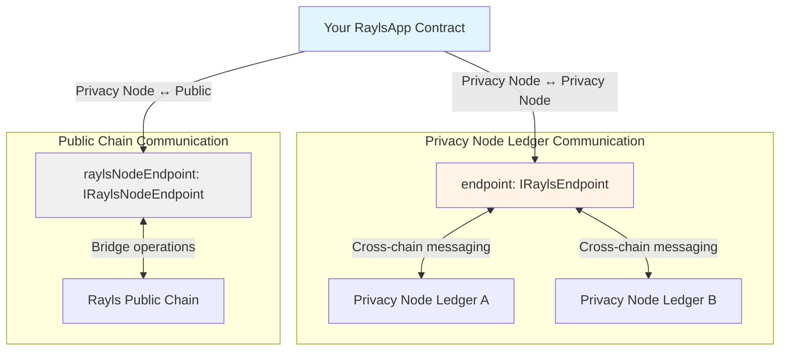
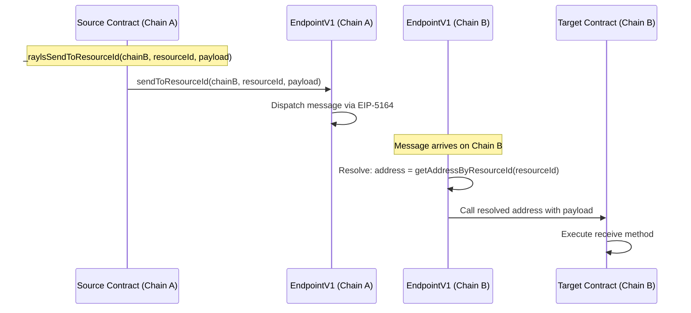

# Endpoint Integration - Advanced RaylsApp Usage

## Introduction

You've seen RaylsApp in action through token contracts in [Token Standards](token-standards.md). Now let's go deeper: building **custom cross-chain applications** beyond simple token transfers.

**What you already know:**

- RaylsApp provides the base for cross-chain contracts
- Basic `teleport()` uses `_raylsSendToResourceId()` under the hood
- The `receiveMethod` modifier secures receive functions

**What you'll learn here:**

- **All 4 message sending methods** and when to use each
- **Context extraction** to identify sender chain and address
- **Security modifiers** and what attacks they prevent
- **Building custom contracts**: voting systems, state sync, request-response patterns
- **Resource ID system**: generation, registration, resolution
- **Nonce management** and message ordering guarantees

**Who this is for:**

Developers building cross-chain applications that go beyond tokens: governance systems, multi-chain state management, cross-chain oracles, and more.

!!! info "Prerequisites"
    - Complete [Token Standards](token-standards.md) for RaylsApp basics
    - Read [EIP-5164 Explained](eip-5164-explained.md) for messaging internals
    - Understand [Architecture Overview](../beginner/architecture-overview.md)

---

## RaylsApp Architecture Deep Dive

**File**: `src/rayls-protocol-sdk/RaylsApp.sol:12-366`

### Internal State

RaylsApp maintains four key state variables:

```solidity
// RaylsApp.sol:13-17
abstract contract RaylsApp {
    IRaylsEndpoint internal endpoint;                // Privacy Node Ledger endpoint
    IRaylsNodeEndpoint internal raylsNodeEndpoint;   // Public chain bridge endpoint
    IUserGovernance public raylsNodeUserGovernance;  // User registry for compliance
    bytes32 public resourceId;                        // Logical contract identifier
}
```

### Two-Endpoint Design

Rayls uses a **dual-endpoint architecture** to support two distinct communication paths:



**When each endpoint is used:**

| Endpoint | Use For | Example |
|----------|---------|---------|
| `endpoint` | Privacy Node ↔ Privacy Node | Token teleport between Privacy Node Ledgers |
| `raylsNodeEndpoint` | Privacy Node ↔ Public Chain | Bridging assets to Rayls Public Chain |

### Constructor Pattern

```solidity
// RaylsApp.sol:25-33
constructor(address _endpoint, address _raylsNodeEndpoint, address _userGovernance) {
    endpoint = IRaylsEndpoint(_endpoint);

    // Public chain endpoint is optional
    if (_raylsNodeEndpoint != address(0)) {
        raylsNodeEndpoint = IRaylsNodeEndpoint(_raylsNodeEndpoint);
    }

    // User governance for KYC/compliance is optional
    if (_userGovernance != address(0)) {
        raylsNodeUserGovernance = IUserGovernance(_userGovernance);
    }
}
```

**Key insight**: The `raylsNodeEndpoint` is optional - only needed if your contract bridges to public chains. Pure Privacy Node Ledger contracts can pass `address(0)`.

---

## Message Sending Methods Comparison

RaylsApp provides **four methods** for sending cross-chain messages. Choosing the right one depends on your routing needs and whether you're sending single or batched messages.

### Quick Reference Table

| Method | Routing | Batch | Use When |
|--------|---------|-------|----------|
| `_raylsSend()` | Direct address | No | You know exact destination address |
| `_raylsSendToResourceId()` | Resource ID | No | Logical routing, contract upgrades possible |
| `_raylsSendBatch()` | Direct addresses | Yes | Multiple messages to known addresses |
| `_raylsSendBatchToResourceId()` | Resource IDs | Yes | Multiple messages with logical routing |

---

### _raylsSend() - Direct Address Routing

**File**: `RaylsApp.sol:51-57`

```solidity
function _raylsSend(
    uint256 _dstChainId,
    address _destination,
    bytes memory _payload
) internal virtual {
    endpoint.send(_dstChainId, _destination, _payload);
}
```

**When to use:**

- You know the exact deployed address on destination chain
- Simple point-to-point messaging
- Destination contract won't be upgraded

**Example use case:**

```solidity
contract CrossChainNotifier is RaylsApp {
    function notifyExternalContract(uint256 targetChain, address target, bytes memory data)
        external
    {
        _raylsSend(targetChain, target, data);
    }
}
```

**Limitation**: If destination contract is upgraded to a new address, your calls will fail.

---

### _raylsSendToResourceId() - Logical Routing

**File**: `RaylsApp.sol:75-85`

```solidity
function _raylsSendToResourceId(
    uint256 _dstChainId,
    bytes32 _resourceId,
    bytes memory _payload
) internal virtual {
    endpoint.sendToResourceId(
        _dstChainId,
        _resourceId,
        _payload
    );
}
```

**When to use:**

- Destination contract might be upgraded (proxy pattern)
- Want logical naming instead of hard-coded addresses
- Multi-chain deployments with same resource ID across chains

**Example use case - Token teleport:**

```solidity
// From RaylsErc20Handler
function teleport(uint256 destinationChainId, address to, uint256 value) external {
    _burn(msg.sender, value);

    // Use resource ID - works even if contract is upgraded
    _raylsSendToResourceId(
        destinationChainId,
        resourceId,  // Same resource ID on all chains
        abi.encodeWithSignature("receiveTeleport(address,uint256)", to, value)
    );
}
```

**Benefit**: Contract upgrades don't break cross-chain references. The resource ID stays the same, even if the contract address changes.

---

### _raylsSendBatch() - Multiple Direct Sends

**File**: `RaylsApp.sol:63-67`

```solidity
function _raylsSendBatch(
    DestinationPayloadRequest[] calldata _destinationPayloadRequests
) internal virtual {
    endpoint.sendBatch(_destinationPayloadRequests);
}
```

**When to use:**

- Sending multiple messages in one transaction
- Target contracts at known addresses
- Gas optimization over individual sends

**Example use case - Broadcast to multiple contracts:**

```solidity
contract MultichainBroadcaster is RaylsApp {
    function broadcastToAll(address[] memory targets, bytes memory data) external {
        DestinationPayloadRequest[] memory requests =
            new DestinationPayloadRequest[](targets.length);

        for (uint i = 0; i < targets.length; i++) {
            requests[i] = DestinationPayloadRequest({
                chainId: getCurrentChainId(),
                destination: targets[i],
                payload: data
            });
        }

        _raylsSendBatch(requests);
    }
}
```

**Gas savings**: One cross-chain call instead of N separate calls.

---

### _raylsSendBatchToResourceId() - Batch with Resource IDs

**File**: `RaylsApp.sol:91-97`

```solidity
function _raylsSendBatchToResourceId(
    ResourceIdPayloadRequest[] memory _resourceIdPayloadRequests
) internal virtual {
    endpoint.sendBatchToResourceId(
        _resourceIdPayloadRequests
    );
}
```

**When to use:**

- Batch messages with logical routing
- Combines benefits of resource IDs and batching

**Example use case - Multi-token batch:**

```solidity
// Teleport multiple tokens in one call
function batchTeleport(
    uint256[] memory amounts,
    bytes32[] memory tokenResourceIds,
    uint256 destinationChain,
    address recipient
) external {
    ResourceIdPayloadRequest[] memory requests =
        new ResourceIdPayloadRequest[](amounts.length);

    for (uint i = 0; i < amounts.length; i++) {
        requests[i] = ResourceIdPayloadRequest({
            chainId: destinationChain,
            resourceId: tokenResourceIds[i],
            payload: abi.encodeWithSignature(
                "receiveTeleport(address,uint256)",
                recipient,
                amounts[i]
            )
        });
    }

    _raylsSendBatchToResourceId(requests);
}
```

---

## Cross-Chain Context Extraction

When your contract receives a cross-chain message, you often need to know: **Who sent it? From which chain?**

### The Context Appending Mechanism

As explained in [EIP-5164 Explained - Context Appending](eip-5164-explained.md#context-appending-mechanism), the MessageExecutor appends 84 bytes of context to the calldata:

**Calldata structure:**

```
[function selector (4 bytes)] [function params] [messageId (32 bytes)] [fromChainId (32 bytes)] [from (20 bytes)]
                                                  ^                     ^                       ^
                                                  |                     |                       |
                                                  84 bytes from end     52 bytes from end       20 bytes from end
```

RaylsApp provides three helper methods to extract this context.

---

### _getMsgSenderOnReceiveMethod()

**File**: `RaylsApp.sol:317-329`

```solidity
function _getMsgSenderOnReceiveMethod()
    internal
    view
    returns (address payable _signer)
{
    _signer = payable(msg.sender);

    // Extract sender from last 20 bytes of calldata
    if (msg.data.length >= 20) {
        assembly {
            _signer := shr(96, calldataload(sub(calldatasize(), 20)))
        }
    }
}
```

**Returns**: The address that sent the message on the **source chain**.

**Important**: This is NOT `msg.sender` (which would be the executor). It's the original sender who initiated the cross-chain call.

---

### _getFromChainIdOnReceiveMethod()

**File**: `RaylsApp.sol:298-310`

```solidity
function _getFromChainIdOnReceiveMethod()
    internal
    pure
    returns (uint256 _msgDataFromChainId)
{
    _msgDataFromChainId;

    // Extract chain ID from calldata (52 bytes from end)
    if (msg.data.length >= 52) {
        assembly {
            _msgDataFromChainId := calldataload(sub(calldatasize(), 52))
        }
    }
}
```

**Returns**: The chain ID where the message originated.

---

### _getMessageIdOnReceiveMethod()

**File**: `RaylsApp.sol:279-291`

```solidity
function _getMessageIdOnReceiveMethod()
    internal
    pure
    returns (bytes32 _msgDataMessageId)
{
    _msgDataMessageId;

    // Extract message ID from calldata (84 bytes from end)
    if (msg.data.length >= 84) {
        assembly {
            _msgDataMessageId := calldataload(sub(calldatasize(), 84))
        }
    }
}
```

**Returns**: The unique message ID for this cross-chain call.

**Use for**: Event emission, replay detection, request-response matching.

---

### Practical Usage Pattern

```solidity
contract CrossChainVoting is RaylsApp {
    mapping(uint256 => mapping(uint256 => mapping(address => bool))) public votes;
    // proposalId => fromChainId => voter => hasVoted

    event VoteReceived(
        uint256 indexed proposalId,
        bytes32 indexed messageId,
        uint256 fromChainId,
        address voter,
        bool support
    );

    function receiveVote(uint256 proposalId, bool support)
        external
        receiveMethod
    {
        // Extract cross-chain context
        address voter = _getMsgSenderOnReceiveMethod();
        uint256 fromChain = _getFromChainIdOnReceiveMethod();
        bytes32 messageId = _getMessageIdOnReceiveMethod();

        // Chain-specific validation
        require(isAuthorizedChain(fromChain), "Chain not authorized for voting");

        // Prevent double voting
        require(!votes[proposalId][fromChain][voter], "Already voted from this chain");

        votes[proposalId][fromChain][voter] = true;

        // Emit with full context for traceability
        emit VoteReceived(proposalId, messageId, fromChain, voter, support);
    }
}
```

**Key techniques:**

1. Extract all three context values
2. Validate `fromChainId` for chain-specific logic
3. Use `voter` address for authorization
4. Emit `messageId` for tracing and debugging

---

## Security Modifiers Explained

RaylsApp provides four security modifiers. Understanding what attacks each prevents is critical for building secure contracts.

### receiveMethod - Prevent Direct Calls

The `receiveMethod` modifier is **critical security** for all cross-chain receive functions.

```solidity
// ALWAYS use receiveMethod on cross-chain receive functions
function receiveMint(address to, uint256 amount) external receiveMethod {
    _mint(to, amount);
}
```

**What it prevents:**
- ❌ Direct calls bypassing cross-chain flow
- ❌ Fake cross-chain messages
- ❌ Unauthorized minting/state changes

!!! danger "Security Critical"
    **ALWAYS** use `receiveMethod` on any function that's called cross-chain. Without it, anyone can call your receive functions directly and bypass all security.

    For comprehensive security explanation including attack scenarios, prevention strategies, and flow diagrams, see [Security: receiveMethod Modifier](security.md#1-receivemethod-trusted-executor-validation).

---

### onlyFromCommitChain - Admin Operations

**File**: `RaylsApp.sol:266-272`

```solidity
modifier onlyFromCommitChain() {
    require(
        _getFromChainIdOnReceiveMethod() == endpoint.getCommitChainId(),
        "This method only receive calls from Private Network Hub."
    );
    _;
}
```

**When to use:**

- Configuration updates from Private Network Hub
- Administrative operations
- Chain-wide governance actions

**Example - Config updates:**

```solidity
contract ConfigurableContract is RaylsApp {
    uint256 public feeRate;
    address public admin;

    function updateConfig(uint256 newFeeRate, address newAdmin)
        external
        receiveMethod
        onlyFromCommitChain  // Only Private Network Hub can update
    {
        feeRate = newFeeRate;
        admin = newAdmin;
        emit ConfigUpdated(newFeeRate, newAdmin);
    }
}
```

**Why this matters**: Configuration changes should be coordinated through the Private Network Hub, not initiated from individual Privacy Node Ledgers. This ensures consistency across the network.

---

### onlyRegisteredUsers - KYC/Compliance

**File**: `RaylsApp.sol:359-365`

```solidity
modifier onlyRegisteredUsers() {
    if (address(raylsNodeUserGovernance) != address(0)) {
        bool isRegistered = raylsNodeUserGovernance.checkUserIsApprovedByPrivateAddress(msg.sender);
        require(isRegistered, "User not registered");
    }
    _;
}
```

**When to use:**

- Public chain interactions requiring user registration
- KYC/AML compliance for regulated operations
- Controlled access to sensitive functions

**Example - Public bridge:**

```solidity
contract PublicBridge is RaylsApp {
    function bridgeToPublic(uint256 amount)
        external
        onlyRegisteredUsers  // Requires KYC
    {
        // Only registered users can bridge to public chain
        _burn(msg.sender, amount);
        _bridgeToPublicChain(msg.sender, amount);
    }
}
```

**Note**: If `raylsNodeUserGovernance` is not set (address(0)), this modifier has no effect.

---

### publicEndpointReceiveMethod - Public Chain Messages

**File**: `RaylsApp.sol:257-263`

```solidity
modifier publicEndpointReceiveMethod() {
    require(
        raylsNodeEndpoint.isTrustedExecutor(msg.sender),
        "This is a receive method. Only rayls node endpoint's executor can call this method."
    );
    _;
}
```

**When to use:**

Receiving messages from **Rayls Public Chain** (not from other Privacy Node Ledgers).

**Example:**

```solidity
function receiveFromPublicChain(address to, uint256 amount)
    external
    publicEndpointReceiveMethod  // From public chain, not Privacy Node Ledger
{
    _mint(to, amount);
}
```

**Comparison:**

| Modifier | Source | Endpoint Used |
|----------|--------|---------------|
| `receiveMethod` | Privacy Node Ledger | `endpoint` (IRaylsEndpoint) |
| `publicEndpointReceiveMethod` | Rayls Public Chain | `raylsNodeEndpoint` (IRaylsNodeEndpoint) |

---

## Building Custom Cross-Chain Contracts

Let's build three complete examples that go beyond token transfers.

### Example 1: Cross-Chain Voting System

**Scenario**: A DAO with members across multiple Privacy Node Ledgers. Proposals can be voted on from any chain, with votes aggregated on a single chain.

```solidity
// SPDX-License-Identifier: MIT
pragma solidity ^0.8.20;

import "./RaylsApp.sol";

contract MultiChainDAO is RaylsApp {
    struct Proposal {
        string description;
        uint256 votesFor;
        uint256 votesAgainst;
        uint256 deadline;
        bool executed;
    }

    mapping(uint256 => Proposal) public proposals;
    mapping(uint256 => mapping(uint256 => mapping(address => bool))) public hasVoted;
    // proposalId => fromChainId => voter => hasVoted

    uint256 public proposalCount;
    uint256 public homeChainId;
    bytes32 public daoResourceId;

    event ProposalCreated(uint256 indexed proposalId, string description, uint256 deadline);
    event VoteReceived(uint256 indexed proposalId, uint256 fromChainId, address voter, bool support);
    event ProposalExecuted(uint256 indexed proposalId);

    constructor(
        address _endpoint,
        address _raylsNodeEndpoint,
        address _userGovernance,
        uint256 _homeChainId
    ) RaylsApp(_endpoint, _raylsNodeEndpoint, _userGovernance) {
        homeChainId = _homeChainId;
        resourceId = keccak256(abi.encodePacked("MULTI_CHAIN_DAO", block.chainid));
        daoResourceId = resourceId;
        _registerResourceId();
    }

    function createProposal(string memory description, uint256 duration)
        external
        returns (uint256)
    {
        require(block.chainid == homeChainId, "Proposals only on home chain");

        uint256 proposalId = proposalCount++;
        proposals[proposalId] = Proposal({
            description: description,
            votesFor: 0,
            votesAgainst: 0,
            deadline: block.timestamp + duration,
            executed: false
        });

        emit ProposalCreated(proposalId, description, block.timestamp + duration);
        return proposalId;
    }

    function vote(uint256 proposalId, bool support) external {
        // Send vote to home chain where proposal aggregation happens
        bytes memory payload = abi.encodeWithSignature(
            "receiveVote(uint256,bool)",
            proposalId,
            support
        );

        _raylsSendToResourceId(homeChainId, daoResourceId, payload);
    }

    function receiveVote(uint256 proposalId, bool support)
        external
        receiveMethod
    {
        address voter = _getMsgSenderOnReceiveMethod();
        uint256 fromChain = _getFromChainIdOnReceiveMethod();

        require(block.chainid == homeChainId, "Votes processed on home chain");
        require(proposalId < proposalCount, "Invalid proposal");
        require(!proposals[proposalId].executed, "Already executed");
        require(block.timestamp < proposals[proposalId].deadline, "Voting ended");
        require(!hasVoted[proposalId][fromChain][voter], "Already voted");

        hasVoted[proposalId][fromChain][voter] = true;

        if (support) {
            proposals[proposalId].votesFor++;
        } else {
            proposals[proposalId].votesAgainst++;
        }

        emit VoteReceived(proposalId, fromChain, voter, support);
    }

    function executeProposal(uint256 proposalId) external {
        require(block.chainid == homeChainId, "Execute on home chain");
        require(!proposals[proposalId].executed, "Already executed");
        require(block.timestamp >= proposals[proposalId].deadline, "Voting not ended");
        require(proposals[proposalId].votesFor > proposals[proposalId].votesAgainst, "Not passed");

        proposals[proposalId].executed = true;

        // Execute proposal logic here

        emit ProposalExecuted(proposalId);
    }
}
```

**Key techniques used:**

- Resource ID routing for upgradability
- Context extraction tracking voter origin
- receiveMethod protection
- Multi-chain state tracking with mappings

---

### Example 2: Multi-Chain State Synchronization

**Scenario**: Configuration that needs to stay synchronized across all Privacy Node Ledgers.

```solidity
// SPDX-License-Identifier: MIT
pragma solidity ^0.8.20;

import "./RaylsApp.sol";

contract SyncedConfig is RaylsApp {
    bytes32 public configHash;
    mapping(string => uint256) public parameters;

    uint256[] public allChainIds;

    event ConfigUpdated(bytes32 indexed configHash, uint256 timestamp);
    event ConfigSynced(uint256 fromChainId, bytes32 configHash);

    constructor(
        address _endpoint,
        address _raylsNodeEndpoint,
        address _userGovernance,
        uint256[] memory _allChainIds
    ) RaylsApp(_endpoint, _raylsNodeEndpoint, _userGovernance) {
        allChainIds = _allChainIds;
        resourceId = keccak256(abi.encodePacked("SYNCED_CONFIG", block.chainid));
        _registerResourceId();
    }

    function updateConfig(string[] memory keys, uint256[] memory values)
        external
        onlyFromCommitChain
        receiveMethod
    {
        require(keys.length == values.length, "Length mismatch");

        // Update local config
        for (uint i = 0; i < keys.length; i++) {
            parameters[keys[i]] = values[i];
        }

        configHash = keccak256(abi.encode(keys, values));

        emit ConfigUpdated(configHash, block.timestamp);

        // Sync to all other chains
        bytes memory payload = abi.encodeWithSignature(
            "receiveConfigSync(string[],uint256[])",
            keys,
            values
        );

        for (uint i = 0; i < allChainIds.length; i++) {
            if (allChainIds[i] != block.chainid) {
                _raylsSendToResourceId(allChainIds[i], resourceId, payload);
            }
        }
    }

    function receiveConfigSync(string[] memory keys, uint256[] memory values)
        external
        receiveMethod
        onlyFromCommitChain  // Only Private Network Hub initiates config changes
    {
        uint256 fromChain = _getFromChainIdOnReceiveMethod();

        // Update parameters
        for (uint i = 0; i < keys.length; i++) {
            parameters[keys[i]] = values[i];
        }

        configHash = keccak256(abi.encode(keys, values));

        emit ConfigSynced(fromChain, configHash);
    }

    function getParameter(string memory key) external view returns (uint256) {
        return parameters[key];
    }
}
```

**Key techniques used:**

- onlyFromCommitChain for admin-initiated syncs
- Broadcasting to multiple chains
- State consistency via config hash

---

### Example 3: Request-Response Pattern

**Scenario**: Query data from another chain's oracle and get the response back.

```solidity
// SPDX-License-Identifier: MIT
pragma solidity ^0.8.20;

import "./RaylsApp.sol";

contract CrossChainOracle is RaylsApp {
    mapping(bytes32 => uint256) public priceResponses;
    mapping(bytes32 => bool) public responsePending;

    bytes32 public oracleResourceId;
    uint256 public oracleChainId;

    event PriceRequested(bytes32 indexed requestId, bytes32 asset, uint256 targetChain);
    event PriceReceived(bytes32 indexed requestId, uint256 price);

    constructor(
        address _endpoint,
        address _raylsNodeEndpoint,
        address _userGovernance,
        uint256 _oracleChainId,
        bytes32 _oracleResourceId
    ) RaylsApp(_endpoint, _raylsNodeEndpoint, _userGovernance) {
        oracleChainId = _oracleChainId;
        oracleResourceId = _oracleResourceId;
        resourceId = keccak256(abi.encodePacked("CROSS_CHAIN_ORACLE", block.chainid));
        _registerResourceId();
    }

    function queryPrice(bytes32 asset) external returns (bytes32 requestId) {
        // Generate unique request ID
        requestId = keccak256(abi.encodePacked(
            asset,
            block.timestamp,
            block.chainid,
            msg.sender
        ));

        responsePending[requestId] = true;

        // Send request to oracle chain
        bytes memory payload = abi.encodeWithSignature(
            "handlePriceQuery(bytes32,bytes32)",
            requestId,
            asset
        );

        _raylsSendToResourceId(oracleChainId, oracleResourceId, payload);

        emit PriceRequested(requestId, asset, oracleChainId);
    }

    function handlePriceQuery(bytes32 requestId, bytes32 asset)
        external
        receiveMethod
    {
        // This runs on the oracle chain
        uint256 price = _getPriceFromLocalOracle(asset);
        uint256 fromChain = _getFromChainIdOnReceiveMethod();

        // Send response back to requesting chain
        bytes memory payload = abi.encodeWithSignature(
            "receivePriceResponse(bytes32,uint256)",
            requestId,
            price
        );

        _raylsSendToResourceId(fromChain, resourceId, payload);
    }

    function receivePriceResponse(bytes32 requestId, uint256 price)
        external
        receiveMethod
    {
        require(responsePending[requestId], "No pending request");

        responsePending[requestId] = false;
        priceResponses[requestId] = price;

        emit PriceReceived(requestId, price);
    }

    function _getPriceFromLocalOracle(bytes32 asset) internal view returns (uint256) {
        // Placeholder - implement actual oracle logic
        return 100;
    }
}
```

**Key techniques used:**

- Request ID matching queries with responses
- Bidirectional messaging (request → response)
- Context extraction to route response back

---

## Resource ID Management

Resource IDs are 32-byte identifiers that provide **logical addressing** for contracts across chains.

### Why Resource IDs?

**Problem**: Contract addresses differ across chains, even for the "same" contract.

- Token on Privacy Node Ledger A: `0x1234...`
- Same token on Privacy Node Ledger B: `0x5678...`

**Solution**: Use the same resource ID on both chains.

- Token resource ID everywhere: `0xabcd...`

### Resource ID Registration

**File**: `RaylsApp.sol:143-149`

```solidity
function _registerResourceId() internal virtual {
    require(
        resourceId != bytes32(0),
        "Only register resource when it's approved"
    );
    endpoint.registerResourceId(resourceId, address(this));
}
```

**What happens:**

1. Contract sets its `resourceId` during initialization
2. Calls `_registerResourceId()` to register with endpoint
3. EndpointV1 stores mapping: `resourceId → contractAddress`

**Example (non-token dApp self-registration):**

```solidity
constructor(address _endpoint, address _raylsNodeEndpoint, address _userGovernance)
    RaylsApp(_endpoint, _raylsNodeEndpoint, _userGovernance)
{
    // Set resource ID (derived from the dApp/contract name)
    resourceId = keccak256(abi.encodePacked("MY_DAPP", block.chainid));

    // Register with endpoint
    _registerResourceId();
}
```

!!! note "Tokens do not self-register"
    The self-registration pattern above applies to non-token dApps (DAO, config,
    oracle, etc.) that manage their own resource id. **ERC-20 tokens no longer set
    or register their own resource id.** Instead, the Privacy Node's
    `PNTokenRegistryV1` assigns it: after Hub approval the Hub sends the
    `activateToken(bytes32,address,uint8)` callback to the PN registry, which then
    calls `setResourceId(bytes32)` on the token and registers the mapping in the
    endpoint on the token's behalf.

### Resource ID Resolution

**Flow:**



**On destination:**

```solidity
// EndpointV1 resolves resource ID to address
address target = getAddressByResourceId(resourceId);

// Calls target contract
target.call(payload);
```

### Querying Resource Addresses

You can query what address a resource ID maps to:

```solidity
// RaylsApp.sol:39-43
function getAddressByResourceId(bytes32 _resourceId)
    external
    view
    returns (address)
{
    return endpoint.getAddressByResourceId(_resourceId);
}
```

**Usage:**

```solidity
// Find where a token is deployed on another chain
bytes32 tokenResourceId = 0xabcd...;
address tokenAddress = getAddressByResourceId(tokenResourceId);
```

---

## Nonce Management and Message Ordering

### Why Nonces Matter

Nonces serve two critical purposes:

1. **Message uniqueness**: Ensures each messageId is unique (prevents collisions)
2. **Replay prevention**: Part of EIP-5164 replay protection

### Automatic Nonce Handling

**Good news**: You don't manage nonces manually. EndpointV1 does it automatically.

**How it works:**

```solidity
// EndpointV1 (simplified)
mapping(address => uint256) public nonces;

function send(uint256 dstChainId, address to, bytes memory data) external {
    uint256 nonce = nonces[msg.sender]++;  // Auto-increment

    // Nonce used in message ID generation
    bytes32 messageId = keccak256(abi.encode(msg.sender, dstChainId, to, data, nonce));

    // Dispatch message
    messageDispatcher.dispatchMessage(..., nonce);
}
```

**Each sender** (your contract) has its own nonce that increments with every message.

### Message Ordering Guarantees

**Critical point**: Messages are **NOT guaranteed to arrive in order**.

**Why?**

- Relayers process messages asynchronously
- Different messages may take different routes
- Network conditions vary

**Implication**: Design contracts to handle out-of-order messages.

### Order-Independent Design (Recommended)

```solidity
// ✅ GOOD: Each message is independent
function receiveVote(uint256 proposalId, bool support)
    external
    receiveMethod
{
    // Can process in any order
    votes[proposalId][msg.sender] = support;
}
```

### Handling Order-Dependent Operations

If order truly matters, include sequence numbers in your payload:

```solidity
contract OrderedUpdates is RaylsApp {
    uint256 public lastProcessedSequence;
    mapping(uint256 => bytes) public pendingUpdates;

    function sendOrderedUpdate(uint256 sequence, bytes memory data) external {
        bytes memory payload = abi.encodeWithSignature(
            "receiveOrderedUpdate(uint256,bytes)",
            sequence,
            data
        );

        _raylsSendToResourceId(targetChain, resourceId, payload);
    }

    function receiveOrderedUpdate(uint256 sequence, bytes memory data)
        external
        receiveMethod
    {
        if (sequence == lastProcessedSequence + 1) {
            // In order - process immediately
            _processUpdate(data);
            lastProcessedSequence = sequence;

            // Process any pending updates that are now in order
            _processPendingUpdates();
        } else if (sequence > lastProcessedSequence + 1) {
            // Out of order - store for later
            pendingUpdates[sequence] = data;
        }
        // If sequence <= lastProcessedSequence, ignore (duplicate/old)
    }

    function _processPendingUpdates() internal {
        while (pendingUpdates[lastProcessedSequence + 1].length > 0) {
            lastProcessedSequence++;
            _processUpdate(pendingUpdates[lastProcessedSequence]);
            delete pendingUpdates[lastProcessedSequence];
        }
    }

    function _processUpdate(bytes memory data) internal {
        // Process the update
    }
}
```

**Key techniques:**

- Include sequence number in payload
- Process in-order messages immediately
- Buffer out-of-order messages
- Process buffer when gaps fill

---

## Advanced Patterns

### Circuit Breaker Pattern

Emergency pause for cross-chain operations:

```solidity
contract CircuitBreaker is RaylsApp {
    bool public paused;
    address public admin;

    modifier whenNotPaused() {
        require(!paused, "Circuit breaker active");
        _;
    }

    function sendCrossChain(uint256 chainId, bytes memory data)
        external
        whenNotPaused  // Blocked when circuit breaker trips
    {
        _raylsSendToResourceId(chainId, resourceId, data);
    }

    function emergencyPause() external {
        require(msg.sender == admin, "Only admin");
        paused = true;
    }

    function resume() external {
        require(msg.sender == admin, "Only admin");
        paused = false;
    }
}
```

### Rate Limiting Pattern

Limit cross-chain calls per time period:

```solidity
contract RateLimited is RaylsApp {
    uint256 public constant MAX_CALLS_PER_HOUR = 10;

    mapping(uint256 => uint256) public callsThisHour;  // hourTimestamp => count

    function sendCrossChainRateLimited(uint256 chainId, bytes memory data) external {
        uint256 currentHour = block.timestamp / 1 hours;

        require(
            callsThisHour[currentHour] < MAX_CALLS_PER_HOUR,
            "Rate limit exceeded"
        );

        callsThisHour[currentHour]++;
        _raylsSendToResourceId(chainId, resourceId, data);
    }
}
```

---

## Best Practices

### Do's:

✅ **Always use receiveMethod** on receive functions
```solidity
function receiveMessage(...) external receiveMethod { }
```

✅ **Validate fromChainId** when chain-specific logic is needed
```solidity
uint256 fromChain = _getFromChainIdOnReceiveMethod();
require(fromChain == expectedChain, "Invalid source chain");
```

✅ **Design for out-of-order delivery**
```solidity
// Independent messages, not sequential operations
```

✅ **Use resource IDs** for upgradeable contracts
```solidity
_raylsSendToResourceId(chainId, resourceId, payload);  // ✅
// Not: _raylsSend(chainId, hardcodedAddress, payload);  // ❌
```

✅ **Emit events with context** for traceability
```solidity
emit MessageReceived(
    _getMessageIdOnReceiveMethod(),
    _getFromChainIdOnReceiveMethod(),
    _getMsgSenderOnReceiveMethod()
);
```

### Don'ts:

❌ **Don't call endpoint directly** - use RaylsApp helpers
```solidity
endpoint.send(...);  // ❌ Don't
_raylsSend(...);     // ✅ Do
```

❌ **Don't assume message ordering**
```solidity
// ❌ Bad: Assumes messages arrive in order
require(counter == lastCounter + 1, "Out of order");
```

❌ **Don't forget gas limits**
```solidity
// ❌ Receiver does expensive computation
function receive() external receiveMethod {
    for (uint i = 0; i < 10000; i++) { }  // May run out of gas
}
```

❌ **Don't hardcode addresses** across chains
```solidity
address target = 0x1234...;  // ❌ Different on each chain
bytes32 target = resourceId;  // ✅ Same everywhere
```

---

## Testing Custom Contracts

### Mocking Cross-Chain Calls

```typescript
describe("CrossChainVoting", () => {
    it("should process vote from another chain", async () => {
        // Setup
        const dao = await deployDAO();
        const proposalId = await dao.createProposal("Test", 86400);

        // Mock executor to simulate cross-chain call
        const mockExecutor = await deployMockExecutor();
        await endpoint.setTrustedExecutor(mockExecutor.address);

        // Simulate cross-chain vote
        const voter = "0xVoter...";
        const fromChainId = 2;
        const messageId = ethers.utils.id("msg1");

        // Call with appended context (like real executor does)
        const payload = dao.interface.encodeFunctionData("receiveVote", [proposalId, true]);
        const payloadWithContext = ethers.utils.concat([
            payload,
            messageId,
            ethers.utils.defaultAbiCoder.encode(["uint256"], [fromChainId]),
            ethers.utils.defaultAbiCoder.encode(["address"], [voter])
        ]);

        await mockExecutor.call(dao.address, payloadWithContext);

        // Verify vote recorded
        expect(await dao.hasVoted(proposalId, fromChainId, voter)).to.be.true;
    });
});
```

### Integration Testing

For comprehensive testing strategies including multi-chain integration tests, see [Testing Guide](../reference/testing-guide.md).

!!! example "Endpoint Integration Test Scenarios"
    **Essential test coverage for custom contracts**:

    - **Endpoint configuration** - [Testing: Running Tests](testing.md#running-tests) - Verify RPC connectivity and endpoint authorization
    - **Message routing** - [Testing: Cross-Chain Transfer Tests](testing.md#cross-chain-transfer-tests) - Validate _raylsSend vs _raylsSendToResourceId
    - **receiveMethod validation** - [Testing: Token Tests](testing.md#what-token-tests-guarantee) - Ensure only trusted executor can call receive functions
    - **Context extraction** - [Testing: Balance Verification Pattern](testing.md#balance-verification-pattern) - Test _getMessageIdOnReceiveMethod, _getFromChainIdOnReceiveMethod, _getMsgSenderOnReceiveMethod
    - **Resource ID resolution** - [Testing: Token Tests](testing.md#what-token-tests-cover) - Verify resource ID to address mapping

    See [Testing Guide](testing.md) for complete endpoint integration test patterns and examples.

---

## Summary and Next Steps

### Key Takeaways

**RaylsApp provides four messaging methods:**

- `_raylsSend()` - Direct address routing
- `_raylsSendToResourceId()` - Logical routing (recommended)
- `_raylsSendBatch()` - Batch direct sends
- `_raylsSendBatchToResourceId()` - Batch with resource IDs

**Context extraction gives you sender info:**

- `_getMsgSenderOnReceiveMethod()` - Who sent it
- `_getFromChainIdOnReceiveMethod()` - From which chain
- `_getMessageIdOnReceiveMethod()` - Unique message ID

**Security modifiers prevent attacks:**

- `receiveMethod` - Prevents direct calls
- `onlyFromCommitChain` - Admin operations from Private Network Hub (legacy modifier name)
- `onlyRegisteredUsers` - KYC/compliance
- `publicEndpointReceiveMethod` - Public chain messages

**Resource IDs enable:**

- Logical addressing across chains
- Contract upgradability
- Consistent naming

### When You Need This

**Use endpoint integration** when building:

- Cross-chain governance and voting
- Multi-chain state synchronization
- Cross-chain oracles and data requests
- Custom cross-chain protocols beyond tokens

### Related Documentation

**For more context:**

- [Token Standards](token-standards.md) - See RaylsApp in action with tokens
- [EIP-5164 Explained](eip-5164-explained.md) - Understanding the messaging protocol
- [Transaction Lifecycle](transaction-lifecycle.md) - Full end-to-end flow

**For advanced topics:**

- [Testing Guide](../reference/testing-guide.md) - Test your custom contracts
- [Best Practices](../reference/best-practices.md) - Development guidelines

---

You now have the knowledge to build sophisticated cross-chain applications on Rayls. The patterns shown here - voting, state sync, request-response - are building blocks for unlimited possibilities.

Ready to deploy? See [Deployment Workflow](deployment-workflow.md) next.
