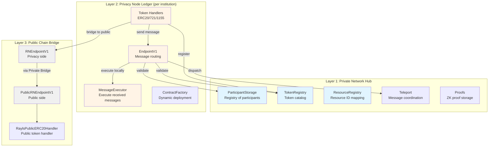
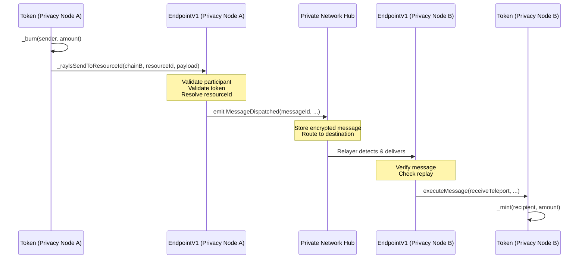
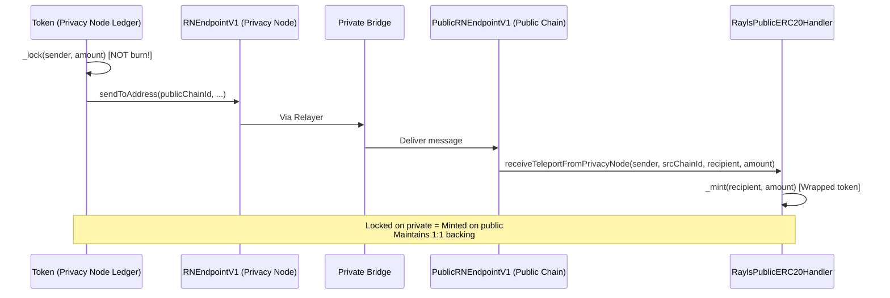

# Smart Contracts - Technical Overview

Understand how Rayls smart contracts are organized and how they interact to enable secure cross-chain communication. This guide provides the architectural foundation for building on Rayls.

!!! info "Prerequisites"
    - Complete [Architecture Overview](../beginner/architecture-overview.md) - Understand basic components
    - Complete [First Transaction](../beginner/first-transaction.md) - Basic teleport experience
    - Familiarity with Solidity and smart contract development

**What you already know from beginner:**

- Rayls uses a hub-and-spoke model (Privacy Node Ledgers connected via Private Network Hub)
- Basic component names (Endpoint, Relayer, Private Network Hub)
- How to execute a simple teleport

**What you'll learn here:**

- How contracts are organized across three architectural layers
- EIP-5164 implementation for cross-chain messaging
- Message flow patterns through the system
- How Private Network Hub, Privacy Node Ledger, and Public Chain contracts interact
- Development workflow from design to multi-chain deployment

---

## Key Terminology

Before diving into the architecture, familiarize yourself with these official terms:

- **Private Network Hub** (formerly "Commit Chain") - The coordination layer that orchestrates cross-chain operations between Privacy Node Ledgers
- **Privacy Node Ledger** (formerly "Privacy Ledger") - Individual private blockchain networks where tokens and contracts reside
- **Rayls Privacy Node** - The infrastructure/node software running a Privacy Node Ledger
- **Endpoint** - Smart contract interface for cross-chain messaging (EndpointV1, RNEndpointV1, PublicRNEndpointV1)
- **Relayer** - Off-chain service that transports messages between chains
- **Resource ID** - Logical identifier (bytes32) for contracts, enabling upgradability across chains
- **Teleport** - Cross-chain token transfer operation (burn on source, mint on destination)
- **MessageDispatcher/MessageExecutor** - EIP-5164 standard interfaces for dispatching and executing cross-chain messages
- **Lock/Unlock** - Token custody operations for bridging; tokens "locked" on one chain enable minting on another
- **Escrow** - Clarifying term for locked token holdings (e.g., "tokens minted to escrow account")

!!! note "Deprecated Terms in Code"
    You may encounter legacy code using historical names:

    - **Code artifacts:** `CommitChain` class, `onlyFromCommitChain` modifier, `getCommitChainId()` method → refer to **Private Network Hub**
    - **Environment variables:** `RPC_URL_NODE_CC`, `NODE_CC_CHAIN_ID` → refer to Private Network Hub
    - **Directory paths:** `src/commitChain/` → refer to Private Network Hub components

    These code-level artifacts retain historical naming for backwards compatibility. All documentation uses official terminology.

---

## Contract Organization

Rayls contracts are organized into **three architectural layers**, each serving a distinct purpose in the cross-chain ecosystem.

### Three-Layer Architecture



### Contract Categories

| Layer | Contracts | Purpose | Location |
|-------|-----------|---------|----------|
| **Private Network Hub** | ParticipantStorage, TokenRegistry, ResourceRegistry, Teleport, Proofs | Coordinate cross-chain operations, store registries | `src/commitChain/` * |

\* Historical directory name retained for backwards compatibility
| **Privacy Node Ledger** | EndpointV1, MessageExecutor, RaylsErc20Handler, RaylsContractFactory | Execute transactions, route messages | `src/rayls-protocol/` |
| **Public Bridge** | RNEndpointV1, PublicRNEndpointV1, RaylsPublicERC20Handler | Bridge to Rayls Public Chain | `src/rayls-node/` |

---

## EIP-5164 Implementation Overview

Rayls implements **EIP-5164** (Cross-Chain Execution) standard for interoperable cross-chain messaging.

!!! info "What is EIP-5164?"
    A standard interface for executing contract calls across different blockchain networks. It defines MessageDispatcher (sending side) and MessageExecutor (receiving side) components.

    For deep dive, see [EIP-5164 Explained](eip-5164-explained.md)

### Rayls Components Implementing EIP-5164

**MessageDispatcher Implementation:**

```solidity
// RNMessageDispatcherV1.sol:85-90
function dispatchMessage(
    uint256 fromChainId,
    address from,
    uint256 toChainId,
    address to,
    RaylsNodeMessage memory data
) external onlyAuthorizedEndpoint returns (bytes32)
```

- **Location**: `src/rayls-node/rayls-sovereign-ledger/RNMessageDispatcherV1.sol`
- **Purpose**: Emits `MessageDispatched` events for relayers to transport messages
- **Compliance**: Generates EIP-5164 compliant message IDs including nonce for uniqueness

**MessageExecutor Implementations:**

1. **Base MessageExecutor** - `src/MessageExecutor.sol:40-50`
   - Simple executor with replay protection
   - Appends `(messageId, fromChainId, from)` to calldata per EIP-5164 spec

2. **RaylsMessageExecutorV1** - `src/rayls-protocol/RaylsMessageExecutor/RaylsMessageExecutorV1.sol`
   - Enhanced executor for Privacy Node Ledgers
   - Additional validation and authorization

### How EIP-5164 Enables Cross-Chain Composability

```solidity
// When MessageExecutor calls your contract, it appends context:
// yourContract.receiveTeleport(recipient, amount) becomes:
// yourContract.receiveTeleport(recipient, amount, messageId, fromChainId, sender)

// You can extract this context:
function receiveTeleport(address to, uint256 value) public receiveMethod {
    bytes32 msgId = _getMessageIdOnReceiveMethod();      // Get message ID
    uint256 sourceChain = _getFromChainIdOnReceiveMethod(); // Get source chain
    address sender = _getMsgSenderOnReceiveMethod();     // Get original sender

    // Use context for validation, logging, etc.
}
```

!!! info "Security Deep Dive"
    The `receiveMethod` modifier provides critical security by ensuring only authorized executors can call receive functions. For complete security explanation including attack scenarios and prevention strategies, see [Security: receiveMethod Modifier](security.md#1-receivemethod-trusted-executor-validation).

This standardized context enables contracts to verify cross-chain senders and implement secure cross-chain logic.

---

## Message Flow Patterns

### Pattern 1: Privacy Node Ledger ↔ Privacy Node Ledger

The most common pattern - transferring tokens between institutions.



**Key Points:**

- Burns on source, mints on destination
- All messages flow through Private Network Hub
- Encryption ensures privacy
- Replay protection prevents double-execution

### Pattern 2: Privacy Node Ledger ↔ Rayls Public Chain

Bridging private tokens to public chains uses different components and semantics.



**Key Differences:**

| Privacy Node ↔ Privacy Node | Privacy Node ↔ Public Chain |
|----------------------------|---------------------------|
| Burn on source | **Lock** on source (collateral) |
| Mint on destination | **Mint wrapped** on public |
| Via Private Network Hub | Via Private Bridge |
| Uses EndpointV1 | Uses RNEndpointV1 |
| Full privacy | Public visibility |

---

## Development Workflow

### Complete Development Lifecycle

```mermaid
graph LR
    A[1. Design Contract] --> B[2. Inherit from Handler]
    B --> C[3. Deploy to Privacy Node Ledger A]
    C --> D[4. Authorize with Endpoint]
    D --> E[5. Register on PN Token Registry]
    E --> F[6. Submit to Hub & Activate]
    F --> G[7. Deploy to Privacy Node Ledger B]
    G --> H[8. Test Cross-Chain]

    style A fill:#e1f5ff
    style C fill:#fff4e6
    style E fill:#e1f5ff
    style G fill:#fff4e6
    style H fill:#90EE90
```



**Phase 1: Design**

- Inherit from RaylsErc20Handler (or other handler)
- Add custom business logic
- Define receive method overrides

**Phase 2: Deploy to First Privacy Node Ledger**

```bash
npx hardhat tokens:erc20:deploy --pl A --name "MyToken" --symbol "MTK"
```

- Token contract deployed on Privacy Node Ledger A
- Returns contract address

**Phase 3: Register on the PN Token Registry**

```bash
npx hardhat tokens:register --pl A --token-address <TOKEN_ADDRESS>
```

- Calls `PNTokenRegistryV1.registerToken(tokenAddress)` on the Privacy Node (single argument, no storage slot)
- Reads name / symbol / totalSupply on-chain and enforces symbol uniqueness
- Sets `privacyNodeStatus = WAITING_APPROVAL`

**Phase 4: Authorize on the Privacy Node**

```bash
# PN operator authorizes the token locally
npx hardhat tokens:approve-pn --symbol MTK
```

- Calls `updatePrivacyNodeStatus(tokenAddress, AUTHORIZED)` (`AUTHORIZED` = 2)
- Token becomes operational locally (mint / transfer / handler ops)

**Phase 5: Submit to the Hub and Activate**

```bash
# Submit to the Hub (requires PN AUTHORIZED), then the Hub operator approves
npx hardhat submitTokenToHub --symbol MTK
npx hardhat tokens:approve-hub --symbol MTK
```

- `submitToHub(tokenAddress)` sets `hubStatus = WAITING_APPROVAL` and sends `addToken()` to the Hub registry
- The Hub operator approves with `updateStatus(resourceId, ACTIVE)` (`ACTIVE` = 1)
- The relayer delivers the `activateToken(bytes32,address,uint8)` callback, which registers the resource ID on the local Endpoint and sets `hubStatus = AUTHORIZED`
- The same resource ID is used on all chains

See the [PN Token Registry](../../learn/components/smart-contracts/pn-token-registry.md) page for the full three-status model.

**Phase 6: Deploy to Additional Chains**

- Deploy same contract to Privacy Node Ledger B
- Token automatically receives same resource ID from Private Network Hub
- Or use Factory deployment (automatic)

**Phase 7: Test Cross-Chain**

```bash
npx hardhat tokens:erc20:send --symbol MTK --pl-origin A --pl-dest B --destination-address 0x... --amount 1000
```

For detailed deployment guide with troubleshooting and best practices, see [Deployment Workflow](deployment-workflow.md)

---

## Private Network Hub Contracts Deep Dive

### ParticipantStorage

**Purpose**: Registry of all participants (institutions) in the Rayls Private Network

**Location**: `src/commitChain/ParticipantStorage/` _(historical path name)_

**Key Functions:**

- **Participant Registration**: Add new institutions to the network
- **Role Management**: Assign roles (operator, participant, auditor)
- **Status Tracking**: Active, frozen, suspended states
- **Governance Actions**: Freeze/unfreeze participants

```solidity
// Used by Endpoint to validate participants
function isParticipantActive(address participant) external view returns (bool);
```

**Why this matters**: Every cross-chain message validates that both sender and receiver participants are active.

### TokenRegistry

**Purpose**: Central catalog of all registered tokens across the Rayls Private Network

**Location**: `src/commitChain/TokenRegistry/` _(historical path name)_

**Key Functions:**

- **Token Catalog**: Store tokens submitted from Privacy Nodes for cross-chain use
- **Resource ID Generation**: Create unique cross-chain identifier
- **Uniqueness Validation**: Prevent duplicate token names/symbols
- **Status Management**: `updateStatus(resourceId, ACTIVE)` at the Hub level

```solidity
// Registration flow (PN-side entry point lives in PNTokenRegistryV1)
1. PN operator calls PNTokenRegistryV1.registerToken(tokenAddress) on the Privacy Node
2. After PN authorization, submitToHub(tokenAddress) sends addToken() to this Hub registry
3. Hub operator approves via updateStatus(resourceId, ACTIVE)   // ACTIVE = 1
4. Hub generates/stores the resourceId
5. Relayer delivers the activateToken(bytes32,address,uint8) callback to the PN
```

!!! info "PN-side registration"
    The PN-side entry point and the three-status model are documented on the [PN Token Registry](../../learn/components/smart-contracts/pn-token-registry.md) page. The Hub `TokenRegistry` and the PN `PNTokenRegistryV1` use different status models and must not be conflated.

**Resource ID Format:**

```solidity
// Generated from token metadata
resourceId = keccak256(abi.encodePacked(
    tokenName,
    tokenSymbol,
    deployerAddress,
    timestamp
));
```

### ResourceRegistry

**Purpose**: Maps resource IDs to actual contract addresses on each Privacy Node Ledger

**Location**: `src/commitChain/ResourceRegistry/` _(historical path name)_

**Key Functions:**

```solidity
// Register resource ID for a contract
function registerResourceId(bytes32 resourceId, address contractAddress) external;

// Resolve resource ID to address on local chain
function getAddressByResourceId(bytes32 resourceId) external view returns (address);
```

**How it works:**

- Same resource ID across all chains
- Different contract addresses per chain
- Endpoint uses this for routing

**Example:**

```
Token "USDC":
- Resource ID: 0xabc123... (same everywhere)
- Privacy Node Ledger A: 0x111... (actual contract address)
- Privacy Node Ledger B: 0x222... (different address, same token)
- Privacy Node Ledger C: 0x333...
```

!!! info "Complete Resource ID Documentation"
    For comprehensive resource ID management including generation strategies, collision prevention, and cross-chain synchronization, see [Endpoint Integration: Resource ID Management](endpoint-integration.md).

### Teleport

**Purpose**: Coordinate cross-chain message transport via Private Network Hub

**Location**: `src/commitChain/Teleport/`

**Key Functions:**

- Store encrypted cross-chain messages
- Route messages to destination participants
- Maintain message queue per destination
- Provide message confirmation

### Proofs

**Purpose**: Store and verify zero-knowledge proofs for Enygma privacy protocol

**Location**: `src/commitChain/Proofs/`

**Key Functions:**

- Store ZK proofs on Private Network Hub
- Verify proofs before executing privacy transactions
- Track proof commitments and nullifiers
- Support multiple verifier types (k=2 through k=6)

---

## Privacy Node Ledger Contracts

### EndpointV1 Architecture

**Location**: `src/rayls-protocol/Endpoint/EndpointV1.sol`

EndpointV1 uses a **modular architecture** with pluggable components:

**Core Modules:**

| Module | Responsibility | Location |
|--------|---------------|----------|
| **ResourceManager** | Resolve resource IDs to addresses | `src/rayls-protocol/modules/ResourceManager.sol` |
| **MessageSender** | Validate and dispatch outgoing messages | `src/rayls-protocol/modules/MessageSender.sol` |
| **MessageReceiver** | Validate and execute incoming messages | `src/rayls-protocol/modules/MessageReceiver.sol` |
| **BatchMessageSender** | Handle batch operations | `src/rayls-protocol/modules/BatchMessageSender.sol` |

**Authorization Model:**

```solidity
// EndpointV1.sol:106-111
modifier onlyRelayerAuthorized() {
    if (!relayAuthorizationMap[msg.sender]) {
        revert RelayerUnauthorizedAccount(msg.sender);
    }
    _;
}
```

- Only authorized relayers can deliver messages
- Only authorized tokens can send messages (`onlyAuthorizedAddresses`)
- Prevents message flooding and unauthorized access

**Message Validation Pipeline** (before dispatch):

```solidity
// EndpointV1.sol:190-200
function send(...) external onlyAuthorizedAddresses returns (bytes32 messageId) {
    // 1. Caller authorized?
    // 2. Destination participant active? (check ParticipantStorageReplica)
    // 3. Token registered & authorized? (check PNTokenRegistryV1)
    // 4. Resource ID exists? (check ResourceManager)
    // 5. Assign nonce for ordering
    // 6. Emit MessageDispatched event
}
```

### RaylsMessageExecutorV1

**Location**: `src/rayls-protocol/RaylsMessageExecutor/RaylsMessageExecutorV1.sol`

**Purpose**: Execute incoming cross-chain messages with security guarantees

**Key Features:**

1. **Replay Protection**
```solidity
mapping(bytes32 => bool) public executed;

function executeMessage(...) external {
    if (executed[_messageId]) {
        revert MessageIdAlreadyExecuted(_messageId);
    }
    executed[_messageId] = true;
    // ... execute
}
```

2. **EIP-5164 Compliance**
```solidity
// Appends (messageId, fromChainId, from) to calldata
(bool success, bytes memory returnData) = to.call(
    abi.encodePacked(data, messageId, fromChainId, from)
);
```

3. **Error Handling**
```solidity
if (!success) {
    revert MessageFailure(messageId, returnData);
}
```

### RaylsContractFactory

**Purpose**: Enable automatic multi-chain deployment via Factory pattern

**How it works:**

1. Token provides `_generateInitializerParams()`
2. TokenRegistry stores bytecode + init params
3. On destination chain, Factory deploys using stored data
4. Automatically assigns same resource ID

---

## Public Chain Bridge Contracts

### RNEndpointV1 (Privacy Node Ledger Side)

**Location**: `src/rayls-node/rayls-sovereign-ledger/RNEndpointV1.sol`

**Purpose**: Route messages from Privacy Node Ledger to Rayls Public Chain

**Key Differences from EndpointV1:**

- Uses `RNMessageDispatcherV1` (instead of regular dispatcher)
- Integrates with User Governance for KYC/compliance
- Messages go to Private Bridge (not Private Network Hub)
- Validates users via `onlyRegisteredUsers` for public exposure

```solidity
// RNEndpointV1.sol:189-195
function sendToAddress(
    uint256 _dstChainId,
    address _privateChainAddress,
    bytes calldata _payload,
    bytes memory _revertDataPayload,
    RaylsNodeBridgedTransferMetadata memory transferMetadata
) external virtual override onlyAuthorizedTokens returns (bytes32 messageId)
```

### PublicRNEndpointV1 (Rayls Public Chain Side)

**Purpose**: Receive and execute messages from Privacy Node Ledgers on public chain

**Security:**

- Validates messages come from authorized Privacy Node Ledgers
- Verifies cross-chain sender
- Executes on public chain contracts (e.g., RaylsPublicERC20Handler)

### RaylsPublicERC20Handler

**Location**: `src/rayls-node/rayls-public-chain/tokens/RaylsPublicERC20Handler.sol`

**Purpose**: Handle tokens on Rayls Public Chain that are backed by locked tokens on Privacy Node Ledgers

**Key Methods:**

```solidity
// From Privacy Node Ledger: lock tokens there, mint wrapped here
function receiveTeleportFromPrivacyNode(address from, uint256 srcChainId, address to, uint256 amount) external virtual receiveMethod;

// From public chain: burn tokens here, unlock on Privacy Node Ledger
function teleportToPrivacyNode(address to, uint256 amount, uint256 chainId) external virtual returns (bool);

// Mint tokens back on failed public→private transfer
function revertTeleportToPrivacyNode(address to, uint256 amount) external virtual receiveMethod;
```

**Burn/Mint Model:**

The public chain uses burn/mint instead of lock/unlock — tokens are burned when leaving and minted when arriving.

For detailed public bridge integration, see [Public Chain Bridge](../advanced/public-chain-bridge.md)

---

## Contract Interaction Patterns

### Pattern: Token → Endpoint → Private Network Hub → Endpoint → Token

The fundamental cross-chain pattern:

```
1. Token A (Privacy Node Ledger A)
   └─> Calls _raylsSendToResourceId()

2. EndpointV1 A (Privacy Node Ledger A)
   └─> Validates & emits MessageDispatched

3. Relayer (off-chain)
   └─> Detects event, posts to Private Network Hub

4. Private Network Hub
   └─> Stores encrypted message, routes to destination

5. Relayer (off-chain)
   └─> Detects message for Privacy Node Ledger B, delivers

6. EndpointV1 B (Privacy Node Ledger B)
   └─> Receives via MessageExecutor

7. Token B (Privacy Node Ledger B)
   └─> Executes receiveTeleport()
```

### Pattern: Batch Aggregation

Multiple messages bundled into one transaction on Private Network Hub:

```
100 individual teleports on Privacy Node Ledger A
    ↓
Batched into 1 transaction on Private Network Hub (gas savings!)
    ↓
Delivered as 100 separate executions on Privacy Node Ledger B
```

**Benefit:** ~60% gas reduction on Private Network Hub, individual atomic guarantees preserved

---

## Key Takeaways

1. **Three-Layer Architecture**
   - **Private Network Hub**: Coordination and registries
   - **Privacy Node Ledger**: Execution and local state
   - **Public Bridge**: Connection to Rayls Public Chain

2. **EIP-5164 Standard**
   - Interoperable cross-chain messaging
   - MessageDispatcher + MessageExecutor pattern
   - Standardized context passing

3. **Message Routing**
   - Privacy Node ↔ Privacy Node: Via Private Network Hub (burn/mint)
   - Privacy Node ↔ Public Chain: Via Private Bridge (lock/mint)

4. **Contract Organization**
   - Clear separation of concerns
   - Modular architecture enables extensibility
   - Registry pattern for discovery

5. **Security Model**
   - Authorization at multiple levels
   - Replay protection built-in
   - Participant and token validation before dispatch

---

## Next Steps

**Build on this foundation:**

- **[Token Standards](token-standards.md)** - Build cross-chain tokens using these contracts
- **[EIP-5164 Explained](eip-5164-explained.md)** - Deep dive into the messaging standard
- **[Endpoint Integration](endpoint-integration.md)** - Master RaylsApp and cross-chain messaging
- **[Deployment Workflow](deployment-workflow.md)** - Complete deployment guide with multi-chain strategies
- **[Transaction Lifecycle](transaction-lifecycle.md)** - See complete message flow with timing

**For advanced topics:**

- **[Public Chain Bridge](../advanced/public-chain-bridge.md)** - Public chain integration details
- **[Best Practices](../reference/best-practices.md)** - Proven development patterns

---

## Reference

**Contract Locations:**

- **Private Network Hub**: `rayls-sovereign-contracts/src/commitChain/` _(historical directory name)_
- **Privacy Node Ledger**: `rayls-sovereign-contracts/src/rayls-protocol/`
- **Public Bridge**: `rayls-sovereign-contracts/src/rayls-node/`
- **SDK & Handlers**: `rayls-sovereign-contracts/src/rayls-protocol-sdk/`

**Key Files:**

- `EndpointV1.sol` - Main endpoint implementation
- `RaylsMessageExecutorV1.sol` - Message executor
- `RNMessageDispatcherV1.sol` - EIP-5164 dispatcher
- `RaylsErc20Handler.sol` - Token handler with cross-chain
- `TokenRegistry contracts` - Token registration system
- `ParticipantStorage contracts` - Participant management
