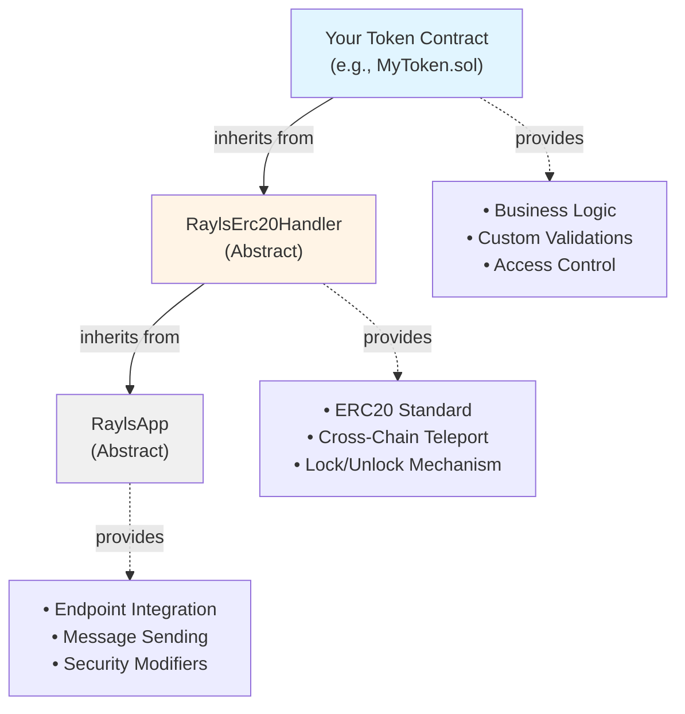
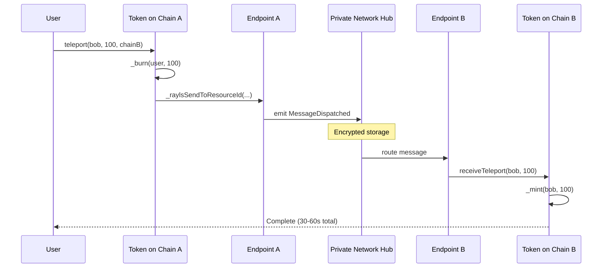

# Token Standards - Deep Dive

Build production-ready cross-chain tokens by extending RaylsErc20Handler. This guide covers the inheritance architecture, customization patterns, and advanced features beyond the basic teleport.

!!! info "Prerequisites"
    - Complete [First Transaction](../beginner/first-transaction.md)
    - Understand [Architecture Overview](../beginner/architecture-overview.md)
    - Basic Solidity knowledge (inheritance, modifiers, overrides)

**What you already know from beginner:**

- RaylsErc20Handler provides cross-chain functionality
- Basic `teleport()` and `teleportAtomic()` usage
- Constructor parameters (name, symbol, endpoint addresses)
- How to deploy a simple token

**What you'll learn here:**

- **Why** the handler works the way it does
- **How** to customize behavior for your use case
- **When** to override methods vs extend them
- Advanced patterns from production tokens

---

## The Three-Layer Handler Pattern

You've deployed a token that inherits from RaylsErc20Handler. Now let's understand what each layer provides and why.

### Inheritance Diagram



### Layer 1: RaylsApp - Endpoint Integration

**Location:** `rayls-sovereign-contracts/src/rayls-protocol-sdk/RaylsApp.sol:12-366`

**What it provides:**

| Feature | Method | When to Use |
|---------|--------|-------------|
| Endpoint connection | `endpoint`, `raylsNodeEndpoint` | Automatic, via constructor |
| Message sending | `_raylsSend()` | Custom cross-chain messages |
| Batch messaging | `_raylsSendBatch()` | Multiple messages at once |
| Resource ID routing | `_raylsSendToResourceId()` | Token transfers (automatic) |
| Security modifiers | `receiveMethod` | All receive functions |
| Context extraction | `_getMsgSenderOnReceiveMethod()` | Identify sender chain/address |

!!! tip "Key Insight"
    RaylsApp abstracts ALL endpoint interaction. You never call endpoint directly - you use the provided internal methods like `_raylsSend()` or `_raylsSendToResourceId()`.

**Example - What happens in constructor:**

```solidity
// From RaylsApp.sol:25-33
constructor(address _endpoint, address _raylsNodeEndpoint, address _userGovernance) {
    endpoint = IRaylsEndpoint(_endpoint);  // Connects to Privacy Node Ledger endpoint
    if (_raylsNodeEndpoint != address(0)) {
        raylsNodeEndpoint = IRaylsNodeEndpoint(_raylsNodeEndpoint); // For Rayls Public Chain bridge
    }
}
```

This constructor establishes the connection to:
- **EndpointV1**: For Privacy Node Ledger ↔ Privacy Node Ledger communication
- **RNEndpointV1**: For Privacy Node Ledger ↔ Rayls Public Chain bridging

### Layer 2: RaylsErc20Handler - Cross-Chain ERC20

**Location:** `rayls-sovereign-contracts/src/rayls-protocol-sdk/tokens/RaylsErc20Handler.sol:1-556`

**What it adds on top of RaylsApp:**

1. **Standard ERC20** (OpenZeppelin)
   - `transfer()`, `approve()`, `balanceOf()`, etc.
   - Fully compatible with existing ERC20 tools

2. **Cross-Chain Teleportation**
   - `teleport()` - Simple burn & mint
   - `teleportAtomic()` - With automatic revert
   - `teleportFrom()` - Third-party teleport with approval

3. **Public Chain Bridging**
   - `teleportToPublicChain()` - Lock on Privacy Node Ledger, mint on Rayls Public Chain
   - Integration via Private Bridge

4. **Lock/Unlock Mechanism**
   - Used for atomic operations
   - Tokens locked until confirmed
   - Auto-revert if destination fails

5. **Token Registry Integration**
   - Registration is handled by the Privacy Node's `PNTokenRegistryV1` (`registerToken(address)`) — the token no longer registers itself
   - `setResourceId(bytes32)` - inherited from `RaylsApp`; called by the PN TokenRegistry via the `activateToken` callback once the token is activated

    See [PN TokenRegistry](../../learn/components/smart-contracts/pn-token-registry.md) for the full registration flow.

!!! tip "Key Insight"
    The handler orchestrates the "burn → send message → mint" flow automatically. You don't implement cross-chain logic - you inherit it.

### Layer 3: Your Token - Business Logic

**What you add:**

- Custom validation (blacklists, limits, compliance)
- Access control (roles, permissions)
- Business rules (attestations, approvals)
- Override receive methods to add checks
- Custom initialization for multi-chain deployment

!!! warning "Important Principle"
    Keep cross-chain mechanics in the handler, add only your business logic. Don't reimplement teleport mechanisms - extend them.

---

## Understanding teleport() Internals

You know `teleport(recipient, amount, destinationChainId)` sends tokens cross-chain. Here's what actually happens at each step.

### The Complete Flow

**Step 1: Burn Tokens Locally**

```solidity
// From RaylsErc20Handler.sol:153-156
function teleport(address to, uint256 value, uint256 chainId) public virtual returns (bool) {
    _burn(msg.sender, value);  // ← Tokens destroyed on source immediately
    // ...
```

!!! question "Why burn first?"
    Prevents double-spend. Tokens must be destroyed on source before creating on destination. This ensures total supply remains constant across the network.

**Step 2: Construct Metadata**

```solidity
// From RaylsErc20Handler.sol:158-164
BridgedTransferMetadata memory transferMetadata = BridgedTransferMetadata({
    assetType: RaylsBridgeableERC.ERC20,
    id: 0,                          // Not used for ERC20 (used for ERC721 tokenId)
    from: msg.sender,
    tokenAddress: address(this),
    to: to,
    amount: value
});
```

**What this data does:** Tells destination chain WHO sent, WHAT token, HOW MUCH, and WHERE to mint.

**Step 3: Send via Endpoint**

```solidity
// From RaylsErc20Handler.sol:166-175
_raylsSendToResourceId(
    chainId,                    // Destination Privacy Node Ledger
    resourceId,                 // Logical token identifier (same across all chains)
    abi.encodeWithSignature(
        "receiveTeleport(address,uint256)",
        to,
        value
    ),                         // Payload to execute on destination
    bytes(""),                 // No lockData for simple teleport
    bytes(""),                 // No revert payload
    bytes(""),                 // No receiver revert
    transferMetadata
);
```

**Step 4: Endpoint Validates & Dispatches**

```solidity
// In EndpointV1.sol:190-200
function send(...) external onlyAuthorizedAddresses returns (bytes32 messageId) {
    // 1. Check token is authorized
    // 2. Validate participant is active
    // 3. Resolve resourceId to destination address
    // 4. Assign nonce for ordering
    // 5. Emit MessageDispatched event for relayer
}
```

**Step 5: Relayer Transports** (off-chain)

- Detects `MessageDispatched` event
- Posts to Private Network Hub
- Private Network Hub routes to destination

**Step 6: Destination Receives**

```solidity
// Your token on destination chain
function receiveTeleport(address to, uint256 value)
    public
    virtual
    receiveMethod  // ← Only executor can call
{
    _mint(to, value);  // Tokens created on destination
}
```

### Visual Timeline



**Total time:** Typically 30-60 seconds for cross-chain finality.

---

## teleportAtomic() - Safety with Automatic Revert

The difference between `teleport()` and `teleportAtomic()` is critical for production systems.

### The Problem teleportAtomic() Solves

**Scenario:** You teleport 1000 tokens from Privacy Node Ledger A to B.

**With teleport():**

- Tokens burned on A ✅
- Destination contract reverts (recipient blacklisted) ❌
- **Result: 1000 tokens LOST FOREVER**

**With teleportAtomic():**

- Tokens burned on A ✅
- Destination reverts ❌
- Automatic `revertTeleportMint()` executes ✅
- **Result: 1000 tokens RESTORED to sender**

### How It Works: Four Payloads

```solidity
// From RaylsErc20Handler.sol:241-272
function teleportAtomic(...) public virtual returns (bool) {
    _burn(msg.sender, value);  // Same as regular teleport

    _raylsSendToResourceId(
        destinationChainId,
        resourceId,

        // PAYLOAD 1: Main execution (destination)
        abi.encodeWithSignature(
            "receiveTeleportAtomic(address,uint256)",
            to,
            value
        ),

        // PAYLOAD 2: Confirmation (destination) - executes if PAYLOAD 1 succeeds
        abi.encodeWithSignature(
            "unlock(address,uint256)",
            to,
            value
        ),

        // PAYLOAD 3: Revert on sender side - executes if PAYLOAD 1 fails
        abi.encodeWithSignature(
            "revertTeleportMint(address,uint256)",
            msg.sender,
            value
        ),

        // PAYLOAD 4: Revert on receiver side - cleanup
        abi.encodeWithSignature(
            "revertTeleportBurn(uint256)",
            value
        ),

        transferMetadata
    );
}
```

### What Each Payload Does

**PAYLOAD 1: receiveTeleportAtomic()**

```solidity
// RaylsErc20Handler.sol:375-388
function receiveTeleportAtomic(address to, uint256 value) public virtual receiveMethod {
    _mint(owner(), value);  // ← Mints to TOKEN OWNER, not recipient!
    if (to != owner()) {
        _lock(to, value);   // ← Locks for recipient
    }
}
```

!!! question "Why mint to owner?"
    So tokens exist but recipient can't access until confirmed. This enables atomic rollback if anything fails.

**PAYLOAD 2: unlock()** (only if PAYLOAD 1 succeeds)

```solidity
// RaylsErc20Handler.sol:393-402
function unlock(address to, uint256 amount) external virtual returns (bool) {
    if (to != owner()) {
        _unlock(to, amount);           // Release from locked state
        _transfer(owner(), to, amount); // Transfer from owner to recipient
    }
    return true;
}
```

**PAYLOAD 3: revertTeleportMint()** (only if PAYLOAD 1 fails)

```solidity
// RaylsErc20Handler.sol:442-451
function revertTeleportMint(address to, uint256 value) public virtual receiveMethod {
    _mint(to, value);  // Restore tokens to original sender
}
```

**PAYLOAD 4: revertTeleportBurn()** (cleanup on destination)

```solidity
// RaylsErc20Handler.sol:454-463
function revertTeleportBurn(uint256 value) public virtual receiveMethod {
    _burn(owner(), value);  // Remove the locked tokens
}
```

### Decision Matrix

| Scenario | Use teleport() | Use teleportAtomic() |
|----------|----------------|----------------------|
| High-value transfers | ❌ | ✅ |
| Production systems | ❌ | ✅ |
| Recipient might reject | ❌ | ✅ |
| Testing/development | ✅ | Optional |
| Gas optimization priority | ✅ | ❌ (costs ~40% more) |

---

## Customization Patterns

### Pattern 1: Adding Validation to Receives

**Use case:** Prevent blacklisted addresses from receiving tokens

```solidity
// Based on TokenExample.sol pattern
contract MyToken is RaylsErc20Handler {
    mapping(address => bool) public blacklist;
    uint256 public maxReceiveAmount = 1000000 * 10**18;

    function receiveTeleportAtomic(address to, uint256 value)
        public
        override
        receiveMethod  // CRITICAL: Always keep this modifier
    {
        // ✅ ADD: Custom validation BEFORE calling super
        require(!blacklist[to], "Recipient is blacklisted");
        require(value <= maxReceiveAmount, "Amount exceeds limit");

        // ✅ KEEP: Call parent to execute core logic
        super.receiveTeleportAtomic(to, value);

        // ✅ ADD: Post-execution logic (logging, events)
        emit CrossChainReceived(to, value, block.timestamp);
    }

    event CrossChainReceived(address indexed recipient, uint256 amount, uint256 timestamp);
}
```

!!! success "Best Practices"
    **DO:**

    - Add validation BEFORE `super` call
    - Keep `receiveMethod` modifier
    - Call `super.method()` to preserve core logic
    - Add custom events AFTER `super` call

!!! danger "Anti-Pattern"
    **DON'T:**

    ```solidity
    function receiveTeleportAtomic(address to, uint256 value)
        public
        override
        // ❌ Missing receiveMethod - SECURITY VULNERABILITY!
    {
        // ❌ Reimplementing instead of calling super - BREAKS ATOMIC MECHANISM!
        _mint(to, value);
    }
    ```

### Pattern 2: Custom Token with Access Control

**Use case:** Institutional token with role-based minting and compliance

```solidity
// From CustomTokenExample.sol
import {AccessControl} from "@openzeppelin/contracts/access/AccessControl.sol";
import {RaylsErc20Handler} from "../../rayls-protocol-sdk/tokens/RaylsErc20Handler.sol";

contract InstitutionalToken is AccessControl, RaylsErc20Handler {
    bytes32 public constant MINTER_ROLE = keccak256("MINTER_ROLE");
    bytes32 public constant COMPLIANCE_ROLE = keccak256("COMPLIANCE_ROLE");
    bytes32 public attestationUid;  // Compliance attestation

    constructor(
        string memory name,
        string memory symbol,
        address _endpointAddr,
        address _raylsNodeEndpoint
    ) RaylsErc20Handler(
        name, symbol, _endpointAddr,
        _raylsNodeEndpoint, address(0),
        msg.sender, true  // ← isCustom = true for custom logic
    ) {
        _grantRole(DEFAULT_ADMIN_ROLE, msg.sender);
        _grantRole(MINTER_ROLE, msg.sender);
        _grantRole(COMPLIANCE_ROLE, msg.sender);
    }

    // Override mint to add attestation check
    function mint(address to, uint256 amount)
        public
        override
        onlyRole(MINTER_ROLE)  // ← Access control
    {
        require(attestationUid != bytes32(0), "No risk attestation");
        _mint(to, amount);
    }

    // Compliance officer can set attestation
    function setAttestation(bytes32 _uuid) external onlyRole(COMPLIANCE_ROLE) {
        attestationUid = _uuid;
    }

    // Override transfer to add compliance check
    function transfer(address to, uint256 amount)
        public
        override
        returns (bool)
    {
        require(attestationUid != bytes32(0), "Token not attested");
        return super.transfer(to, amount);
    }
}
```

**Key features:**

1. **Role-Based Access Control** via OpenZeppelin AccessControl
2. **Attestation Requirement** for regulatory compliance
3. **Multiple Roles** (admin, minter, compliance officer)
4. **Still Gets ALL Cross-Chain Functionality** - teleport, atomic, etc.

### Pattern 3: Batch Operations

**Use case:** Gas-efficient multi-recipient transfers

```solidity
// From Erc20BatchTeleport.sol
contract BatchTransferToken is RaylsErc20Handler {

    struct BatchTeleportRequest {
        address to;
        uint256 value;
        uint256 chainId;
    }

    function batchTeleportAtomic(
        BatchTeleportRequest[] calldata requests
    ) public virtual returns (bool) {
        // Pre-allocate array
        ResourceIdCompletePayloadRequest[] memory batch =
            new ResourceIdCompletePayloadRequest[](requests.length);

        // Build batch
        for (uint256 i=0; i<requests.length; i++) {
            _burn(msg.sender, requests[i].value);  // Burn locally

            BridgedTransferMetadata memory metadata = BridgedTransferMetadata({
                assetType: RaylsBridgeableERC.ERC20,
                id: 0,
                from: msg.sender,
                to: requests[i].to,
                tokenAddress: address(this),
                amount: requests[i].value
            });

            batch[i] = ResourceIdCompletePayloadRequest({
                _dstChainId: requests[i].chainId,
                _resourceId: resourceId,
                _payload: abi.encodeWithSignature(
                    "receiveTeleportAtomic(address,uint256)",
                    requests[i].to,
                    requests[i].value
                ),
                _lockData: abi.encodeWithSignature(
                    "unlock(address,uint256)",
                    requests[i].to,
                    requests[i].value
                ),
                _revertDataSender: abi.encodeWithSignature(
                    "revertTeleportMint(address,uint256)",
                    msg.sender,
                    requests[i].value
                ),
                _revertDataReceiver: abi.encodeWithSignature(
                    "revertTeleportBurn(uint256)",
                    requests[i].value
                ),
                transferMetadata: metadata
            });
        }

        // Send all at once
        _raylsSendBatchToResourceId(batch);
        return true;
    }
}
```

**Usage:**

```solidity
BatchTeleportRequest[] memory transfers = new BatchTeleportRequest[](3);
transfers[0] = BatchTeleportRequest(alice, 100 * 10**18, CHAIN_B);
transfers[1] = BatchTeleportRequest(bob, 200 * 10**18, CHAIN_C);
transfers[2] = BatchTeleportRequest(carol, 300 * 10**18, CHAIN_B);

token.batchTeleportAtomic(transfers);  // All execute atomically
```

!!! success "Gas Savings"
    **~60% gas reduction** compared to 3 separate teleportAtomic calls. The batch is submitted as a single transaction to the Private Network Hub.

---

## Bridging to Rayls Public Chain

**Use case:** Move tokens from Rayls Privacy Node to public blockchain (Ethereum, Polygon, etc.)

### Architecture Difference

| Privacy Node ↔ Privacy Node | Privacy Node ↔ Rayls Public Chain |
|----------------------------|----------------------------|
| Uses EndpointV1 | Uses RNEndpointV1 |
| Via Private Network Hub | Via Private Bridge |
| **Burn** on source | **Lock** on source |
| **Mint** on destination | **Mint** wrapped token on public |

!!! warning "Why Lock Instead of Burn?"
    Tokens must remain on Privacy Node Ledger as collateral. Rayls Public Chain mints a wrapped representation. This maintains 1:1 backing.

### Implementation

```solidity
// RaylsErc20Handler.sol:331-365
function teleportToPublicChain(
    address to,
    uint256 value,
    uint256 destinationChainId
)
    public
    virtual
    onlyRegisteredUsers  // ← Requires KYC/compliance via User Governance
    returns (bool)
{
    _lock(msg.sender, value);  // ← LOCK, not burn!

    RaylsNodeBridgedTransferMetadata memory transferMetadata =
        RaylsNodeBridgedTransferMetadata({
            assetType: RaylsNodeBridgeableERC.ERC20,
            id: 0,
            from: msg.sender,
            tokenAddress: address(this),
            to: to,
            amount: value
        });

    raylsNodeEndpoint.sendToAddress(
        destinationChainId,
        privateChainAddress,  // Address of RaylsPublicERC20Handler
        abi.encodeWithSignature("receiveTeleportFromPrivacyNode(address,uint256,address,uint256)", msg.sender, raylsNodeEndpoint.getChainId(), to, value),
        abi.encodeWithSignature("revertTeleportToPublicChain(address,uint256)", msg.sender, value),
        transferMetadata
    );

    return true;
}
```

**Corresponding public chain handler:** `RaylsPublicERC20Handler.sol`

---

## Common Pitfalls & Anti-Patterns

### Pitfall 1: Breaking Cross-Chain by Not Calling Super

❌ **WRONG:**

```solidity
function receiveTeleport(address to, uint256 value)
    public
    override
    receiveMethod
{
    // Custom logic only, no super call
    _mint(to, value * 2);  // ← Breaks expected behavior!
}
```

**Why this breaks:** Destination expects exact `value` amount. Doubling breaks accounting and causes supply mismatch.

✅ **CORRECT:**

```solidity
function receiveTeleport(address to, uint256 value)
    public
    override
    receiveMethod
{
    // Add checks BEFORE
    require(someCondition, "Check failed");

    // Preserve core logic
    super.receiveTeleport(to, value);

    // Add effects AFTER
    emit CustomEvent(to, value);
}
```

### Pitfall 2: Forgetting receiveMethod Modifier

❌ **SECURITY VULNERABILITY:**

```solidity
function receiveTeleport(address to, uint256 value)
    public
    override
    // Missing: receiveMethod
{
    _mint(to, value);
}
```

**Attack Vector:** Anyone can call this directly, minting unlimited tokens without cross-chain verification!

✅ **SECURE:**

```solidity
function receiveTeleport(address to, uint256 value)
    public
    override
    receiveMethod  // ← Only executor can call
{
    _mint(to, value);
}
```

### Pitfall 3: Token Not Registered with the PN TokenRegistry

**Symptom:** Token deployed but cross-chain transfers fail with "resource not found"

**Cause:** The token was never registered with the Privacy Node's `PNTokenRegistryV1`, or it is not yet approved (Privacy Node status not `AUTHORIZED`), so no resource ID has been assigned yet.

**Fix:**

```solidity
// After deployment, register the token with the PN TokenRegistry
// (the registry reads name/symbol/supply on-chain — no storage slot argument)
registry.registerToken(address(token));

// The operator then authorizes it on the Privacy Node, and (for cross-chain use)
// submits it to the Hub. Once the Hub approves, the PN TokenRegistry receives the
// activateToken callback and calls setResourceId(bytes32) on the token.
//
//   registry.updatePrivacyNodeStatus(address(token), AUTHORIZED);
//   registry.submitToHub(address(token));
//   // Hub approval -> activateToken callback -> registry sets the token's resourceId

// Wait for confirmation, then verify the resource ID has been set
bytes32 rid = token.resourceId();
require(rid != bytes32(0), "Resource ID not set");

// Now safe to teleport across chains
```

See [PN TokenRegistry](../../learn/components/smart-contracts/pn-token-registry.md) for the full registration flow.

---

## Testing Strategies

### Unit Tests: Business Logic

Focus on YOUR customizations, not handler internals:

```solidity
function testBlacklistPreventsReceive() public {
    myToken.blacklist(bob);

    vm.prank(alice);
    vm.expectRevert("Recipient is blacklisted");
    myToken.receiveTeleportAtomic(bob, 100);
}

function testAttestationRequired() public {
    vm.expectRevert("No risk attestation");
    institutionalToken.mint(alice, 1000);

    institutionalToken.setAttestation(keccak256("ATTESTATION_1"));
    institutionalToken.mint(alice, 1000);  // Should succeed
}
```

### Integration Tests: Cross-Chain Flow

Test complete Privacy Node Ledger → Privacy Node Ledger scenarios:

```solidity
function testCrossChainTeleportAtomic() public {
    // Setup
    TokenExample tokenA = deployOnChainA();
    TokenExample tokenB = deployOnChainB();

    // Register with the PN TokenRegistry and sync resource IDs
    // (registry authorization + Hub activateToken callback assigns the resourceId)
    registry.registerToken(address(tokenA));
    vm.roll(block.number + 5);  // Wait for resourceId

    // Execute teleport
    uint256 balBefore = tokenB.balanceOf(bob);

    vm.prank(alice);
    tokenA.teleportAtomic(bob, 100 * 10**18, CHAIN_B_ID);

    // Simulate relayer execution
    simulateRelayerExecution(
        CHAIN_A_ID,
        alice,
        address(tokenB),
        abi.encodeWithSignature("receiveTeleportAtomic(address,uint256)", bob, 100 * 10**18)
    );

    // Verify
    assertEq(tokenB.balanceOf(bob), balBefore + 100 * 10**18);
}
```

---

## Key Takeaways

1. **Three-Layer Architecture**
   - **RaylsApp**: Endpoint integration
   - **RaylsErc20Handler**: Cross-chain ERC20
   - **Your Token**: Business logic

2. **Override Receive Methods Safely**
   - Always keep `receiveMethod` modifier
   - Add validation BEFORE `super` call
   - Preserve core logic with `super.method()`

3. **Use teleportAtomic() in Production**
   - Automatic revert safety
   - Four-payload mechanism
   - Worth the ~40% gas cost

4. **Batch for Efficiency**
   - 60% gas savings
   - Same atomic guarantees
   - Ideal for payment systems

5. **Official Terminology**
   - Privacy Node Ledger (not "privacy ledger")
   - Private Network Hub (not "commit chain")
   - Rayls Public Chain (for public bridging)

---

## Can You Now...?

Test your understanding before proceeding:

- [ ] **Explain the difference** between burn/mint and lock/unlock patterns?
  - *When would you use each pattern for cross-chain transfers?*

- [ ] **Describe handler selection** for different token types?
  - *Which handler (ERC20/721/1155) do you need and why?*

- [ ] **Identify atomic teleport components** in the 4-payload system?
  - *What are the four payloads and when does each execute?*

- [ ] **Understand resource ID mapping** for cross-chain addressing?
  - *How does resourceId enable contract upgradability?*

- [ ] **Compare vanilla vs atomic teleport** trade-offs?
  - *What are the gas costs, safety guarantees, and failure behaviors?*

- [ ] **Recognize batch teleport patterns** for gas optimization?
  - *When should you batch transfers vs sending individually?*

If you answered "no" to any question, review the relevant sections above. These concepts are essential for building secure, efficient cross-chain tokens.

---

## Testing Your Token Handlers

Before deploying to production, verify your token handler implementation with comprehensive tests:

!!! example "Test Coverage for Token Handlers"
    **Essential test scenarios**:

    - **Lock/unlock patterns** - [Testing: Token Tests](testing.md#token-tests) - Verify lock/unlock mechanisms for atomic teleports
    - **Burn/mint patterns** - [Testing: Cross-Chain Transfer Tests](testing.md#cross-chain-transfer-tests) - Balance consistency across chains
    - **Resource ID mapping** - [Testing: Token Tests](testing.md#what-token-tests-cover) - Automatic contract deployment verification
    - **Atomic teleport flow** - [Testing: Vanilla vs Atomic Teleport](testing.md#vanilla-vs-atomic-teleport) - Success and failure paths
    - **Batch operations** - [Testing: Token Tests](testing.md#token-tests) - Gas optimization verification

    **Recommended test commands**:
    ```bash
    # Test ERC20 handler
    npm run test:e2e-erc20

    # Test ERC721 handler
    npm run test:e2e-erc721

    # Test ERC1155 handler
    npm run test:e2e-erc1155
    ```

---

## Next Steps

- **[Endpoint Integration](endpoint-integration.md)** - Deep dive into RaylsApp methods
- **[Transaction Lifecycle](transaction-lifecycle.md)** - See complete cross-chain flow
- **[Deployment Workflow](deployment-workflow.md)** - Multi-chain deployment workflow
- **[Code Examples](code-examples.md)** - More complete implementations
- **[EIP-5164 Explained](eip-5164-explained.md)** - Understanding the standard

---

## Reference

- **RaylsErc20Handler.sol** - `rayls-sovereign-contracts/src/rayls-protocol-sdk/tokens/RaylsErc20Handler.sol`
- **TokenExample.sol** - `rayls-sovereign-contracts/src/rayls-protocol/test-contracts/TokenExample.sol`
- **CustomTokenExample.sol** - `rayls-sovereign-contracts/src/rayls-protocol/test-contracts/CustomTokenExample.sol`
- **Erc20BatchTeleport.sol** - `rayls-sovereign-contracts/src/rayls-protocol/test-contracts/Erc20BatchTeleport.sol`
- **RaylsApp.sol** - `rayls-sovereign-contracts/src/rayls-protocol-sdk/RaylsApp.sol`
- **Official Glossary** - [docs/resources/glossary.md](../../resources/glossary.md)
