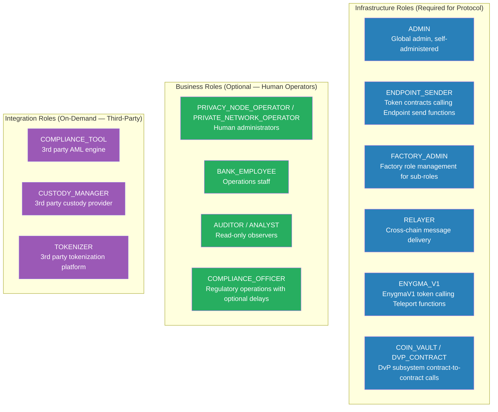

# Role Reference

Complete reference for all authorization roles, permission matrices, and selector mappings across the Rayls network.

---

## Permission Matrices

### Private Network Hub (PNH) Permission Matrix

!!! info "Multiple roles per function"
    Each function can be mapped to multiple independent roles simultaneously using `addFunctionAllowedRole()`. ADMIN always bypasses regardless of mapping. The "admin-of" relationship does NOT inherit function permissions -- it only controls who can grant/revoke role membership.

| Function | Mapped Role | ADMIN | PRIVATE_NETWORK_OPERATOR | NETWORK_AUDITOR | COMPLIANCE_OFFICER | TOKEN_MANAGER | PUBLIC |
|---|---|:---:|:---:|:---:|:---:|:---:|:---:|
| TokenRegistry.`updateStatus()` | TOKEN_MANAGER | bypass | grant | | | mapped | |
| TokenRegistry.`freezeToken()` | COMPLIANCE_OFFICER | bypass | | | mapped | | |
| TokenRegistry.`unfreezeToken()` | COMPLIANCE_OFFICER | bypass | | | mapped | | |
| TokenRegistry.`getAllTokens()` | PUBLIC | bypass | Y | Y | Y | Y | mapped |
| Teleport.`setLockTime()` | PRIVATE_NETWORK_OPERATOR | bypass | mapped | | | | |
| Manager.`grantRole()` | (admin-of) | bypass | \* | | | | |
| Manager.`registerRole()` | ADMIN | bypass | | | | | |
| Manager.`addFunctionAllowedRoles()` | ADMIN | bypass | | | | | |
| Manager.`setContractPaused()` | ADMIN | bypass | | | | | |
| Manager.`setRoleAdmin()` | ADMIN | bypass | | | | | |
| `upgradeToAndCall()` | ADMIN (unmapped) | bypass | | | | | |

Legend:

- **bypass** -- ADMIN always passes regardless of mapping
- **mapped** -- this is the role the function is mapped to
- **grant** -- this persona should be granted the mapped role so they can call this function
- \* PRIVATE_NETWORK_OPERATOR can grant/revoke roles where it is the admin (NETWORK_AUDITOR, COMPLIANCE_OFFICER, TOKEN_MANAGER)

### Privacy Node (PN) Permission Matrix

| Function | Mapped Role | ADMIN | PRIVACY_NODE_OPERATOR | BANK_EMPLOYEE | AUDITOR | COMPLIANCE_OFFICER | PUBLIC |
|---|---|:---:|:---:|:---:|:---:|:---:|:---:|
| TokenRegistry.`registerToken()` | BANK_EMPLOYEE | bypass | grant | mapped | | | |
| TokenRegistry.`updatePrivacyNodeStatus()` | PRIVACY_NODE_OPERATOR | bypass | mapped | | | | |
| TokenRegistry.`submitToHub()` | PRIVACY_NODE_OPERATOR | bypass | mapped | | | | |
| TokenRegistry.`submitToPublicChain()` | PRIVACY_NODE_OPERATOR | bypass | mapped | | | | |
| TokenRegistry.`getAllTokens()` | PUBLIC | bypass | Y | Y | Y | Y | mapped |
| UserGovernance.`createUser()` | PRIVACY_NODE_OPERATOR | bypass | mapped | | | | |
| UserGovernance.`approveUser()` | PRIVACY_NODE_OPERATOR | bypass | mapped | | | | |
| UserGovernance.`removeUser()` | PRIVACY_NODE_OPERATOR | bypass | mapped | | | | |
| UserGovernance.`addAddressPair()` | BANK_EMPLOYEE | bypass | grant | mapped | | | |
| Endpoint.`configureContracts()` | PRIVACY_NODE_OPERATOR | bypass | mapped | | | | |
| Manager.`grantRole()` | (admin-of) | bypass | \* | | | | |
| `upgradeToAndCall()` | ADMIN (unmapped) | bypass | | | | | |

- \* PRIVACY_NODE_OPERATOR can grant/revoke BANK_EMPLOYEE, AUDITOR, COMPLIANCE_OFFICER, ANALYST, and integration roles

---

## Selector Mappings

### PNH Deployed Mappings

#### EndpointV1

| Function | Role |
|---|---|
| `send()`, `sendBatch()`, `sendToResourceId()`, `sendBatchToResourceId()` | ENDPOINT_SENDER |
| `registerResourceId()` | ENDPOINT_SENDER |
| `receivePayload()` | RELAYER |

#### EnygmaTeleport

| Function | Role |
|---|---|
| `transfer()`, `enygmaSupplyUpdated()`, `finalizeBalances()`, `enygmaDvpBalanceUpdated()` | ENYGMA_V1 |
| `enygmaTransferCompleted()` | RELAYER |

#### DvpTeleport

| Function | Role |
|---|---|
| `emitCommitments()`, `emitNullifier()` | COIN_VAULT |
| `ercDvpBalanceUpdated()` | DVP_CONTRACT |
| `transferEncryptedData()`, `initiateTransferEncryptedData()`, `initiateCalldata()`, `executeCalldata()`, `completeSwap()`, `revertSwap()`, `cancelSwap()` | RELAYER |

#### EnygmaFactory

| Function | Role |
|---|---|
| `initiateEnygmaCreation()` | ENYGMA_CREATOR |

#### TeleportV1

| Function | Role |
|---|---|
| `storeEncryptedDataBatch()`, `addHeader()`, `addSingleHeader()`, `executeAtomicMessageBatch()`, `revertAtomicMessageBatch()`, `EmitAdditionalAtomicDataBatchFor()` | RELAYER |

#### RaylsMessageExecutorV1

| Function | Role |
|---|---|
| `executeMessage()`, `executeMessageBatch()` | MESSAGE_RECEIVER |

### PN Deployed Mappings

#### EndpointV1

| Function | Role |
|---|---|
| `send()`, `sendBatch()`, `sendToResourceId()`, `sendBatchToResourceId()` | ENDPOINT_SENDER |
| `registerResourceId()` | ENDPOINT_SENDER |
| `receivePayload()` | RELAYER |

#### RNEndpointV1

| Function | Role |
|---|---|
| `receivePayload()` | RELAYER |

#### TokenRegistryV1 (PN)

| Function | Role | Notes |
|---|---|---|
| `registerToken()` | BANK_EMPLOYEE | PN-local token registration |
| `updatePrivacyNodeStatus()`, `submitToHub()`, `submitToPublicChain()` | PRIVACY_NODE_OPERATOR | PN approval and cross-layer submission |
| `activateToken()`, `syncFrozenTokens()`, `updateFrozenToken()`, `removeFrozenToken()` | MESSAGE_EXECUTOR | Cross-chain PNH governance callbacks |

#### EnygmaPNEvents

| Function | Role |
|---|---|
| Runtime Enygma selectors | ENDPOINT_SENDER |
| `creation()`, `dvp721Creation()`, `dvp1155Creation()` | TOKEN_CREATOR |

#### RaylsMessageExecutorV1

| Function | Role |
|---|---|
| `executeMessage()`, `executeMessageBatch()` | MESSAGE_RECEIVER |

### PC Deployed Mappings

#### PublicRNEndpointV1

| Function | Role |
|---|---|
| `receivePayload()` | RELAYER |
| `send()`, `sendToAddress()` | AUTHORIZED_SENDER |

### Token Handler Mappings (via selfRegisterManagedContract)

Token handlers register their own role mappings at construction time.

#### RaylsEnygmaHandler

| Function | Role | Scope |
|---|---|---|
| `mint()`, `burn()`, `setSwapValidityTime()` | TOKEN_OWNER | Target-scoped |
| `crossRevertMint()`, `crossMint()`, `crossTransferRevertBatch()`, `supplyUpdateRevert()`, `receiveWithdrawFromDvp()`, `notifySenderWithPNCommunicator()`, `notifySenderAndReceiverWithPNCommunicator()`, `dvpSwapCompleted()` | RELAYER | Global |
| `crossTransferCheck()` | MESSAGE_EXECUTOR | Global |

#### RaylsErc721DvpHandler

| Function | Role | Scope |
|---|---|---|
| `mint()`, `burn()`, `submitTokenUpdate()`, `setSwapValidityTime()` | TOKEN_OWNER | Target-scoped |
| `unlockFromDvp()`, `dvpSwapCompleted()`, `notifySenderWithPNCommunicator()`, `notifySenderAndReceiverWithPNCommunicator()` | RELAYER | Global |
| `unlock()`, `MintFromSwapDvp()` | MESSAGE_EXECUTOR | Global |

#### RaylsErc1155DvpHandler

| Function | Role | Scope |
|---|---|---|
| `mint()`, `burn()`, `submitTokenUpdate()`, `setSwapValidityTime()` | TOKEN_OWNER | Target-scoped |
| `unlockFromDvp()`, `dvpSwapCompleted()`, `notifySenderWithPNCommunicator()`, `notifySenderAndReceiverWithPNCommunicator()` | RELAYER | Global |
| `unlock()`, `MintFromSwapDvp()` | MESSAGE_EXECUTOR | Global |

!!! note "Resource ID delivery"
    Handlers no longer self-register a resource-ID selector. The resource ID is delivered by the PN `TokenRegistryV1`'s `activateToken()` callback, which invokes `setResourceId(bytes32)` on the handler's `RaylsApp` base. `setResourceId` is guarded by a direct token-registry check (caller must equal the address registered under `RESOURCE_ID_TOKEN_REGISTRY`), not by a role mapping, so it is not part of the `selfRegisterManagedContract()` mappings above.

---

## Unmapped Selectors

Any selector not explicitly mapped defaults to **ADMIN-only**. This is the fail-closed behavior. Notable functions that fall through to ADMIN:

- `upgradeToAndCall()` on all UUPS contracts
- Configuration functions (`configureContracts()`, `configureModules()`, etc.)
- Any future function added via UUPS upgrade

---

## Role Categories

---

**Navigate:**

- [Back to Build Overview](../index.md)
- [Authorization Overview](../../learn/governance/authorization/index.md)
- [Access Manager](../../learn/governance/authorization/access-manager.md)
- [Authorization Operations](../../deploy/privacy-node/authorization-operations.md)
