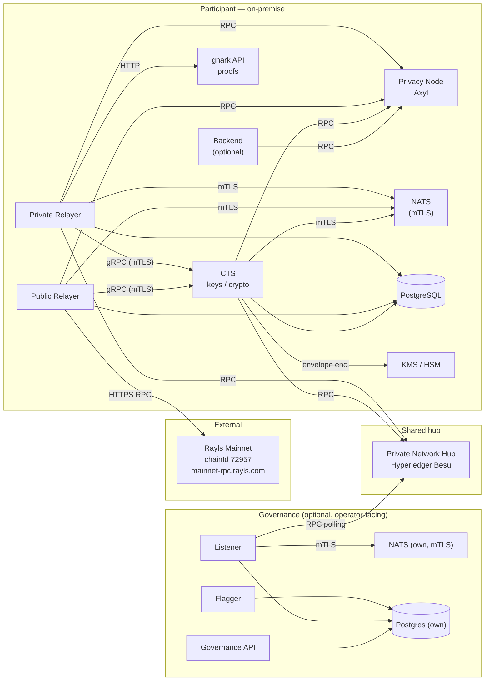

# Full Network Deployment Guide

This guide describes a **greenfield, on-premise installation** where you stand up your **own** private Rayls network from scratch and **connect it to the public Rayls Mainnet**. Unlike the [Privacy Node guide](../privacy-node/index.md) — which covers only the node client — this guide walks through **every component of a participant**: the Privacy Node, the Private Network Hub, the CTS, the relayers, and their supporting infrastructure.

!!! info "Rayls Mainnet is external — you connect to it, you do NOT deploy it"
    | | |
    |---|---|
    | Chain ID | **`72957`** |
    | RPC | **`https://mainnet-rpc.rayls.com`** |
    | Explorer | **`https://explorer.rayls.com`** |

!!! note "Ports are application defaults"
    Every listen port in this guide is an **application default and is fully configurable** — you map whatever ports and hostnames you want. Ports are only mentioned where a value must be wired between two components.

---

## Architecture

Rayls is a **privacy cross-chain network**. You run one (or more) **participant(s)**; each participant owns a **Privacy Node (PNo)** and reaches other participants through a shared **Private Network Hub (PNH)**. To transact on the public network, a participant also relays to **Rayls Mainnet**.

The **relayer** is the off-chain engine: it listens to events on the chains, batches them, encrypts/decrypts payloads through the **CTS**, and executes messages on the destination chain.

### Components

| Component | On-prem? | Image / source | Role |
|---|---|---|---|
| **Privacy Node (PNo)** — Axyl | deploy | `rayls-stack-node-client` | The participant's own ledger (reth/Rayls consensus). Committee of 4 validators, ~1s block. |
| **Private Network Hub (PNH)** — Besu | deploy | `hyperledger/besu` (via `hyperledger-besu-chart`) | The intermediary chain participants relay through. |
| **Rayls Mainnet (public chain)** | **external — connect only** | `https://mainnet-rpc.rayls.com` | Public settlement chain, `chainId 72957`. Reached by the public relayer. |
| **CTS** (Cryptography Trust Suite) | deploy | `rayls-cts` | All key management & crypto. gRPC + HTTP, **mandatory mTLS**. Private keys never leave the process; encrypted at rest via KMS. |
| **Private Relayer** | deploy | `rayls-relayer` | Relays PNo ↔ PNH (incl. atomic + Enygma DvP). |
| **Public Relayer** | deploy | `rayls-relayer-public` | Relays PNo ↔ Rayls Mainnet. Needed to use the public chain. |
| **gnark API** | deploy | `rayls-gnark-api` | Zero-knowledge proof generation (Enygma/DvP). CPU/RAM heavy. |
| **NATS** | deploy | NATS (upstream) | Async transport between relayer and CTS. **mTLS with `verify:true`**. |
| **PostgreSQL** | deploy | any managed/on-prem PG | State for relayer / public relayer / CTS. |
| **Rayls Backend** | optional | `rayls-backend` | Participant REST API. |
| **MongoDB** | optional | any Mongo | Backend wallets store (only if backend enabled). |
| **Explorer** | optional | blockscout / blockroma | Block explorer. |
| **Governance — Listener** | optional | `rayls-listener` | Indexes PNH block events (RPC polling) and dispatches them via NATS JetStream. |
| **Governance — Flagger** | optional | `rayls-flagger` | Anomaly detection / validates correctness of cross-chain transactions. |
| **Governance — API** | optional | `rayls-api` | Operator REST API over the governance data. |
| **Governance NATS + Postgres** | optional | NATS + Postgres | The governance stack runs its **own** NATS (mTLS) and shares its **own** Postgres DB — separate from the relayer/CTS ones. |
| **Observability** | optional | OTel Collector / Grafana / Prometheus | Traces, metrics, logs. |

!!! info "One repo, three binaries"
    The **CTS, private relayer and public relayer are not separate repos** — they are three sub-projects (`cts/`, `private-relayer/`, `public-relayer/`) of **`rayls-sovereign-relayer`**, sharing one `go.mod`, built together with `make build`. Each has its own Dockerfile and ships as its own image (`rayls-cts`, `rayls-relayer`, `rayls-relayer-public`) on the same `v3.0.0` tag, and each runs as its own container. CTS is isolated at runtime (own process, mTLS gRPC) because that is where private keys live.

### Ledger technologies

- **Privacy Node (PNo) = Axyl** — a reth/Rust-based ledger with Rayls consensus, which replaced the old geth-based ledger. Each PNo is a committee of **4 validator nodes**, ~1s block time. **You deploy this.** See the [Privacy Node deployment guide](../privacy-node/index.md).
- **Private Network Hub (PNH) = Hyperledger Besu** — the intermediary chain your participant(s) relay through, ~1s block. **You deploy this.** See the [Private Network Hub component docs](../../learn/components/private-network-hub/index.md).
- **Public Chain = Rayls Mainnet** — the **external** public settlement network (`chainId 72957`, `https://mainnet-rpc.rayls.com`). **You do NOT deploy it**; the public relayer connects to it over RPC.

### Image tags — they do NOT all move together

| Image | Tag |
|---|---|
| `rayls-relayer` | `v3.0.0` |
| `rayls-relayer-public` | `v3.0.0` |
| `rayls-cts` | `v3.0.0` |
| `rayls-gnark-api` | `v3.0.0` |
| `rayls-backend` | `v3.0.0` |
| `rayls-listener`, `rayls-flagger`, `rayls-api` (governance) | `v3.0.0` |
| `rayls-stack-node-client` (Axyl) | **latest released `mainnet-v*`** — **not** `v3.0.0` |
| `hyperledger/besu` (PNH) | the tag set by `hyperledger-besu-chart` — **not** `v3.0.0` |

- The five **application** images move together on `v3.0.0`.
- **Axyl** is versioned independently — always use the **newest released** `mainnet-v*` tag (not `latest`/`main`).
- **Besu**'s image tag ships with its Helm chart; you pin the **chart revision**, not a Rayls tag.
- `rayls-sovereign-contracts` has no image — check it out at branch `version/3.0.0`.

### Topology & data flow

**Reading the diagram:**

- **Private relayer** ↔ PNo RPC, PNH RPC, CTS (gRPC mTLS), NATS (mTLS), gnark (proofs), Postgres. It bridges **PNo ↔ PNH**.
- **Public relayer** ↔ PNo RPC, **Rayls Mainnet** RPC, CTS (gRPC mTLS), **NATS (mTLS)**, Postgres. It bridges **PNo ↔ Mainnet**. It does **not** use gnark.
- **CTS** ↔ NATS (mTLS), Postgres, KMS (at-rest), and reads PNH/PNo (and public) RPCs to authorize relayer keys against the deployment-proxy registries.
- **NATS** is the mTLS transport shared by **both** relayers and CTS.
- **Governance** (optional) is a self-contained stack: **Listener** polls the PNH and dispatches over its **own** NATS; **Flagger** and **API** work off a shared **own** Postgres. It does **not** share the relayer/CTS NATS or DB.

!!! note "Not shown for clarity"
    The explorer (reads PNo) and observability (OTel) are omitted from the diagram. Both are optional.

### Mandatory vs optional

| Component | Status |
|---|---|
| Privacy Node (Axyl) | **Mandatory** |
| Private Network Hub (Besu) | **Mandatory** |
| CTS | **Mandatory** |
| Private Relayer | **Mandatory** |
| gnark proofs API | **Mandatory** (needed for Enygma/DvP) |
| NATS (mTLS) | **Mandatory** (relayer ↔ CTS transport) |
| PostgreSQL | **Mandatory** |
| **Public Relayer** | **Required to use Rayls Mainnet** |
| Rayls Backend | Optional (participant API) |
| MongoDB | Optional (only with backend) |
| Explorer | Optional |
| Governance (Listener + Flagger + API, + its own NATS & Postgres) | Optional (operator-facing) |
| Observability | Optional (recommended) |

!!! tip "Minimum viable participant"
    Axyl PNo + Besu PNH + CTS + private relayer + gnark + NATS + Postgres. Add the **public relayer** to reach Rayls Mainnet. A single participant runs **one Privacy Node**.

---

## How to install

Work through the pages in order:

  <a href="prerequisites/" class="flex-card-item">
    

      
1. Prerequisites & Bring-up Order

      
→

    

    

      Runtime targets, supporting infrastructure, the strict bring-up order, and the databases to pre-create.
    

  </a>
  <a href="smart-contracts/" class="flex-card-item">
    

      
2. Smart-Contract Deployment

      
→

    

    

      Deploy the PNH, Privacy Node and public-chain contracts, capture the registries, and authorize the relayer keys.
    

  </a>
  <a href="configuration/" class="flex-card-item">
    

      
3. Configuration

      
→

    

    

      Complete <code>.env</code> templates for CTS, the private relayer and the public relayer.
    

  </a>
  <a href="security/" class="flex-card-item">
    

      
4. Security

      
→

    

    

      Mandatory mTLS, KMS at-rest encryption, secret handling, network and image hardening.
    

  </a>
  <a href="verification/" class="flex-card-item">
    

      
5. Verification & Troubleshooting

      
→

    

    

      Health checks, progress endpoints, an end-to-end test, and a symptom → cause → fix table.
    

  </a>

---

**Navigate:**

- [Prerequisites & Bring-up Order](prerequisites.md)
- [Privacy Node Deployment](../privacy-node/index.md)
- [Deploy Overview](../index.md)
