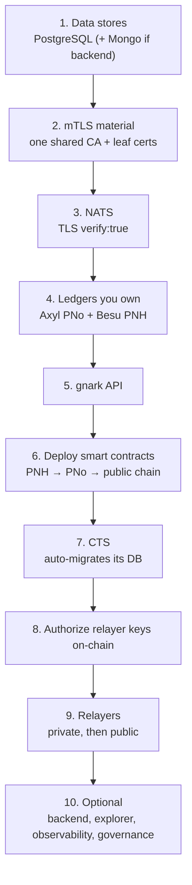

# Prerequisites & Bring-up Order

Before deploying a full participant, provision the runtime and supporting infrastructure below, then bring the components up in the **strict order** described here. Each step depends on the previous one.

---

## Prerequisites

**Runtime target** — either:

- a **Kubernetes cluster** (deploy each component as a Deployment), or
- **hosts/VMs with Docker Compose** (deploy each component as a container).

**Supporting infrastructure:**

- A **secret store** (Vault / sealed-secrets / cloud secrets manager / a pipeline-managed Kubernetes Secret) — see [Security → Secrets](security.md#secrets).
- A **KMS or HSM** for CTS at-rest encryption — see [Security → KMS](security.md#kms-cts-at-rest-encryption).
- **PostgreSQL** reachable from the workloads (and **MongoDB** only if the backend is enabled).
- A **container registry** holding the `v3.0.0` app images and the Axyl `mainnet-v*` image (mirror them into your registry if the network is closed).
- **Outbound HTTPS** to `https://mainnet-rpc.rayls.com` for the public relayer.
- A reverse proxy / ingress for the few endpoints you choose to expose.

**Tooling to deploy contracts:** Node.js + npm and **Foundry** (`forge`), against `rayls-sovereign-contracts` at branch `version/3.0.0`.

!!! tip "Check the image tags first"
    Review the [image tag matrix](index.md#image-tags-they-do-not-all-move-together) before pulling — the application images move together on `v3.0.0`, but Axyl and Besu are versioned independently.

---

## Bring-up order

Deploy strictly in this order — each step depends on the previous:

1. **Data stores** — PostgreSQL (create the per-participant databases, see [Databases](#databases)) and Mongo (if backend).
2. **mTLS material** — generate **one shared CA** and the leaf certs (see [Security → mTLS](security.md#mtls-mandatory-in-v300)), and load them into secrets. Everything mTLS must trust the same CA.
3. **NATS** — start with TLS `verify:true`, presenting its server cert. The hostname clients use must match the server cert SAN.
4. **Ledgers you own** — the **Axyl PNo** (4-validator committee) and the **Besu PNH**. Wait until each RPC answers. See the [Privacy Node deployment guide](../privacy-node/index.md).
5. **gnark API** — proofs must be up before the relayer processes Enygma.
6. **Deploy smart contracts** — **PNH first, then the PNo**, and (if using Mainnet) the **public-chain contracts**. Capture the deployment-proxy-registry addresses and starting blocks; feed them to CTS and the relayers. See [Smart-Contract Deployment](smart-contracts.md).
7. **CTS** — needs its Postgres DB, mTLS certs, chain RPCs and the registries. It **auto-migrates** its DB on startup. Its readiness endpoint is `/public/addresses?service=private_relayer` (see the note on [authorizing relayer keys](smart-contracts.md#authorize-the-relayer-keys-on-chain)).
8. **Authorize the relayer keys on-chain** — CTS gRPC only fully opens once its keys are authorized (add the public relayer with `--with-public-relayer`). See [Smart-Contract Deployment](smart-contracts.md#authorize-the-relayer-keys-on-chain).
9. **Relayers** — the private relayer, then (if using Mainnet) the public relayer. They **auto-migrate** their DBs on startup.
10. **Optional** — backend (+ Mongo), explorer, observability, and the **governance** stack (Listener + Flagger + API). Governance stands up its **own** NATS (mTLS) and **own** Postgres DB; its Listener reads the **PNH**, so it can start any time after the PNH is up. It uses the PNH governance contracts already deployed in step 6.

---

## Databases

Each participant uses separate PostgreSQL databases — one for the private relayer, one for the public relayer, one for CTS:

| Service | Example database name |
|---|---|
| Private relayer | `rayls_privacy_relayer_<name>` |
| Public relayer | `rayls_privacy_relayer_public_<name>` |
| CTS | `rayls_cts_<name>` |

CTS and the relayers **run their own migrations on startup**, but the **databases themselves must pre-exist** — create them before starting the services. Connection strings are supplied via the `*_DATABASE_CONNECTIONSTRING` environment variables (see [Configuration](configuration.md)).

!!! warning "Create the databases before the services start"
    A missing per-participant database causes a `database does not exist` failure at startup. Pre-create the relayer, public-relayer and CTS databases in step 1.

---

**Navigate:**

- [Next: Smart-Contract Deployment](smart-contracts.md)
- [Back to Overview](index.md)
- [Security](security.md)
