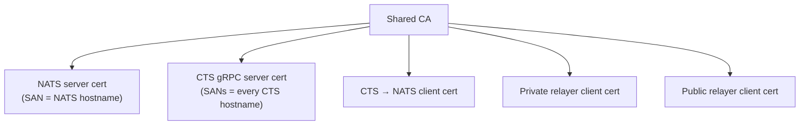

# Security

Security is not optional in `v3.0.0`. mTLS is enforced with no off switch, private keys are encrypted at rest through a KMS, and secrets are referenced — never embedded. This page covers the mandatory controls and the hardening you should apply.

---

## mTLS (mandatory in `v3.0.0`)

The CTS gRPC channel **and** the NATS client enforce mTLS — there is **no off switch**.

- **One shared CA** signs everything: the NATS **server** cert, the CTS gRPC **server** cert (with SANs for every CTS hostname clients use), and the **client** certs (CTS→NATS, private relayer, public relayer). All parties must trust that one CA.
- NATS runs with `verify:true` — a client without a CA-signed cert is rejected.
- Mount cert/key files **read-only** and keep the private keys in the [secret store](#secrets).
- **Rotate** certs on a schedule; because everything trusts one CA, rotating the CA is a coordinated operation.

!!! warning "Hostname must match the server-cert SAN"
    The hostname clients use to reach NATS and CTS must appear in the respective server cert's SAN list, or the TLS handshake fails.

The cert/key file paths are wired via the `*_TLS_*_FILE` variables in [Configuration](configuration.md).

---

## KMS (CTS at-rest encryption)

- Private keys **never leave the CTS process memory** and are stored **encrypted at rest** via **AWS or GCP KMS envelope encryption** (or an equivalent HSM/KMS).
- Set `CTS_ENCRYPTORSERVICE=aws` (or `gcp`) in production.

!!! danger "Never run production with plaintext"
    `CTS_ENCRYPTORSERVICE=plaintext` disables at-rest encryption and is for local development only. Use `aws` or `gcp` in any shared or production environment. See [KMS Integration](../../learn/components/kos/kms-integration.md).

---

## Secrets

- No secret values in config files or manifests — only **references** to secrets materialised from your secret store.
- The crown jewels are `OWNER_PRIVATE_KEY` and the CTS API credentials (`CTS_API_KEY` / `CTS_SECRET`) — restrict read access to only the workloads that need them.

---

## Network

- Keep all chain **RPC endpoints internal**. Do not expose PNo/PNH RPC publicly.
- Expose only what must be reached (e.g. backend API, explorer) behind a reverse proxy with auth/WAF.
- Lock Postgres/Mongo to the workloads only.
- Allow **outbound** only where needed — notably `https://mainnet-rpc.rayls.com` for the public relayer.

---

## Images

- Pin exact `v3.0.0` tags (or digests) and scan them before promotion; do not ship with known vulnerabilities.
- Run containers as non-root with a hardened security context and resource limits.

---

**Navigate:**

- [Next: Verification & Troubleshooting](verification.md)
- [Configuration](configuration.md)
- [Key Operation System](../../learn/components/kos/index.md)
