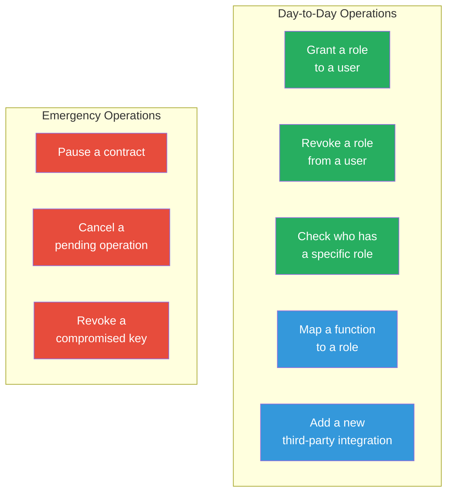
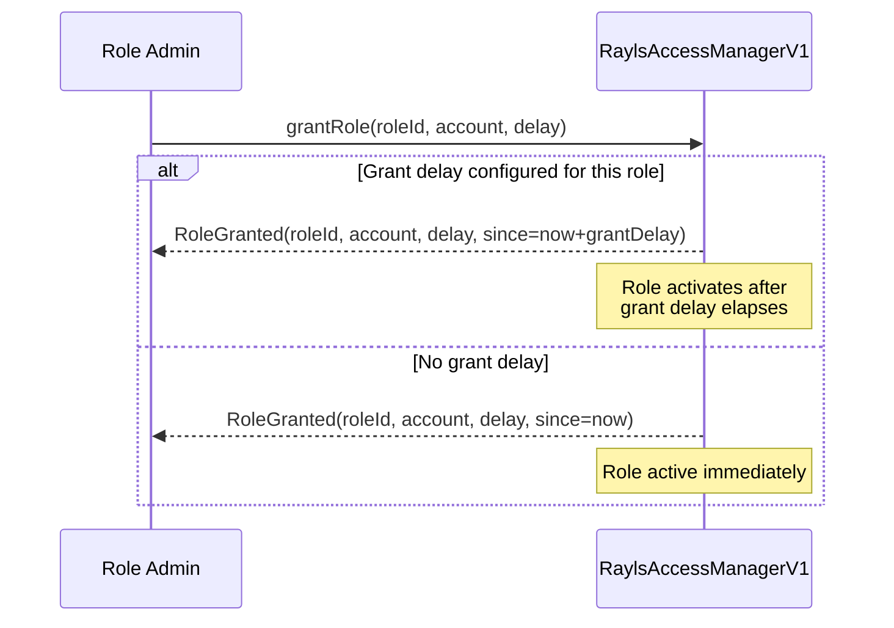
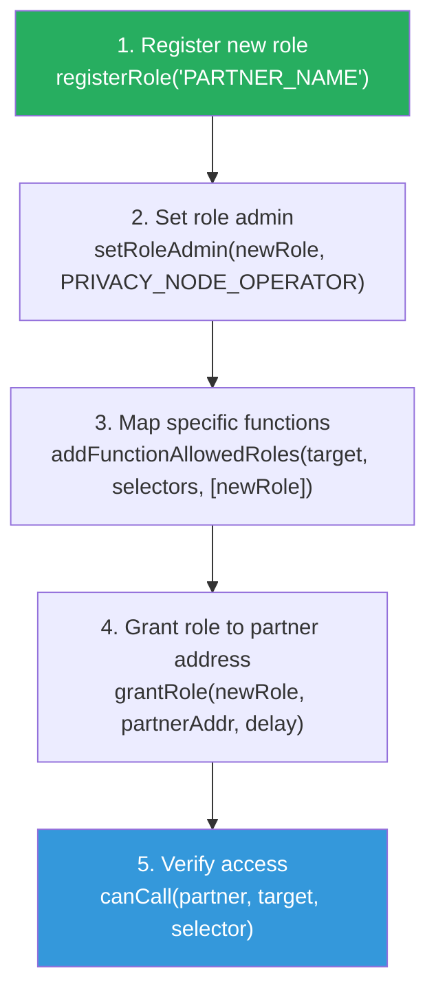
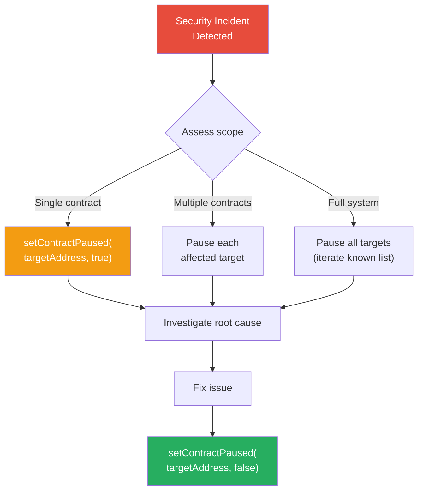
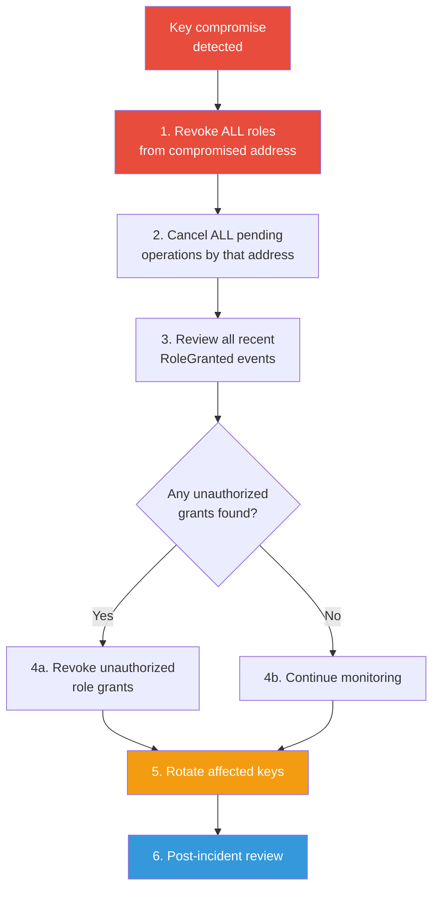
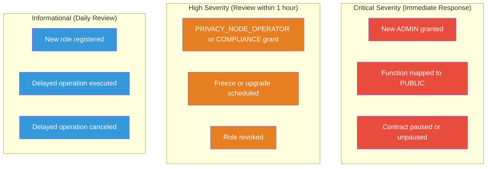
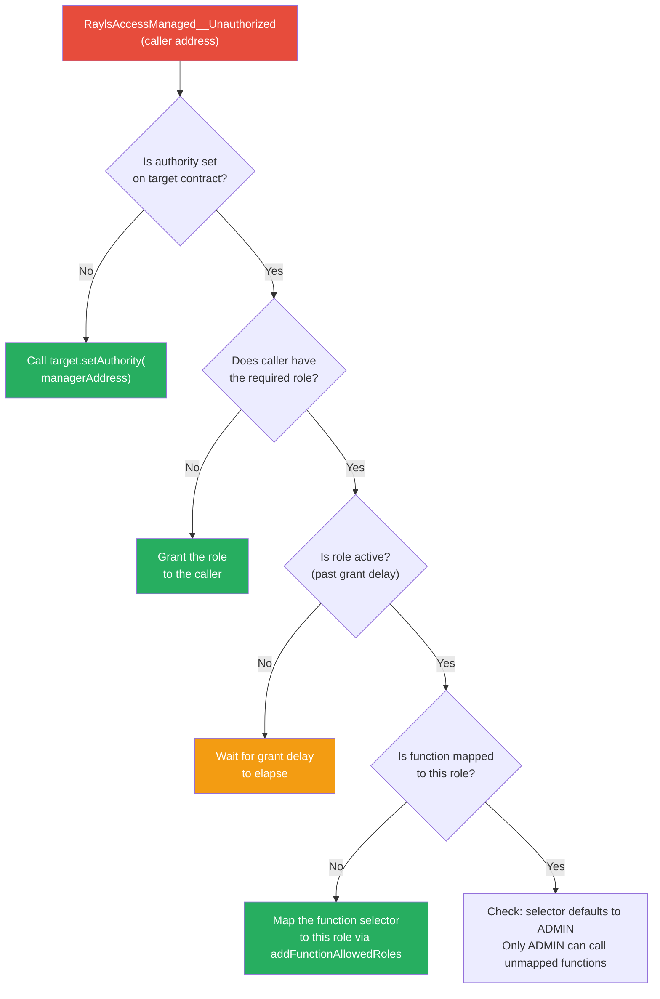

# Authorization Operations

Day-to-day operational procedures for managing the authorization system, including role management, permission configuration, emergency response, and monitoring.

---

## Common Operations

### Hardhat Tasks

Business role management is available via hardhat tasks:

```bash
# Activate business roles (register + map + hierarchy)
npx hardhat activate-business-roles-pnh                    # Private Network Hub
npx hardhat activate-business-roles-pn --pn A              # Privacy Node A

# Grant a role to an address
npx hardhat grant-business-role --role PRIVACY_NODE_OPERATOR --account 0x... --pn A
npx hardhat grant-business-role --role PRIVATE_NETWORK_OPERATOR --account 0x... --chain pnh
npx hardhat grant-business-role --role COMPLIANCE_OFFICER --account 0x... --pn A --delay 86400

# List all roles (optionally check membership)
npx hardhat list-roles --chain pnh
npx hardhat list-roles --pn A --account 0x...
```

### Quick Reference



---

## Role Management

### Grant a Role

**Who can do this:** Admin of the target role (e.g., PRIVACY_NODE_OPERATOR is admin of BANK_EMPLOYEE)

```solidity
// Grant with no execution delay (immediate access)
manager.grantRole(roleId, accountAddress, 0);

// Grant with 24h execution delay
manager.grantRole(roleId, accountAddress, 86400);
```



### Revoke a Role

**Who can do this:** Admin of the target role, or the role holder themselves (renounce)

```solidity
// Admin revokes
manager.revokeRole(roleId, accountAddress);

// Self-renounce (caller must confirm their own address)
manager.renounceRole(roleId, msg.sender);
```

### Check Role Membership

```solidity
// By role ID
(bool isMember, uint32 delay) = manager.hasRole(roleId, accountAddress);

// By role name
bool isMember = manager.hasRoleByName("PRIVACY_NODE_OPERATOR", accountAddress);
```

### Register a New Role

**Who can do this:** ADMIN only

```solidity
uint64 newRoleId = manager.registerRole("CUSTODY_MANAGER");
// Emits: RoleRegistered(newRoleId, "CUSTODY_MANAGER")
```

### Set Role Hierarchy

```solidity
// Make PRIVACY_NODE_OPERATOR the admin of BANK_EMPLOYEE
manager.setRoleAdmin(BANK_EMPLOYEE_ROLE, PRIVACY_NODE_OPERATOR_ROLE);

// Make PRIVACY_NODE_OPERATOR the guardian of COMPLIANCE_OFFICER
manager.setRoleGuardian(COMPLIANCE_OFFICER_ROLE, PRIVACY_NODE_OPERATOR_ROLE);
```

---

## Permission Management

### Map Functions to Roles

**Who can do this:** ADMIN only

```solidity
// Add roles to functions (additive -- preserves existing role mappings)
uint64[] memory roleIds = new uint64[](1);
roleIds[0] = COMPLIANCE_OFFICER_ROLE;
manager.addFunctionAllowedRoles(
    address(tokenRegistry),
    [TokenRegistryV1.freezeToken.selector, TokenRegistryV1.unfreezeToken.selector],
    roleIds
);

// Add an additional role to the same function
roleIds[0] = COMPLIANCE_TOOL_ROLE;
manager.addFunctionAllowedRoles(
    address(tokenRegistry),
    [TokenRegistryV1.freezeToken.selector],
    roleIds
);
// Now both COMPLIANCE_OFFICER and COMPLIANCE_TOOL can call freezeToken()

// Remove a role from a function's bitmap
manager.removeFunctionAllowedRoles(
    address(tokenRegistry),
    [TokenRegistryV1.freezeToken.selector],
    roleIds
);
```

### Add a New Third-Party Integration



**Example: Adding a compliance tool integration**

```solidity
// 1. Register role
uint64 complianceToolRole = manager.registerRole("COMPLIANCE_TOOL");

// 2. Set admin (PRIVACY_NODE_OPERATOR manages this role)
manager.setRoleAdmin(complianceToolRole, PRIVACY_NODE_OPERATOR_ROLE);

// 3. Map exactly 2 functions on 1 target
bytes4[] memory selectors = new bytes4[](2);
selectors[0] = TokenRegistryV1.freezeToken.selector;
selectors[1] = TokenRegistryV1.unfreezeToken.selector;
uint64[] memory roleIds = new uint64[](1);
roleIds[0] = complianceToolRole;
manager.addFunctionAllowedRoles(address(tokenRegistry), selectors, roleIds);

// 4. Grant to partner address
manager.grantRole(complianceToolRole, partnerAddress, 0);

// 5. Verify
(bool allowed, , ) = manager.canCall(partnerAddress, address(tokenRegistry),
    TokenRegistryV1.freezeToken.selector);
assert(allowed == true);
```

### Target-Scoped Role Grants

**Who can do this:** Target authority (usually the token deployer)

```solidity
// Grant TOKEN_OWNER to alice, scoped to a specific token
manager.grantContractScopedRole(TOKEN_OWNER, aliceAddress, tokenAddress, 0);

// Revoke TOKEN_OWNER from alice on a specific token
manager.revokeContractScopedRole(TOKEN_OWNER, aliceAddress, tokenAddress);

// Check target-scoped membership
(bool isMember, uint32 delay) = manager.hasContractScopedRole(
    TOKEN_OWNER, aliceAddress, tokenAddress
);
```

### Check Current Permissions

```solidity
// What role is required for a function?
uint64[] memory roleIds = manager.getFunctionAllowedRoles(targetAddress, selector);

// Can this address call this function?
(bool allowed, uint32 delay, bool paused) = manager.canCall(
    callerAddress, targetAddress, selector
);

// Is this contract paused?
bool closed = manager.isContractPaused(targetAddress);

// Who is the target authority?
address authority = manager.getContractAuthority(targetAddress);
```

---

## Emergency Procedures

### Pause a Contract

**When:** Security incident affecting a specific contract. Immediately blocks all `restricted` function calls on that target.



```solidity
// Pause TokenRegistry (all restricted functions blocked)
manager.setContractPaused(address(tokenRegistry), true);

// Reopen after incident resolved
manager.setContractPaused(address(tokenRegistry), false);
```

### Cancel a Pending Operation

**When:** A scheduled operation should not execute (wrong parameters, compromised key, etc.)

**Who can cancel:** Original caller, ADMIN holder, or guardian of the caller's role.

```solidity
manager.cancel(
    originalCaller,          // who scheduled it
    address(tokenRegistry),  // target
    abi.encodeCall(TokenRegistryV1.freezeToken, (resourceId, chainIds))
);
```

### Respond to Compromised Key



```solidity
// Step 1: Revoke all known roles from compromised address
manager.revokeRole(PRIVACY_NODE_OPERATOR_ROLE, compromisedAddress);
manager.revokeRole(COMPLIANCE_ROLE, compromisedAddress);

// Step 2: Cancel any pending operations
manager.cancel(compromisedAddress, target, operationData);

// Step 3: If compromised address was ADMIN, rotate ADMIN immediately
// This is the worst case -- requires multisig coordination
```

---

## Monitoring and Alerts

### Events to Monitor



### Alert Configuration

| Event | Condition | Severity | Action |
|---|---|---|---|
| `RoleGranted` | roleId == ADMIN | Critical | Verify with multisig signers immediately |
| `FunctionAllowedRoleAdded` | roleId == PUBLIC | Critical | Verify intentional; auto-pause target if not |
| `ContractPauseUpdated` | Any target | Critical | Confirm authorized; check for active incident |
| `RoleGranted` | roleId in [PRIVACY_NODE_OPERATOR, COMPLIANCE_OFFICER] | High | Verify with role admin |
| `OperationScheduled` | target contains upgrade selectors | High | Review new implementation before execution |
| `RoleRevoked` | Any | High | Confirm authorized revocation |
| `RoleRegistered` | Any | Info | Log for audit trail |
| `OperationExecuted` | Any | Info | Verify expected outcome |
| `OperationCanceled` | Any | Info | Log cancellation reason |

---

## Troubleshooting

### "RaylsAccessManaged__ContractPaused" Error

The contract is emergency-paused. ALL restricted calls are blocked regardless of roles.

**Fix:** `manager.setContractPaused(targetAddress, false)` (ADMIN only).

!!! info "The AccessManager itself cannot be paused"
    `setContractPaused(managerAddress, ...)` reverts with `RaylsAccessManagerV1__CannotPauseSelf`.

### "RaylsAccessManaged__Unauthorized" Error



### "RaylsAccessManagerV1__NotScheduled" Error

The caller has the required role but the role has a non-zero execution delay. The caller must schedule the operation first, wait for the delay, then execute.

```solidity
// Instead of calling the target directly:
// target.freezeToken(resourceId, chainIds);  // REVERTS

// Step 1: Schedule through the manager
bytes memory data = abi.encodeCall(
    TokenRegistryV1.freezeToken, (resourceId, chainIds)
);
uint48 executeAt = uint48(block.timestamp + executionDelay);
manager.schedule(address(tokenRegistry), data, executeAt);

// Step 2: Wait for the execution delay to elapse

// Step 3: Execute through the manager
manager.execute(address(tokenRegistry), data);
```

### Diagnostic Commands

```solidity
// 1. Check authority on a managed contract
address auth = target.authority();

// 2. Check what roles are required for a function
uint64[] memory roleIds = manager.getFunctionAllowedRoles(target, selector);

// 3. Check if caller has a specific role
(bool hasMembership, uint32 delay) = manager.hasRole(roleIds[0], caller);

// 4. Full authorization check
(bool allowed, uint32 execDelay, bool paused) = manager.canCall(caller, target, selector);

// 5. Check if target is paused
bool closed = manager.isContractPaused(target);

// 6. Get role ID by name
uint64 roleId = manager.getRoleIdByName("PRIVACY_NODE_OPERATOR");

// 7. Check target authority
address authority = manager.getContractAuthority(targetAddress);

// 8. Check target-scoped role membership
(bool hasTargetMembership, uint32 delay) = manager.hasContractScopedRole(
    roleId, caller, target
);
```

### Hardhat Console Diagnostics

```bash
# Check role membership
npx hardhat console --network <network>
> const mgr = await ethers.getContractAt("RaylsAccessManagerV1", "<mgr-addr>")
> const roleId = await mgr.getRoleIdByName("RELAYER")
> const [hasMembership, delay] = await mgr.hasRole(roleId, "<address>")
> console.log(hasMembership, delay)

# Check function permission
> const [allowed, execDelay] = await mgr.canCall("<caller>", "<target>", "<selector>")

# Check target status
> const closed = await mgr.isContractPaused("<target>")
```

---

**Navigate:**

- [Back to Deploy Overview](../index.md)
- [Authorization Overview](../../learn/governance/authorization/index.md)
- [Role Reference](../../build/reference/role-reference.md)
- [Security Model](../../learn/governance/authorization/security-model.md)
