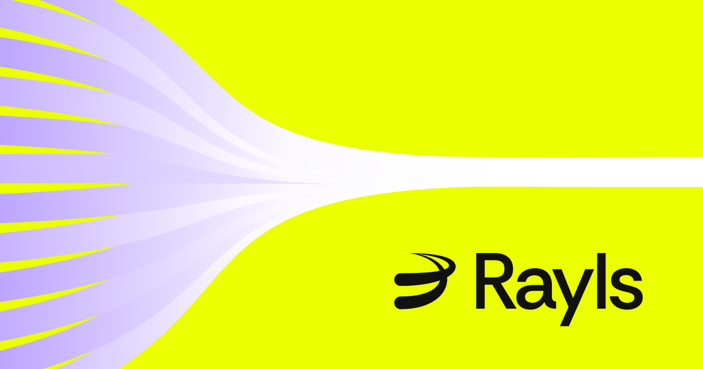

---
hide:
- navigation
- toc
---

  <header class="section">
    

      

        

          

            <h1 class="hero-heading">Privacy-Preserving Cross-Chain Infrastructure</h1>
            
Institutional-grade blockchain infrastructure for compliant, confidential transactions across multiple networks.

            
Built for financial institutions with privacy, governance, and interoperability at its core.

          

          

            
          

        

      

    

  </header>

  <section class="section">
    

      

        

          <!-- LEARN COLUMN -->
          

            

              

                <h3 class="heading-h3 margin-none">📚 LEARN</h3>
              

              

                Understand Rayls architecture, protocols, and privacy-preserving technologies.
              

            

            <a href="learn/introduction/what-is-rayls/" class="flex-card-item">
              

                
Introduction

                
→

              

              

                Learn what Rayls is, how it works, and the problems it solves for financial institutions.
              

            </a>
          

          <!-- BUILD COLUMN -->
          

            

              

                <h3 class="heading-h3 margin-none">🔨 BUILD</h3>
              

              

                Develop applications and integrate with Rayls privacy-preserving infrastructure.
              

            

            <a href="build/beginner/local-setup/" class="flex-card-item">
              

                
Quickstart

                
→

              

              

                Set up your local Rayls environment and complete your first cross-chain transaction in minutes.
              

            </a>
          

          <!-- DEPLOY COLUMN -->
          

            

              

                <h3 class="heading-h3 margin-none">🚀 DEPLOY</h3>
              

              

                Deploy production-ready infrastructure with enterprise-grade security and compliance.
              

            

            <a href="deploy/privacy-node/" class="flex-card-item">
              

                
Deploy Rayls Privacy Node

                
→

              

              

                Deploy production-ready Privacy Nodes with complete configuration and security setup.
              

            </a>
          

        

      

    

  </section>

