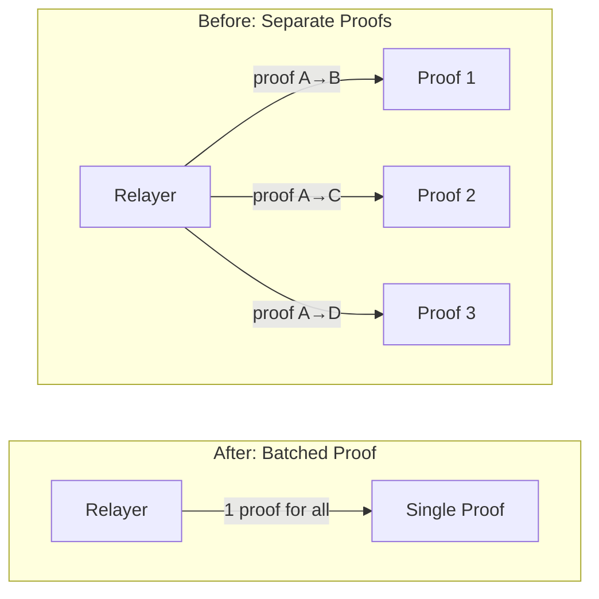
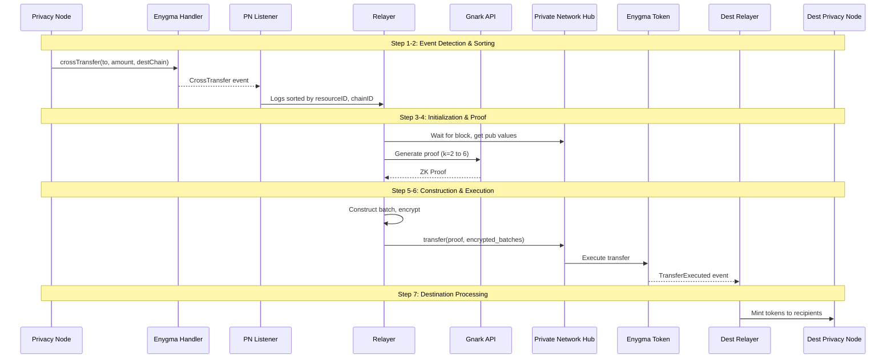
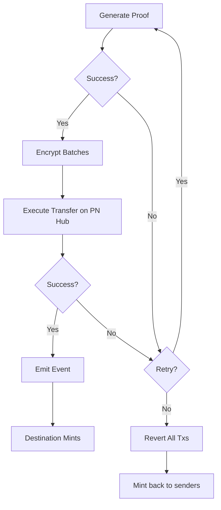

# Enygma Batching

This page explains how Enygma batches multiple privacy-preserving transfers together for efficiency and enhanced anonymity. For the cryptographic foundations, see [Enygma Protocol](../../protocols/enygma/index.md).

---

## Overview

Enygma enables hidden-amount transfers using zero-knowledge proofs. When you send tokens via Enygma, the transfer amount is hidden from everyone except the sender—even the recipient only sees their balance change, not the specific amount received.

**Batching** is the process of grouping multiple Enygma transfers together before generating a single zero-knowledge proof. This provides two key benefits:

1. **Privacy** - Multiple transfers become indistinguishable from each other
2. **Efficiency** - One proof covers many transfers instead of one proof per transfer

---

## The Problem: Why Batching?

### Privacy Through Anonymity

When multiple transfers are batched together, observers cannot determine which specific transfer belongs to which participant. This is called **k-anonymity**—if k participants are in a batch, any individual transfer could belong to any of the k participants.

Consider a network with 6 Privacy Nodes. If Alice sends tokens to Bob, and Carol sends tokens to Dave in the same batch, an observer sees "2 transfers happened" but cannot determine who sent what to whom.

### Efficiency Through Aggregation

Without batching, each transfer to a different destination would require its own ZK proof generation—an expensive operation taking 2-10 seconds per proof.

With batching, the Relayer generates a single proof covering all transfers in the batch, dramatically reducing computational overhead.

---

## k-Anonymity Sets

The "k" in k-anonymity represents how many participants are indistinguishable in a batch. Rayls supports anonymity set sizes from k=2 to k=6, with the value determined by the number of Privacy Nodes registered in the network:

| Registered Privacy Nodes | k Value | Circuit Used | Meaning |
|--------------------------|---------|--------------|---------|
| 2 | 2 | circuit-2 | Each batch contains 2 participants |
| 3 | 3 | circuit-3 | Each batch contains 3 participants |
| 4 | 4 | circuit-4 | Each batch contains 4 participants |
| 5 | 5 | circuit-5 | Each batch contains 5 participants |
| 6+ | 6 | circuit-6 | Each batch contains 6 participants |

The Gnark API provides pre-compiled circuits for every integer k from 2 to 6. The appropriate circuit is selected based on the number of registered Privacy Nodes, capping at k=6 for networks with 6 or more nodes.

### Filling the Anonymity Set

What if only one Privacy Node has transfers to send? The batch would only have 1 participant, breaking k-anonymity.

The solution: **empty batches**. If a batch doesn't have enough participants, the Relayer adds empty batches for other Privacy Nodes to fulfill the anonymity requirement.

For example, with k=2:
- Privacy Node A has 3 transfers to send
- Privacy Node B has 0 transfers to send
- The Relayer creates a batch with Privacy Node A's 3 transfers + an empty batch for Privacy Node B
- Observers see "2 Privacy Nodes participated" but cannot tell which had real transfers

---

## Batching Rules

The Relayer follows strict rules when constructing batches to ensure correctness and privacy guarantees:

| Rule | Description |
|------|-------------|
| **1 batch per chain ID** | Transfers to different destination chains go in separate batches |
| **1 batch per resource ID** | Each token type (identified by resource ID) has its own batch |
| **R value per batch** | The randomness value (R) is shared across all transactions in a batch, not per-transaction |
| **Max transactions per batch** | If too many transfers occur in one block, they're split into multiple batches |

**Why separate by chain ID and resource ID?** Each batch generates a proof that updates the state for a specific token on a specific destination chain. Mixing different tokens or destinations would require a more complex (and slower) proof system.

---

## Batching Flow

The complete lifecycle of an Enygma batch, from when users initiate transfers to when tokens are minted at the destination:

### Step 1: Event Detection

The Enygma PN Listener monitors the Privacy Node for `CrossTransfer` events emitted by the Enygma Handler contract. Multiple users may call `crossTransfer` in the same block:

- Alice: `crossTransfer(0x01, 100, PL_B)`
- Bob: `crossTransfer(0x02, 200, PL_B)`
- Carol: `crossTransfer(0x03, 50, PL_C)`

### Step 2: Log Sorting

Events are sorted first by resource ID (token type), then by destination chain ID. This ensures transfers of the same token to the same destination are grouped together.

### Step 3: Batch Initialization

For each unique (resourceID, chainID) pair, the Relayer:
1. Initializes a new batch structure
2. Waits for the Private Network Hub block to be mined
3. Retrieves the current Enygma public values from the Hub

### Step 4: Proof Generation

The Relayer calls the Gnark API to generate a ZK proof for the batch. The proof includes:
- The PN Hub block number (binding the proof to a specific state)
- Public values (current balances, R values)
- The batch contents (hidden in the proof)

### Step 5: Batch Construction

The Relayer constructs the `EnygmaTransferBatch` structure:
- Fills empty slots to meet the k-anonymity requirement
- Calculates the new R value for the batch
- Groups all transactions for this (resourceID, chainID) pair

### Step 6: Encryption & Execution

Batches are encrypted using the destination's public key and submitted to the Private Network Hub. The Enygma Token contract validates the proof and emits a `TransferExecuted` event.

### Step 7: Destination Processing

Each Relayer in the network receives the transfer event and processes it based on their role (see next section).

---

## Destination Processing

When the Private Network Hub emits a transfer event, all Relayers receive it but take different actions:

| Relayer Role | Action |
|--------------|--------|
| **Source Relayer** | Do nothing (already burned tokens locally) |
| **Destination Relayer** | Decrypt batch, mint all tokens to recipients |
| **Other Relayers** | Update R value only if included in the batch |

### Understanding the R Value

The "R value" is a cumulative randomness used in Pedersen commitments. It's essential for the zero-knowledge proof system to work correctly.

Even Relayers not directly involved in a transfer need to update their local R value to stay synchronized with the network state. This ensures they can participate in future batches correctly.

---

## Error Handling

Enygma batching includes robust error handling to ensure atomicity—either all transfers in a batch succeed, or all are reverted.

### Proof Generation Failure

If the Gnark API fails to generate a proof (timeout, invalid inputs), the Relayer retries with exponential backoff. After exhausting retries, the batch is abandoned and transfers can be retried in a future block.

### Execution Failure

If the Hub execution fails (proof verification fails, state mismatch), the Relayer checks if retry is possible. If retries are exhausted, all transactions in the batch are **reverted** on the source Privacy Node—tokens are minted back to the original senders.

### Finalization

A "finalization transaction" is triggered once per resourceID after all batches are processed. This updates the public balances on the Private Network Hub from the last batch using an empty batch. This ensures the Hub state is consistent even if no more transfers occur for that token.

---

## Summary

| Aspect | Description |
|--------|-------------|
| **Purpose** | Privacy + Efficiency for cross-chain transfers |
| **k-Anonymity** | k=2 through k=6 (based on number of registered Privacy Nodes) |
| **Atomicity** | All-or-nothing batch execution with automatic revert |
| **Proof System** | Gnark API with circuit-k (k=2 to 6) |
| **Batching Rules** | 1 batch per (resourceID, chainID) pair |

---

**Next:** [Privacy Nodes](../privacy-nodes/index.md) - Deep dive into Privacy Node architecture
