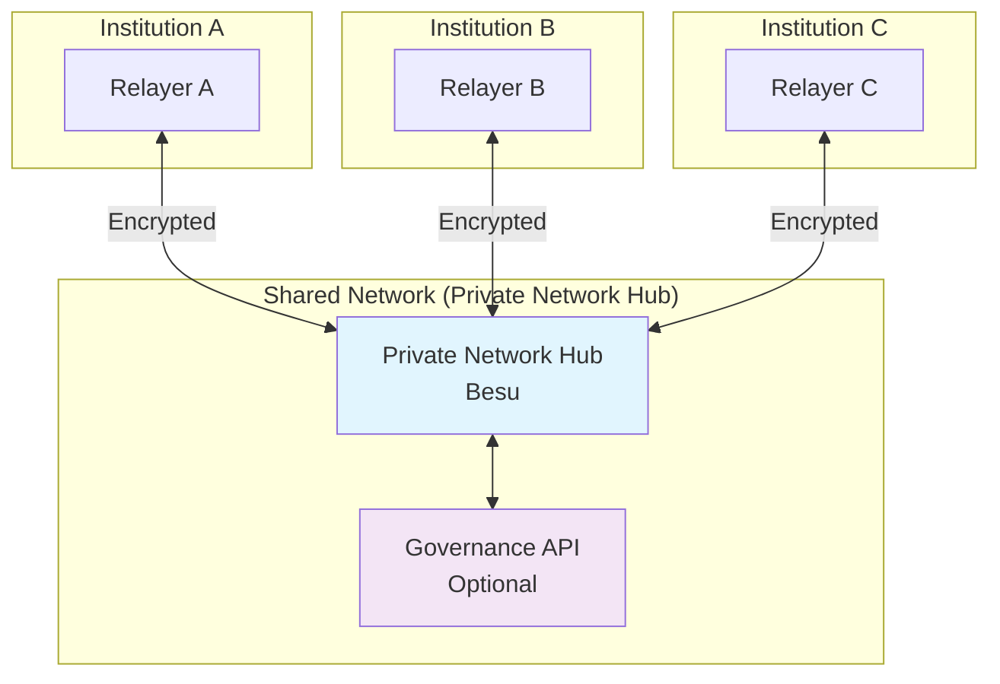
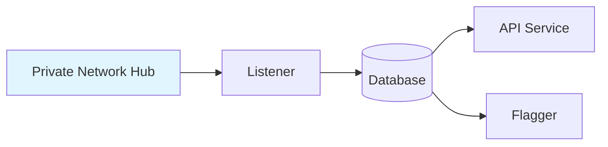
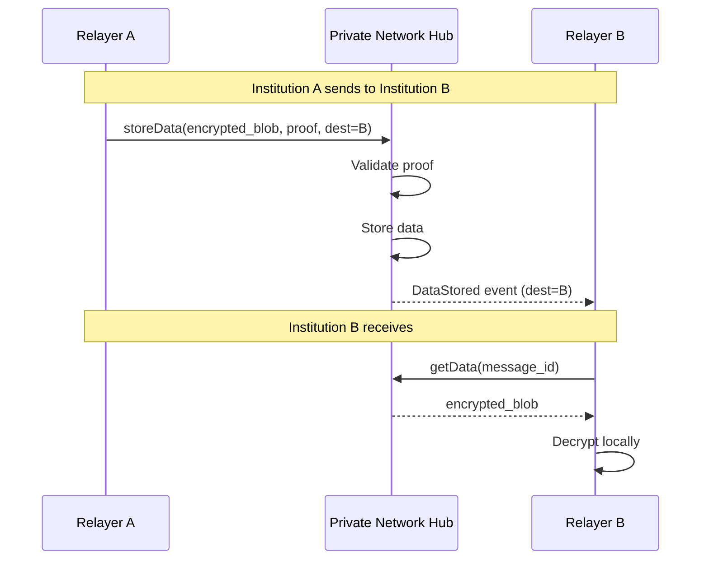
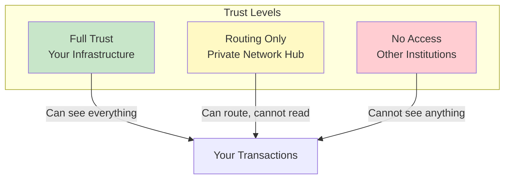
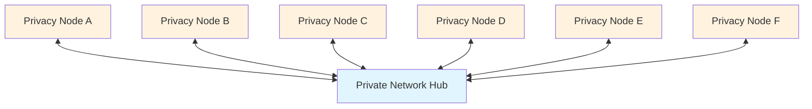

# Private Network Hub Components

This page describes the shared infrastructure that connects all institutions in the Rayls network.

---

## Overview

The Private Network Hub is the coordination layer that routes messages between institutions. It's shared infrastructure—all institutions connect to the same Hub, but no institution can read another's messages.

---

## Private Network Hub

The Private Network Hub is the coordination layer where all cross-chain messages are routed.

| Property | Value |
|----------|-------|
| **Technology** | Java (Hyperledger Besu) |
| **Consensus** | IBFT/QBFT (Byzantine Fault Tolerant) |
| **Block Time** | ~5 seconds |
| **Purpose** | Message routing, proof verification, state coordination |

### Key Characteristics

- **Shared Infrastructure:** All institutions connect to the same chain
- **Privacy by Design:** Only sees encrypted blobs, never transaction contents
- **Byzantine Fault Tolerant:** Continues operating even if some validators fail
- **Permissioned:** Only registered institutions can participate

### What the Hub Stores

| Data | Visibility | Purpose |
|------|------------|---------|
| Encrypted message blobs | Opaque to Hub | Route to destination |
| Merkle proofs | Verifiable | Validate message authenticity |
| Participant registry | Public | Know which institutions exist |
| Token registry | Public | Map tokens across chains |
| Enygma public state | Public | Balance commitments (not actual balances) |

### What the Hub CANNOT See

| Data | Why |
|------|-----|
| Transfer amounts | Encrypted in payload |
| Recipient addresses | Encrypted in payload |
| Transaction details | Encrypted in payload |
| Sender identity | Only chain ID visible, not internal addresses |

---

## Smart Contracts on Private Network Hub

The Private Network Hub runs several core contracts that coordinate the network.

### TeleportV1

The main message routing contract.

| Function | Purpose |
|----------|---------|
| `storeData()` | Store encrypted message + Merkle proof |
| `validateProof()` | Verify Merkle inclusion proof |
| Events | `DataStored` - notifies destination relayers |

### ParticipantStorageV1

Registry of all institutions in the network.

| Function | Purpose |
|----------|---------|
| `registerParticipant()` | Add new institution |
| `getParticipant()` | Look up institution details |
| `getPublicKey()` | Get institution's encryption public key |

### TokenRegistryV1

The Hub-side network catalog that maps tokens across different Privacy Nodes. Tokens are first registered on a Privacy Node via [`PNTokenRegistryV1`](../smart-contracts/pn-token-registry.md); when a node calls `submitToHub`, the token is added here and the Hub operator activates it.

| Function | Purpose |
|----------|---------|
| `addToken()` | Add a submitted token to the network catalog |
| `updateStatus()` | Activate a token (`updateStatus(resourceId, ACTIVE)`) |
| `getResourceId()` | Get chain-agnostic token identifier |
| `getTokenAddress()` | Get token address on specific chain |

### ResourceRegistryV1

Metadata for deployable resources.

| Function | Purpose |
|----------|---------|
| `registerResource()` | Register resource metadata |
| `getResource()` | Look up resource details |

### EnygmaV1

Privacy token protocol for hidden-amount transfers.

| Function | Purpose |
|----------|---------|
| `transfer()` | Execute batched privacy transfer |
| `verifyProof()` | Validate ZK proof |
| State | Public balance commitments (Pedersen) |

### Dvp

Zero-knowledge Delivery vs Payment for atomic swaps.

| Function | Purpose |
|----------|---------|
| `deposit()` | Lock asset with commitment |
| `settle()` | Execute atomic swap |
| `cancel()` | Return funds if swap fails |

---

## Governance API (Optional)

The Governance API provides compliance monitoring and audit capabilities.

| Property | Value |
|----------|-------|
| **Technology** | Go 1.24.2 |
| **Repository** | rayls-sovereign-pnh-governance |
| **Purpose** | Compliance monitoring, transaction flagging |

### Services

| Service | Function |
|---------|----------|
| **Listener** | Monitors Private Network Hub for all cross-chain transactions |
| **API** | REST endpoints for querying transaction history |
| **Flagger** | Validates transactions against business rules |

### Capabilities

- Track all cross-chain transactions
- Query transaction history by participant, token, time range
- Flag suspicious transactions based on configurable rules
- Audit trail for compliance requirements

### Privacy Note

The Governance API can only see what the Private Network Hub sees—encrypted blobs and metadata. It cannot decrypt transaction contents unless given auditor keys.

---

## How Institutions Connect

### Connection Architecture

Each institution's Relayer connects to the Private Network Hub via JSON-RPC:

### Connection Requirements

| Requirement | Details |
|-------------|---------|
| Protocol | JSON-RPC over HTTPS |
| Authentication | Institution's registered keys |
| Ports | Configurable (default: 8545) |
| Network | Must reach Private Network Hub validators |

---

## Privacy Guarantees

The Private Network Hub is designed so that even the shared infrastructure cannot violate privacy.

### What Each Party Can See

| Data | Your Institution | Private Network Hub | Other Institutions |
|------|------------------|--------------|-------------------|
| Your transactions | Full details | Encrypted blob | Nothing |
| Your balances | Full details | Commitments only | Nothing |
| Incoming messages | Full details (after decrypt) | Encrypted blob | Nothing |
| Participant list | Full list | Full list | Full list |
| Token registry | Full registry | Full registry | Full registry |

### Trust Model

---

## Validator Setup

The Private Network Hub uses Byzantine Fault Tolerant consensus with multiple validators.

### Consensus: IBFT/QBFT

| Property | Value |
|----------|-------|
| Algorithm | Istanbul BFT / Quorum BFT |
| Fault Tolerance | Tolerates up to ⌊(n-1)/3⌋ faulty validators |
| Finality | Immediate (no forks) |
| Block Time | ~5 seconds |

### Validator Requirements

| Requirement | Details |
|-------------|---------|
| Minimum validators | 4 (for BFT guarantees) |
| Recommended | 7+ for production |
| Operator | Network participants or trusted third parties |

### Adding New Validators

1. New validator node deployed
2. Existing validators vote to add
3. Requires majority consensus
4. New validator begins participating

---

## Network Topology

### Single Hub, Multiple Privacy Nodes

### Scaling

| Aspect | How It Scales |
|--------|---------------|
| More institutions | Add more Privacy Nodes, all connect to same Hub |
| More transactions | Hub throughput ~100-500 TPS |
| More validators | Add validators for resilience (not throughput) |

---

## Summary

| Component | Operated By | Purpose |
|-----------|-------------|---------|
| **Private Network Hub** | Network validators | Message routing, coordination |
| **Governance API** | Network operator (optional) | Compliance monitoring |
| **Smart Contracts** | Deployed once | Protocol logic |

---

**Next:** [Enygma Batching](enygma.md) - Privacy-preserving transfer details
