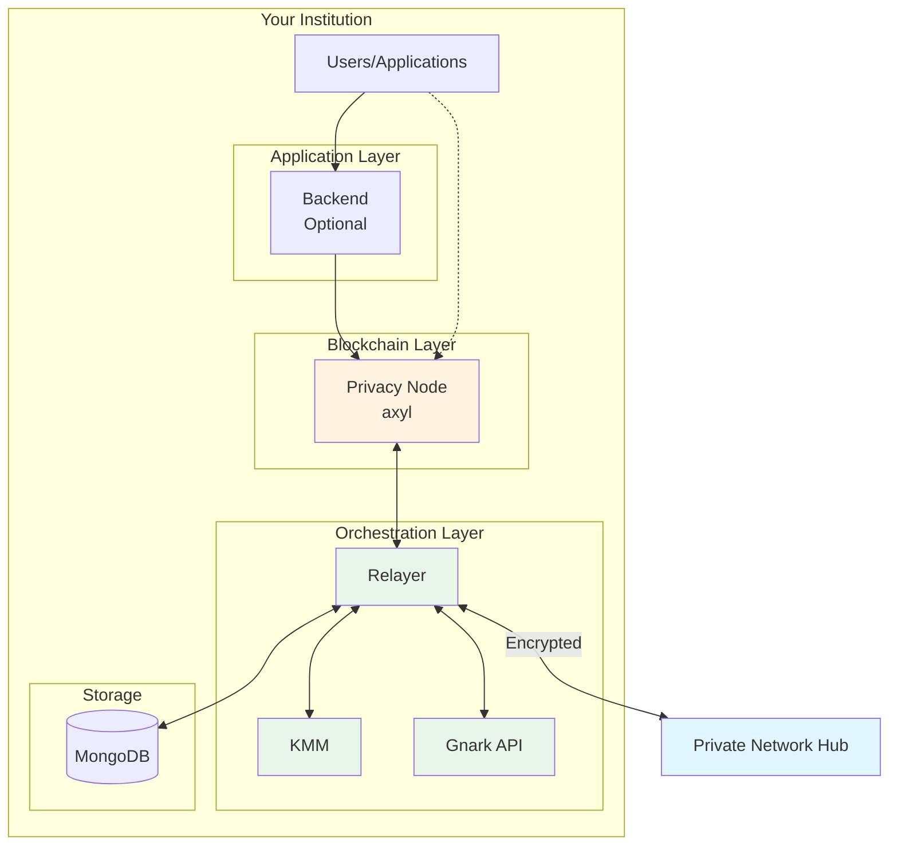
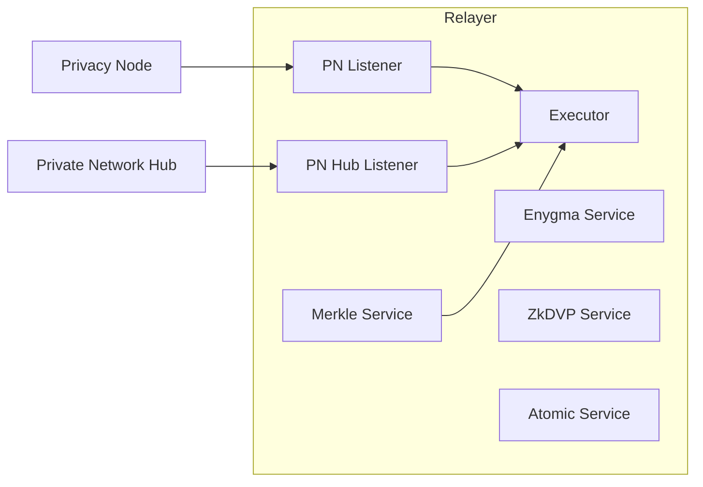
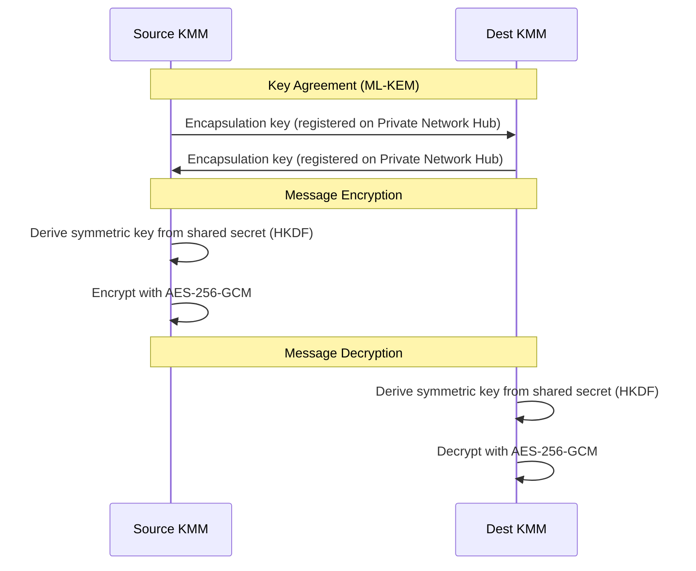

# Rayls Privacy Node Components

This page describes all the components that run per-institution alongside each Rayls Privacy Node.

---

## Overview

Each institution in the Rayls network operates its own isolated infrastructure. No other institution can access your components or data.

---

## Rayls Privacy Node

The Rayls Privacy Node is your institution's private blockchain where all local transactions are recorded.

| Property | Value |
|----------|-------|
| **Technology** | Rust (axyl — reth-based EVM) |
| **Consensus** | Narwhal + Bullshark BFT |
| **Block Time** | 1 second |
| **Contract Size Limit** | 1 MB (vs 24 KB standard) |
| **Compatibility** | Full Ethereum (Solidity, JSON-RPC, EVM) |

### Key Characteristics

- **Multi-Validator BFT:** Your chain runs a Narwhal + Bullshark validator committee (4 by default) with epoch rotation via the on-chain ConsensusRegistry
- **Full Privacy:** Transaction data never leaves your infrastructure (only encrypted messages do)
- **Ethereum Compatible:** Use standard Ethereum tools (Hardhat, ethers.js, MetaMask)
- **Extended Limits:** Deploy larger contracts for complex DeFi logic

### Smart Contracts on Privacy Node

| Contract | Purpose |
|----------|---------|
| **RNEndpointV1** | Entry point for cross-chain messages (EIP-5164) |
| **ERC20Handler** | Cross-chain ERC-20 token transfers |
| **ERC721Handler** | Cross-chain NFT transfers |
| **ERC1155Handler** | Cross-chain multi-token transfers |
| **EnygmaHandler** | Privacy-preserving transfers with hidden amounts |
| **ZkDvpHandler** | Zero-knowledge atomic swaps |

---

## Relayer

The Relayer is the bridge between your Privacy Node and the Private Network Hub. It handles all cross-chain communication.

| Property | Value |
|----------|-------|
| **Technology** | Go 1.24+ |
| **Repository** | rayls-sovereign-relayer |
| **Purpose** | Event detection, message routing, proof coordination |

### Internal Services

The Relayer runs multiple internal services:

| Service | Function |
|---------|----------|
| **PN Listener** | Monitors Privacy Node for outgoing messages |
| **PN Hub Listener** | Monitors Private Network Hub for incoming messages |
| **Executor** | Submits transactions to Privacy Node and Hub |
| **Merkle Service** | Builds Merkle trees and inclusion proofs |
| **Enygma Service** | Handles privacy-preserving transfer batching |
| **ZkDVP Service** | Coordinates zero-knowledge atomic swaps |
| **Atomic Service** | Manages locked funds for atomic transactions |

### What the Relayer Does

1. **Outgoing Messages:**
   - Detects `MessageDispatched` events on your Privacy Node
   - Generates Merkle proofs
   - Requests encryption from KMM
   - Submits to Private Network Hub

2. **Incoming Messages:**
   - Detects `DataStored` events targeting your chain
   - Requests decryption from KMM
   - Executes messages on your Privacy Node

---

## Key Management Module (KMM)

KMM handles all cryptographic operations—key management, encryption, and decryption.

| Property | Value |
|----------|-------|
| **Technology** | Go 1.24+ |
| **Repository** | rayls-sovereign-relayer (submodule) |
| **Purpose** | Key management, message encryption/decryption |

### Key Types

| Key Type | Algorithm | Purpose |
|----------|-----------|---------|
| **Rayls Sign Keys** | ECDSA (secp256k1) | Blockchain transaction signing |
| **Rayls View Keys** | ML-KEM-768 | Message encryption between institutions |
| **Payment Spend Keys** | Baby JubJub (BN254) | Enygma ZK proofs and Pedersen commitments |

### Key Storage Options

KMM supports multiple storage backends for your keys:

| Option | Use Case |
|--------|----------|
| **AWS KMS** | Production (cloud) |
| **Google Cloud KMS** | Production (cloud) |
| **Azure Key Vault** | Production (cloud) |
| **HSM** | Production (on-premise, highest security) |
| **Local File** | Development only |

### How Encryption Works

---

## Gnark API

Gnark API generates zero-knowledge proofs for privacy-preserving operations.

| Property | Value |
|----------|-------|
| **Technology** | Go 1.22+ |
| **Repository** | rayls-sovereign-gnark-api |
| **Purpose** | ZK proof generation for Enygma and ZkDVP |

### Supported Circuits

| Circuit | k-Anonymity | Use Case |
|---------|-------------|----------|
| **circuit-2** | 2 participants | Networks with 2 Privacy Nodes |
| **circuit-3** | 3 participants | Networks with 3 Privacy Nodes |
| **circuit-4** | 4 participants | Networks with 4 Privacy Nodes |
| **circuit-5** | 5 participants | Networks with 5 Privacy Nodes |
| **circuit-6** | 6 participants | Networks with 6+ Privacy Nodes |

### When Gnark API is Used

- **Standard Teleport:** Not used
- **Atomic Transactions:** Not used
- **Enygma Transfers:** Generates proofs for hidden amounts
- **ZkDVP Swaps:** Generates proofs for atomic exchanges

### Performance

| Operation | Duration |
|-----------|----------|
| Proof generation (circuit-2) | ~2 seconds |
| Proof generation (circuit-6) | ~10 seconds |

---

## Backend (Optional)

The Backend provides a REST API layer for application integration.

| Property | Value |
|----------|-------|
| **Technology** | Go |
| **Repository** | rayls-sovereign-backend |
| **Purpose** | Transaction construction, custody integration |

### When to Use Backend

| Use Case | Recommendation |
|----------|----------------|
| Direct blockchain integration | Skip Backend, use JSON-RPC |
| Application with custody requirements | Use Backend |
| Multi-signature workflows | Use Backend |
| Transaction batching | Use Backend |

### Capabilities

- Transaction construction and signing
- Custody provider integration (e.g., Fireblocks)
- REST API for applications
- Transaction history and status

---

## MongoDB

MongoDB stores state for the Relayer to ensure reliable message delivery.

| Property | Value |
|----------|-------|
| **Purpose** | Relayer state persistence |

### What MongoDB Stores

| Data | Purpose |
|------|---------|
| Last processed block (PN) | Resume after restart |
| Last processed block (PN Hub) | Resume after restart |
| Pending transactions | Retry on failure |
| Merkle tree state | Proof generation |
| Enygma batch state | Batch processing |

### Why MongoDB?

- Ensures no messages are lost if Relayer restarts
- Enables transaction retry on transient failures
- Tracks processing state across services

---

## Communication Between Components

| From | To | Protocol | Data |
|------|----|----------|------|
| Backend | Privacy Node | JSON-RPC | Transactions |
| Relayer | Privacy Node | JSON-RPC (HTTP/WS) | Events, transactions |
| Relayer | KMM | REST API | Encryption/decryption requests |
| Relayer | Gnark API | REST API | Proof generation requests |
| Relayer | MongoDB | MongoDB protocol | State persistence |
| Relayer | Private Network Hub | JSON-RPC (HTTP/WS) | Encrypted messages |

---

## Deployment Summary

All these components run within your institution's network:

| Component | Required | Notes |
|-----------|----------|-------|
| Privacy Node | Yes | Your private blockchain |
| Relayer | Yes | Cross-chain communication |
| KMM | Yes | Key management |
| Gnark API | Yes | ZK proofs (even if not using Enygma) |
| MongoDB | Yes | Relayer state |
| Backend | No | Optional application layer |

---

**Next:** [Private Network Hub Components](hub-components.md) - The shared network hub
