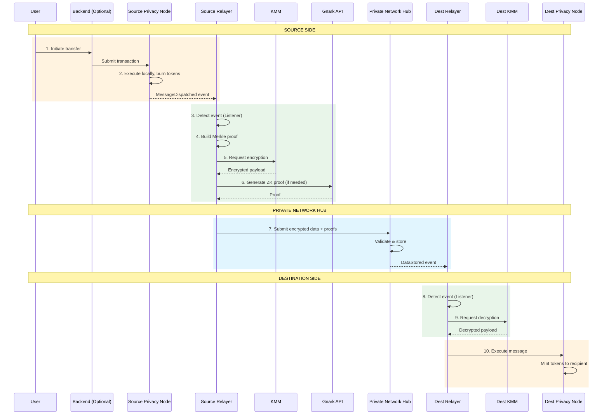

# Transaction Lifecycle

This page shows the complete journey of a cross-chain transaction through every component in the Rayls network.

---

## The Complete Picture

A token transfer from Institution A to Institution B passes through 10 distinct steps across multiple services:

---

## Step-by-Step Breakdown

### Step 1: User Initiates Transfer

The journey begins when a user wants to send tokens to another institution.

**What happens:**
- User calls the Backend API (or directly submits to the Privacy Node)
- Backend constructs the transaction and submits it to the Privacy Node
- The transaction calls `crossTransfer()` on the appropriate token handler

**Components involved:** User → Backend → Privacy Node

---

### Step 2: Privacy Node Processing

The source Privacy Node executes the transaction locally.

**What happens:**
- Token handler burns the tokens from sender's balance
- Endpoint contract (`RNEndpointV1`) prepares the cross-chain message
- `MessageDispatched` event is emitted with the message details

**Why burn?** Burning ensures tokens don't exist on both chains simultaneously. They'll be minted on the destination.

**Components involved:** Privacy Node (axyl), Smart Contracts

---

### Step 3: Relayer Detects Event

The Relayer's Listener service continuously monitors the Privacy Node for events.

**What happens:**
- PN Listener polls for new blocks
- Detects the `MessageDispatched` event
- Adds the message to the processing queue

**Components involved:** Relayer (Listener service)

---

### Step 4: Merkle Proof Generation

The Relayer generates a cryptographic proof that the message exists on the source chain.

**What happens:**
- Merkle service collects recent messages
- Builds a Merkle tree with the new message
- Generates an inclusion proof for this specific message

**Why Merkle proofs?** They allow the Private Network Hub to verify the message is legitimate without trusting the Relayer.

**Components involved:** Relayer (Merkle service)

---

### Step 5: Encryption (KMM)

The message payload is encrypted so only the destination can read it.

**What happens:**
- Relayer requests encryption from KMM
- KMM uses the pre-established ML-KEM shared secret to derive a symmetric key
- Payload encrypted with AES-256-GCM
- Only the destination institution's KMM can decrypt

**Why encrypt?** The Private Network Hub routes messages but should never see their contents. This ensures privacy even from the shared infrastructure.

**Components involved:** Relayer → KMM

---

### Step 6: ZK Proof Generation (If Needed)

For Enygma or ZkDVP transfers, a zero-knowledge proof is generated.

**What happens:**
- Relayer sends proof request to Gnark API
- Gnark generates a ZK proof (using circuit-k, where k ranges from 2 to 6)
- Proof demonstrates correctness without revealing amounts

**When is this needed?**
- **Standard Teleport:** No ZK proof needed
- **Enygma:** ZK proof hides transfer amounts
- **ZkDVP:** ZK proof enables atomic swaps

**Components involved:** Relayer → Gnark API

For Enygma details, see [Enygma Batching](enygma.md).

---

### Step 7: Submit to Private Network Hub

The encrypted message and proofs are submitted to the shared hub.

**What happens:**
- Relayer calls `TeleportV1` contract on Private Network Hub
- Contract validates the Merkle proof
- Encrypted blob stored on-chain
- `DataStored` event emitted with destination chain ID

**What the Hub sees:**
- Encrypted blob (cannot read contents)
- Merkle proof (can verify validity)
- Source and destination chain IDs

**What the Hub cannot see:**
- Transfer amounts
- Recipient addresses
- Any transaction details

**Components involved:** Relayer → Private Network Hub (TeleportV1)

---

### Step 8: Destination Relayer Receives

The destination institution's Relayer detects the incoming message.

**What happens:**
- PN Hub Listener polls Private Network Hub for new events
- Detects `DataStored` event
- Checks if destination chain ID matches this institution
- If yes, adds to processing queue

**Components involved:** Destination Relayer (PN Hub Listener)

---

### Step 9: Decryption (KMM)

The destination decrypts the message to reveal the original payload.

**What happens:**
- Relayer requests decryption from KMM
- KMM derives the shared secret using its private key
- Payload decrypted to reveal original transaction data

**Components involved:** Destination Relayer → Destination KMM

---

### Step 10: Execute on Destination

The final step: executing the transaction on the destination Privacy Node.

**What happens:**
- Relayer calls `executeMessage()` on destination Endpoint
- Endpoint validates the message hasn't been executed before
- Token handler mints tokens to the recipient
- Transaction complete!

**Components involved:** Destination Relayer → Destination Privacy Node

---

## Timing Summary

| Step | Operation | Typical Duration |
|------|-----------|------------------|
| 1-2 | User initiation + PN processing | ~1 second |
| 3 | Event detection | ~1-2 seconds |
| 4 | Merkle proof generation | < 1 second |
| 5 | Encryption | < 1 second |
| 6 | ZK proof (if needed) | 2-10 seconds |
| 7 | Submit to Private Network Hub | ~5 seconds (block time) |
| 8 | Destination detection | ~5-10 seconds |
| 9 | Decryption | < 1 second |
| 10 | Execute on destination | ~1 second |
| **Total** | **Standard Teleport** | **30-60 seconds** |
| **Total** | **With ZK Proof (Enygma)** | **20-60 seconds** |

---

## What Can Go Wrong

### Source Side Failures

| Issue | What Happens |
|-------|--------------|
| Transaction reverts on Privacy Node | No message dispatched, user can retry |
| Merkle proof fails | Relayer retries proof generation |
| KMM unavailable | Relayer retries with backoff |
| Gnark API timeout | Relayer retries proof generation |

### Hub Failures

| Issue | What Happens |
|-------|--------------|
| Proof validation fails | Transaction rejected, logged for investigation |
| Hub congestion | Relayer waits and retries |

### Destination Side Failures

| Issue | What Happens |
|-------|--------------|
| Decryption fails | Logged as error, requires investigation |
| Execution reverts | **Standard:** Marked failed, manual retry needed |
| Execution reverts | **Atomic:** Automatic revert on source, funds returned |

---

## Message Type Variations

This page covers the **Standard Teleport** flow. Other message types have variations:

| Type | Difference from Standard |
|------|-------------------------|
| **Atomic** | Adds lock/unlock phases for automatic rollback |
| **Enygma** | Batches transfers, adds ZK proofs for hidden amounts |
| **ZkDVP** | Two-party flow with matched deposits |

---

**Next:** [Privacy Node Components](privacy-node-components.md) - Deep dive into per-institution infrastructure
