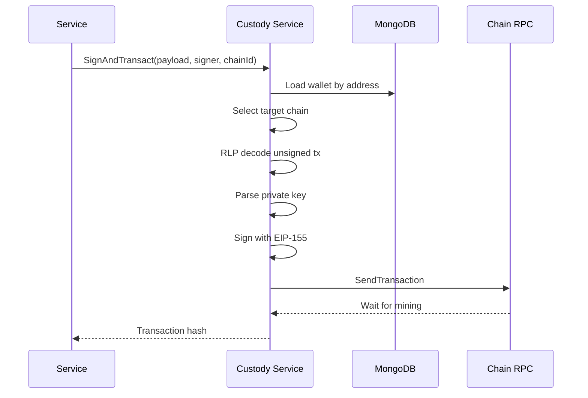
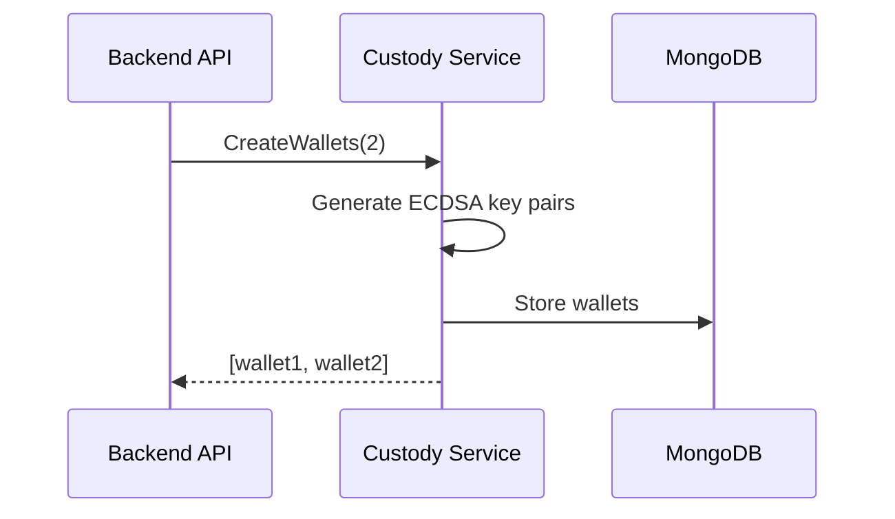

# Custody Integration

The Backend uses a custody-agnostic design that allows integration with different custody providers. The custody service handles wallet creation, transaction signing, and broadcasting.

---

## Custody Service Interface

The Backend defines a simple interface for custody operations:

```go
type CustodyService interface {
    CreateWallets(ctx context.Context, quantity int) ([]Wallet, error)
    SignAndTransact(ctx context.Context, payload []byte, signerAddress, chainID string) (string, error)
}
```

Any custody provider that implements this interface can be used with the Backend.

---

## Signing Flow



---

## Wallet Management

### Wallet Creation

During user onboarding, the custody service creates two wallets:
- One for the private chain (Privacy Node)
- One for the public chain



### Wallet Storage

Wallets are persisted in MongoDB with:

| Field | Description |
|-------|-------------|
| `id` | Unique identifier |
| `address` | Ethereum address (hex) |
| `publicKey` | Public key (hex) |
| `privateKey` | Private key (hex) |

---

## Multi-Chain Support

The custody service manages connections to both chains:

| Chain | Configuration | Purpose |
|-------|---------------|---------|
| **Private** | `PRIVATE_PL_RPC_URL`, `PRIVATE_PL_CHAIN_ID` | Privacy Node operations |
| **Public** | `PUBLIC_PL_RPC_URL`, `PUBLIC_PL_CHAIN_ID` | Public chain operations |

The `chainID` parameter in `SignAndTransact` determines which RPC endpoint receives the transaction.

---

## Transaction Signing

The signing process follows EIP-155 for replay protection:

1. **Load Wallet**: Retrieve wallet from MongoDB by signer address
2. **Decode Transaction**: RLP-decode the unsigned transaction bytes
3. **Parse Key**: Extract private key from wallet (hex to ECDSA)
4. **Sign**: Create signature with chain ID included (EIP-155)
5. **Broadcast**: Send signed transaction to appropriate chain RPC
6. **Wait**: Poll for transaction receipt
7. **Return**: Return transaction hash on success

---

## Current Implementation

The Backend includes a mock custody service for development:

**Features:**
- ECDSA key generation using go-ethereum crypto
- MongoDB wallet storage
- Dual-chain transaction routing
- Receipt waiting with timeout
- Revert reason extraction

**Limitations:**
- Keys stored in plain text (for development only)
- No HSM integration
- No multi-signature support

---

## Extending for Production

To integrate a production custody provider (e.g., Fireblocks):

### 1. Implement Interface

Create a new service implementing `CustodyService`:

```go
type FireblocksCustodyService struct {
    client *fireblocks.Client
    // ...
}

func (s *FireblocksCustodyService) CreateWallets(ctx context.Context, quantity int) ([]Wallet, error) {
    // Call Fireblocks API to create vaults
}

func (s *FireblocksCustodyService) SignAndTransact(ctx context.Context, payload []byte, signerAddress, chainID string) (string, error) {
    // Submit transaction to Fireblocks for signing
    // Wait for approval workflow
    // Broadcast and return hash
}
```

### 2. Update Initialization

Replace the custody service initialization in the application startup:

```go
// Instead of mock service
custodyService := fireblocks.NewCustodyService(config)
```

### 3. No Other Changes Needed

The interface-based design means no other code changes are required.

---

## Security Considerations

### Development (Mock Service)

- Private keys stored in MongoDB
- Suitable for testing only
- No approval workflows

### Production (Custody Provider)

- Keys managed in HSM
- Multi-signature support
- Approval workflows
- Audit logging
- Compliance controls

---

**Navigate:**

- [Back to Backend Overview](index.md)
- [Transaction Construction](transaction-construction.md) - How transactions are built
