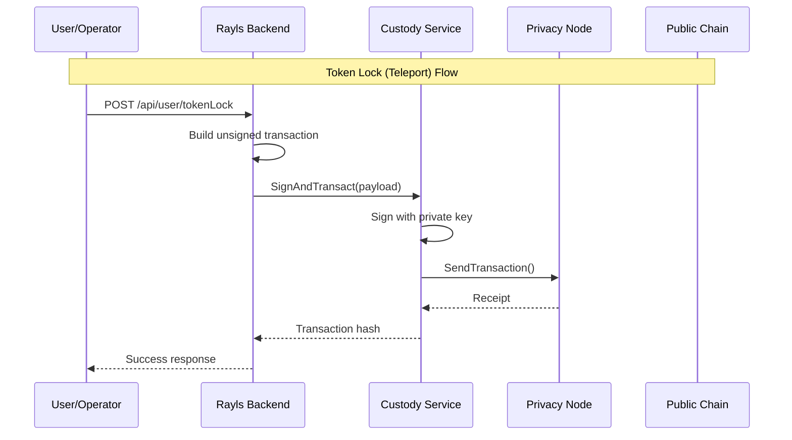

# Backend (Optional)

The Rayls Backend is an optional custody-agnostic API service that provides transaction construction for public chain operations and integrates with custody providers for institutional-grade key management.

> **Note:** This component is only required if you want to bridge assets to public blockchains using a custody provider.

---

## Purpose

The Backend service acts as an abstraction layer between users and the Rayls network:

- Constructs transactions for public chain bridging
- Integrates with custody providers (interface-based design)
- Manages user onboarding with address pair generation
- Handles token catalog and approval workflows
- Enables token teleportation (lock on private chain → bridge to public)

---

## Architecture

---

## Key Features

| Feature | Description |
|---------|-------------|
| **User Onboarding** | Generate address pairs for public/private chain operations |
| **Token Management** | Catalog tokens with approval workflows |
| **Token Teleport** | Lock tokens on private chain to bridge to public |
| **Operator Approval** | Separate operator role for approving users and tokens |
| **Custody-Agnostic** | Interface-based design for multiple custody providers |

---

## API Overview

The Backend provides separate APIs for users and operators:

### User Endpoints

| Endpoint | Purpose |
|----------|---------|
| `POST /api/user/onboarding` | Create user with address pair |
| `GET /api/user/users/address-pairs` | List user's address pairs |
| `POST /api/user/tokens` | Add token to catalog |
| `GET /api/user/tokens` | List all tokens |
| `POST /api/user/tokenLock` | Lock tokens (initiate teleport) |

### Operator Endpoints

| Endpoint | Purpose |
|----------|---------|
| `PATCH /api/operator/onboarding/status` | Approve/reject address pair |
| `PATCH /api/operator/tokens/status` | Approve/reject token |
| `GET /api/operator/tokens/pending` | List pending tokens |

---

## Contract Interactions

The Backend interacts with RN-prefixed contracts on the Privacy Node:

| Contract | Purpose |
|----------|---------|
| **RNUserGovernanceV1** | User identity and address pair management |
| **PNTokenRegistryV1** | PN-side token registry and lifecycle (`registerToken`, `submitToHub`, `submitToPublicChain`) |
| **RNEndpointV1** | Message dispatch for cross-chain operations |
| **DeploymentProxyRegistry** | Contract address discovery |

---

## When to Use

Use the Backend service when you need:

- **Public chain bridging** with custody provider integration
- **Institutional-grade key management** (Fireblocks, etc.)
- **Operator approval workflows** for users and tokens
- **Unified API** for managing cross-chain operations

If you only need private-to-private transactions within the Rayls network, the Backend is not required.

---

**Navigate:**

- [Transaction Construction](transaction-construction.md) - How transactions are built
- [Custody Integration](custody-integration.md) - Custody provider integration
