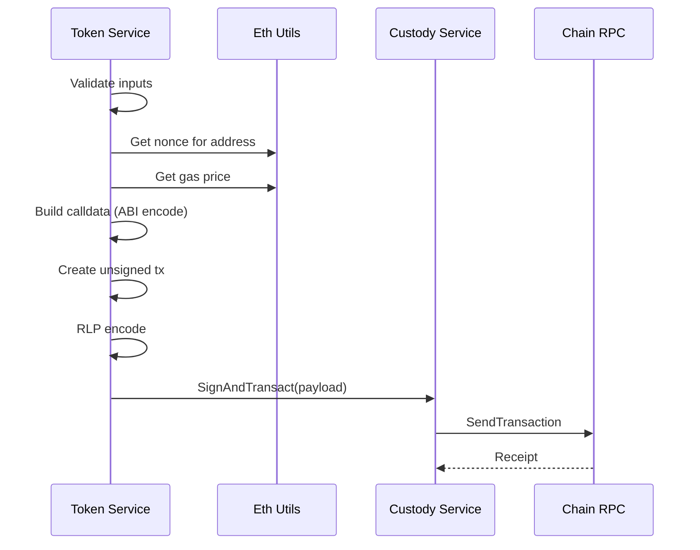

# Transaction Construction

The Backend constructs unsigned Ethereum transactions for token operations on the Privacy Node. These transactions are then signed by the custody service and broadcast to the chain.

---

## Transaction Flow



---

## Token Teleport Operations

The primary use case is the Token Lock operation, which initiates cross-chain bridging:

### Supported Token Standards

| Standard | Teleport Function | Parameters |
|----------|-------------------|------------|
| **ERC-20** | `teleportToPublicChain(to, value, chainId)` | to, amount |
| **ERC-721** | `teleportToPublicChain(to, id, chainId)` | to, tokenId |
| **ERC-1155** | `teleportToPublicChain(to, id, value, chainId, data)` | to, tokenId, amount, data |

---

## Transaction Parameters

Each transaction is constructed with:

| Parameter | Source | Value |
|-----------|--------|-------|
| **Nonce** | Chain RPC | Current account nonce |
| **Gas Price** | Chain RPC | Current gas price |
| **Gas Limit** | Fixed | 5,000,000 |
| **Value** | Fixed | 0 (no ETH sent) |
| **To** | Request | Token contract address |
| **Data** | ABI Encoded | Function calldata |

---

## Calldata Construction

Transaction data is ABI-encoded based on token standard:

### ERC-20 Example

```
Function: teleportToPublicChain(address to, uint256 value, uint256 destinationChainId)

Calldata: [function selector] + [to address] + [amount as uint256] + [chain ID as uint256]
```

### ERC-721 Example

```
Function: teleportToPublicChain(address to, uint256 id, uint256 destinationChainId)

Calldata: [function selector] + [to address] + [token ID] + [chain ID]
```

### ERC-1155 Example

```
Function: teleportToPublicChain(address to, uint256 id, uint256 value, uint256 destinationChainId, bytes data)

Calldata: [function selector] + [to address] + [token ID] + [amount] + [chain ID] + [data bytes]
```

---

## Token Lock Request

The `/api/user/tokenLock` endpoint accepts:

| Field | Type | Required | Description |
|-------|------|----------|-------------|
| `from` | address | Yes | Signer address on private chain |
| `to` | address | Yes | Destination address on public chain |
| `token` | address | Yes | Token contract address |
| `standard` | int | Yes | 0=ERC-20, 1=ERC-721, 2=ERC-1155 |
| `amount` | string | ERC-20/1155 | Token amount |
| `tokenId` | string | ERC-721/1155 | Token ID |
| `data` | hex | ERC-1155 | Optional bytes data |

---

## Processing Steps

1. **Validate Inputs**
   - Verify all required fields present
   - Validate addresses are valid hex
   - Check token standard matches parameters

2. **Verify Token**
   - Query PNTokenRegistryV1 for token
   - Ensure token is approved

3. **Build Calldata**
   - Parse amount/tokenId as big integers
   - ABI-encode function call

4. **Construct Transaction**
   - Fetch nonce from chain
   - Fetch gas price from chain
   - Create unsigned transaction
   - RLP-encode for transport

5. **Sign and Broadcast**
   - Send to custody service
   - Wait for mining
   - Return transaction hash

---

## Error Handling

If a transaction fails on-chain, the Backend:

1. Detects receipt status ≠ 1
2. Simulates transaction to extract revert reason
3. Returns human-readable error to client

Common failure reasons:
- Insufficient token balance
- Token not approved for transfer
- Invalid token ID (NFTs)
- Contract paused

---

**Navigate:**

- [Back to Backend Overview](index.md)
- [Custody Integration](custody-integration.md) - Signing and broadcasting
