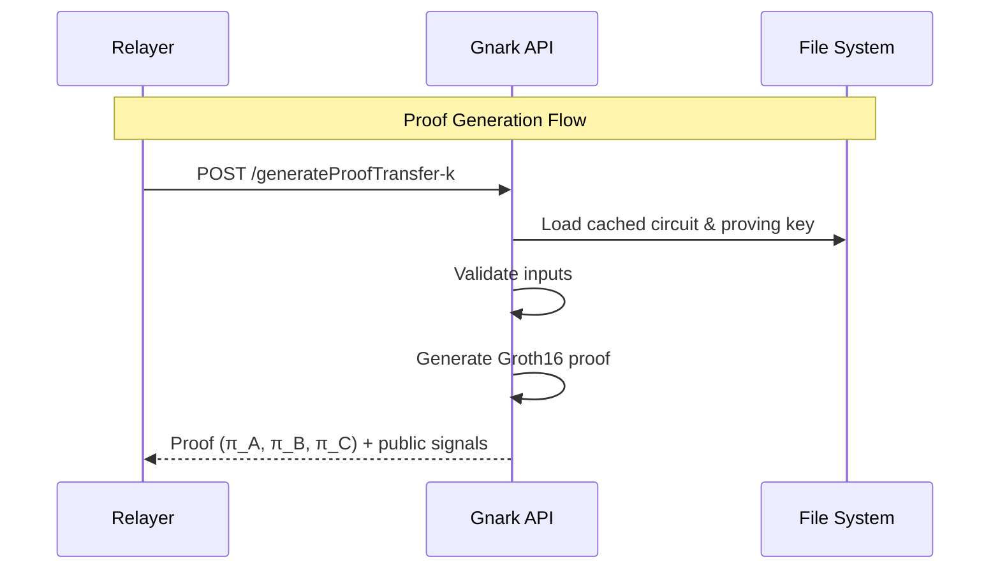
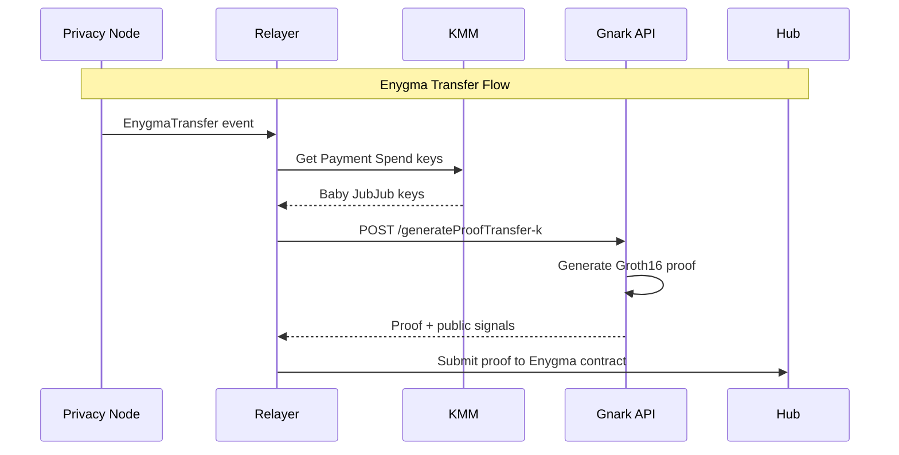

# Gnark API

The Gnark API is a Zero-Knowledge Proof proving service that generates cryptographic proofs for privacy-preserving operations in the Rayls network. It uses the Gnark framework to create Groth16 proofs over the BN254 curve.

---

## Purpose

The Gnark API enables confidential transactions by:

- Generating zero-knowledge proofs for Enygma transfers, deposits, and withdrawals
- Proving NFT ownership without revealing identity (ERC-721)
- Handling multi-token join-split operations (ERC-1155)
- Providing proof verification data for on-chain validation

---

## Architecture

---

## Key Features

| Feature | Description |
|---------|-------------|
| **6 Circuit Families** | Supports different privacy-preserving operations |
| **K-Parameterization** | Circuits scale for 2-6 participants |
| **In-Memory Caching** | Circuits loaded once, reused for subsequent proofs |
| **Groth16 Proofs** | Small proof size (~200 bytes), fast verification |

---

## Integration with Relayer

The Gnark API works with the relayer and KMM to enable end-to-end privacy:

---

## Proof System

| Property | Value |
|----------|-------|
| **Algorithm** | Groth16 (ZK-SNARK) |
| **Curve** | BN254 (also called Alt-BN128) |
| **Proof Size** | ~200 bytes (constant) |
| **Verification Time** | Milliseconds |
| **Security Level** | 128-bit |

Groth16 produces constant-size proofs regardless of circuit complexity, making it efficient for on-chain verification.

---

## Endpoints

| Endpoint | Purpose |
|----------|---------|
| `/generateProofTransfer-:k` | Private transfers (k=2-6) |
| `/generateProofDeposit-:k` | Deposits (k=2-6) |
| `/generateProofWithdraw-:k` | Withdrawals (k=2-6) |
| `/join-split-enygma` | Enygma join-split |
| `/ownership-721` | ERC-721 ownership proof |
| `/join-split-1155` | ERC-1155 join-split |
| `/healthcheck` | Server health status |

---

**Navigate:**

- [Circuits](circuits.md) - Circuit types and cryptographic details
- [Proving Keys](proving-keys.md) - Key management and Git LFS
