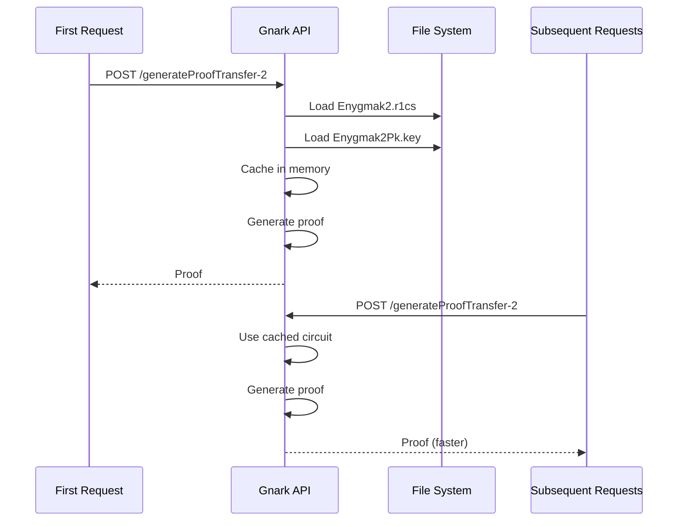

# Proving Keys

The Gnark API requires large binary files (proving keys, verifying keys, and constraint systems) to generate proofs. These files are managed using Git LFS to keep the repository size manageable.

---

## Key Types

| File Type | Extension | Size | Purpose |
|-----------|-----------|------|---------|
| **Proving Keys** | `.key` (Pk) | 7-13 MB | Generate proofs (prover-side) |
| **Verifying Keys** | `.key` (Vk) | ~1-2 KB | Verify proofs (on-chain) |
| **Constraint Systems** | `.r1cs` | Variable | Circuit definition (R1CS format) |

---

## File Organization

All cryptographic artifacts are stored in the `last_build/` directory:

```
last_build/
├── keys/                    # ~365 MB total
│   ├── Enygmak2Pk.key       # Transfer K=2 proving key
│   ├── Enygmak2Vk.key       # Transfer K=2 verifying key
│   ├── Enygmak3Pk.key ... Enygmak6Pk.key
│   ├── Withdrawk2Pk.key ... Withdrawk6Pk.key
│   ├── Depositk2Pk.key ... Depositk6Pk.key
│   ├── EnygmaJoinSplitPk.key
│   ├── EnygmaJoinSplitVk.key
│   ├── Erc721OwnershipPk.key
│   ├── Erc721OwnershipVk.key
│   ├── Erc1155JoinSplitPk.key
│   └── Erc1155JoinSplitVk.key
└── circuits/
    ├── Enygmak2.r1cs ... Enygmak6.r1cs
    ├── Withdrawk2.r1cs ... Withdrawk6.r1cs
    ├── Depositk2.r1cs ... Depositk6.r1cs
    ├── EnygmaJoinSplit.r1cs
    ├── Erc721Ownership.r1cs
    └── Erc1155JoinSplit.r1cs
```

**Total: 38 key files across 6 circuit families**

---

## Git LFS Integration

Large binary files are stored using Git Large File Storage (LFS):

**Configuration (`.gitattributes`):**
```
last_build/** filter=lfs diff=lfs merge=lfs -text
```

**Remote Storage:**
- Hosted on Azure DevOps LFS endpoint
- Files downloaded on `git clone` or `git lfs pull`

**Why LFS?**
- Proving keys are 7-13 MB each
- Total ~365 MB would bloat Git history
- LFS stores only references in Git, actual files externally

---

## Key Generation

Keys are generated using Groth16 trusted setup:

**Scripts:**
- `generate_keys_verifiers.sh` - Regenerate all proving/verifying keys
- `compile_circuits_gen_executables.sh` - Compile circuits and build server

**When to regenerate:**
- Circuit constraints change
- Adding new circuit variants
- Updating Gnark library version

**Trusted Setup:**
Groth16 requires a trusted setup ceremony. The proving and verifying keys contain "toxic waste" that must be destroyed after generation. If the setup is compromised, fake proofs could be created.

---

## Caching Strategy

The Gnark API caches circuits in memory for performance:



**Implementation:**
- Uses `sync.Once` pattern for thread-safe loading
- Each K-value cached independently
- First request loads from disk (slower)
- Subsequent requests use cached circuits (faster)

---

## Performance Considerations

### Proof Generation Time

| Factor | Impact |
|--------|--------|
| K value | Higher K = more constraints = slower |
| Circuit type | Join-split more complex than transfer |
| First vs cached | First request loads from disk |
| CPU cores | Benefits from parallelization |

### Resource Requirements

| Resource | Requirement |
|----------|-------------|
| Memory | Scales with circuit size |
| CPU | Multi-core improves performance |
| Disk | ~365 MB for all keys |
| Timeout | 10-minute request timeout |

### Optimization Techniques

- **BigInt Pool**: Reuses memory for large integers
- **Pre-allocated Slices**: Reduces garbage collection
- **GOMAXPROCS**: Scales to available CPU cores

---

## Deployment

The Gnark API is deployed as a Docker container:

| Setting | Value |
|---------|-------|
| Port | 3003 |
| User | Non-root (appuser) |
| Timeouts | 10-min read/write, 60-sec idle |
| CPU | Uses all available cores |

**Requirements:**
- Git LFS installed for key download
- Sufficient memory for circuit caching
- Fast disk for initial key loading

---

**Navigate:**

- [Back to Gnark API Overview](index.md)
- [Circuits](circuits.md) - Circuit types and cryptographic details
