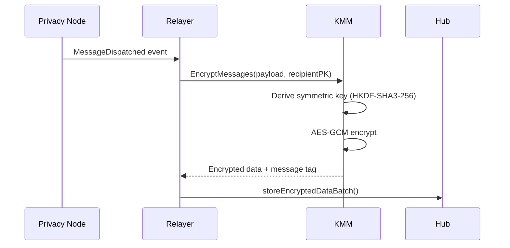
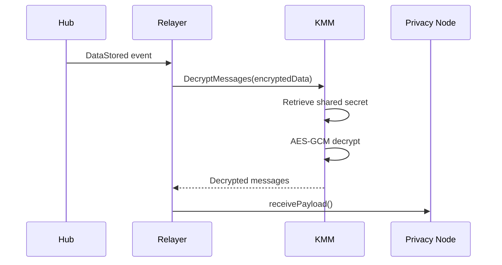

# Encryption

The KMM provides end-to-end encryption for all cross-chain messages in the Rayls network. Messages are encrypted at the source and can only be decrypted by the intended recipient.

---

## Encryption Algorithms

| Algorithm         | Purpose                                                    |
| ----------------- | ---------------------------------------------------------- |
| **ML-KEM-768**    | Post-quantum key encapsulation to establish shared secrets |
| **AES-256-GCM**   | Symmetric encryption of message payloads                   |
| **HKDF-SHA3-256** | Symmetric key derivation from shared secrets               |
| **Poseidon**      | Message tag generation for sender identification           |

---

## Encryption Flow

When a Privacy Node sends a message to another Privacy Node:



### Steps

1. **Event Detection**: Relayer detects `MessageDispatched` event on Privacy Node
2. **Key Derivation**: KMM uses the pre-established shared secret (from one-time ML-KEM key agreement) to derive a symmetric key via HKDF-SHA3-256
3. **Encryption**: Message payload encrypted with AES-256-GCM using the derived symmetric key
4. **Message Tag**: `PoseidonHash(shared_secret, blockNumber)` computed for sender identification — the receiver uses this to look up which shared secret to use for decryption
5. **Dispatch**: Encrypted data + message tag sent to Hub for storage

---

## Decryption Flow

When receiving a message from the Hub:



### Steps

1. **Event Detection**: Relayer detects `DataStored` event on Hub
2. **Secret Retrieval**: KMM retrieves the shared secret for the sender-recipient pair
3. **Key Derivation**: Derives symmetric key from shared secret via HKDF-SHA3-256
4. **Decryption**: Decrypts payload using AES-256-GCM
5. **Delivery**: Decrypted message delivered to destination Privacy Node

---

## Key Agreement

Before messages can be encrypted, participants must establish shared secrets via a **one-time ML-KEM key agreement**. This is performed once per participant pair and the shared secret is reused for all subsequent messages, avoiding the overhead of transmitting an ML-KEM ciphertext (~1088 bytes) with every message.

1. **Encapsulation**: The initiator uses the responder's public encapsulation key to produce a ciphertext and a shared secret
2. **On-Chain Storage**: The ciphertext is stored **once** on-chain in ParticipantStorage via `initiateKeyAgreement()` — the contract prevents duplicate key agreements for the same pair
3. **Decapsulation**: The responder listens for the `KeyAgreementInitiated` event, then uses their private decapsulation key to recover the shared secret from the ciphertext
4. **Caching**: Both parties cache the shared secret in their databases for all future communication
5. **Symmetric Key Derivation**: For each message, both parties derive the same symmetric key from the cached shared secret using HKDF-SHA3-256 with the context `"Rayls"`

### Sender Identification

ML-KEM provides no inherent sender identification. When a receiver gets an encrypted message, they need to know which shared secret to use. The solution is a **Poseidon message tag** included with each message:

```text
MessageTag = PoseidonHash(shared_secret, blockNumber)
```

The message tag is only ~32 bytes (vs ~1088 bytes for a full ciphertext), enabling efficient sender lookup without per-message key encapsulation.

See [Governance Decryption](../../governance/decryption.md) for the complete key agreement architecture.

---

## Encryption Types

The KMM handles different encryption scenarios:

### Standard Message Encryption

For regular cross-chain messages between Privacy Nodes:

- Single message or batch encryption
- Uses shared secrets derived from ML-KEM key agreements
- Generates message tag for each encrypted payload

### Enygma Encryption

For privacy-preserving transfers with k-anonymity:

- Batch encryption of multiple transfer commitments
- Uses Payment Spend keys (Baby JubJub) for ZK proof generation
- Supports concurrent batch processing

### ZkDVP Encryption

For zero-knowledge atomic swap operations:

- Encrypts swap commitments and proofs
- Uses specialized DVP Spend key pairs
- Enables atomic NFT-for-token swaps

### Atomic Teleport Encryption

For atomic cross-chain transactions:

- Encrypts atomic message payloads
- Includes revert data for failure scenarios
- Supports finalization signatures

---

## Security Properties

### End-to-End Encryption

- Only sender and recipient can read message contents
- Hub stores only encrypted data
- Intermediate nodes cannot decrypt

### Post-Quantum Security

- ML-KEM-768 algorithm resistant to quantum attacks (NIST standardized)
- Provides ~192-bit symmetric security
- Protects against future quantum computers

### Authenticated Encryption

- AES-256-GCM provides both confidentiality and integrity
- KMAC verification prevents tampering
- Invalid or tampered data is rejected before decryption

---

## API Security

Communication between relayer and KMM is also encrypted:

1. **API Key Authentication**: All requests require valid API key
2. **Request Encryption**: Request body encrypted with AES-GCM
3. **Response Encryption**: Response body encrypted with AES-GCM
4. **Shared Secret**: API key used to derive encryption key

---

**Navigate:**

- [Back to KMM Overview](index.md)
- [Key Management](key-management.md) - Key types and lifecycle
- [KMS Integration](kms-integration.md) - Cloud KMS configuration
