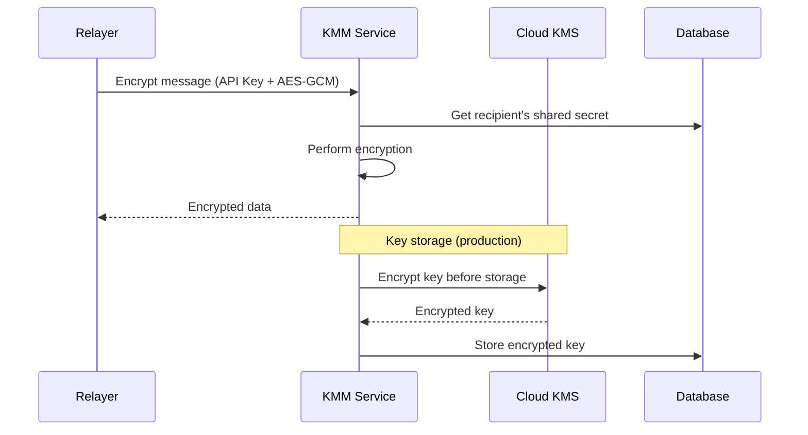
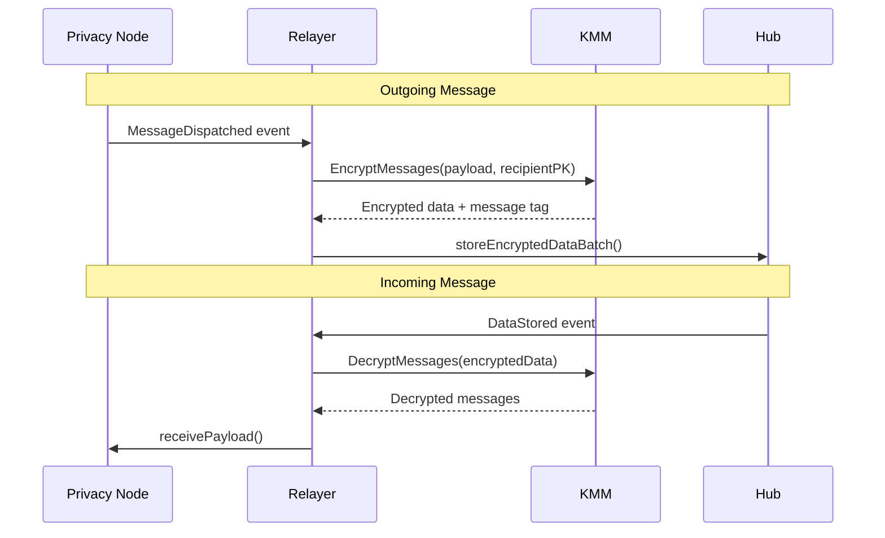

# Key Management Module (KMM)

The Key Management Module (KMM), also known as Key Operation Service (KOS), is a dedicated microservice that handles all cryptographic operations for the Rayls network. It isolates sensitive key management and encryption operations from the relayer.

---

## Purpose

The KMM provides centralized cryptographic services:

- Manages all cryptographic keys (Rayls View, Rayls Sign, Enygma, DVP Spend)
- Performs encryption and decryption of cross-chain messages
- Integrates with cloud KMS providers for production key storage
- Isolates private keys from relayer logic

---

## Architecture

---

## Key Operations

The KMM handles several types of cryptographic operations:

| Operation               | Description                                                          |
| ----------------------- | -------------------------------------------------------------------- |
| **Message Encryption**  | Encrypt cross-chain payloads using ML-KEM derived shared secrets     |
| **Message Decryption**  | Decrypt incoming messages from other Privacy Nodes                   |
| **Key Generation**      | Generate Rayls View, Rayls Sign, Enygma, and DVP Spend key pairs    |
| **Key Agreement**       | Establish shared secrets via ML-KEM encapsulation/decapsulation      |
| **Key Storage**         | Store keys encrypted via cloud KMS                                   |
| **Message Tag Generation** | Create Poseidon hash message tags for sender identification       |

---

## Security Model

The KMM provides several layers of security:

1. **Key Isolation**: Private keys never leave the KMM service
2. **API Authentication**: All requests authenticated via API key
3. **Transport Encryption**: Request/response encrypted with AES-GCM
4. **Cloud KMS Integration**: Production keys encrypted at rest via AWS/GCP KMS
5. **Post-Quantum Cryptography**: ML-KEM-768 algorithm for quantum-resistant key encapsulation

---

## Integration with Relayer

The relayer communicates with KMM for all cryptographic operations:

---

**Navigate:**

- [Key Management](key-management.md) - Key types and lifecycle
- [Encryption](encryption.md) - Encryption operations and flows
- [KMS Integration](kms-integration.md) - Cloud KMS configuration
