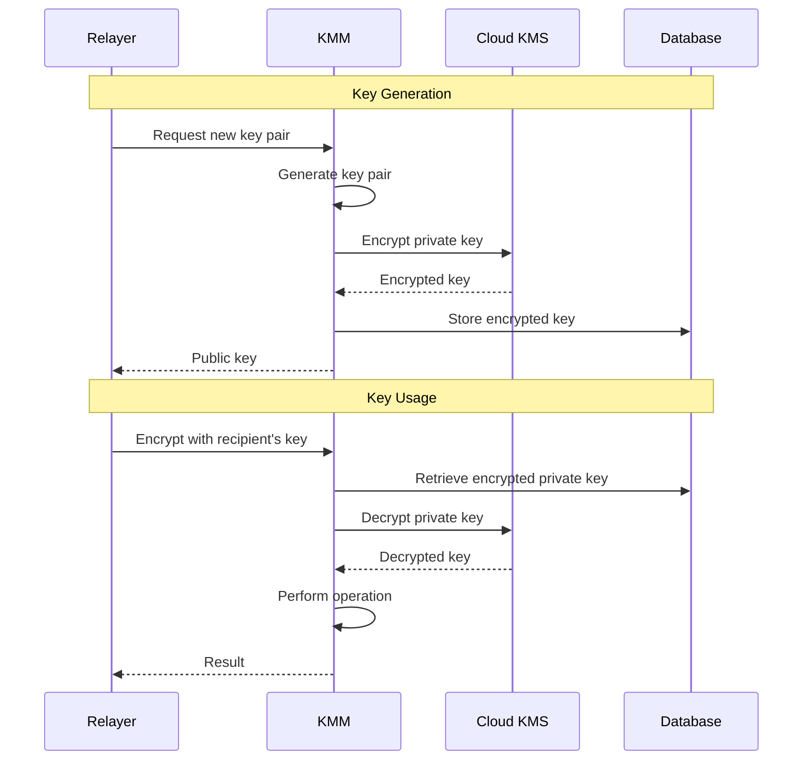

# Key Management

The KMM manages multiple types of cryptographic keys, each serving a specific purpose in the Rayls network. Keys are generated on demand and stored encrypted in the database.

---

## Key Inventory

| Type | Algorithm | Purpose |
|------|-----------|---------|
| **Rayls View Keys** | ML-KEM-768 (post-quantum) | Encrypt/decrypt cross-chain messages and generate shared secrets for sender-anonymity |
| **Rayls Sign Keys** | Secp256k1 (ECDSA) | Sign and submit on-chain transactions |
| **Payment Spend Keys** | Baby JubJub (BN254) + Poseidon hash | Compute Pedersen commitments and generate ZK proofs for Enygma transfers |
| **DVP Spend Keys** | Baby JubJub (BN254) + Poseidon hash | Compute Pedersen commitments and generate ZK proofs for ZkDVP swaps |

---

## Rayls View Keys (ML-KEM)

Rayls View Keys encrypt and decrypt all cross-chain messages and generate the shared secrets that provide sender-anonymity on the Private Network Hub.

- **Algorithm**: ML-KEM-768 (Module-Lattice-based Key Encapsulation Mechanism, NIST FIPS 203)
- **Security**: Post-quantum resistant (~192-bit symmetric security, equivalent to AES-192)
- **Key components**:
  - **Encapsulation key** (public) — registered on-chain in `ParticipantStorage`
  - **Decapsulation key** (private) — stored encrypted in the KMM database
- **Usage**: Encapsulate shared secrets used to derive AES-256-GCM symmetric keys
- **One per participant**: Each Privacy Node has a unique Rayls View key pair

### How It Works

The sender uses the recipient's public encapsulation key to encapsulate a shared secret and produce a ciphertext. The recipient uses their private decapsulation key to recover the shared secret from the ciphertext. Both parties then derive the same symmetric key via HKDF-SHA3-256 (context: `"Rayls"`) for AES-GCM encryption/decryption.

---

## Rayls Sign Keys (ECDSA)

Rayls Sign Keys sign and submit on-chain transactions to both the Privacy Node and the Private Network Hub.

- **Algorithm**: Secp256k1 (Ethereum standard ECDSA)
- **Usage**: Sign transactions for Privacy Nodes and Hub
- **Key rotation**: Multiple keys with automatic rotation
- **Nonce management**: Tracks nonces per key to prevent conflicts

---

## Payment Spend Keys

Payment Spend Keys compute Pedersen commitments and generate zero-knowledge proofs for Enygma privacy-preserving transfers.

- **Algorithm**: Baby JubJub curve over BN254, with Poseidon hash
- **Usage**: Generate ZK proofs and Pedersen commitments for Enygma transfers
- **Integration**: Works with Gnark API for proof generation

### Key Derivation

| Component | Derivation |
|-----------|------------|
| **Secret key (sk)** | Random value mod `JubJubPrimeSubGroup` (251-bit) |
| **Public key (pk)** | `Poseidon([sk, sk]) mod JubJubPrimeSubGroup` |

The secret key is a random 251-bit scalar in the Baby JubJub prime-order subgroup. The public key is derived by computing the Poseidon hash of the secret key with itself, reduced modulo the subgroup order.

---

## DVP Spend Keys

DVP Spend Keys compute Pedersen commitments and generate zero-knowledge proofs for ZkDVP (Delivery vs Payment) atomic swaps.

- **Algorithm**: Baby JubJub curve over BN254, with Poseidon hash
- **Purpose**: Enable atomic NFT-for-token and token-for-token swaps with hidden amounts
- **Components**: Buyer and seller key pairs

### Key Derivation

| Component | Derivation |
|-----------|------------|
| **Secret key (sk)** | Random value mod `JubJubPrimeGroup` (254-bit) |
| **Public key (pk)** | `Poseidon(sk) mod JubJubPrimeGroup` |

The secret key is a random 254-bit scalar in the full Baby JubJub prime group. The public key is derived by computing the Poseidon hash of the secret key, reduced modulo the group order.

> **Note**: Payment Spend Keys and DVP Spend Keys use different group orders and Poseidon invocations. Payment Spend Keys operate over the prime-order *subgroup* (251-bit) with `Poseidon([sk, sk])`, while DVP Spend Keys operate over the full prime *group* (254-bit) with `Poseidon(sk)`.

---

## Key Lifecycle

### Stages

1. **Generation**: Keys created on demand when first needed
2. **Encryption**: Private keys encrypted via cloud KMS before storage
3. **Storage**: Encrypted keys stored in MongoDB
4. **Retrieval**: Keys decrypted on-demand for operations
5. **Usage**: Keys used for signing/encryption, then cleared from memory

---

## Relayer Key Sets

Different relayer types require different key configurations:

### Private Relayer Keys

For communication between Privacy Nodes via the Hub:

| Key Type | Chain | Purpose |
|----------|-------|---------|
| Rayls View | Hub | Encrypt messages to Hub |
| Rayls View | Privacy Node | Encrypt messages to Privacy Node |
| Rayls Sign | Hub | Sign Hub transactions |
| Rayls Sign | Privacy Node | Sign Privacy Node transactions |

### Public Relayer Keys

For bridging between Privacy Nodes and public chains:

| Key Type | Chain | Purpose |
|----------|-------|---------|
| Rayls Sign | Public Chain | Sign public chain transactions |
| Rayls Sign | Privacy Node | Sign Privacy Node transactions |

### Atomic Service Keys

For atomic transaction finalization:

| Key Type | Chain | Purpose |
|----------|-------|---------|
| Rayls Sign | Hub | Sign finalization transactions |
| Rayls Sign | Privacy Node | Sign atomic execution transactions |

---

## Key Rotation

Rayls View Keys and Rayls Sign Keys support rotation for improved security:

- Multiple keys available per chain
- Automatic rotation based on usage count
- Nonce tracking per key prevents conflicts
- Old keys remain valid for pending transactions
- Rayls View Key rotation can be requested via the `requestNewRaylsViewKeys` endpoint function

---

**Navigate:**

- [Back to KMM Overview](index.md)
- [Encryption](encryption.md) - Encryption operations
- [KMS Integration](kms-integration.md) - Cloud KMS configuration
