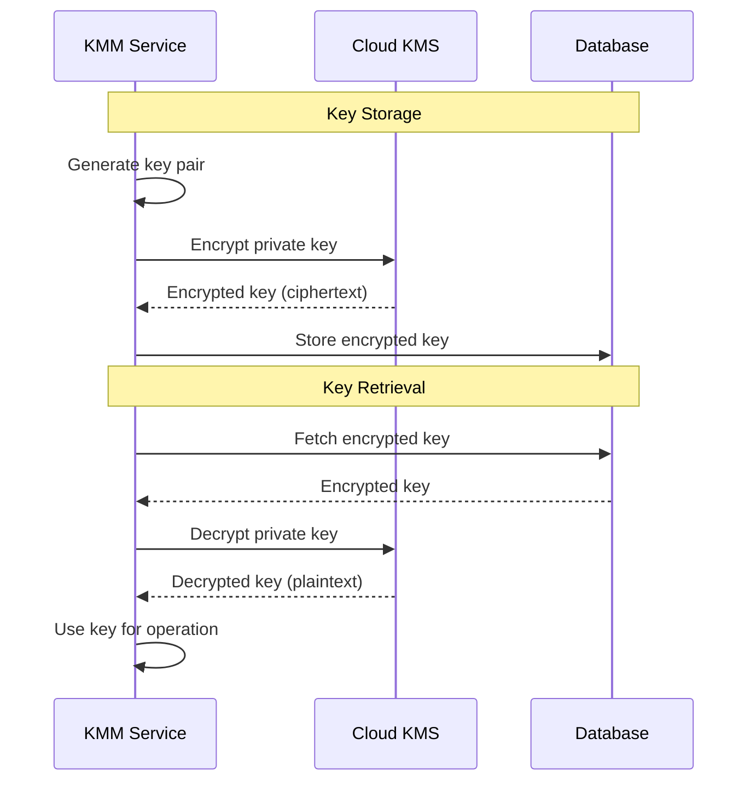

# KMS Integration

The KMM integrates with cloud Key Management Services (KMS) to protect cryptographic keys at rest. In production deployments, all private keys are encrypted using a cloud KMS before storage.

---

## Supported Providers

| Provider | Use Case |
|----------|----------|
| **AWS KMS** | Production deployments on AWS |
| **GCP KMS** | Production deployments on Google Cloud |
| **Plaintext** | Development and testing only |

---

## How It Works

### Encryption Flow

1. **Key Generation**: KMM generates a new key pair
2. **KMS Encryption**: Private key sent to cloud KMS for encryption
3. **Storage**: Only the encrypted (ciphertext) version stored in MongoDB
4. **Retrieval**: When needed, encrypted key fetched from database
5. **KMS Decryption**: Cloud KMS decrypts the key for use
6. **Memory Clearing**: Decrypted key cleared from memory after use

---

## AWS KMS

### Configuration

| Variable | Description |
|----------|-------------|
| `KMS_ENCRYPTORSERVICE` | Set to `aws` |
| `KMS_AWSPROFILE` | AWS credentials profile name |
| `KMS_AWSALIAS` | KMS key alias (e.g., `alias/rayls-kms`) |

### Setup Requirements

1. Create a KMS key in AWS Console or via CLI
2. Create an alias for the key
3. Configure IAM permissions for encrypt/decrypt operations
4. Set the AWS profile with appropriate credentials

### IAM Permissions Required

The KMM service requires these KMS permissions:

- `kms:Encrypt` - Encrypt private keys before storage
- `kms:Decrypt` - Decrypt private keys for operations
- `kms:DescribeKey` - Verify key exists and is enabled

---

## GCP KMS

### Configuration

| Variable | Description |
|----------|-------------|
| `KMS_ENCRYPTORSERVICE` | Set to `gcp` |
| `KMS_GCPPROJECT` | GCP project ID |
| `KMS_GCPLOCATION` | KMS location (e.g., `us-central1`) |
| `KMS_GCPKEYRING` | Key ring name |
| `KMS_GCPCRYPTOKEY` | Crypto key name |

### Setup Requirements

1. Create a key ring in Cloud KMS
2. Create a crypto key within the key ring
3. Configure service account with appropriate permissions
4. Set up application default credentials

### IAM Permissions Required

The KMM service account requires:

- `cloudkms.cryptoKeys.encrypt` - Encrypt private keys
- `cloudkms.cryptoKeys.decrypt` - Decrypt private keys
- `cloudkms.cryptoKeys.get` - Verify key configuration

---

## Plaintext Mode

For development and testing environments only:

| Variable | Value |
|----------|-------|
| `KMS_ENCRYPTORSERVICE` | `plaintext` |

In plaintext mode:
- Keys stored unencrypted in database
- No cloud KMS calls made
- Suitable for local development only
- **Never use in production**

---

## Key Rotation

Cloud KMS providers support automatic key rotation:

### AWS KMS

- Enable automatic rotation in key settings
- New key material generated annually
- Old key material preserved for decryption
- No application changes required

### GCP KMS

- Configure rotation period on crypto key
- Primary version used for new encryptions
- Old versions available for decryption
- Supports manual rotation triggers

---

## Security Considerations

### Production Requirements

- Always use AWS or GCP KMS in production
- Restrict KMS key access to KMM service only
- Enable CloudTrail/Audit Logs for KMS operations
- Use separate KMS keys per environment

### Network Security

- KMM should run in private subnet
- KMS endpoint access via VPC endpoint (AWS) or Private Google Access (GCP)
- No public internet access required for KMS operations

### Audit Trail

Cloud KMS provides audit logging:

- All encrypt/decrypt operations logged
- IAM authentication recorded
- Useful for compliance and forensics

---

**Navigate:**

- [Back to KMM Overview](index.md)
- [Key Management](key-management.md) - Key types and lifecycle
- [Encryption](encryption.md) - Encryption operations
