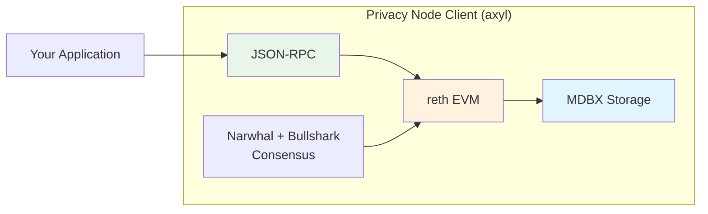

# Blockchain Client

This page describes the **axyl** blockchain client that powers Rayls Privacy Nodes.

---

## Overview

Rayls Privacy Nodes run **axyl** — a Rust client (binary `rayls`, crate `rayls-network`) whose execution layer is built on **reth**. It is fully EVM-compatible while extending limits for enterprise use cases. axyl replaces the earlier Geth (Go Ethereum) fork.

---

## axyl Client Details

axyl is a Rust binary with a reth-based execution layer. It is EVM-compatible but raises several limits for Rayls:

| Property | Standard EVM | Rayls Privacy Node (axyl) |
|----------|---------------|----------------------|
| **Implementation** | Various (Geth/reth/etc.) | Rust (`rayls`, reth-based EVM) |
| **Contract Size Limit** | 24 KB (EIP-170) | 1 MB |
| **Init Code Size Limit** | 48 KB (EIP-3860) | 2 MB |
| **Consensus** | PoW / PoS | Narwhal + Bullshark multi-validator BFT |
| **Storage** | LevelDB / Pebble | MDBX (execution + consensus DBs) |

---

## Why 1 MB Contracts?

Standard Ethereum limits contract bytecode to 24 KB (EIP-170) and init code to 48 KB (EIP-3860). axyl raises these to 1 MB (contract) and 2 MB (init code) to support:

| Use Case | Why More Space Needed |
|----------|----------------------|
| **Complex DeFi Logic** | Multi-step financial operations in single contracts |
| **Cross-Chain Handlers** | Extensive routing and validation logic |
| **ZK Proof Verification** | Verification circuits require substantial bytecode |
| **Rich Token Logic** | Compliance, access control, and business rules |

This eliminates the need for:

- Splitting logic across multiple contracts
- Proxy patterns purely for size reasons
- External library dependencies

---

## EVM Compatibility

Privacy Nodes maintain full compatibility with standard Ethereum:

### Supported Features

| Feature | Status |
|---------|--------|
| All EVM opcodes | Supported |
| Standard gas costs | Maintained |
| Solidity compiler | Compatible |
| EIPs through London | Supported |

### Ethereum Improvement Proposals

The following EIPs are enabled:

| EIP | Name | Status |
|-----|------|--------|
| EIP-155 | Replay Protection | Enabled |
| EIP-158 | State Clearing | Enabled |
| EIP-1559 | Fee Market (London) | Enabled |
| EIP-2929 | Gas Cost Increases (Berlin) | Enabled |
| Istanbul | Bundle | Enabled |
| Berlin | Bundle | Enabled |
| London | Bundle | Enabled |

!!! note "EIP-1559 activation"
    The block at which EIP-1559 activates is set by the network profile (`--network`): block `0` for `local` and `mainnet`, block `50` for `devnet`, and block `281800` for `testnet`. See [Configuration](configuration.md).

---

## JSON-RPC Interface

Privacy Nodes expose the standard Ethereum JSON-RPC API plus Rayls-specific namespaces:

### Standard Modules

| Module | Purpose |
|--------|---------|
| `eth` | Ethereum protocol (transactions, blocks, state) |
| `net` | Network information |
| `web3` | Web3 utilities |

### Extended Modules

| Module | Purpose |
|--------|---------|
| `rayls` | Rayls-specific RPC namespace |
| `debug` | Debugging and tracing |
| `trace` | Detailed transaction tracing |
| `faucet` | Optional faucet endpoint (test networks) |

!!! note
    The `admin` RPC module is unsupported on axyl and is filtered out if requested.

### Connection Options

| Protocol | Default Port | Use Case |
|----------|--------------|----------|
| HTTP | 8545 | Standard RPC |
| WebSocket | 8546 | Event subscriptions |
| IPC | `rayls.ipc` | Local connections |

---

## Storage: MDBX

axyl stores all on-disk state in **MDBX** — a fast, memory-mapped embedded key-value store. There is no external database and no MongoDB. A node keeps **two** MDBX databases under its data directory:

| Database | Location | Contents |
|----------|----------|----------|
| **Execution DB** | `<datadir>/db/` | reth execution-layer state: headers, blocks, receipts, account/storage tries, contract code |
| **Consensus DB** | `<datadir>/consensus-db/` | Narwhal/Bullshark consensus state: certificates, the DAG, epoch records, batches |

### Data Directory Layout

A provisioned node's data directory contains:

| Path | Purpose |
|------|---------|
| `node-keys/` | Encrypted BLS keys + deterministic Ed25519 network keys |
| `node-info.yaml` | This node's identity / metadata |
| `parameters.yaml` | Operational parameters (header timing, min base fee, gas limit, network profile) |
| `genesis/genesis.yaml` | Genesis block definition |
| `genesis/committee.yaml` | Initial committee definition |
| `db/` | Execution-layer MDBX database |
| `consensus-db/` | Consensus MDBX database |
| `static_files/` | reth static files (immutable historical data) |
| `blobstore/` | Transaction blob store |

### Tuning the Consensus Database

The consensus MDBX database can be tuned with these flags:

| Parameter | CLI Flag | Description |
|-----------|----------|-------------|
| Max size | `--consensus-db.max-size` | Maximum database size (e.g. `4TB`, `8MB`) |
| Growth step | `--consensus-db.growth-step` | Incremental growth step (e.g. `4GB`, `4KB`) |
| Read txn timeout | `--consensus-db.read-transaction-timeout` | Read-transaction timeout in seconds (`0` = none) |
| Max readers | `--consensus-db.max-readers` | Max concurrent readers |

---

## Development Tools

Privacy Nodes work with all standard Ethereum development tools — axyl is EVM-compatible, so existing tooling and libraries work unchanged:

### Smart Contract Development

| Tool | Support |
|------|---------|
| Hardhat | Full |
| Foundry | Full |
| Truffle | Full |
| Remix IDE | Full |

### Client Libraries

| Library | Support |
|---------|---------|
| ethers.js | Full |
| web3.js | Full |
| viem | Full |
| Go ethereum client | Full |

### Wallets

| Wallet | Support |
|--------|---------|
| MetaMask | Full |
| WalletConnect | Full |
| Hardware wallets | Full |

---

## Summary

| Aspect | Details |
|--------|---------|
| **Client** | axyl (`rayls` binary, Rust) |
| **Execution** | reth-based EVM |
| **Contract Limit** | 1 MB (vs 24 KB standard), init code 2 MB |
| **EVM** | Full Ethereum compatibility |
| **RPC** | `eth_*` + `rayls_*` (+ optional faucet) |
| **Consensus** | Narwhal + Bullshark multi-validator BFT |
| **Storage** | MDBX (execution `db/` + `consensus-db/`) |

---

**Next:** [Consensus](consensus.md) — Narwhal + Bullshark multi-validator BFT explained
