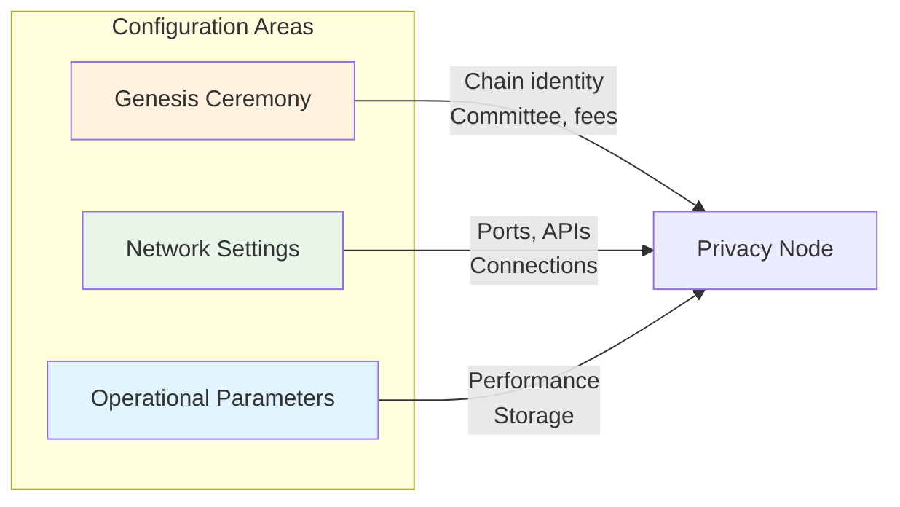

# Configuration

This page covers the key configuration parameters for deploying and operating a Rayls Privacy Node running **axyl** (the `rayls` binary).

---

## Overview

Privacy Node configuration involves three main areas:



The two top-level commands are:

| Command | Purpose |
|---------|---------|
| `rayls genesis` | Run the genesis ceremony — produces `genesis.yaml`, `committee.yaml`, and `parameters.yaml` |
| `rayls node` | Start the node against a provisioned data directory |

Keys are generated beforehand with `rayls keytool generate {validator,observer}`.

---

## Genesis Configuration

The genesis ceremony (`rayls genesis`) defines the chain's initial state, fee model, and the on-chain `ConsensusRegistry`. Output is written into the data directory as `genesis/genesis.yaml`, `genesis/committee.yaml`, and `parameters.yaml`.

### Essential Parameters

| Parameter | CLI Flag | Description | Default |
|-----------|----------|-------------|---------|
| Chain ID | `--chain-id` | Numeric chain id (accepts hex) | `2017` (`0x7e1`) |
| Gas limit | `--gas-limit` | Block gas limit (gas units) | network default |
| Epoch duration | `--epoch-duration-in-secs` | Length of each epoch, in seconds | `86400` (24h) |
| Initial stake | `--initial-stake-per-validator` | Stake credited to each validator in genesis | `5_000_000` RLS |
| Min withdraw | `--min-withdraw-amount` | Minimum a validator can withdraw | `1_000` RLS |

### Fee Model (base fee / gasless)

| Parameter | CLI Flag | Stored In | Description |
|-----------|----------|-----------|-------------|
| Base fee | `--base-fee` | `genesis.yaml` (`baseFeePerGas`) | Starting base fee for the genesis block (wei) |
| Min base fee | `--min-base-fee` | `parameters.yaml` | Floor the EIP-1559 base fee can never drop below (wei) |

Both default to **48 Gwei**. For a **gasless network**, set *both* to `0`:

```bash
rayls genesis \
  --chain-id 0x1e7 \
  --base-fee 0 \
  --min-base-fee 0
```

!!! note "Both flags are required for gasless"
    EIP-1559's base-fee delta is proportional to the parent base fee, so a base fee of `0` stays at `0`. The `--min-base-fee 0` floor is what keeps the clamped result at zero. Setting only one of the two is **not** sufficient.

### Governance / Admin Addresses

| Parameter | CLI Flag | Default |
|-----------|----------|---------|
| Consensus registry owner | `--consensus-registry-owner` | Governance Safe |
| Base-fee recipient | `--basefee-address` | FeeAggregator |
| FeeAggregator admin | `--fee-aggregator-admin` | Governance Safe |
| Network admin (precompiles) | `--network-admin` | Governance Safe |

### Pre-Funding Accounts

| Flag | Purpose |
|------|---------|
| `--accounts <YAML_FILE>` | Merge a YAML map of `address → GenesisAccount` into genesis (dev/test nets) |
| `--rls-accounts <YAML_FILE>` | Pre-fund addresses with an RLS ERC-20 balance |
| `--dev-funded-account <STRING>` | Deterministically derive and fund a dev account from a text string (dev only) |

### Header Timing (advanced)

| Flag | Purpose |
|------|---------|
| `--max-header-delay-ms` | Max delay before a primary produces a new header |
| `--min-header-delay-ms` | Min delay before a primary produces a new header |

---

## Network Configuration

### Selecting a Network Profile

The `--network` flag (or the `RAYLS_NETWORK` env var) selects the baked-in hardfork profile. It also sets the EIP-1559 activation block:

| Profile | EIP-1559 Activation Block |
|---------|---------------------------|
| `local` | 0 |
| `devnet` | 50 |
| `testnet` | 281800 |
| `mainnet` | 0 |

Named public networks can be joined directly with `--chain {testnet,mainnet}`.

### HTTP / RPC Ports

| Service | Default Port | CLI Flag | Description |
|---------|--------------|----------|-------------|
| HTTP RPC | 8545 | `--http.port` | JSON-RPC over HTTP (enable with `--http`) |
| WebSocket | 8546 | `--ws.port` | JSON-RPC over WebSocket (enable with `--ws`) |
| IPC | `rayls.ipc` | `--ipcpath` | Local IPC socket (disable with `--ipcdisable`) |

### HTTP Binding

| Parameter | CLI Flag | Default | Description |
|-----------|----------|---------|-------------|
| Enable HTTP | `--http` | off | Enable the HTTP-RPC server |
| HTTP address | `--http.addr` | `127.0.0.1` | HTTP bind address |
| HTTP port | `--http.port` | 8545 | HTTP port |
| HTTP modules | `--http.api` | — | RPC modules to expose |
| HTTP CORS | `--http.corsdomain` | none | Allowed CORS origins |

### Running Multiple Nodes on One Host

| Flag | Purpose |
|------|---------|
| `--instance <N>` | Offset all ports to avoid conflicts (max 200 instances) |
| `--with-unused-ports` | Let the OS pick random unused ports (mutually exclusive with `--instance`) |

---

## RPC API Configuration

### Available Modules

axyl exposes the standard Ethereum namespaces plus the Rayls namespace. The `admin` module is **not** supported and is filtered out if requested.

| Module | Purpose | Notes |
|--------|---------|-------|
| `eth` | Ethereum protocol | Standard |
| `net` | Network information | Standard |
| `web3` | Web3 utilities | Standard |
| `rayls` | Rayls-specific RPC | Rayls extension |
| `debug` | Debugging / tracing | Development |
| `trace` | Detailed tracing | Development |
| `faucet` | Faucet endpoint | Test networks only |

Modules are selected via `--http.api` (and `--ws.api` for WebSocket).

---

## Storage Configuration

axyl stores state in **MDBX** — two databases under the data directory: the reth execution DB (`<datadir>/db/`) and the consensus DB (`<datadir>/consensus-db/`). There is no external/MongoDB backend.

### Data Directory

| Flag | Purpose |
|------|---------|
| `--datadir <DATA_DIR>` | Root directory for all node files and subdirectories |

If omitted, an OS-specific default is used (e.g. `$HOME/Library/Application Support/rayls-network/` on macOS, `$HOME/.local/share/rayls-network/` on Linux).

### Tuning the Consensus Database

| Flag | Description |
|------|-------------|
| `--consensus-db.max-size` | Maximum database size (e.g. `4TB`, `8MB`) |
| `--consensus-db.growth-step` | Incremental growth step (e.g. `4GB`, `4KB`) |
| `--consensus-db.read-transaction-timeout` | Read-transaction timeout in seconds (`0` = none) |
| `--consensus-db.max-readers` | Max concurrent readers |

---

## Transaction Pool & Gas Price Oracle

axyl uses reth's transaction pool and gas-price oracle, configured with `--txpool.*` and `--gpo.*` flags.

| Flag | Purpose |
|------|---------|
| `--txpool.minimal-protocol-fee` | Minimum protocol fee accepted by the pool. Set to `0` on a gasless network so zero-fee transactions are accepted (reth's default requires `max_fee_per_gas >= 7 wei`). |

!!! note "Gasless operators"
    On a gasless network, start validators with `--txpool.minimal-protocol-fee 0`. Without it, clients that send `gasPrice: 0` may be rejected even though the actual cost is still zero.

---

## Consensus Metrics

| Flag | Purpose |
|------|---------|
| `--metrics <SOCKET>` | Serve Prometheus **consensus** metrics on the given interface/port |
| `--reth-metrics <SOCKET>` | Serve Prometheus **reth execution-layer** metrics |
| `--healthcheck <PORT>` | Spawn a TCP health-check endpoint (for load balancers / monitoring) |

---

## Key Management

Keys are generated with `rayls keytool generate {validator,observer}`, which writes encrypted BLS keys plus deterministic Ed25519 network keys under `<datadir>/node-keys/` along with `node-info.yaml`.

### BLS Passphrase

The BLS key passphrase is supplied at startup via `--bls-passphrase-source`:

| Source | Behavior |
|--------|----------|
| `env` | Read from the `RL_BLS_PASSPHRASE` env var (default) |
| `stdin` | Read the first line of stdin |
| `ask` | Prompt interactively (foreground TTY only) |

!!! warning
    BLS private keys never leave the node process in plaintext — they are AES-GCM-SIV encrypted on disk and the signer returns signatures without exposing the secret. Manage `RL_BLS_PASSPHRASE` carefully on validators.

### Validator On-Chain Registration

A validator joins the committee through the `ConsensusRegistry` contract: allowlist → stake → activate. See [Consensus](consensus.md#joining-the-committee) for the full sequence.

---

## Deployment Checklist

Before starting your Privacy Node:

### Genesis Setup
- [ ] Chain ID is unique (not conflicting with public networks)
- [ ] Fee model decided (`--base-fee` / `--min-base-fee`, or both `0` for gasless)
- [ ] Gas limit appropriate for your contracts
- [ ] Governance/admin addresses set for production (not defaults)
- [ ] Pre-funded accounts configured (if needed)

### Network Setup
- [ ] `--network` profile selected (or `--chain` for a named net)
- [ ] HTTP/WS enabled and ports configured
- [ ] HTTP CORS settings appropriate
- [ ] RPC modules selected via `--http.api`

### Storage Setup
- [ ] `--datadir` prepared
- [ ] Consensus DB sizing reviewed (`--consensus-db.max-size`)
- [ ] Sufficient disk space available

### Security Setup
- [ ] BLS keys generated (`keytool generate`)
- [ ] `--bls-passphrase-source` chosen; `RL_BLS_PASSPHRASE` secured
- [ ] Validator registered on-chain (`ConsensusRegistry`)
- [ ] `admin` RPC not relied upon (unsupported)

### Operational
- [ ] Logging configured
- [ ] Metrics enabled (`--metrics` / `--reth-metrics`)
- [ ] Health check enabled (`--healthcheck`)
- [ ] Backup strategy defined

---

## Quick Reference

### Genesis Ceremony (gasless dev net)

```bash
rayls genesis \
  --chain-id 0x7e1 \
  --base-fee 0 \
  --min-base-fee 0
```

### Starting a Node

```bash
rayls node \
  --datadir /path/to/datadir \
  --network local \
  --http --http.port 8545 \
  --metrics 127.0.0.1:9090 \
  --txpool.minimal-protocol-fee 0
```

(`--observer` starts a non-validating observer node.)

---

## Summary

| Category | Key Parameters |
|----------|----------------|
| **Genesis** | `--chain-id`, `--gas-limit`, `--epoch-duration-in-secs`, `--base-fee`, `--min-base-fee` |
| **Network** | `--network` / `--chain`, `--http`, `--http.port` (8545), `--http.api` |
| **Storage** | `--datadir`, `--consensus-db.max-size`, MDBX (`db/` + `consensus-db/`) |
| **Tx pool** | `--txpool.minimal-protocol-fee` (gasless), `--gpo.*` |
| **Observability** | `--metrics`, `--reth-metrics`, `--healthcheck` |
| **Keys** | `--bls-passphrase-source`, `RL_BLS_PASSPHRASE` |

---

**Back to:** [Rayls Privacy Nodes Overview](index.md)
