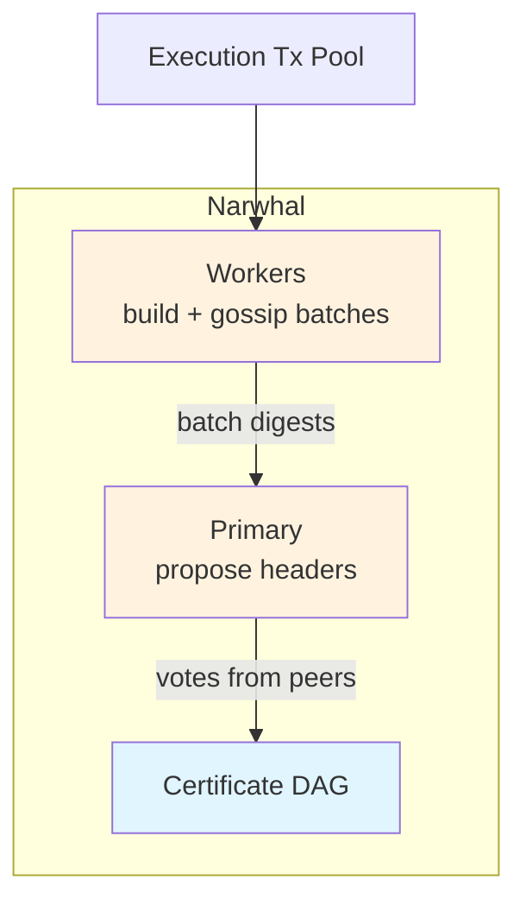
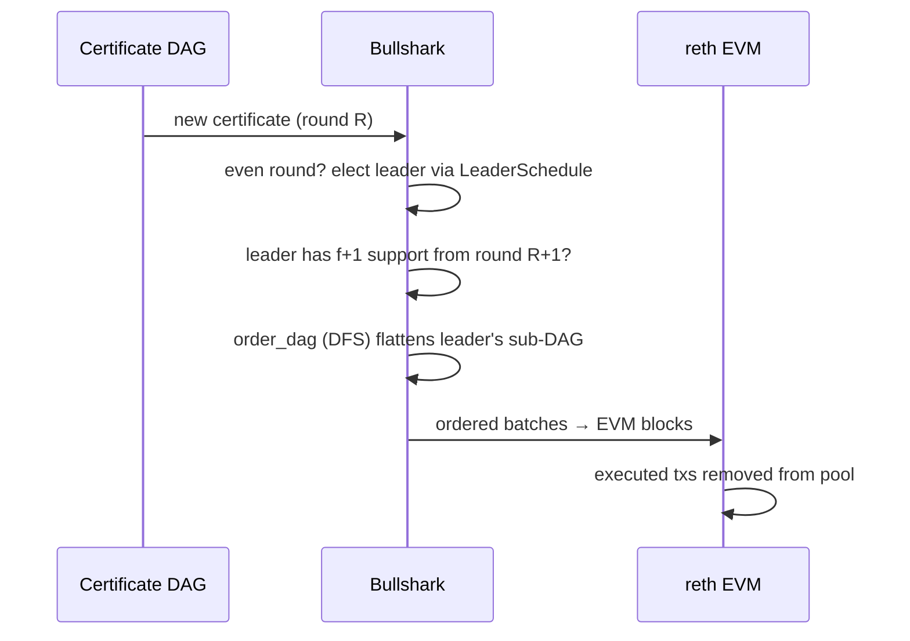

# Consensus

This page explains the **Narwhal + Bullshark** multi-validator BFT consensus used by Rayls Privacy Nodes running axyl.

---

## Overview

Rayls Privacy Nodes use **Narwhal + Bullshark** — a DAG-based Byzantine-fault-tolerant (BFT) consensus. The two protocols split the problem cleanly:

- **Narwhal** provides *data availability*: it disseminates transaction batches to every validator and builds an authenticated DAG of certificates that proves the data was received.
- **Bullshark** provides *ordering*: it takes Narwhal's DAG and chooses a single, linear sequence of certificates to commit, which then drives execution.

A committee of validators runs the protocol together, so the chain tolerates Byzantine (malicious or failed) participants up to the BFT threshold. Committed batches are executed into EVM blocks by the reth execution layer.

---

## The Committee

Consensus is run by a **committee** of validators (4 by default). Membership is governed on-chain by the **`ConsensusRegistry`** contract.

### Joining the Committee

A validator joins through an on-chain sequence:

| Step | Action |
|------|--------|
| **Fund** | Fund the validator's operator address |
| **Allowlist** | `ConsensusRegistry.allowlistValidator(address)` (admin / `MAINTAINER` role) |
| **Stake** | `ConsensusRegistry.stake(...)` (operator key) |
| **Activate** | `ConsensusRegistry.activate()` (operator key) |

Activation places the validator in `PendingActivation`; the next `concludeEpoch()` system call promotes it to `Active`, after which it is part of the committee schedule.

### Byzantine Fault Tolerance

With a committee of `n` validators tolerating `f` faults, Bullshark commits a leader once it has gathered **f+1** support from the following round. This is what gives the network its Byzantine fault tolerance — no single validator can force or block a commit.

!!! note "Single-validator (dev only)"
    A 1-of-1 committee has no Byzantine fault tolerance and is refused unless the binary is built and started explicitly for local development. Production networks run multi-validator committees.

---

## Narwhal: Data Availability + DAG

Narwhal's job is to get transaction data to all validators quickly and to prove it was received.



### Workers

Each validator runs one or more **workers**. A worker:

1. Watches the execution-layer transaction pool for pending transactions.
2. Selects the "best" pending transactions and packages them into a **batch** (without executing them), recording per-sender nonce ranges and sealing the batch.
3. Broadcasts the sealed batch to peer workers over the consensus network.
4. Peers validate that the batch is well-formed, matches its digest, and respects size/gas limits, then acknowledge it. Once a quorum of acknowledgements is collected, the batch is accepted and ready to be referenced by the primary.

This is the **data-availability** layer: by the time a batch is referenced, every validator can already obtain its contents.

### Primaries and Certificates

Each validator also runs a **primary**. The primary:

1. Collects batch digests from its workers plus enough parent certificates from the previous round, and bundles them into a **header proposal**.
2. Broadcasts the header to the other primaries.
3. Collects **votes** on the header. Once enough votes accumulate, the header becomes a **certificate** — a committed step in the consensus DAG.

The certificate graph (the **DAG**) grows round by round, with each certificate referencing parent certificates from previous rounds. This captures the partial order of data availability. A **certificate fetcher** retrieves any missing ancestor certificates from peers, and **state sync** keeps slow or recovering nodes up to date by fetching missing headers and batches.

---

## Bullshark: Ordering + Commits

Bullshark turns Narwhal's DAG into a single linear order of commits.



The commit path works as follows:

1. **Process certificate** — each new certificate is inserted into the in-memory DAG. On even (leader-election) rounds, Bullshark checks whether a commit is possible.
2. **Commit leader** — the elected leader for the round is looked up via the **leader schedule**. If that leader certificate has **f+1** support from the next round, it is committed, and Bullshark collects any earlier, not-yet-committed leaders ("unchained" leaders) behind it.
3. **Order the sub-DAG** — for each committed leader, `order_dag` performs a depth-first (DFS) traversal that flattens the leader's sub-DAG into a linear sequence of certificates (a `CommittedSubDag`). This is the execution order.
4. **Leader rotation** — after each commit, the leader table may rotate based on accumulated **reputation** scores, so well-performing validators are favored as future leaders.

The committed, ordered batches are then handed to the execution layer.

---

## From Commit to EVM Block

Consensus produces an ordered stream of batches; execution turns them into blocks:

- Each committed `ConsensusOutput` is forwarded to the middleware processor.
- The processor builds an EVM block from each batch via the reth execution layer (`build_block_from_batch_payload`).
- Transactions that made it into an executed batch are removed from the transaction pool. Any transaction that was not sealed into a quorum-accepted batch stays in the pool to be retried in a future batch.
- On epoch-closing blocks, the execution layer also runs the `applyIncentives` / `concludeEpoch` / `distributeRewards` system calls.

---

## Node Modes

An axyl node is always in one of three modes, declared by the orchestrator:

| Mode | Description |
|------|-------------|
| **CvvActive** | Committee-voting validator actively participating — running its primary and workers, proposing and voting. |
| **CvvInactive** | Allowlisted validator that is catching up (or temporarily out of consensus). Runs the **state-sync subscriber** to fetch and replay missing consensus blocks/batches until its tip matches the network, then promotes to `CvvActive`. |
| **Observer** | A non-validating node. It streams committed consensus output from a peer and serves RPC, but never joins the committee on-chain. |

A node that has just joined, or that has fallen behind after a crash, starts in `CvvInactive` and catches up before promoting itself to `CvvActive`.

---

## Epochs and Committee Rotation

The committee rotates per **epoch**. At each epoch boundary the orchestrator:

1. Drains the current primary and worker tasks.
2. Reads the new committee from the `ConsensusRegistry`.
3. Spawns fresh primary / worker instances bound to the new committee.
4. Updates per-epoch accounting (gas accumulator / rewards counter).
5. Writes the epoch record and certificate to the consensus DB.

Committee selection for the new epoch is **deterministic** and seeded by `keccak(aggregate_bls_signature)` of the **closing leader certificate** — so every node derives the same next committee independently.

---

## Networking

Validators communicate over **libp2p with QUIC** (QUIC-v1 over UDP). Peer addresses are libp2p multiaddrs of the form:

```
/ip4/<host>/udp/<port>/quic-v1/p2p/<key>
```

Network keys are deterministically derived from a BLS signature of a seed string, so they do not need separate persistence. BLS private keys never leave the node's `KeyConfig` in memory; on disk they are AES-GCM-SIV encrypted under an operator-chosen passphrase.

---

## Security Model

| Aspect | Details |
|--------|---------|
| **Trust basis** | BFT across the committee — correctness holds as long as faulty validators stay below the `f` threshold |
| **Membership** | Permissioned on-chain via `ConsensusRegistry` (allowlist → stake → activate) |
| **Key security** | BLS keys encrypted at rest (AES-GCM-SIV); never exposed in memory |
| **Commit safety** | A leader commits only with f+1 support; no single validator can force or censor a commit |
| **Determinism** | Committee rotation seeded from the closing leader certificate's aggregate BLS signature |

---

## Crash Recovery

axyl recovers consensus state from on-disk MDBX after an ungraceful crash:

- **Consensus DAG** — the certificate store is the source of truth; the in-memory `ConsensusState` (DAG) is reconstructed on startup.
- **Execution chain** — the canonical in-memory state is rebuilt from MDBX; persisted blocks are replayed, and blocks that were only in memory are re-produced from the cached `ConsensusOutput`.
- **Epoch transitions** — in-progress epoch boundaries are checkpointed per phase, so a crash mid-transition resumes from the checkpointed phase.

A node that was `Active` when it crashed typically returns as `CvvInactive`, catches up from peers, then re-promotes to `CvvActive`.

---

## Summary

| Property | Value |
|----------|-------|
| **Consensus** | Narwhal + Bullshark (DAG-based BFT) |
| **Committee** | Multi-validator (4 default), on-chain `ConsensusRegistry` |
| **Fault tolerance** | Byzantine — commits require f+1 support |
| **Data availability** | Narwhal workers build/gossip batches → certificate DAG |
| **Ordering** | Bullshark leader schedule + `order_dag` (DFS) |
| **Rotation** | Per-epoch, deterministic seed from closing leader certificate |
| **Node modes** | CvvActive / CvvInactive / Observer |
| **Networking** | libp2p QUIC-v1 (UDP) |

---

**Next:** [Configuration](configuration.md) — Genesis settings and operational parameters
