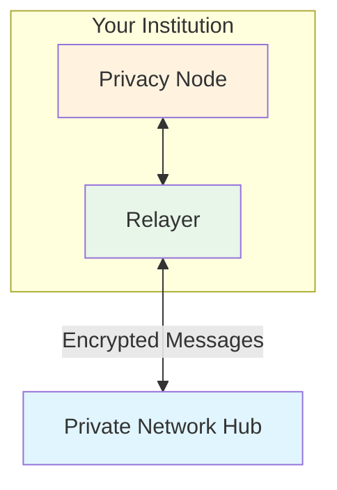
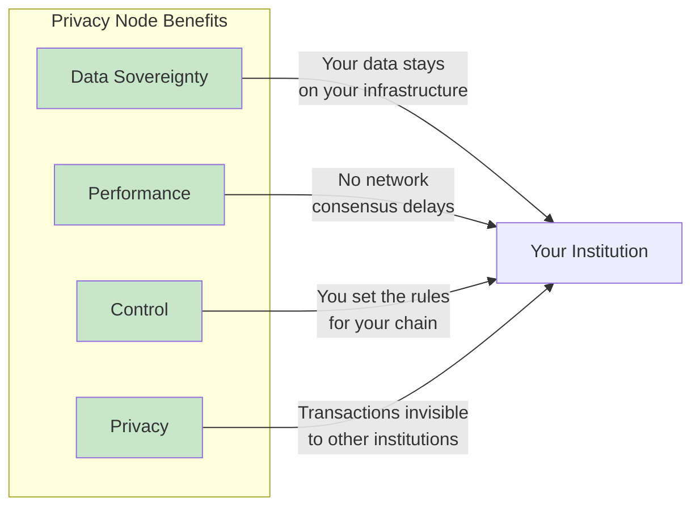
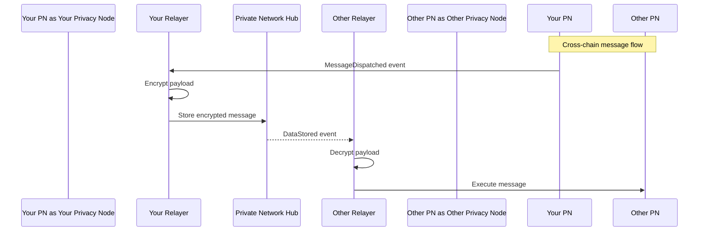

# Rayls Privacy Nodes

This page introduces Rayls Privacy Nodes—the private blockchains that each institution operates within the Rayls network.

---

## What is a Rayls Privacy Node?

A Rayls Privacy Node is your institution's private blockchain. It's where all your local transactions are recorded, your smart contracts are deployed, and your data stays under your control.

Each institution in the Rayls network runs its own Rayls Privacy Node. Your Privacy Node is completely isolated—no other institution can access your data or transactions.

---

## Key Characteristics

| Property | Value |
|----------|-------|
| **Technology** | Rust (axyl — reth-based EVM) |
| **Consensus** | Narwhal + Bullshark BFT |
| **Contract Size Limit** | 1 MB (vs 24 KB standard Ethereum) |
| **Compatibility** | EVM-compatible (Solidity, JSON-RPC, EVM) |

---

## Why a Private Blockchain?

Rayls Privacy Nodes provide four key benefits:

| Benefit | Description |
|---------|-------------|
| **Data Sovereignty** | All transaction data stays on your infrastructure. You own your data. |
| **Performance** | DAG-based BFT consensus keeps throughput high with fast finality. |
| **Control** | You decide what contracts to deploy and how to configure your chain. |
| **Privacy** | Other institutions cannot see your transactions or balances. |

---

## What Runs on a Privacy Node

Your Privacy Node hosts all the components needed for local operations and cross-chain communication:

### Smart Contracts

| Contract Type | Purpose |
|---------------|---------|
| **Your Tokens** | ERC-20, ERC-721, ERC-1155 tokens you create |
| **Your DeFi Logic** | Custom business logic contracts |
| **RNEndpointV1** | Cross-chain message entry point (EIP-5164) |
| **Token Handlers** | ERC20Handler, ERC721Handler, ERC1155Handler |
| **EnygmaHandler** | Privacy-preserving transfers |
| **ZkDvpHandler** | Zero-knowledge atomic swaps |

### Ethereum Compatibility

Because Privacy Nodes run an EVM-compatible client (axyl), you can use all standard Ethereum tools:

| Tool | Supported |
|------|-----------|
| Solidity | Full support |
| Hardhat / Foundry | Full support |
| ethers.js / web3.js | Full support |
| MetaMask | Full support |
| Remix IDE | Full support |

---

## How It Connects to the Network

Your Privacy Node never communicates directly with other Privacy Nodes. All cross-chain communication goes through the Private Network Hub:

Key points:

- Your Relayer watches your Privacy Node for outgoing messages
- Messages are encrypted before leaving your infrastructure
- The Private Network Hub routes messages but cannot read their contents
- The destination Relayer decrypts and executes the message

---

## Privacy Guarantees

| Data | Who Can See It |
|------|----------------|
| Your transactions | Only you |
| Your token balances | Only you |
| Your contract state | Only you |
| Cross-chain message contents | You and the recipient |
| Message routing metadata | Private Network Hub (encrypted payloads only) |

---

## Section Contents

Learn more about Privacy Node internals:

- **[Blockchain Client](blockchain-client.md)** — axyl (reth-based EVM), 1 MB contracts, MDBX storage
- **[Consensus](consensus.md)** — Narwhal + Bullshark multi-validator BFT
- **[Configuration](configuration.md)** — Genesis settings, network ports, operational parameters

---

**Next:** [Blockchain Client](blockchain-client.md)
