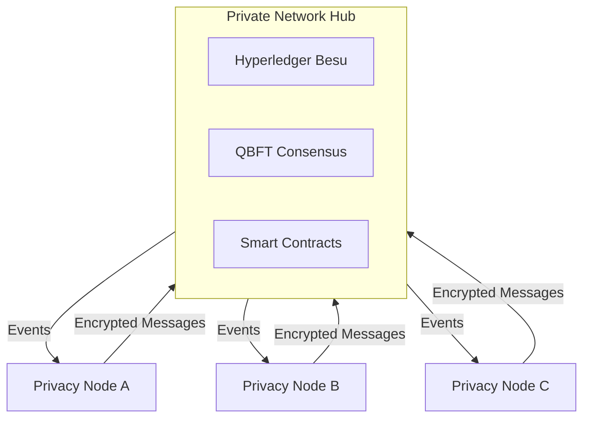
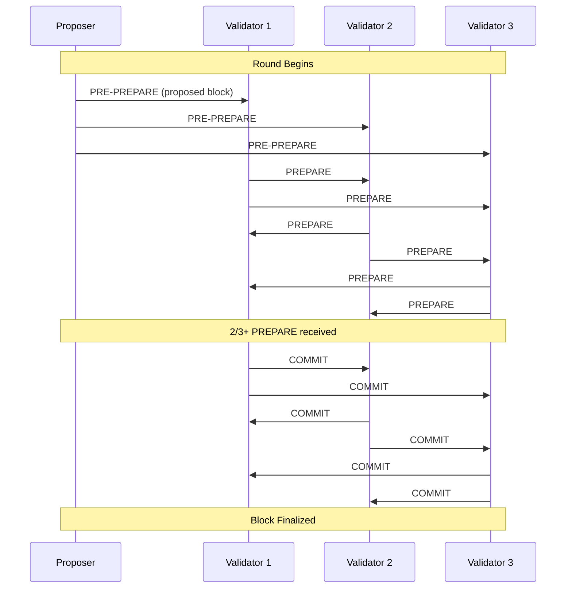

# Blockchain Client

The Private Network Hub runs on [Hyperledger Besu](https://besu.hyperledger.org/), an enterprise-grade Ethereum execution client optimized for permissioned networks.

---

## Overview

The Private Network Hub serves as the central coordination layer in the Rayls network. It stores encrypted cross-chain messages, validates Merkle proofs, and emits events for message routing - all without accessing plaintext transaction data.

---

## Hyperledger Besu

Besu is an open-source Ethereum client designed for enterprise use cases. It supports both public and private networks.

| Feature | Description |
|---------|-------------|
| **EVM Compatible** | Runs standard Solidity smart contracts |
| **Enterprise Consensus** | Supports IBFT 2.0 and QBFT for permissioned networks |
| **Privacy Features** | Native support for private transactions |
| **Production Ready** | Used by major financial institutions worldwide |
| **Monitoring** | Built-in metrics and logging for operations |

### Why Besu for the Hub?

1. **Permissioned Access** - Only authorized validators can participate
2. **Immediate Finality** - QBFT provides deterministic block finality
3. **Enterprise Support** - Backed by Hyperledger Foundation and Consensys
4. **Regulatory Alignment** - Designed for compliance-sensitive environments

For full documentation, see [Hyperledger Besu Docs](https://besu.hyperledger.org/).

---

## QBFT Consensus

The Private Network Hub uses **QBFT** (Quorum Byzantine Fault Tolerant) consensus, providing immediate finality and Byzantine fault tolerance.

| Property | Value |
|----------|-------|
| **Type** | Byzantine Fault Tolerant |
| **Finality** | Immediate (no confirmations needed) |
| **Block Time** | ~5 seconds |
| **Fault Tolerance** | Tolerates ⌊(n-1)/3⌋ faulty validators |

### QBFT Round Flow

### How QBFT Works

1. **PRE-PREPARE**: Proposer creates and broadcasts a block
2. **PREPARE**: Validators acknowledge the proposal
3. **COMMIT**: Validators commit to the block
4. **FINALITY**: Block is finalized when 2/3+ validators commit

Key properties:
- No forks or reorganizations possible
- Blocks are final immediately after consensus
- Proposer rotates each round for fairness

### Validator Requirements

| Validators | Faults Tolerated | Minimum for Consensus |
|------------|------------------|----------------------|
| 4 nodes | 1 fault | 3 validators |
| 7 nodes | 2 faults | 5 validators |
| 10 nodes | 3 faults | 7 validators |
| 13 nodes | 4 faults | 9 validators |

For production deployments, **7+ validators** are recommended to ensure high availability.

For more details, see [Besu QBFT Documentation](https://besu.hyperledger.org/private-networks/how-to/configure/consensus/qbft).

---

## Network Configuration

The Rayls Private Network Hub uses these settings:

| Setting | Value | Description |
|---------|-------|-------------|
| Block period | 5 seconds | Time between blocks |
| Request timeout | 10 seconds | QBFT round timeout |
| Epoch length | 30000 blocks | Validator set update interval |
| Block gas limit | 30M gas | Maximum gas per block |
| Chain ID | Network-specific | Unique identifier |

### Genesis Configuration

The Hub is initialized with a genesis file that defines:

- Initial validator set
- Pre-deployed system contracts
- Network parameters
- Allocations for system accounts

---

## JSON-RPC API

The Hub exposes standard Ethereum JSON-RPC endpoints for external communication.

### Connection Methods

| Protocol | Use Case |
|----------|----------|
| **HTTPS** | Secure RPC from Relayers |
| **WebSocket** | Real-time event subscriptions |

### Key Endpoints

| Method | Purpose |
|--------|---------|
| `eth_sendRawTransaction` | Submit encrypted messages |
| `eth_call` | Query registry data |
| `eth_getTransactionReceipt` | Confirm message storage |
| `eth_getLogs` | Retrieve events for routing |
| `eth_subscribe` | Real-time event monitoring |

### Security

- All connections require TLS/HTTPS
- API access is restricted to authorized Relayers
- Rate limiting protects against abuse

For the full API reference, see [Besu JSON-RPC API](https://besu.hyperledger.org/public-networks/reference/api).

---

## Monitoring and Operations

### Health Checks

| Endpoint | Description |
|----------|-------------|
| `/liveness` | Node is running |
| `/readiness` | Node is synced and ready |

### Metrics

Besu exposes Prometheus metrics for:

- Block height and sync status
- Transaction pool size
- Peer connections
- Consensus round timing
- RPC request latency

---

**Navigate:**

- [Back to Private Network Hub](index.md)
- [Message Coordination](coordination.md)
