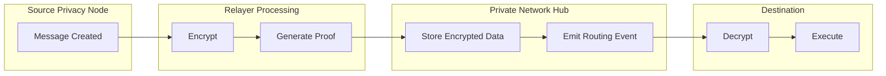
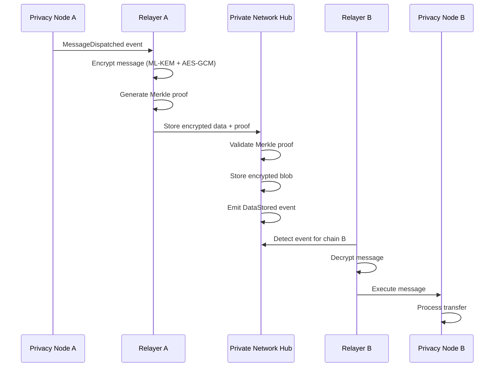
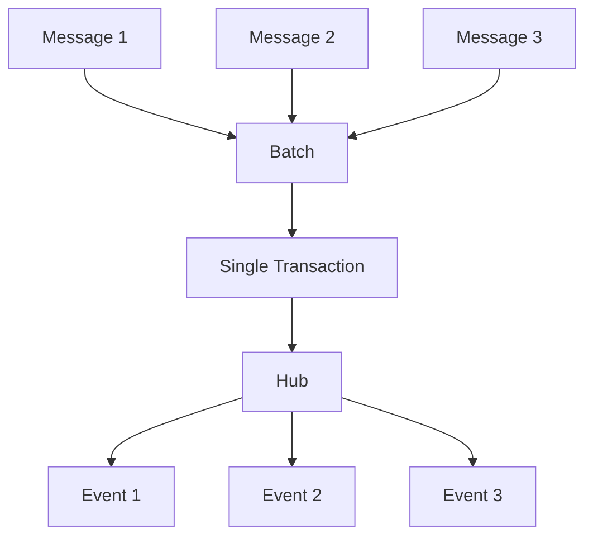

# Message Coordination

The Private Network Hub coordinates cross-chain messaging between Privacy Nodes. It stores encrypted messages, validates proofs, and emits events for routing - all without accessing plaintext data.

---

## Overview

The Hub acts as a blind coordinator: it receives encrypted payloads, validates cryptographic proofs, and routes messages to their destinations. It never sees the contents of transfers.

---

## Message Flow

---

## Coordination Phases

### Phase 1: Source Side

When a Privacy Node dispatches a cross-chain message:

| Step | Action | Component |
|------|--------|-----------|
| 1 | User initiates cross-chain transfer | Privacy Node |
| 2 | `MessageDispatched` event emitted | RaylsEndpoint contract |
| 3 | Relayer detects the event | Listener service |
| 4 | Message encrypted with destination's public key | KOS |
| 5 | Merkle proof generated from current state | Merkle service |
| 6 | Encrypted data submitted to Hub | Executor service |

### Phase 2: Hub Processing

The Hub receives the encrypted data and validates it:

| Step | Action | Contract |
|------|--------|----------|
| 1 | Receive transaction from Relayer | Teleport |
| 2 | Validate Merkle proof against submitted root | Proofs |
| 3 | Verify header proof (state commitment) | Proofs |
| 4 | Store encrypted blob on-chain | EncryptedDataStorage |
| 5 | Emit `DataStored` event with routing info | Teleport |

### Phase 3: Destination Side

The destination Relayer processes the message:

| Step | Action | Component |
|------|--------|-----------|
| 1 | Monitor Hub for `DataStored` events | Listener |
| 2 | Filter events targeting this chain | Listener |
| 3 | Retrieve encrypted payload | Executor |
| 4 | Decrypt using shared secret | KOS |
| 5 | Execute message on Privacy Node | Executor |
| 6 | Emit completion event | Privacy Node |

---

## What the Hub Stores

### Stored Data

| Data | Purpose |
|------|---------|
| Encrypted message blob | Payload for destination |
| Merkle root | State proof validation |
| Header proof | Block commitment verification |
| Source chain ID | Origin tracking |
| Destination chain ID | Routing |
| Message ID | Deduplication and status tracking |
| Timestamp | Ordering and timeout enforcement |

### Privacy Guarantees

The Hub **never** stores or accesses:

- Decrypted message contents
- Transfer amounts or values
- Recipient addresses
- Token types or quantities
- Any business logic details

All sensitive data remains encrypted end-to-end between Privacy Nodes.

---

## Registry Contracts

The Hub maintains several registries that enable coordination:

### ParticipantStorage

| Field | Description |
|-------|-------------|
| Chain ID | Unique Privacy Node identifier |
| Public Keys | ML-KEM encapsulation keys for encryption |
| Endpoint Address | RaylsEndpoint contract address |
| Status | Active, suspended, or removed |
| Roles | Participant capabilities |

### TokenRegistry

| Field | Description |
|-------|-------------|
| Resource ID | Universal token identifier |
| Issuer Chain | Original Privacy Node |
| Token Address | Contract address per chain |
| Standard | ERC-20, ERC-721, ERC-1155 |
| Status | Active or frozen |

### ResourceRegistry

| Field | Description |
|-------|-------------|
| Resource ID | Unique contract identifier |
| Bytecode Hash | Contract deployment verification |
| Constructor Args | Initialization parameters |
| Deployment Status | Deployed chains |

These registries enable:

- **Key Lookup** - Find encryption keys for any participant
- **Token Mapping** - Map tokens across different chains
- **Contract Deployment** - Deploy consistent contracts network-wide

---

## Event Types

The Hub emits several event types for coordination:

| Event | Purpose | Subscribers |
|-------|---------|-------------|
| `EncryptedDataBatchStored` | Message ready for routing | Destination Relayers |
| `AtomicMessageStatusChanged` | Atomic transfer status update | Source/Destination Relayers |
| `HeaderProofSubmitted` | State commitment confirmed | Governance API |
| `ParticipantRegistered` | New participant joined | All Relayers |
| `TokenRegistered` | New token available | All Relayers |

---

## Message Batching

For efficiency, the Hub supports message batching:

Benefits:
- Reduced gas costs per message
- Improved throughput
- Atomic batch processing

---

## Timeout and Retry

Messages have a **240-second timeout** (LOCK_TIME) for atomic transfers:

| Scenario | Behavior |
|----------|----------|
| Success within timeout | Message executed, status updated |
| Timeout reached | Automatic revert triggered |
| Retry needed | Relayer resubmits with same message ID |

The Hub tracks message status to prevent duplicate execution.

---

**Navigate:**

- [Back to Private Network Hub](index.md)
- [Blockchain Client](blockchain-client.md)
