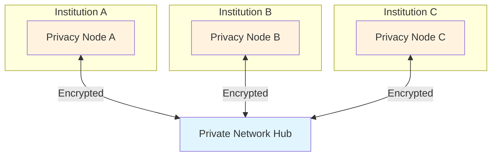

# Private Network Hub

The Private Network Hub is the central coordination layer in the Rayls network. It routes encrypted messages between Privacy Nodes without accessing their contents.

---

## Role in the Network

Rayls uses a **hub-and-spoke architecture**:

- Each institution operates its own **Privacy Node** (spoke)
- All Privacy Nodes connect to a shared **Private Network Hub** (hub)
- The Hub routes messages but never sees transaction details

---

## Technology

The Private Network Hub is based on [Hyperledger Besu](https://besu.hyperledger.org/), an enterprise Ethereum client running QBFT consensus.

| Property | Value |
|----------|-------|
| **Base** | Hyperledger Besu |
| **Consensus** | QBFT (Byzantine Fault Tolerant) |
| **Block Time** | ~5 seconds |
| **Finality** | Immediate (no forks) |
| **Validators** | 4+ nodes |

For more details, see [Blockchain Client](blockchain-client.md).

---

## Privacy Guarantees

The Hub provides routing without visibility:

| Data | Visible to Hub |
|------|----------------|
| Encrypted message blobs | Yes (opaque) |
| Source/destination chain IDs | Yes |
| Transfer amounts | No |
| Recipient addresses | No |
| Transaction details | No |

Messages are encrypted end-to-end using ML-KEM key agreement. Only the destination institution can decrypt.

---

## What the Hub Does

1. **Stores encrypted messages** from source Privacy Nodes
2. **Validates Merkle proofs** to verify message authenticity
3. **Emits routing events** for destination Privacy Nodes
4. **Maintains registries** for participants, tokens, and resources

For message flow details, see [Message Coordination](coordination.md).

---

## In This Section

- [Blockchain Client](blockchain-client.md) - Besu and QBFT consensus
- [Message Coordination](coordination.md) - How messages are routed

---

**Navigate:**

- [Back to Components](../index.md)
