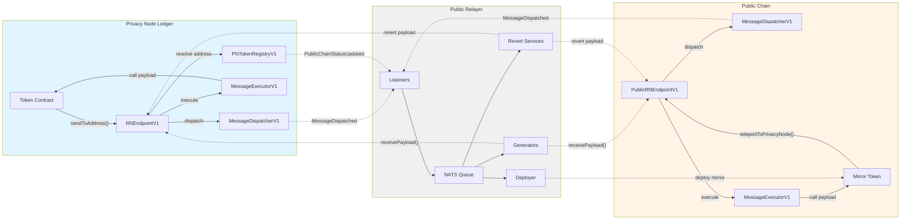

# Bridge Architecture

The bridge connects a Privacy Node Ledger to a public blockchain through a set of infrastructure contracts on both chains and an off-chain relayer service.

## System Diagram

---

## Infrastructure Contracts

These contracts are deployed on **both** the Privacy Node Ledger and the public chain. They form the cross-chain messaging backbone.

| Contract | Role |
|---|---|
| **RNEndpointV1** (private) / **PublicRNEndpointV1** (public) | The message gateway. Token contracts call it to send cross-chain messages. Relayers call it to deliver incoming messages. Handles replay protection via message ID tracking. |
| **RNMessageDispatcherV1** | Receives messages from the endpoint and emits `MessageDispatched` events. These events are what the relayer listens for. Computes unique message IDs using EIP-5164 compliant nonce-based hashing. |
| **RNMessageExecutorV1** | Receives relayed messages from the endpoint and executes them by calling the target contract with the decoded payload. Includes reentrancy protection and verifies the target is a contract. |
| **RelayAuthorizationRegistry** | Maintains a whitelist of addresses authorized to act as relayers. Both endpoints check this registry before accepting incoming messages. |

!!! note "Key Difference: Private vs Public Endpoint"
    - The **Privacy Node Ledger endpoint** (`RNEndpointV1`) uses the [PN Token Registry](../smart-contracts/pn-token-registry.md) (`PNTokenRegistryV1`) to resolve private token addresses to their public chain counterparts and to verify that only authorized, registered tokens can send messages.
    - The **public chain endpoint** (`PublicRNEndpointV1`) uses an `authorizedSenders` mapping instead — each public token contract must be explicitly whitelisted by the relayer after deployment.

---

## Privacy Node Ledger Contracts

### PNTokenRegistryV1

The Privacy-Node-side registry of all tokens, including the bridgeable ones. It owns the public-chain side of the token lifecycle through its `publicChainStatus` state machine. See the [PN Token Registry](../smart-contracts/pn-token-registry.md) page for the full architecture and status models.

| Responsibility | Details |
|---|---|
| **Token metadata** | Stores name, symbol, standard (ERC-20/721/1155), the three lifecycle statuses, and addresses |
| **Public-chain lifecycle** | Manages `publicChainStatus`: `PENDING_DEPLOYMENT` → `DEPLOYED` (and `FROZEN` / `DEPRECATED`) via `submitToPublicChain`, `updatePublicTokenAddress`, and the public freeze/deprecate calls |
| **Address mapping** | Stores the private-to-public address mapping used by the endpoint to route messages |
| **Deployment trigger** | Emits `PublicChainStatusUpdated` when a token is submitted to the public chain, which triggers the relayer to deploy the mirror contract |

---

## Public Chain Contracts

### Token Handlers (Abstract)

These are abstract contracts that implement the bridge logic. The auto-deployed mirror contracts inherit from them.

| Contract | Role |
|---|---|
| **RaylsPublicApp** | Base contract for all public chain Rayls applications. Provides the `receiveMethod` modifier that restricts incoming cross-chain calls to the trusted message executor only. |
| **RaylsPublicERC20Handler** | Extends `RaylsPublicApp` + OpenZeppelin `ERC20`. Implements `teleportToPrivacyNode()` (burn and send), `receiveTeleportFromPrivacyNode()` (mint on receive), and `revertTeleportToPrivacyNode()` (mint back on revert). |
| **RaylsPublicERC721Handler** | Same pattern for ERC-721 NFTs. Burns/mints NFTs for cross-chain transfers. |
| **RaylsPublicERC1155Handler** | Same pattern for ERC-1155 multi-tokens. Burns/mints tokens for cross-chain transfers. |

### Reference Implementations (Concrete)

These are the contracts the relayer's deployer service auto-deploys when a token is activated.

| Contract | Inherits | Notes |
|---|---|---|
| **PublicChainERC20** | RaylsPublicERC20Handler | Minimal implementation. Optional initial supply minted to deployer. |
| **PublicChainERC721** | RaylsPublicERC721Handler | Adds auto-incrementing token ID counter and convenience mint functions. |
| **PublicChainERC1155** | RaylsPublicERC1155Handler | Adds token type tracking and supply management. |

---

## Public Relayer

The public relayer is an off-chain Go service that bridges the Privacy Node Ledger and the public chain. It runs as a single process with multiple concurrent services coordinated via NATS message queues.

The relayer handles:

- **Message relay** — Watches for `MessageDispatched` events on both chains and delivers them to the other
- **Token deployment** — Detects `PublicChainStatusUpdated` events, deploys mirror contracts, maps addresses, and authorizes senders
- **Failure recovery** — Monitors transaction receipts and sends revert payloads when execution fails

!!! info "Relayer Deep Dive"
    For detailed documentation of the relayer's services, message flows, and contract interactions, see [Public Relayer](../relayer/public-relayer.md).

---

**Navigate:**

- [Token Bridging](token-bridging.md) — Transfer flows and failure handling
- [Back to Public Chain Overview](index.md)
