# Public Chain Integration (Optional)

!!! info "Optional Component"
    Public chain integration is **optional**. Institutions can operate entirely within the private Rayls network. These components are only needed when bridging assets to/from public blockchains like Ethereum or Polygon.

## Overview

The Rayls private-to-public chain bridge enables tokens on a Privacy Node Ledger to have a corresponding representation on a public chain. Tokens can be transferred between the two chains through a lock/unlock and mint mechanism, with an off-chain relayer service shuttling messages in both directions.

**The mental model is simple:** two independent blockchains, each with a messaging endpoint, connected by a relayer that watches for events on one chain and delivers them to the other.

The system has three layers:

- **Privacy Node Ledger** — Your token contract lives here. Infrastructure contracts handle message routing, and the [PN Token Registry](../smart-contracts/pn-token-registry.md) (`PNTokenRegistryV1`) handles token registration, status, and authorization.
- **Public Chain** — A mirror contract is automatically deployed here. It handles locking, unlocking, and minting tokens on the public side.
- **Public Relayer** — An off-chain Go service that watches for events on both chains and relays messages between them.

## Key Capabilities

- Bridge ERC-20, ERC-721, and ERC-1155 tokens between private and public chains
- Automatic mirror contract deployment on the public chain
- Revert safety — tokens are never lost, even if a cross-chain transfer fails
- KYC/compliance enforcement via User Governance
- Lock-based accounting — tokens on the Privacy Node Ledger are locked (not burned), maintaining 1:1 backing

## Token Lifecycle

Before a token can be transferred between chains, it goes through a registration and activation process:

1. **Write** — Inherit from a handler (`RaylsErc20Handler`, `RaylsErc721Handler`, or `RaylsErc1155Handler`)
2. **Deploy** — Deploy the contract on the Privacy Node Ledger
3. **Register** — Call `PNTokenRegistryV1.registerToken(tokenAddress)` to register it locally on the Privacy Node
4. **Approve** — The PN operator authorizes the token via `updatePrivacyNodeStatus(addr, AUTHORIZED)`
5. **Submit to public chain** — Call `submitToPublicChain(addr)`, setting `publicChainStatus` to `PENDING_DEPLOYMENT`
6. **Auto-Deploy** — The public relayer detects the pending deployment and deploys a mirror contract on the public chain
7. **Map & Authorize** — The relayer calls `updatePublicTokenAddress()` (setting `publicChainStatus` to `DEPLOYED`) and `addAuthorizedSender()`. Tokens can now flow in both directions.

```mermaid
flowchart LR
    A["Write Contract<br/><i>Inherit handler</i>"] --> B["Deploy<br/><i>Privacy Node Ledger</i>"]
    B --> C["Register<br/><i>registerToken()</i>"]
    C --> D["Approve<br/><i>updatePrivacyNodeStatus(AUTHORIZED)</i>"]
    D --> E["Submit<br/><i>submitToPublicChain()</i>"]
    E --> F["Auto-Deploy Mirror<br/><i>Relayer deploys on public chain</i>"]
    F --> H["Map & Authorize<br/><i>updatePublicTokenAddress + addAuthorizedSender</i>"]
    H --> G["Bridgeable<br/><i>Transfer in both directions</i>"]

    style A fill:#e1f5ff
    style B fill:#e1f5ff
    style C fill:#e1f5ff
    style D fill:#fff4e6
    style E fill:#e1f5ff
    style F fill:#f0f0f0
    style H fill:#f0f0f0
    style G fill:#90EE90
```

**Legend:** Blue = developer actions | Red = operator action | Gray = automatic (relayer) | Green = ready

!!! tip "Ready to Build?"
    See the [Public Chain Bridge](../../../build/advanced/public-chain-bridge.md) guide for a step-by-step developer walkthrough with code examples.

---

**Navigate:**

- [Bridge Architecture](architecture.md) — Infrastructure contracts and how they connect
- [Token Bridging](token-bridging.md) — Transfer flows and failure handling
- [Back to Components Overview](../index.md)
