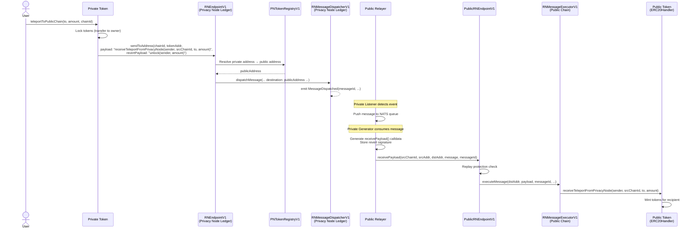
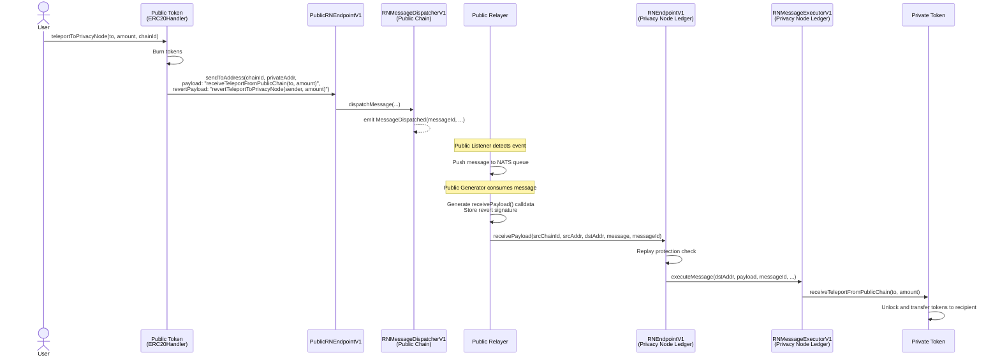

# Token Bridging

Tokens move between the Privacy Node Ledger and the public chain through a lock/burn and mint mechanism. Every transfer includes a revert payload so tokens are never lost, even if a cross-chain message fails.

---

## Token Lifecycle

Before a token can be bridged, it must be registered on the Privacy Node, authorized, and submitted to the public chain. Public-chain bridging is driven by the [PN Token Registry](../smart-contracts/pn-token-registry.md) (`PNTokenRegistryV1`) and its `publicChainStatus` state machine.

1. **Register** — The token contract is deployed on the Privacy Node Ledger. It is registered via `PNTokenRegistryV1.registerToken(tokenAddress)`, which reads its name, symbol, and total supply on-chain. The token starts with `privacyNodeStatus = WAITING_APPROVAL`.

2. **Approve on PN** — The PN operator authorizes the token via `updatePrivacyNodeStatus(addr, AUTHORIZED)`. Public-chain submission requires the token to be PN `AUTHORIZED` first.

3. **Submit to public chain** — An operator or the token owner calls `submitToPublicChain(addr)`, which sets `publicChainStatus = PENDING_DEPLOYMENT` and emits a `PublicChainStatusUpdated` event containing the token's metadata (address, standard, name, symbol).

4. **Auto-deploy mirror** — The public relayer's **Private Listener** picks up the `PublicChainStatusUpdated` event and pushes it to the deployment queue. The **Deployer Service** consumes it and deploys the corresponding mirror contract (`PublicChainERC20`, `PublicChainERC721`, or `PublicChainERC1155`) on the public chain.

5. **Map addresses** — After deployment, the relayer calls `updatePublicTokenAddress()` on `PNTokenRegistryV1` to record the private-to-public address mapping and set `publicChainStatus = DEPLOYED`. This mapping is what allows the Privacy Node Ledger endpoint to resolve where to send messages on the public chain.

6. **Authorize sender** — The relayer calls `addAuthorizedSender()` on `PublicRNEndpointV1` to whitelist the newly deployed public token contract. Without this, the token would not be able to send cross-chain messages from the public chain.

7. **Bridgeable** — The token can now be transferred in both directions.

---

## Private to Public Transfer

A user holds tokens on the Privacy Node Ledger and wants to move them to the public chain.

**What happens:**

1. The user calls `teleportToPublicChain()` on the Privacy Node Ledger token contract
2. The token **locks** the user's funds (transfers them to the contract owner) and sends a message through the endpoint
3. The forward payload includes the sender address and source chain ID, allowing the public chain to send an explicit revert callback if the destination is invalid
4. The endpoint resolves the private token address to its public chain counterpart using the address mapping stored in `PNTokenRegistryV1`
5. The relayer picks up the `MessageDispatched` event, queues it, and creates `receivePayload()` calldata for the public chain
6. The executor calls `receiveTeleportFromPrivacyNode()` on the public mirror, which mints tokens for the recipient

!!! warning "User Registration Required"
    `teleportToPublicChain` requires the caller to be registered in `RNUserGovernanceV1`. This is enforced by the `onlyRegisteredUsers` modifier for KYC/compliance purposes.

!!! note "Zero-Address Safety"
    If the recipient address is `address(0)`, the public chain contract does **not** revert. Instead, it sends an explicit callback to the Privacy Node Ledger to unlock the sender's tokens. This avoids relying on the relayer's revert mechanism for this edge case.

---

## Public to Private Transfer

A user holds tokens on the public chain and wants to move them back to the Privacy Node Ledger.

**What happens:**

1. The user calls `teleportToPrivacyNode()` on the public chain token contract
2. The token **burns** the user's tokens and sends a message through the public endpoint
3. The message contains the payload `receiveTeleportFromPublicChain(to, amount)` and a revert payload `revertTeleportToPrivacyNode(sender, amount)` in case of failure
4. The endpoint dispatches the message, emitting a `MessageDispatched` event
5. The relayer picks up the event, queues it, and creates `receivePayload()` calldata for the Privacy Node Ledger
6. The relayer submits the transaction to the Privacy Node Ledger endpoint
7. The executor calls `receiveTeleportFromPublicChain()` on the private token contract, which unlocks tokens and transfers them to the recipient

---

## Failure Handling (Reverts)

Every cross-chain message includes a revert payload. If the destination chain execution fails, the relayer automatically sends the revert payload back to the source chain to restore the original state.

### Private → Public Failure

If `receiveTeleportFromPrivacyNode()` fails on the public chain, the relayer's revert service detects the failed transaction and sends `unlock(sender, amount)` back to the Privacy Node Ledger to release the locked tokens.

### Public → Private Failure

If `receiveTeleportFromPublicChain()` fails on the Privacy Node Ledger, the relayer's revert service sends `revertTeleportToPrivacyNode(sender, amount)` back to the public chain, which **mints the tokens back** to the original sender.

**How the revert mechanism works:**

1. When the generator service creates the forward transaction, it also pre-generates and stores the revert transaction data in the database
2. The revert service periodically polls for completed transactions on the destination chain
3. If a transaction failed (receipt status != 1), the service retrieves the stored revert signature for that message ID
4. The revert payload is submitted to the **source** chain's endpoint, which executes it on the source token contract

!!! success "Safety Guarantee"
    Tokens are never lost. They are either successfully transferred to the destination chain, or automatically returned to the sender on the source chain.

---

## Lock vs Burn

The bridge uses different mechanisms depending on direction:

| Direction | Source Action | Destination Action |
|---|---|---|
| Private to Public | **Lock** (tokens stay on Privacy Node Ledger, held by owner) | **Mint** (new tokens created on public chain) |
| Public to Private | **Burn** (tokens destroyed on public chain) | **Unlock** (previously locked tokens released and transferred) |

On the Privacy Node Ledger, tokens are **locked** (not burned) when bridging to the public chain. This maintains the tokens on-chain as collateral. On the public chain, tokens are **burned** when bridging back, and **minted** when received — the public chain mirror has no locked state.

---

**Navigate:**

- [Bridge Architecture](architecture.md) — Infrastructure contracts and how they connect
- [Back to Public Chain Overview](index.md)
