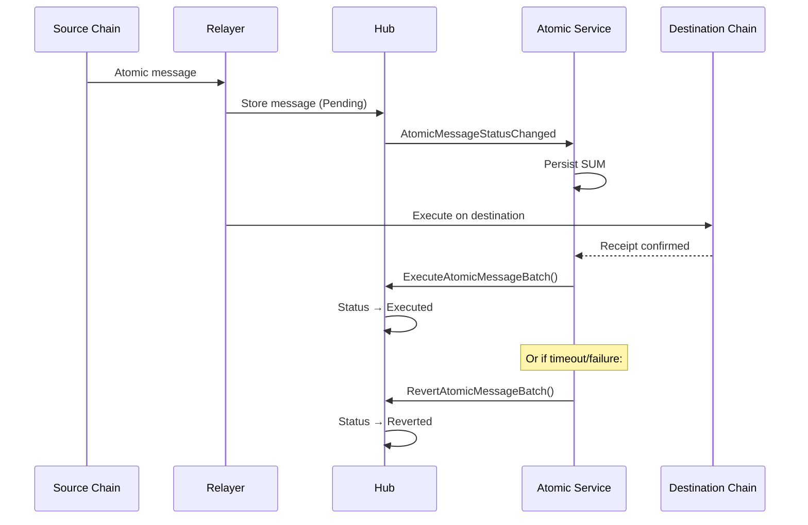
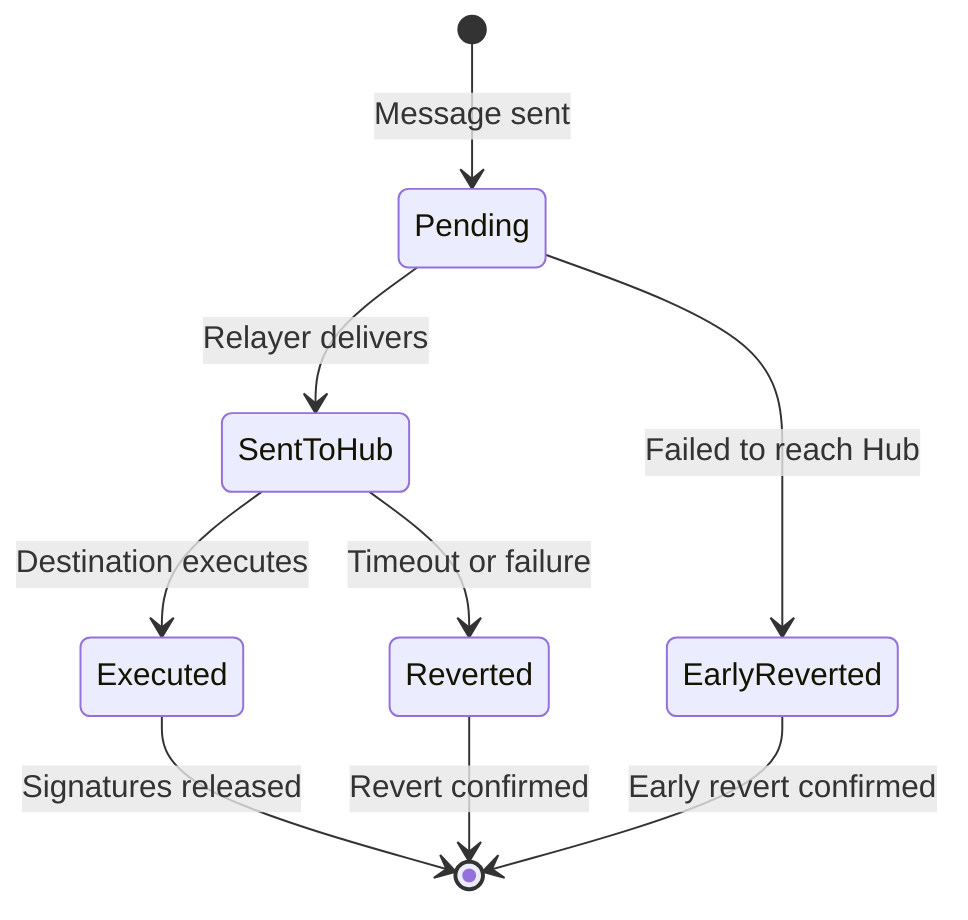
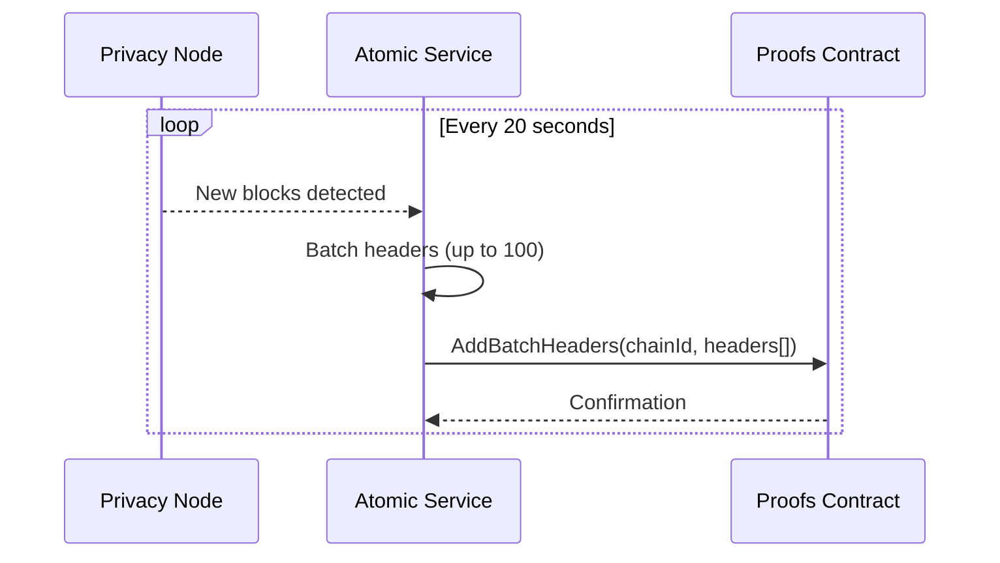

# Atomic Service

The atomic service manages the lifecycle of atomic cross-chain transactions. It ensures that transactions either complete successfully on all chains or are fully reverted - providing all-or-nothing guarantees.

---

## Purpose

The atomic service coordinates transaction finalization:

- Monitors transaction states across chains
- Handles timeouts and expiration
- Provides cryptographic signatures for settlement
- Manages early reverts for failed transactions
- Persists Status Update Messages (SUMs) from the Hub

---

## Architecture

---

## Transaction Lifecycle

Atomic transactions progress through multiple states:

---

## Key Services

### SUM Listener

Monitors the Hub for `AtomicMessageStatusChanged` events and persists them to the database:

- Captures status updates (Pending, Executed, Rejected, Reverted)
- Associates updates with transaction shared IDs
- Enables processing even if atomic service was temporarily down

### Early Revert Service

Handles transactions that failed before reaching the Hub:

- Monitors transactions in `FailedSentToCommitChain` state
- Sends immediate revert signatures to source chain
- Prevents wasted confirmation time

### Expiration Service

Manages transactions that exceed the timeout period (default 30 minutes):

- Queries Hub for pending transaction states
- Triggers reverts for expired transactions
- Configurable timeout via `COMMITCHAIN_EXPIRATIONREVERTTIMEINMINUTES`

### Receipt Pollers

Monitor transaction mining on both source and destination chains:

- **Source Receipt Poller**: Confirms transaction submitted to Hub
- **Destination Receipt Poller**: Confirms execution on destination chain

### Finalization Pollers

Process confirmed transactions for final settlement:

- **Source Finalization**: Waits for Hub confirmation, releases signatures
- **Destination Finalization**: Confirms execution, triggers unlock

### Signature Service

Provides cryptographic signatures for transaction settlement:

- **Unlock signatures**: When destination executes successfully
- **Revert signatures**: When transaction fails or times out
- Signatures enable Hub to finalize atomic state

---

## Contract Interactions

| Contract | Events Monitored | Functions Called |
|----------|-----------------|------------------|
| **TeleportV1** | `AtomicMessageStatusChangedBatch` | `ExecuteAtomicMessageBatch()`, `RevertAtomicMessageBatch()`, `GetAtomicMessageStatuses()` |
| **Proofs** | - | `AddBatchHeaders()` |
| **ParticipantStorage** | - | Chain configuration queries |

---

## Header Proof Submission

The atomic service submits Privacy Node block headers to the Hub's Proofs contract, enabling cross-chain proof verification.

**How it works:**

- Runs continuously, checking for new blocks every 20 seconds
- Batches up to 100 block headers per submission
- Maintains a record of Privacy Node state on the Hub
- Enables verification of cross-chain transactions

---

## Atomic States

| State | Value | Description |
|-------|-------|-------------|
| **Pending** | 0 | Transaction submitted, awaiting execution |
| **Executed** | 1 | Successfully executed on destination |
| **Rejected** | 2 | Rejected by destination contract |
| **Reverted** | 3 | Timed out or explicitly reverted |

---

## Integration with Relayer

The atomic service works alongside the main relayer:

| Responsibility | Relayer | Atomic Service |
|----------------|---------|----------------|
| Event detection | Yes | No |
| Message encryption | Yes | Yes (via KMM) |
| Transaction submission | Yes | No |
| State persistence | Yes | Yes |
| Receipt polling | No | Yes |
| Finalization signatures | No | Yes |
| Timeout handling | No | Yes |

The relayer handles message transport; the atomic service handles finalization.

---

## Reliability Features

### Persistence

All state is persisted to database:

- Transactions with their current state
- Status Update Messages (SUMs)
- Calldata signatures (unlock/revert)
- Last processed block numbers

This enables recovery after crashes or restarts.

### Idempotency

The service handles duplicate operations gracefully:

- Detects "already executed" contract errors
- Detects "already reverted" contract errors
- Updates local state without failing

### Concurrent Processing

Multiple services run concurrently:

- 10+ goroutines managed by error group
- Each service has independent ticker (1-second intervals)
- Shared cancellation context for graceful shutdown

---

## Configuration

Key configuration options:

| Variable | Default | Description |
|----------|---------|-------------|
| `COMMITCHAIN_EXPIRATIONREVERTTIMEINMINUTES` | 30 | Timeout before auto-revert |
| `BLOCKCHAIN_EXECUTOR_BATCH_MESSAGES` | 800 | Batch size for processing |
| `BLOCKCHAIN_LISTENER_BATCH_BLOCKS` | 150 | Blocks to process per batch |

---

**Navigate:**

- [Back to Relayer Overview](index.md)
- [Relayer](relayer.md)
- [Public Relayer](public-relayer.md)
