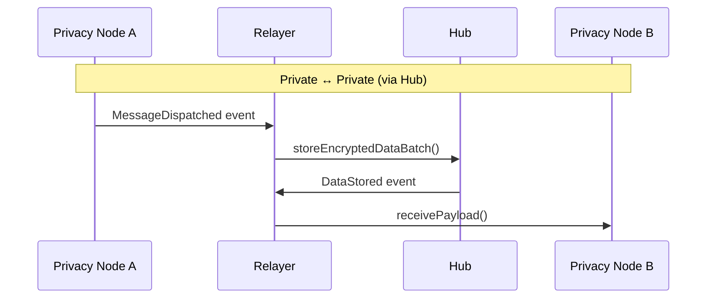

# Relayer Overview

Relayers are off-chain services that transport messages between blockchains in the Rayls network. They listen for events on one chain and execute corresponding transactions on another.

---

## Relayer Components

Rayls uses three specialized relayer services, each handling different communication patterns:

| Component | Communication Path | Purpose |
|-----------|-------------------|---------|
| [Relayer](relayer.md) | Privacy Node ↔ Hub ↔ Privacy Node | Main cross-chain messenger for private network |
| [Public Relayer](public-relayer.md) | Privacy Node ↔ Public Chain | Direct bridge to public blockchains |
| [Atomic Service](atomic-service.md) | Coordinates with Hub | Manages atomic transaction finalization |

---

## Message Flow Overview

---

## How Relayers Work

All relayers follow a similar pattern:

1. **Listen** - Monitor blockchain events (e.g., `MessageDispatched`)
2. **Process** - Decrypt, validate, and prepare the message
3. **Execute** - Submit transaction to destination chain
4. **Confirm** - Wait for transaction receipt and update state

### Key Characteristics

- **Event-driven**: React to smart contract events
- **Encrypted**: All messages encrypted via Key Management Module (KMM)
- **Persistent**: State stored in database for recovery
- **Batched**: Multiple messages processed together for efficiency

---

## When Each Relayer is Used

### Relayer (Private Network)

Used for all communication within the private Rayls network:

- Token transfers between Privacy Nodes
- Enygma privacy-preserving transfers
- DVP atomic swaps
- Registry synchronization (participants, tokens)

### Public Relayer (Public Bridge)

Used when bridging to public blockchains:

- Token transfers to/from public chains
- Mirror token deployment
- Cross-chain message delivery

### Atomic Service

Used for atomic (all-or-nothing) transactions:

- Monitors transaction finalization
- Handles timeouts and reverts
- Provides cryptographic signatures for settlement

---

## Shared Infrastructure

All relayers share common infrastructure:

| Component | Purpose |
|-----------|---------|
| **Database** | Transaction state, proofs, last processed blocks |
| **KMM Client** | Encryption and decryption of messages |
| **Contract Clients** | Interact with smart contracts |
| **Key Manager** | Manage signing keys with rotation |

---

## Testing under failure

The relayer ships with an opt-in, build-tag-gated fault-injection facility used by the
resilience test suite. Tests can force the relayer to crash, sleep, panic, or return
a specific error at a named internal point, then assert that no asset is lost or
duplicated when the system recovers. Production binaries are built without the tag
and contain no fault-injection machinery. See
[Build → Advanced → Fault Injection](../../../build/advanced/fault-injection.md) for
details.

---

**Navigate:**

- [Relayer](relayer.md) - Main cross-chain messenger
- [Public Relayer](public-relayer.md) - Public chain bridge
- [Atomic Service](atomic-service.md) - Transaction finalization
