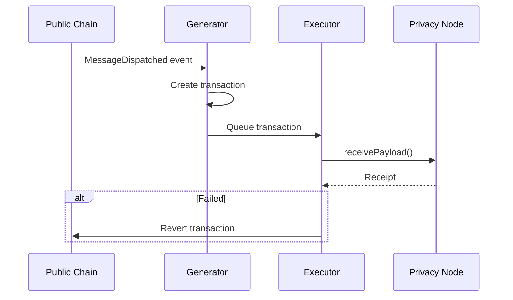
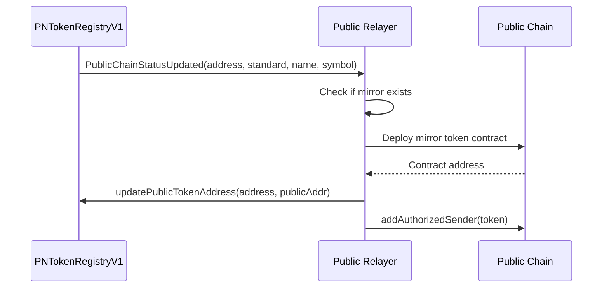

# Public Relayer

The public relayer handles direct communication between a Privacy Node and a public blockchain. It enables bridging assets and messages to/from public chains like Ethereum.

---

## Purpose

The public relayer provides a one-to-one bridge between a Privacy Node and a public chain:

- Relays messages in both directions (private ↔ public)
- Deploys mirror tokens on the public chain
- Handles transaction failures with automatic reverts
- Operates independently of the Private Network Hub

---

## Architecture

### Private → Public Flow

### Public → Private Flow

---

## Message Flow

### Private → Public

1. **Event Detection**: Private Listener monitors `MessageDispatched` from RNMessageDispatcher
2. **Transaction Generation**: Private Generator creates execution transaction
3. **Execution**: Private Executor sends transaction to PublicRNEndpointV1
4. **Receipt Polling**: Waits for transaction confirmation
5. **Revert Handling**: If failed, Revert Service sends revert to source chain

### Public → Private

1. **Event Detection**: Public Listener monitors `MessageDispatched` from public chain
2. **Transaction Generation**: Public Generator creates execution transaction
3. **Execution**: Public Executor sends transaction to RNEndpointV1
4. **Receipt Polling**: Waits for transaction confirmation
5. **Revert Handling**: If failed, Revert Service sends revert to source chain

---

## Token Deployment

When a token is submitted to the public chain on the Privacy Node, the public relayer automatically deploys a mirror on the public chain:

1. **PublicChainStatusUpdated Event**: `PNTokenRegistryV1` emits the event with token details when `submitToPublicChain()` sets `publicChainStatus = PENDING_DEPLOYMENT`
2. **Deployment Check**: Verifies token doesn't already exist on public chain
3. **Mirror Deployment**: Deploys corresponding contract (ERC-20, ERC-721, or ERC-1155)
4. **Address Mapping**: Calls `updatePublicTokenAddress()` to record the public address and set `publicChainStatus = DEPLOYED`
5. **Authorization**: Adds new token as authorized sender via `addAuthorizedSender()`

---

## Contract Interactions

### Privacy Node Contracts (RN Contracts)

| Contract | Events Monitored | Functions Called |
|----------|-----------------|------------------|
| **RNMessageDispatcher** | `MessageDispatched` | - |
| **RNEndpointV1** | - | `receivePayload()` |
| **PNTokenRegistryV1** | `PublicChainStatusUpdated` | `updatePublicTokenAddress()` |

### Public Chain Contracts

| Contract | Events Monitored | Functions Called |
|----------|-----------------|------------------|
| **RNMessageDispatcher** | `MessageDispatched` | - |
| **PublicRNEndpointV1** | - | `receivePayload()` |
| **PublicChainERC20/721/1155** | - | Deploy via factory |

---

## Key Services

### Listener Services

- **Private Listener**: Monitors Privacy Node for outgoing messages and token activations
- **Public Listener**: Monitors public chain for incoming messages

### Generator Services

- **Private Generator**: Creates transactions for public chain execution
- **Public Generator**: Creates transactions for Privacy Node execution

### Executor Services

- **Private Executor**: Sends and monitors transactions to public chain
- **Public Executor**: Sends and monitors transactions to Privacy Node

### Supporting Services

- **Deployer Service**: Deploys mirror tokens on public chain
- **Revert Service**: Handles failed transaction reverts on source chain

---

## Revert Handling

When message execution fails, the public relayer automatically reverts on the source chain:

1. **Failure Detection**: Executor detects failed transaction (receipt status != 1)
2. **Revert Signature**: Retrieves stored revert signature from database
3. **Revert Transaction**: Sends revert to source chain endpoint
4. **State Restoration**: Source chain restores original state

This ensures atomicity - either the message succeeds on the destination or the source state is restored.

---

## Differences from Main Relayer

| Aspect | Public Relayer | Main Relayer |
|--------|---------------|--------------|
| **Path** | Direct (Privacy Node ↔ Public Chain) | Via Hub |
| **Encryption** | Optional | Always encrypted |
| **Token Deployment** | Deploys mirrors | Uses ResourceRegistry |
| **Complexity** | Simpler, direct relay | Complex batching and proofs |
| **Contracts** | RN-prefixed contracts | Endpoint, Teleport |

---

**Navigate:**

- [Back to Relayer Overview](index.md)
- [Relayer](relayer.md)
- [Atomic Service](atomic-service.md)
