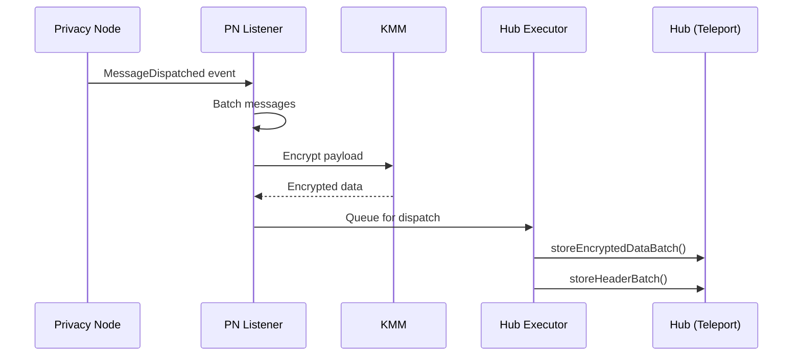
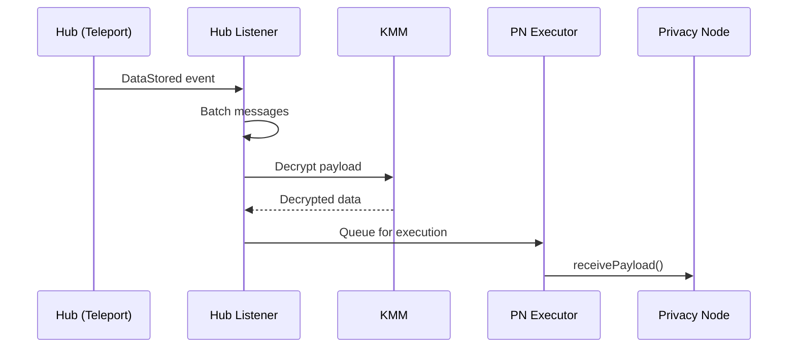

# Relayer

The main relayer handles cross-chain communication between Privacy Nodes through the Private Network Hub. It is the core message transport service for the private Rayls network.

---

## Purpose

The relayer enables Privacy Nodes to communicate with each other by:

- Listening for events on Privacy Nodes and the Hub
- Encrypting outgoing messages using the Key Management Module (KMM)
- Submitting encrypted messages to the Hub's Teleport contract
- Delivering messages from the Hub to destination Privacy Nodes
- Managing cryptographic proofs for message verification

---

## Architecture

### Outgoing Flow (Privacy Node → Hub)

### Incoming Flow (Hub → Privacy Node)

---

## Message Flow

### Privacy Node → Hub (Outgoing)

1. **Event Detection**: PN Listener monitors `MessageDispatched` events from EndpointV1
2. **Batching**: Events are batched (configurable size, default 1000 messages)
3. **Encryption**: Messages encrypted using KMM with recipient's public key
4. **Dispatch**: Hub Executor submits encrypted batch to TeleportV1
5. **Proof Storage**: Block headers and storage proofs stored on Hub

### Hub → Privacy Node (Incoming)

1. **Event Detection**: Hub Listener monitors `DataStored` events from TeleportV1
2. **Batching**: Events batched for efficient processing
3. **Decryption**: Messages decrypted using KMM
4. **Execution**: PN Executor calls `receivePayload()` on destination EndpointV1
5. **Confirmation**: Transaction receipt confirms successful delivery

---

## Contract Interactions

### Privacy Node Contracts

| Contract | Events Monitored | Functions Called |
|----------|-----------------|------------------|
| **EndpointV1** | `MessageDispatched` | `receivePayload()` |
| **EnygmaPLEvents** | Enygma transfer events | - |

### Hub Contracts

| Contract | Events Monitored | Functions Called |
|----------|-----------------|------------------|
| **TeleportV1** | `DataStored`, `AtomicMessageStatusChanged` | `storeEncryptedDataBatch()` |
| **Proofs** | - | `storeHeaderBatch()`, `storeEncryptedStorageProofs()` |
| **ParticipantStorage** | Participant updates | - |
| **TokenRegistry** | Token updates | - |

---

## Key Services

### Listener Services

- **PN Listener**: Monitors Privacy Node for outgoing messages
- **Hub Listener**: Monitors Hub for incoming messages and status updates
- **Merkle Listener**: Tracks merkle tree updates for ZkDVP

### Executor Services

- **PN Executor**: Executes incoming messages on Privacy Node
- **Hub Executor**: Submits outgoing messages to Hub

### Supporting Services

- **Enygma Batching Service**: Handles privacy-preserving transfers with k-anonymity
- **ZkDVP Service**: Coordinates atomic swap operations
- **Merkle Tree Service**: Maintains merkle tree state for inclusion proofs
- **Proof Service**: Generates and stores cryptographic proofs

---

## Transaction States

The relayer tracks messages through multiple states:

| State | Description |
|-------|-------------|
| `SenderStartState` | Initial state when message detected |
| `SenderSentToCCAndAwaitingConfirmation` | Submitted to Hub, waiting for confirmation |
| `SenderSentToCCSuccessfully` | Hub confirmed receipt |
| `SenderSentStorageProofs` | Proofs submitted |
| `DestinationPayloadExecutedAwaitingConfirmation` | Executed on destination |
| `BridgeFlowEIP5164FinishedState` | Complete success |

---

## Encryption

All cross-chain messages are encrypted end-to-end:

1. **Sender encrypts** using shared secret derived from ML-KEM key agreement (keys from ParticipantStorage)
2. **KMM performs** encryption/decryption operations
3. **Only recipient** can decrypt with their private key
4. **Hub cannot read** message contents (stores encrypted data only)

---

## Reliability Features

- **Database persistence**: All state stored for crash recovery
- **Batch processing**: Efficient handling of multiple messages
- **Key rotation**: Multiple signing keys with automatic rotation
- **Retry logic**: Failed transactions retried with backoff
- **Block tracking**: Resumes from last processed block after restart

---

**Navigate:**

- [Back to Relayer Overview](index.md)
- [Public Relayer](public-relayer.md)
- [Atomic Service](atomic-service.md)
