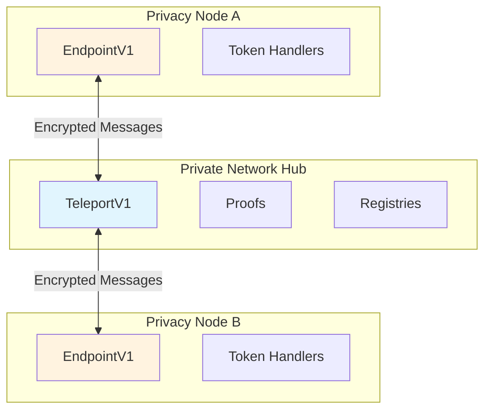
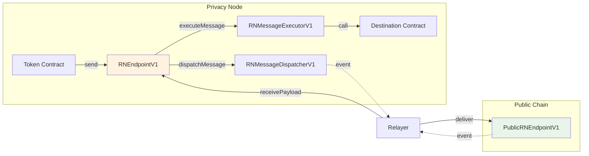
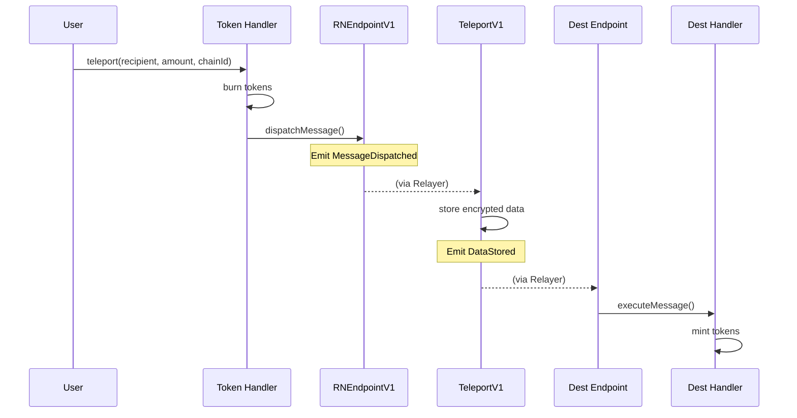

# Smart Contract Architecture

This page explains how smart contracts are organized across the Rayls network and how they interact to enable cross-chain communication.

---

## Contract Layers

Rayls contracts are deployed across three distinct layers:

| Layer | Purpose | Deployed On |
|-------|---------|-------------|
| **Privacy Node** | Local transactions, cross-chain messaging | Each institution's Privacy Node |
| **Private Network Hub** | Message routing, registries, coordination | Shared Besu network |
| **Public Chain** | Bridge to public blockchains | Any EVM-compatible chain |

---

## Communication Patterns

Rayls supports two distinct cross-chain communication patterns, each with its own contract architecture.

### Private ↔ Private (via Hub)

Communication between Privacy Nodes routes through the Private Network Hub using the Teleport contract.



### Private ↔ Public (One-to-One)

Each Privacy Node can connect directly to one public chain using EIP-5164 messaging. This path does not use the Hub's Teleport contract. RNEndpointV1 coordinates the dispatcher (outgoing) and executor (incoming) components.

**Outgoing flow:** Token Contract → Endpoint → Dispatcher → (Relayer) → Public Chain

**Incoming flow:** Public Chain → (Relayer) → Endpoint → Executor → Destination Contract



---

## Message Flow Through Contracts

When a token is transferred cross-chain, messages flow through these contracts:



---

## Key Design Patterns

### UUPS Upgradeable Proxies

All major contracts use the UUPS (Universal Upgradeable Proxy Standard) pattern:

- Proxy contract stores state
- Implementation contract contains logic
- Upgrades change the implementation without losing state
- Only authorized addresses can upgrade

### Modular Architecture

Complex contracts like `ParticipantStorageV1` and `TokenRegistryV1` delegate to specialized modules:

```
ParticipantStorageV1
├── ParticipantCoreV1 (add/remove participants)
├── AuditManagerV1 (audit keys, chain info)
└── EnygmaManagerV1 (ZK public keys)

TokenRegistryV1
├── TokenCoreV1 (registration, lifecycle)
├── TokenFreezeManagerV1 (freeze/unfreeze)
└── EnygmaTokenManagerV1 (privacy tokens)
```

The Privacy Node has its own modular token registry, the PN-side counterpart to the Hub `TokenRegistryV1`:

```
PNTokenRegistryV1
├── PNTokenCoreV1 (registration, lifecycle)
└── PNTokenFreezeManagerV1 (freeze/unfreeze)
```

See [PN Token Registry](pn-token-registry.md) for its three-status model and flows.

### EIP-5164 Cross-Chain Execution

Rayls implements the EIP-5164 standard for cross-chain messaging:

- `dispatchMessage()` - Send a message to another chain
- `executeMessage()` - Execute a received message
- Context (messageId, fromChainId, sender) appended to calldata

---

## Contract Relationships

### Privacy Node Contracts

| Contract | Interacts With | Purpose |
|----------|----------------|---------|
| **RNEndpointV1** | Token Handlers, Relayer | Central message dispatcher/executor |
| **Token Handlers** | Endpoint, User contracts | Process cross-chain token operations |
| **RNContractFactoryV1** | Endpoint | Deploy contracts via CREATE2 |
| **Governance** | Endpoint, Handlers | Manage registrations and permissions |

### Private Network Hub Contracts

| Contract | Interacts With | Purpose |
|----------|----------------|---------|
| **TeleportV1** | Relayers, Proofs | Store and route encrypted messages |
| **Proofs** | TeleportV1, Relayers | Verify block headers |
| **ParticipantStorageV1** | TeleportV1, Relayers | Institution registry |
| **TokenRegistryV1** | TeleportV1, Relayers | Token registry |

---

## Access Control

Contracts use role-based access control:

| Role | Can Do |
|------|--------|
| **Owner** | Upgrade contracts, configure settings |
| **Relayer** | Execute cross-chain messages |
| **Endpoint** | Call handler receive functions |
| **Token Contract** | Dispatch cross-chain messages |

The `receiveMethod` modifier ensures only the trusted Endpoint can call receive functions on handlers.

---

**Navigate:**

- [Back to Smart Contracts Overview](index.md)
