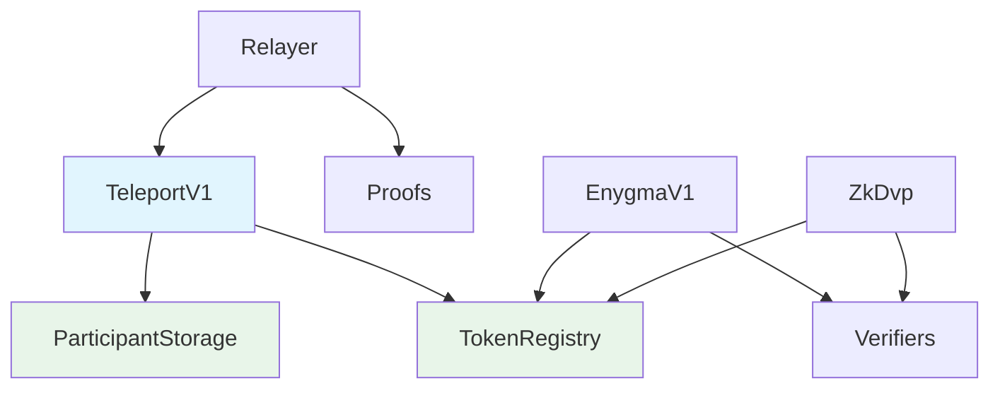

# Private Network Hub Contracts

Smart contracts deployed on the Private Network Hub. These contracts coordinate cross-chain communication, maintain global registries, and manage protocol operations.

---

## Registry Contracts

The Hub maintains global registries that track participants, tokens, and resources across the network.

### ParticipantStorageV1

Central registry of all institutions participating in the network.

**What it does:**

- Stores participant information (chain ID, status, role)
- Manages public keys for encryption (Rayls View Keys, Payment Spend Keys)
- Tracks audit information for compliance
- Broadcasts participant updates to all Privacy Nodes

**Modules:**

- **ParticipantCoreV1** - Add, remove, and update participants
- **AuditManagerV1** - Manage audit keys and chain info
- **EnygmaManagerV1** - Manage ZK public keys for Enygma

### TokenRegistryV1

Global catalog of all tokens promoted to the network. Tokens are registered on a Privacy Node first (via the [PN Token Registry](pn-token-registry.md)); when a node calls `submitToHub`, the token is added here (`addToken`) and the Hub operator activates it with `updateStatus(resourceId, ACTIVE)`.

**What it does:**

- Catalogs submitted tokens with unique resource IDs
- Tracks the Hub-level token status (ACTIVE, frozen)
- Manages token freezing across specific chains
- Broadcasts token updates to Privacy Nodes

**Modules:**

- **TokenCoreV1** - Token cataloging and Hub-level lifecycle
- **TokenFreezeManagerV1** - Freeze and unfreeze tokens
- **EnygmaTokenManagerV1** - Manage privacy token settings

> The PN-side registration entry point (`registerToken`, PN authorization, submission) lives in the [PN Token Registry](pn-token-registry.md); this Hub registry handles only the network-wide catalog.

### ResourceRegistryV1

Maps resource IDs to contract bytecode for cross-chain deployment.

**What it does:**

- Stores contract bytecode and initialization parameters
- Enables consistent contract deployment across chains
- Maps resource IDs to ERC standard (ERC-20, ERC-721, ERC-1155)

---

## Protocol Contracts

These contracts implement the core cross-chain protocols.

### TeleportV1

The main message routing contract on the Hub.

**What it does:**

- Stores encrypted message batches from Privacy Nodes
- Manages atomic message states (Pending → Executed/Reverted)
- Enforces 240-second timeout for atomic transactions
- Emits events for destination Relayers to detect
- Stores block headers for verification

**Message states:**

| State | Description |
|-------|-------------|
| **Pending** | Message received, awaiting execution |
| **Executed** | Successfully executed on destination |
| **Reverted** | Timed out or failed, rolled back |

### Proofs

Stores and verifies Privacy Node block headers.

**What it does:**

- Receives batch header submissions from Relayers
- Validates sequential block order
- Verifies parent hash relationships
- Stores encrypted storage proofs
- Enables header verification for message authenticity

### EnygmaV1

Coordinates the Enygma privacy protocol on the Hub.

**What it does:**

- Manages privacy-preserving token transfers
- Coordinates with k-anonymity batching
- Stores commitment data for ZK proofs
- Works with Gnark verifiers for proof validation

### ZkDvp Contracts

Coordinate atomic swaps (Delivery versus Payment) using zero-knowledge proofs.

**ZkDvpErc721CC:**

- Handles NFT side of atomic swaps
- Manages deposits and withdrawals
- Coordinates cross-chain settlement

**ZkDvpErc1155CC:**

- Handles ERC-1155 tokens in atomic swaps
- Supports batch operations
- Similar flow to ERC-721 variant

**ZkDvpTeleport:**

- Handles teleportation of assets in ZK-DvP operations
- Coordinates cross-chain movement

---

## Verifier Contracts

Zero-knowledge proof verifiers for privacy protocols.

### Enygma Verifiers

Verify ZK proofs for privacy-preserving transfers:

- **VerifierK2** through **VerifierK6** - Different k-anonymity levels
- **DepositToZkDvp verifiers** - Verify deposits
- **WithdrawFromZkDvp verifiers** - Verify withdrawals

### ZkDvp Verifiers

Verify proofs for atomic swaps:

- **Generic verifier** - Standard swap verification
- **ERC721 ownership verifier** - NFT ownership proofs
- **ERC1155 JoinSplit verifier** - Multi-token proofs

---

## Contract Interactions

---

**Navigate:**

- [Back to Smart Contracts Overview](index.md)
