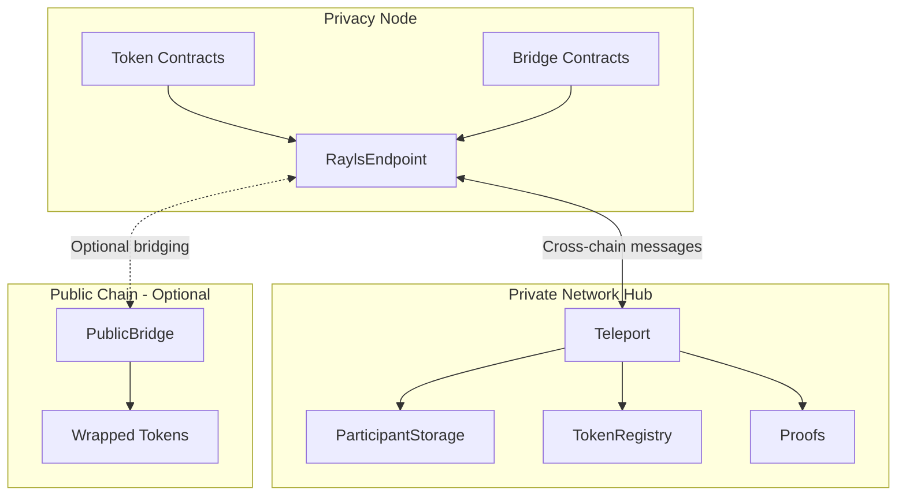
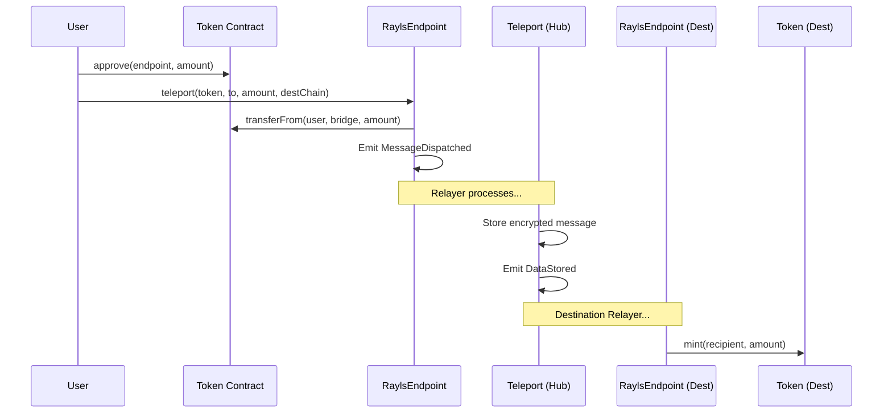

# Smart Contracts Overview

The Rayls ecosystem uses a modular smart contract architecture spanning Privacy Nodes, the Private Network Hub, and optionally public blockchains. This guide provides an overview of all contract categories and their interactions.

---

## Architecture Overview

---

## Contract Categories

### Privacy Node Contracts

Smart contracts deployed on each institution's Rayls Privacy Node for local operations and cross-chain communication.

| Contract | Purpose |
|----------|---------|
| **RaylsEndpoint** | Entry point for all cross-chain messages |
| **Token Contracts** | ERC-20, ERC-721, ERC-1155 implementations |
| **Bridge Contracts** | Token locking and minting for transfers |
| **Enygma Contracts** | Privacy-preserving transfer logic |
| **ZkDVP Contracts** | Atomic swap coordination |

[Learn more →](privacy-node-contracts.md)

---

### Private Network Hub Contracts

Core coordination contracts deployed on the Private Network Hub for network-wide operations.

| Contract | Purpose |
|----------|---------|
| **Teleport** | Message routing and status tracking |
| **ParticipantStorage** | Institution registry and public keys |
| **TokenRegistry** | Token registration and resource IDs |
| **Proofs** | Merkle and header proof verification |
| **EncryptedDataStorage** | Encrypted payload storage |

[Learn more →](hub-contracts.md)

---

### Public Chain Contracts

Contracts for bridging Privacy Nodes to public blockchains (Ethereum, Polygon, etc.).

| Contract | Purpose |
|----------|---------|
| **PublicBridge** | Cross-chain bridge to public networks |
| **Wrapped Tokens** | Token representations on public chains |
| **Validator Registry** | Bridge validator management |

[Learn more →](public-chain-contracts.md)

---

### Governance Contracts

Permission management and authorization contracts across all deployment contexts.

| Contract | Purpose |
|----------|---------|
| **AccessControl** | Role-based permissions |
| **Pausable** | Emergency circuit breakers |
| **Upgradeable** | Proxy patterns for upgrades |

[Learn more →](governance.md)

---

## Contract Interaction Patterns

### Cross-Chain Token Transfer

### Message Flow

1. **Initiation**: User calls RaylsEndpoint with transfer details
2. **Locking**: Source tokens locked in bridge contract
3. **Dispatch**: MessageDispatched event emitted
4. **Relay**: Relayer encrypts and submits to Hub
5. **Route**: Hub stores and emits routing event
6. **Execute**: Destination Relayer executes message
7. **Mint**: Destination tokens minted to recipient

---

## Deployment Locations

| Location | Contracts | Managed By |
|----------|-----------|------------|
| **Privacy Node** | RaylsEndpoint, Tokens, Bridges | Institution |
| **Private Network Hub** | Teleport, Registries, Proofs | Network Operator (Private Network) |
| **Public Chain** | PublicBridge, Wrapped Tokens | Network Operator |

---

## Key Design Principles

### Modularity

Contracts are designed as composable modules:
- Core logic separated from storage
- Upgrade paths via proxy patterns
- Feature toggles for optional capabilities

### Security

- Role-based access control on all admin functions
- Pausable contracts for emergency response
- Reentrancy guards on all state-changing functions
- Comprehensive event logging for auditing

### Interoperability

- EIP-5164 compliant messaging
- Standard token interfaces (ERC-20/721/1155)
- Consistent resource IDs across chains

---

## Quick Links

| Topic | Page |
|-------|------|
| Contract interactions | [Architecture](architecture.md) |
| Privacy Node contracts | [Privacy Node Contracts](privacy-node-contracts.md) |
| Hub contracts | [Hub Contracts](hub-contracts.md) |
| Public chain integration | [Public Chain Contracts](public-chain-contracts.md) |
| Permission management | [Governance](governance.md) |

---

**Navigate:**

- [Back to Components](../index.md)
- [Contract Architecture](architecture.md)
