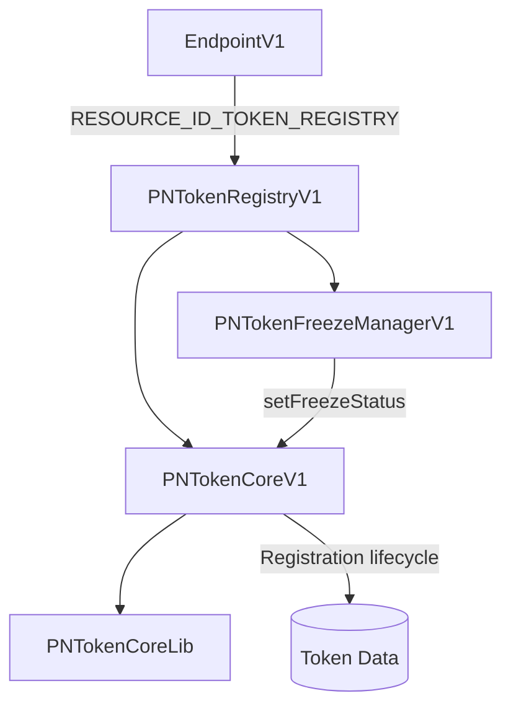
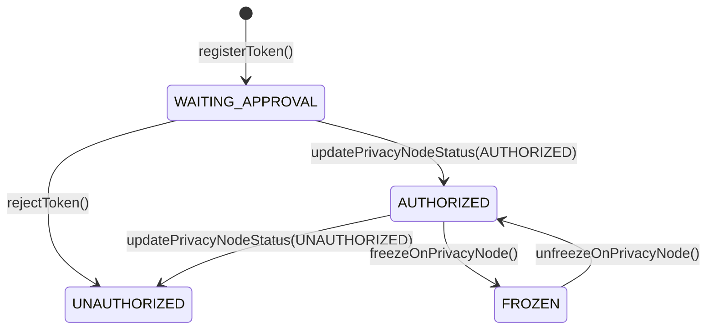
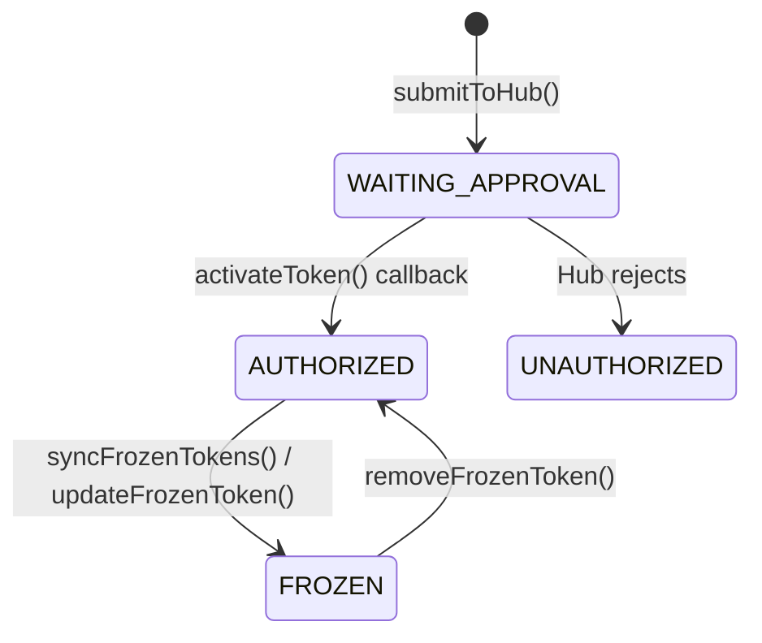
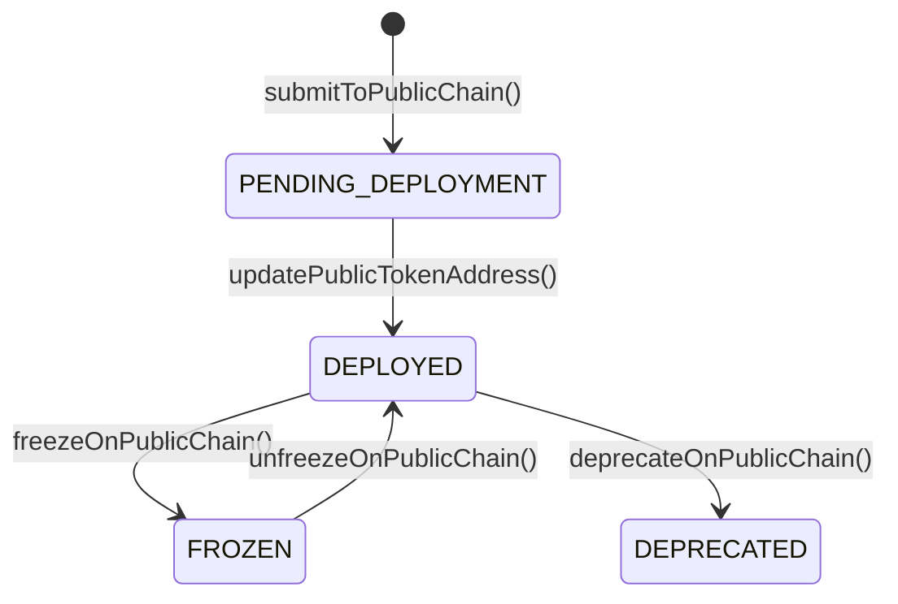
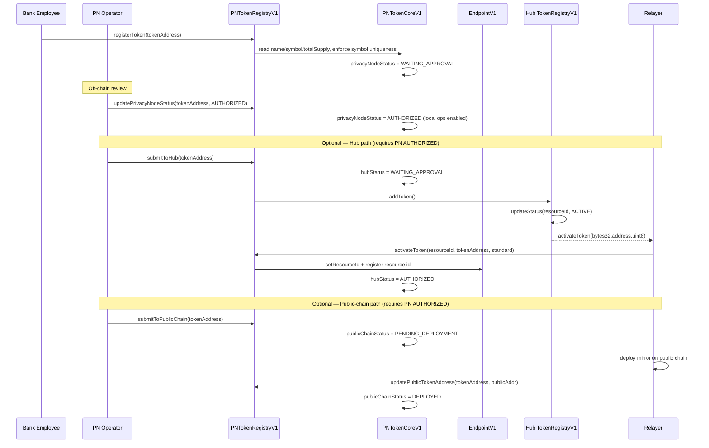

# PN Token Registry

The **PN Token Registry** (`PNTokenRegistryV1`) is the Privacy-Node-side system of record for the token lifecycle. Every token that a Privacy Node issues or receives is registered, authorized, and tracked here before it can be used in local or cross-chain operations.

!!! info "PN side vs Hub side"
    This page documents the **Privacy Node** registry (`PNTokenRegistryV1`, note the `PN` prefix). The **Private Network Hub** has its own separate registry (`TokenRegistryV1`) documented in [Token Registry (Hub)](../../governance/tokens.md). The two use **different status models** and must not be conflated.

---

## What is the PN Token Registry?

Historically, token registration logic was scattered across individual token and handler contracts (each carried its own copy of `submitTokenRegistration`), and public-chain bridging lived in a separate `RNTokenGovernanceV1`. The PN Token Registry **centralizes** all of this into one authoritative subsystem on the Privacy Node.

It **replaces** the removed `TokenRegistryReplicaV1` and `RNTokenGovernanceV1` contracts, and it:

- Registers tokens from a single entry point (`registerToken`), reading `name` / `symbol` / `totalSupply` on-chain and enforcing symbol uniqueness
- Tracks three **independent** lifecycle statuses per token — Privacy Node, Hub, and Public Chain
- Authorizes local operation, submission to the Hub, and submission to a public chain under strong role controls
- Centralizes freeze/unfreeze across all three layers
- Exposes a query surface that handlers read directly (instead of scattered per-function checks), making token state fully observable on the PN side

**Why it exists:** a security initiative to put strong authorization over the token lifecycle, improve dApp integration, and shrink the handler contracts by removing ~6 duplicated copies of the old registration logic.

---

## Contract Architecture

The registry follows the same facade-plus-modules shape as the Hub `TokenRegistry`: a thin `PNTokenRegistryV1` facade delegates to focused modules.

| Contract | Responsibility |
|----------|----------------|
| **PNTokenRegistryV1** | UUPS facade / entry point; delegates to modules |
| **PNTokenCoreV1** | Registration lifecycle, status transitions, query surface |
| **PNTokenCoreLib** | Helper library for `PNTokenCoreV1` |
| **PNTokenFreezeManagerV1** | Freeze / unfreeze across the three layers |

**Deployment & wiring:**

- Registered in the Privacy Node endpoint under `RESOURCE_ID_TOKEN_REGISTRY` (`0x…0003`), so any contract can resolve it via `endpoint.getAddressByResourceId(RESOURCE_ID_TOKEN_REGISTRY)`.
- Initialized with `initialize(endpoint, manager)`.
- Modules are attached with `setTokenCore(...)` and `setTokenFreezeManager(...)`.

!!! note "`setResourceId` moved to the base"
    Handlers no longer define `submitTokenRegistration` or `receiveResourceId`. `setResourceId(bytes32)` now lives on the shared `RaylsApp` base and is guarded so only the token registry (resolved via `RESOURCE_ID_TOKEN_REGISTRY`) can call it.

---

## Status State Machines

A token carries **three independent statuses**, each owned by a different actor. A token can be authorized locally without ever being submitted to the Hub or a public chain.

### Privacy Node status

Owner: **PN operator / local admin**. Governs local operability (mint, transfer, handler ops). **`FROZEN` blocks ALL operations** for the token.

`PrivacyNodeStatus { UNDEFINED, WAITING_APPROVAL, AUTHORIZED, UNAUTHORIZED, FROZEN }`

### Hub status

Owner: **Private Network Hub** (set via cross-chain callbacks). Governs cross-chain (Hub) operability for this token. `FROZEN` blocks Hub cross-chain ops for this chain.

`HubStatus { UNDEFINED, WAITING_APPROVAL, AUTHORIZED, UNAUTHORIZED, FROZEN }`

### Public Chain status

Owner: **relayer / bridge**. Governs the public-chain mirror. `FROZEN` blocks public-chain ops only.

`PublicChainStatus { UNDEFINED, PENDING_DEPLOYMENT, DEPLOYED, FROZEN, DEPRECATED }`

### Freeze layers

Freeze operations target one of three layers via an internal `setFreezeStatus` call from the freeze manager into `PNTokenCoreV1`:

`FreezeLayer { PRIVACY_NODE, HUB, PUBLIC_CHAIN }`

| Layer owner | Status enum | Set by |
|-------------|-------------|--------|
| PN operator / local admin | `PrivacyNodeStatus` | local calls |
| Private Network Hub | `HubStatus` | cross-chain callbacks |
| Relayer / bridge | `PublicChainStatus` | public-chain relayer |

---

## Registration Flow

Registration always originates on the Privacy Node with `registerToken`. Submission to the Hub and to a public chain are **optional** and both require the token to be PN `AUTHORIZED` first.

!!! info "Two distinct approvals"
    - **PN approval** — `updatePrivacyNodeStatus(tokenAddress, AUTHORIZED)` (`AUTHORIZED` = `2`) enables local operability.
    - **Hub approval** — the Hub operator calls `updateStatus(resourceId, ACTIVE)` (`ACTIVE` = `1`) on the **Hub** registry; the relayer then delivers the `activateToken(bytes32,address,uint8)` callback that sets `hubStatus = AUTHORIZED` on the PN side.

!!! note "Receiving nodes auto-register"
    On a node that only *receives* a token, the Hub `activateToken` callback auto-registers and authorizes the mirror. A second node does **not** re-run `registerToken` / `updatePrivacyNodeStatus`.

---

## Token Freezing

Freeze is layered so an operator can isolate a token at exactly the scope required for compliance. Enforcement happens in the handlers, which read the registry (`privacyNodeStatus == AUTHORIZED`, `isTokenActiveForHub()`, `isTokenActiveForPublicChain()`) rather than performing scattered per-function checks.

| Layer | Freeze fn | Unfreeze fn | Owner |
|-------|-----------|-------------|-------|
| Privacy Node | `freezeOnPrivacyNode` | `unfreezeOnPrivacyNode` | PN operator / admin |
| Hub (cross-chain sync from PNH) | `syncFrozenTokens` / `updateFrozenToken` | `removeFrozenToken` | Private Network Hub |
| Public Chain | `freezeOnPublicChain` | `unfreezeOnPublicChain` | Relayer |

!!! note "PN freeze notifies the Hub"
    `freezeOnPrivacyNode` emits an event so the Hub operator can independently decide whether to also freeze the token at the Hub level.

### Freeze-scope matrix

| Frozen layer | Local ops (mint / transfer / handler) | Hub cross-chain ops | Public-chain ops |
|--------------|:-------------------------------------:|:-------------------:|:----------------:|
| **Privacy Node FROZEN** | Blocked | Blocked | Blocked |
| **Hub FROZEN** | Allowed | Blocked | Allowed |
| **Public Chain FROZEN** | Allowed | Allowed | Blocked |

A Privacy Node freeze is the broadest control — it halts **all** operations for the token. Hub and Public Chain freezes are scoped to their respective layer only.

---

## Query Surface

`PNTokenCoreV1` exposes read methods used by handlers, tooling, and dApps:

| Method | Returns |
|--------|---------|
| `getAllTokens()` | All tokens registered on this Privacy Node |
| `getTokenByAddress(address)` | Token record by local address |
| `getTokenByResourceId(bytes32)` | Token record by resource ID |
| `getTokenBySymbol(string)` | Token record by symbol |
| `getPrivacyNodeStatus(address)` | Current `PrivacyNodeStatus` |
| `getHubStatus(address)` | Current `HubStatus` |
| `getPublicChainStatus(address)` | Current `PublicChainStatus` |
| `isTokenFullyOperational(address)` | `true` when the token is usable across all applicable layers |
| `isTokenActiveForHub(address)` | `true` when Hub cross-chain ops are allowed |
| `isTokenActiveForPublicChain(address)` | `true` when public-chain ops are allowed |

---

## Role Mappings

Selectors on `PNTokenRegistryV1` are guarded by business roles via the AccessManager:

| Function | Required role |
|----------|---------------|
| `registerToken` | **BANK_EMPLOYEE** |
| `updatePrivacyNodeStatus` | **PRIVACY_NODE_OPERATOR** |
| `submitToHub` | **PRIVACY_NODE_OPERATOR** |
| `submitToPublicChain` | **PRIVACY_NODE_OPERATOR** |

See [Roles and Permissions](../../governance/authorization/roles-and-permissions.md) for the full role model.

---

**Navigate:**

- [Token Registry (Hub)](../../governance/tokens.md) - The Hub-side registry and its status model
- [Privacy Node Contracts](privacy-node-contracts.md) - Other contracts on the Privacy Node
- [Token Bridging](../public-chain/token-bridging.md) - Public-chain mirror lifecycle
