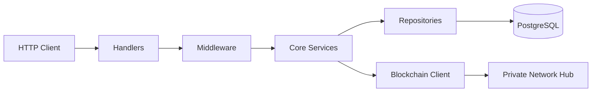
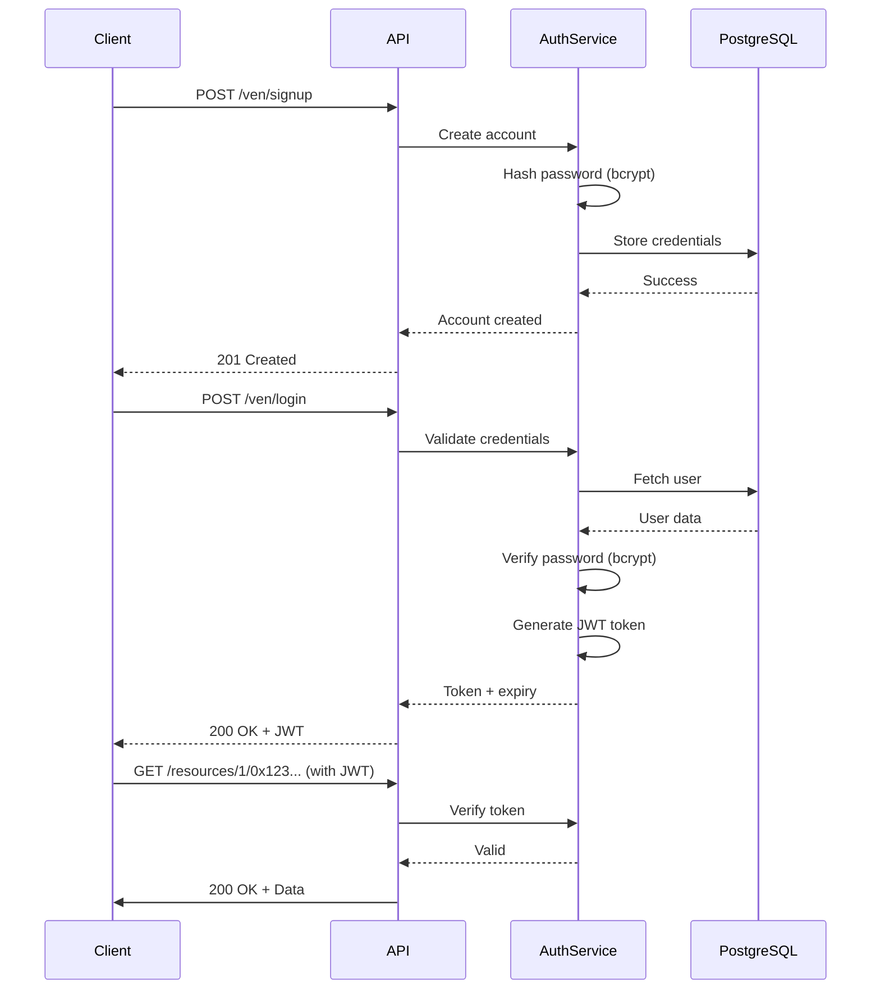
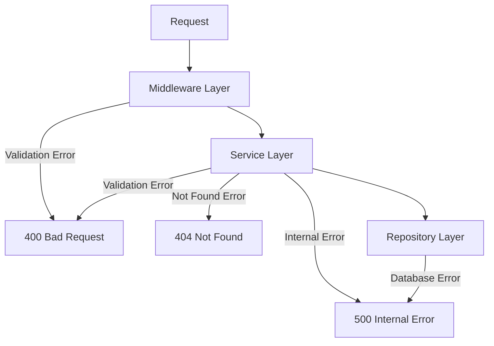

# API Service

The API Service provides REST endpoints to query governance data collected by the Listener, provided data by the Flagger, manage authentication, and access on-chain token information.

---

## Purpose

The API Service is the data access layer of the Governance Services:

- **Audit Endpoints**: Query participants, tokens, and transactions
- **Balance Tracking**: Real-time balance information across chains
- **Authentication**: JWT-based authentication for Private Networks
- **Compliance**: Access flagged transactions and header proofs
- **On-Chain Data**: Query token registry status from blockchain

---

## Architecture

The API follows Hexagonal Architecture principles with clear separation of concerns:



**Layers:**

- **Handlers**: HTTP request/response mapping
- **Middleware**: Authentication, validation, CORS
- **Core Services**: Business logic and validation
- **Repositories**: Main adapter responsible for data access
- **Other adapters**: External integrations (blockchain, metadata)

---

## API Endpoints

### Audit Endpoints

#### Transactions

| Method | Endpoint                                    | Description                            |
| ------ | ------------------------------------------- | -------------------------------------- |
| `GET`  | `/audit/transactions`                       | List transactions with filters         |
| `GET`  | `/audit/transactions/:messageId`            | Get transaction by message ID          |
| `GET`  | `/audit/transactions/dvp/:transactionId`    | Get DVP Swap transaction by ID         |
| `GET`  | `/audit/transactions/enygma/batch/:batchId` | Get Enygma transactions by batch ID    |
| `GET`  | `/audit/transactions/batch/:batchId`        | Get regular transactions by batch ID   |
| `GET`  | `/audit/transactions/dvp/swap/:sharedId`    | Get DVP swap transactions by shared ID |

**Transaction Filters:**

- `messageId` - Filter by message ID
- `sourceChainId` - Source chain identifier
- `destinationChainId` - Destination chain identifier
- `fromAddress` - Sender address
- `toAddress` - Recipient address
- `resourceId` - Token resource identifier
- `messageType` - Message type (erc20, erc721, erc1155, enygma, dvp_erc721, dvp_erc1155)
- `initiatedAfter` - Transactions after timestamp (Unix, YYYY-MM-DD, or ISO8601)
- `initiatedBefore` - Transactions before timestamp (Unix, YYYY-MM-DD, or ISO8601)
- `page` - Page number (default: 1)
- `limit` - Items per page (default: 10, max: 100)

#### Participants

| Method | Endpoint                       | Description                    |
| ------ | ------------------------------ | ------------------------------ |
| `GET`  | `/audit/participants`          | List participants with filters |
| `GET`  | `/audit/participants/:chainId` | Get participant by chain ID    |

**Participant Filters:**

- `name` - Filter by participant name
- `status` - Filter by status (new, active, inactive)
- `role` - Filter by role (participant, issuer, auditor)
- `createdAfter` - Created after timestamp
- `createdBefore` - Created before timestamp

#### Tokens

| Method | Endpoint                    | Description              |
| ------ | --------------------------- | ------------------------ |
| `GET`  | `/audit/tokens`             | List tokens with filters |
| `GET`  | `/audit/tokens/:resourceId` | Get token by resource ID |

**Token Filters:**

- `name` - Filter by token name
- `symbol` - Filter by token symbol
- `issuerId` - Filter by issuer ID
- `status` - Filter by status (new, active, inactive)
- `ercStandard` - Filter by standard (custom, erc20, erc721, erc1155, enygma, dvp_erc721, dvp_erc1155)
- `decimals` - Filter by decimal places
- `createdAfter` - Created after timestamp
- `createdBefore` - Created before timestamp
- `page` - Page number
- `limit` - Items per page

!!! note "Hub-side status vs. PN-side status"
    The `status` filter here reflects the **Hub** token catalog, which the Governance API monitors. It uses the Hub's `new`/`active`/`inactive` model. This is separate from the PN-side three-status model (`PrivacyNodeStatus`, `HubStatus`, `PublicChainStatus`) tracked by [`PNTokenRegistryV1`](../components/smart-contracts/pn-token-registry.md) on each Privacy Node.

#### Header Proofs

| Method | Endpoint               | Description                   |
| ------ | ---------------------- | ----------------------------- |
| `GET`  | `/audit/header-proofs` | List header proof submissions |

**Header Proof Filters:**

- `chainId` - Filter by chain ID
- `startBlock` - Start block number (inclusive)
- `endBlock` - End block number (inclusive)
- `page` - Page number
- `pageSize` - Items per page

---

### Compliance Endpoints

| Method | Endpoint   | Description                  |
| ------ | ---------- | ---------------------------- |
| `GET`  | `/flagged` | Get all flagged transactions |

---

### Authentication Endpoints

| Method | Endpoint      | Description                    | Auth Required |
| ------ | ------------- | ------------------------------ | ------------- |
| `POST` | `/ven/signup` | Register new Private Network   | No            |
| `POST` | `/ven/login`  | Authenticate and get JWT token | No            |

**Sign Up Request:**
```json
{
  "username": "network_name",
  "password": "secure_password"
}
```

**Login Request:**
```json
{
  "username": "network_name",
  "password": "secure_password"
}
```

**Login Response:**
```json
{
  "token": "eyJhbGciOiJIUzI1NiIsInR5cCI6IkpXVCJ9...",
  "expiresAt": "2026-02-28T12:00:00Z"
}
```

---

### Balance Endpoints (Authenticated)

| Method | Endpoint                                | Description                                         | Auth Required |
| ------ | --------------------------------------- | --------------------------------------------------- | ------------- |
| `GET`  | `/resources/:chainid/:resourceid`       | Get balance for specific resource in specific chain | Yes           |
| `GET`  | `/resource_info_all_chains/:resourceid` | Get resource balance across all chains              | Yes           |
| `POST` | `/resource_info_list_chains`            | Get resource balance across specific chains         | Yes           |

**List Chains Request:**

```json
{
  "resourceId": "0x1234...",
  "chainIds": ["1", "137", "42161"]
}
```

---

### Blockchain Endpoints (Authenticated)

| Method | Endpoint                    | Description                      | Auth Required |
| ------ | --------------------------- | -------------------------------- | ------------- |
| `GET`  | `/token_status/:resourceid` | Get token status from blockchain | Yes           |

---

## Authentication Flow



**JWT Claims:**

- `sub` - Private Network username
- `exp` - Token expiration (30 days from issue)
- `iat` - Token issue timestamp

---

## Request Validation

The API implements comprehensive validation:

### Query Parameter Validation

**Middleware:** `ValidateQueryParams`

Validates:

- Unknown parameters (400 Bad Request)
- Empty parameter values (400 Bad Request)
- Enum values via Gin binding tags

**Example:**

```
GET /audit/transactions?messageType=invalid
→ 400 Bad Request: "messageType must be one of: erc20, erc721, ..."

GET /audit/transactions?unknownParam=value
→ 400 Bad Request: "Unknown query parameter: unknownParam"
```

### Service Layer Validation

**Core services validate:**

- Required fields not empty
- Hex string formats (addresses, resource IDs)
- Timestamp range logic (after < before)
- Future timestamps rejected
- Enum values against allowed sets

---

## Response Formats

### Paginated Responses

```json
{
  "data": [...],
  "total": 150,
  "page": 1,
  "limit": 10
}
```

### Transaction Detail

```json
{
  "messageId": "0x1234...",
  "sourceChainId": "1",
  "sourceAddress": "0xabc...",
  "sourceTimestamp": "1706630400",
  "sourceTransactionHash": "0xcdf...",
  "destinationChainId": "137",
  "destinationAddress": "0xdef...",
  "destinationTimestamp": "1706630500",
  "destinationTransactionHash": "0xzxy...",
  "amount": "10000",
  "resourceId": "0x5678...",
  "messageType": "erc20",
  "protocol": "atomic",
  "status": "executed",
  "tokenName": "Test Token",
  "tokenSymbol": "TEST",
  "createdAt": "2026-01-30T12:00:00Z"
}
```

### Token Detail

```json
{
    "resourceId": "290decd9548b62a8d60",
    "name": "9eae8f",
    "symbol": "9eae8f",
    "metadataUrl": "",
    "decimals": 0,
    "issuerId": "12345",
    "status": "active",
    "ercStandard": "erc20",
    "totalSupply": "2000000000000000000000000",
    "circulatingSupply": [
      {
        "participantId": "12345",
        "balance": "1999999999999999999999970"
      },
      {
        "participantId": "12346",
        "balance": "30"
      }
    ],
    "frozenChainIds": ["12345"],
    "createdAt": "2026-01-30T13:58:21.841804Z",
    "updatedAt": "2026-01-30T13:58:21.841804Z"
  }
```

The `frozenChainIds` field lists the chain IDs where the token is currently frozen. An empty array means the token is not frozen on any chain. See [Token Freezing](tokens.md#token-freezing) for details on how freeze operations work.

### Participant Detail

```json
  {
    "id": "6379",
    "createdAt": "2026-01-30T13:24:51Z",
    "updatedAt": "2026-01-30T13:36:23.230051Z",
    "chainId": 999,
    "name": "Auditor",
    "ownerId": "0xf39Fd6e51aad88F6F4ce6aB8827279cffFb92266",
    "status": "active",
    "role": "auditor",
    "allowedToBroadcast": true,
    "isFlagged": false
  }
```

---

## Error Handling

The API uses a layered error handling strategy with consistent JSON responses.



---

### Error Response Format

```json
{
  "error": "Error message",
  "hint": "Additional context (optional)"
}
```

---

### HTTP Status Codes

| Code  | Meaning               | When                                   |
| ----- | --------------------- | -------------------------------------- |
| `200` | OK                    | Successful request                     |
| `201` | Created               | Resource created (signup)              |
| `400` | Bad Request           | Invalid parameters or validation error |
| `401` | Unauthorized          | Missing or invalid JWT token           |
| `404` | Not Found             | Resource doesn't exist                 |
| `500` | Internal Server Error | Database or unexpected error           |

---

### Common Error Examples

#### Validation Errors (400)

**Invalid enum value:**
```json
{
  "error": "Parameter 'messageType' has an invalid value: invalid",
  "hint": "Allowed values: erc20, erc721, erc1155, enygma, dvp_erc721, dvp_erc1155"
}
```

**Unknown parameters:**
```json
{
  "error": "Unknown query parameter(s): unknownParam",
  "hint": "Allowed parameters: messageId, sourceChainId, destinationChainId, ..."
}
```

**Empty values:**
```json
{
  "error": "Empty value for query parameter(s): status",
  "hint": "Query parameters must have a non-empty value or be omitted entirely"
}
```

**Invalid format:**
```json
{
  "error": "validation error on field 'resourceId': resourceId must be a valid hex string"
}
```

**Timestamp errors:**
```json
{
  "error": "validation error on field 'createdAfter/createdBefore': 'after' timestamp must be earlier than 'before' timestamp"
}
```

---

#### Not Found Errors (404)

```json
{
  "error": "transaction not found: 0x1234..."
}
```

---

#### Authentication Errors (401)

**Invalid credentials:**
```json
{
  "error": "invalid credentials"
}
```

**Missing/invalid token:**
```json
{
  "error": "missing or invalid token"
}
```

---

#### Internal Errors (500)

```json
{
  "error": "internal server error"
}
```

**Note:** Full error details are logged server-side but not exposed to prevent leaking implementation details.

---

## Timestamp Formats

The API accepts multiple timestamp formats:

| Format       | Example                | Use Case                    |
| ------------ | ---------------------- | --------------------------- |
| Unix seconds | `1706630400`           | Numeric timestamps          |
| ISO 8601     | `2026-01-30T12:00:00Z` | Full datetime with timezone |
| Date only    | `2026-01-30`           | Date-based filtering        |

**Notes:**

- All timestamps are interpreted in **UTC timezone**
- Date-only format (`YYYY-MM-DD`) is treated as **00:00:00 UTC** on that date

---

## Swagger Documentation

Interactive API documentation available at:

```
http://localhost:8080/swagger/index.html
```

To regenerate Swagger docs:

```bash
./generate-docs.sh
```

---

## Middleware

### Authentication Middleware

**Purpose:** Validates JWT tokens for protected endpoints

**Applied to:**

- `/resources/*`
- `/resource_info_all_chains/*`
- `/resource_info_list_chains`
- `/participant_info/*`
- `/token_status/*`

**Behavior:**

- Extracts token from `Authorization: Bearer <token>` header
- Validates token signature and expiration
- Injects username into request context
- Returns 401 if invalid

### Query Parameter Validation Middleware

**Purpose:** Validates query parameters against DTO struct tags

**Applied to:**

- `/audit/transactions`
- `/audit/participants`
- `/audit/tokens`
- `/audit/header-proofs`

**Validation Rules:**

- Unknown Parameters - Rejects parameters not defined in DTO struct form tags
- Empty Values - Rejects parameters with empty strings (e.g., ?status=)
- Enum Validation - Validates values against enums tag constraints
- URL Encoding - Checks for malformed query encoding (via separate middleware)

---

## Dependencies

**Core:**

- Gin Web Framework - HTTP routing and middleware
- GORM - Database ORM
- PostgreSQL - Data persistence

**Security:**

- golang-jwt/jwt - JWT token generation
- bcrypt - Password hashing

**Blockchain:**

- go-ethereum - Ethereum client for on-chain queries

**Documentation:**

- swaggo/swag - Swagger generation
- swaggo/gin-swagger - Swagger UI integration

---

**Navigate:**

- [Back to Governance Services Overview](governance-services.md)
- [Listener Service](listener-service.md) - Data ingestion
- [Flagger Service](flagger-service.md) - Compliance validation
