# Access Manager

The Rayls Authorization System is built on two contracts that implement a clean separation of concerns:

- **RaylsAccessManagerV1** is the central authority contract. It owns all authorization state: roles, role memberships, function-to-role mappings, managed contract configurations, and scheduled operations. No consumer contract stores any role information.
- **RaylsAccessManaged** is the abstract base contract that consumer contracts inherit. It provides a single `restricted` modifier that delegates every authorization decision to the AccessManager via `canCall()`.

This separation means that adding new roles, changing who can call which function, or pausing a contract are all pure admin transactions on the AccessManager. Consumer contracts never need to be recompiled or redeployed for authorization changes.

## System Architecture

### High-Level Component Diagram

The diagram below shows all consumer contracts grouped by layer, each connected to the central `RaylsAccessManagerV1` via the `canCall` check. Dashed lines indicate inheritance from `RaylsAccessManaged`.

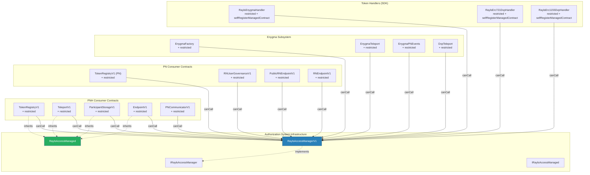

### Design Principles

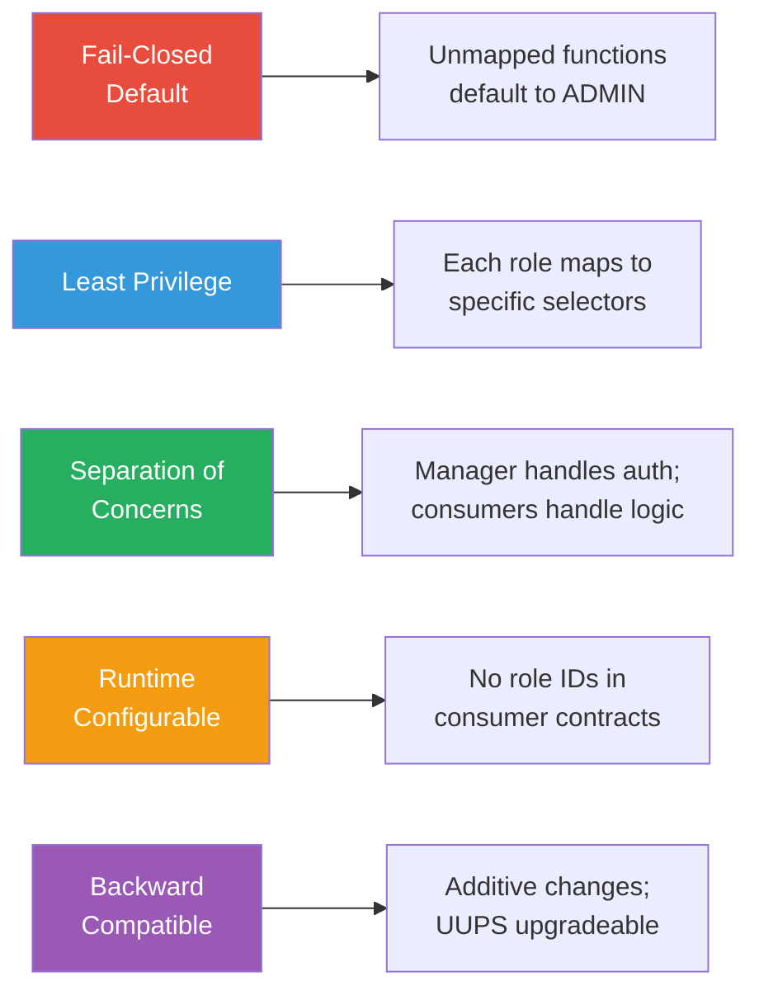

## Core Data Model

### ERC-7201 Namespaced Storage

All AccessManager state lives in a single ERC-7201 namespaced storage struct, isolated from consumer contract storage to prevent upgrade collisions.

**Storage namespace:** `(keccak256("rayls.storage.RaylsAccessManagerV1") - 1) & ~uint256(0xff)`

`RaylsAccessManaged` uses a separate namespace: `(keccak256("rayls.storage.RaylsAccessManaged") - 1) & ~uint256(0xff)`

### Class Diagram

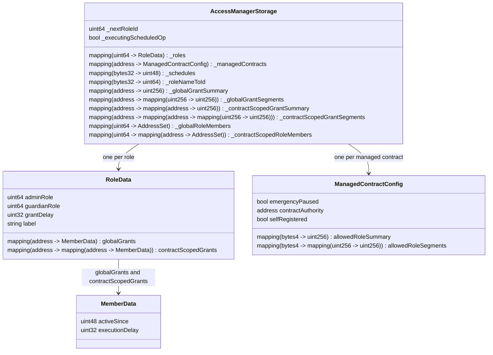

!!! info "Managed Contracts"
    A **managed contract** is any contract that uses the `restricted` modifier and delegates its authorization to the AccessManager.

### Storage Structure Overview

The navigational diagram below shows how you traverse the data. Each arrow is a lookup, and the label shows what key you use:

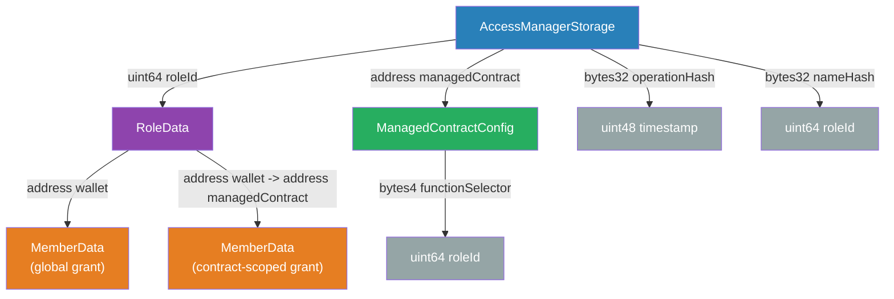

Each arrow shows a mapping -- the label is the key used to look up the value. For example, `_roles[roleId]` means: given a numeric role ID (like `1`), you get the `RoleData` for that role.

### Root Storage: AccessManagerStorage

All data lives in one struct. Each field is a mapping keyed by a specific identifier type:

| Field (Solidity name) | Key | Value | What It Stores |
|---|---|---|---|
| `_roles` | role ID (e.g., `3`) | `RoleData` | Everything about a role: its admin, guardian, members, label |
| `_managedContracts` | managed contract address (e.g., `0xTokenRegistry`) | `ManagedContractConfig` | Which roles can call which functions on this managed contract |
| `_schedules` | operation hash (keccak256 of caller + managed contract + calldata) | timestamp | When a delayed operation can be executed |
| `_roleNameToId` | keccak256 of role name (e.g., `keccak256("RELAYER")`) | role ID (e.g., `3`) | Lookup: human-readable name to numeric role ID |
| `_nextRoleId` | -- | counter (starts at `3`; roles 0, 1, 2 are reserved) | Auto-incremented when `registerRole()` is called. First custom role gets ID 3. |
| `_globalGrantSummary` | member address | uint256 bitmap | Summary bitmap of all roles held globally by this address |
| `_globalGrantSegments` | member address + segment index | uint256 bitmap | Detail bitmap for a specific segment of globally held roles |
| `_contractScopedGrantSummary` | member address + contract address | uint256 bitmap | Summary bitmap of all roles held by this address on a specific contract |
| `_contractScopedGrantSegments` | member address + contract address + segment index | uint256 bitmap | Detail bitmap for contract-scoped roles |
| `_executingScheduledOp` | -- | bool | Flag set during `execute()` to signal the re-entrant `canCall` check |
| `_globalRoleMembers` | role ID | EnumerableSet.AddressSet | Enumerable set of addresses holding this role globally |
| `_contractScopedRoleMembers` | role ID + contract address | EnumerableSet.AddressSet | Enumerable set of addresses holding this role on a specific contract |

### RoleData

Each role ID maps to a `RoleData` struct:

| Field | Type | What It Is | Example |
|---|---|---|---|
| `adminRole` | uint64 (role ID) | Which role can grant/revoke **this** role | `0` = ADMIN administers this role |
| `guardianRole` | uint64 (role ID) | Which role can cancel this role's scheduled operations | `1` = PRIVACY_NODE_OPERATOR can cancel |
| `grantDelay` | uint32 (seconds) | How long before new grants activate (0 = immediate) | `172800` = 48 hours |
| `label` | string | Human-readable name | `"PRIVACY_NODE_OPERATOR"` |
| `globalGrants` | mapping(address -> MemberData) | **Global** grants -- this address holds the role on ALL managed contracts | `0xBankAdmin -> {activeSince: March 1, delay: 0}` |
| `contractScopedGrants` | mapping(address -> mapping(address -> MemberData)) | **Contract-scoped** grants -- this address holds the role on ONE specific managed contract | `0xAlice -> 0xMyToken -> {activeSince: March 5, delay: 0}` |

### MemberData

Stored per (role, address) for global grants, or per (role, address, managed contract) for contract-scoped grants:

| Field | Type | What It Is | Example |
|---|---|---|---|
| `activeSince` | uint48 (timestamp) | When this grant becomes active. `0` = not a member. | `1711929600` (March 1 2024). If grant delay = 48h, this is `now + 48h`. |
| `executionDelay` | uint32 (seconds) | How long this member must wait after scheduling a delayed operation. `0` = can execute immediately. | `86400` = 24 hours |

### ManagedContractConfig

| Field | Type | What It Is | Example |
|---|---|---|---|
| `emergencyPaused` | bool | Emergency pause. `true` = ALL `restricted` functions on this managed contract are blocked. | `false` |
| `contractAuthority` | address (wallet) | Who can grant/revoke contract-scoped roles on this managed contract. Set by `selfRegisterManagedContract()`. | `0xTokenDeployer` (the wallet that deployed this token) |
| `selfRegistered` | bool | One-shot guard: `true` = `selfRegisterManagedContract()` was already called. Prevents re-registration. | `true` |
| `allowedRoleSummary` | mapping(bytes4 => uint256) | Summary bitmap per selector -- one bit per 256-role segment. Indicates which segments have allowed roles. | `freezeToken.selector` -> summary with bit 0 set (roles 0-255 have entries) |
| `allowedRoleSegments` | mapping(bytes4 => mapping(uint256 => uint256)) | Detail bitmap per selector per segment. Each bit corresponds to a specific role. | `freezeToken.selector` -> segment 0 -> bitmap with bits 3 and 10 set (COMPLIANCE_OFFICER + COMPLIANCE_TOOL) |

### Concrete Storage Example

To make the abstract types concrete, here is what the storage would look like for a Privacy Node with two business roles, one infrastructure role, two wallets, one singleton managed contract, and one dynamically deployed token.

```
=====================================================================
 ROLES
=====================================================================

_roles[1] (PUBLIC -- built-in):
  |-- (Function-level property. Set on functions to make them open.
  |    grantRole(PUBLIC, ...) reverts with PublicRoleCannotBeGranted.)
  \-- globalGrants: (empty -- PUBLIC cannot be granted to individuals)

_roles[2] (TOKEN_OWNER -- built-in, for dynamically deployed tokens):
  |-- adminRole     = 0
  |-- guardianRole  = 0
  |-- grantDelay    = 0
  |-- label         = "TOKEN_OWNER"
  |-- globalGrants: (empty -- TOKEN_OWNER is always contract-scoped, never global)
  \-- contractScopedGrants:
      \-- [0xTokenDeployer] -> [0xMyToken contract] = { activeSince: 1711929600, executionDelay: 0 }
          0xTokenDeployer can call mint() and burn() ONLY on 0xMyToken.
          They cannot call mint() on any other token -- the grant is scoped.

_roles[3] (RELAYER -- infrastructure, first custom role):
  |-- adminRole     = 0    (ADMIN can grant/revoke)
  |-- guardianRole  = 0    (ADMIN can cancel scheduled ops)
  |-- grantDelay    = 0
  |-- label         = "RELAYER"
  |-- globalGrants:
  |   \-- [0xRelayer1]  = { activeSince: 1711929600, executionDelay: 0 }
  |       This wallet can call ANY function mapped to RELAYER on ANY managed contract.
  |       Example: receivePayload() on EndpointV1, enygmaTransferCompleted() on EnygmaTeleport.
  \-- contractScopedGrants: (empty -- relayer needs global access, not per-contract)

_roles[4] (PRIVACY_NODE_OPERATOR -- business):
  |-- adminRole     = 0    (ADMIN can grant/revoke)
  |-- guardianRole  = 0
  |-- grantDelay    = 0
  |-- label         = "PRIVACY_NODE_OPERATOR"
  |-- globalGrants:
  |   \-- [0xBankAdmin]  = { activeSince: 1711929600, executionDelay: 0 }
  |       This wallet can call ANY function mapped to PRIVACY_NODE_OPERATOR on ANY managed contract.
  |       Example: updatePrivacyNodeStatus() on TokenRegistryV1 (PN), createUser() on RNUserGovernanceV1.
  \-- contractScopedGrants: (empty)

_roles[5] (BANK_EMPLOYEE -- business):
  |-- adminRole     = 4    (PRIVACY_NODE_OPERATOR can grant/revoke BANK_EMPLOYEE)
  |-- guardianRole  = 4    (PRIVACY_NODE_OPERATOR can cancel BANK_EMPLOYEE's scheduled ops)
  |-- grantDelay    = 0
  |-- label         = "BANK_EMPLOYEE"
  |-- globalGrants:
  |   |-- [0xBankAdmin]  = { activeSince: 1711929600, executionDelay: 0 }
  |   |   0xBankAdmin also holds BANK_EMPLOYEE (in addition to PRIVACY_NODE_OPERATOR).
  |   |   This is needed because registerToken() is mapped to BANK_EMPLOYEE, not PRIVACY_NODE_OPERATOR.
  |   |   The "admin-of" relationship does NOT inherit function permissions.
  |   \-- [0xEmployee1] = { activeSince: 1711929600, executionDelay: 0 }
  \-- contractScopedGrants: (empty)

=====================================================================
 MANAGED CONTRACTS
=====================================================================

_managedContracts[0xTokenRegistryPN]:
  |-- allowedRoles (bitmap):
  |   |-- [registerToken selector]            -> bitmap with bit 4 set   (BANK_EMPLOYEE)
  |   |-- [updatePrivacyNodeStatus selector]  -> bitmap with bit 3 set   (PRIVACY_NODE_OPERATOR)
  |   \-- [getToken selector]                 -> bitmap empty (unmapped -> defaults to ADMIN only)
  |-- emergencyPaused   = false
  |-- contractAuthority = address(0)   <-- EXPECTED for singletons.
  |   This contract was deployed and configured by deployment scripts, not self-registered.
  |   Permissions are managed by ADMIN via addFunctionAllowedRoles() and grantRole().
  \-- selfRegistered    = false

_managedContracts[0xMyToken]:
  |-- allowedRoles (bitmap):
  |   |-- [mint selector]            -> bitmap with bit 2 set   (TOKEN_OWNER)
  |   |-- [burn selector]            -> bitmap with bit 2 set   (TOKEN_OWNER)
  |   |-- [crossMint selector]       -> bitmap with bit 3 set   (RELAYER)
  |   \-- [receiveTeleport selector] -> bitmap with MESSAGE_EXECUTOR bit set
  |-- emergencyPaused   = false
  |-- contractAuthority = 0xTokenDeployer   <-- Set by selfRegisterManagedContract().
  |   0xTokenDeployer can call grantContractScopedRole() / revokeContractScopedRole()
  |   to delegate mint/burn access to other wallets on THIS token only.
  \-- selfRegistered    = true

=====================================================================
 NAMED ROLE REGISTRY
=====================================================================

_roleNameToId:
  |-- [keccak256("RELAYER")]                = 3
  |-- [keccak256("PRIVACY_NODE_OPERATOR")]  = 4
  \-- [keccak256("BANK_EMPLOYEE")]          = 5

_nextRoleId = 6   (next registerRole() call will get ID 6)
Note: roles 0 (ADMIN), 1 (PUBLIC), 2 (TOKEN_OWNER) are reserved constants.
Custom roles auto-increment from 3.
```

### Constants

| Constant | Value | What It Is | Purpose |
|---|---|---|---|
| `ADMIN` | `0` | A role ID | Self-administered superuser. Bypasses all `canCall()` checks -- can call any function on any target. |
| `PUBLIC` | `1` | A role ID | Function-level property, not a caller-level grant. When a function's bitmap has bit 1 set via `addFunctionAllowedRoles(contract, selectors, [PUBLIC])`, everyone can call it. Attempting `grantRole(PUBLIC, ...)` reverts with `PublicRoleCannotBeGranted`. |
| `TOKEN_OWNER` | `2` | A role ID | Used by `selfRegisterManagedContract()` to map owner functions (mint, burn). Granted contract-scoped to the deployer. Lives naturally in the bitmap at segment 0, bit 2. |
| `EXPIRATION` | `7 days` | A duration | Scheduled operations expire after this window if not executed. Prevents stale schedules. |

### Entity-Relationship Diagram

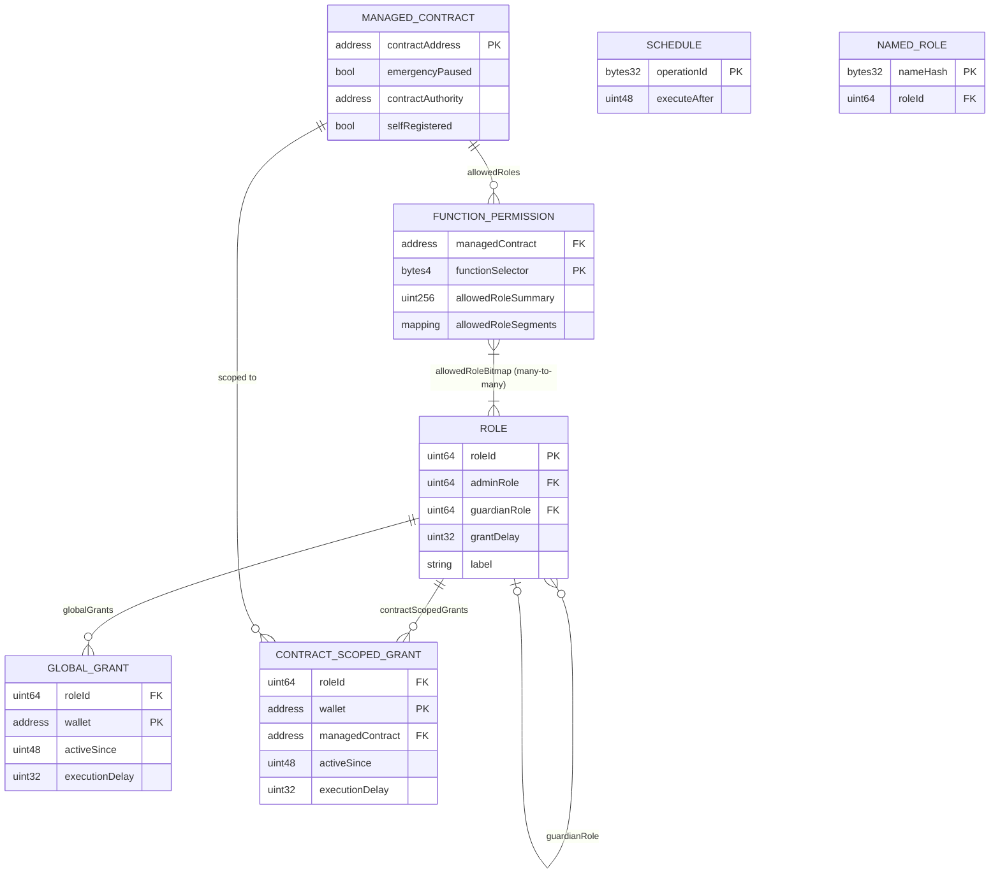

### Key Relationships

| From | To | Arrow | Meaning |
|---|---|---|---|
| ROLE | GLOBAL_GRANT | one -> many | A role can be globally granted to many wallets. A global grant means: this wallet can call any function mapped to this role, on any managed contract. Created by `grantRole()`. |
| ROLE | CONTRACT_SCOPED_GRANT | one -> many | A role can be granted to many wallets scoped to specific contracts. A scoped grant means: this wallet can call functions mapped to this role, but only on the specific managed contract in the grant. Created by `grantContractScopedRole()` or `selfRegisterManagedContract()`. |
| MANAGED_CONTRACT | FUNCTION_PERMISSION | one -> many | Each managed contract has one permission entry per function selector (~5-20 per contract). |
| FUNCTION_PERMISSION | ROLE | **many -> many** | Each function can be mapped to multiple roles via `addFunctionAllowedRole()`. Stored as a two-level bitmap. |
| ROLE | ROLE (adminRole) | many -> one | Each role has one admin role that can grant/revoke it. ADMIN (0) is self-administered. |
| ROLE | ROLE (guardianRole) | many -> one | Each role has at most one guardian role that can cancel scheduled operations by this role's members. |
| MANAGED_CONTRACT | CONTRACT_SCOPED_GRANT | one -> many | A managed contract can have many scoped grants -- wallets that hold roles only for this specific contract. |

### Scalability

| Entity | Growth | Bounded By | Lookup |
|---|---|---|---|
| Roles | Slow -- admin creates via `registerRole()` | ~20 per chain | O(1) |
| Global grants | Moderate -- one per (role, wallet) | Number of role-holding wallets | O(1) |
| Contract-scoped grants | Moderate -- one per (role, wallet, contract) | Token deployers x roles per token | O(1) |
| Managed contracts | Grows with deployments | Contracts using `restricted` | O(1) |
| Function permissions | Grows with contracts x functions | ~5-20 selectors per contract | O(1) via two-level bitmap. Multiple roles per selector. |
| Schedules | Transient -- created and consumed | Active delayed operations | O(1). Auto-expire after 7 days. |

## Two-Tier Topology

Each chain deploys its own independent `RaylsAccessManagerV1`. Roles, targets, and permissions are configured separately per chain. There is no cross-chain permission dependency.

The Private Network Hub (PNH) instance manages hub-level contracts (TokenRegistryV1, ParticipantStorageV1, TeleportV1, etc.) and typically has more roles due to the wider set of operations it supports. Each Privacy Node (PN) instance manages node-level contracts (RNUserGovernanceV1, RNEndpointV1, etc.) and its own token handlers.

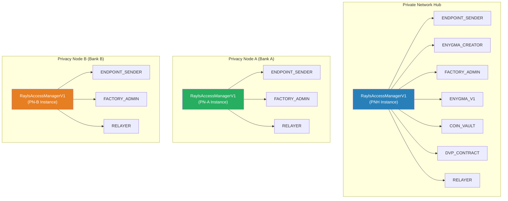

## Consumer Contract Integration

### The `restricted` Modifier Pattern

All privileged functions use the `restricted` modifier, which delegates authorization decisions to the AccessManager via a single pattern:

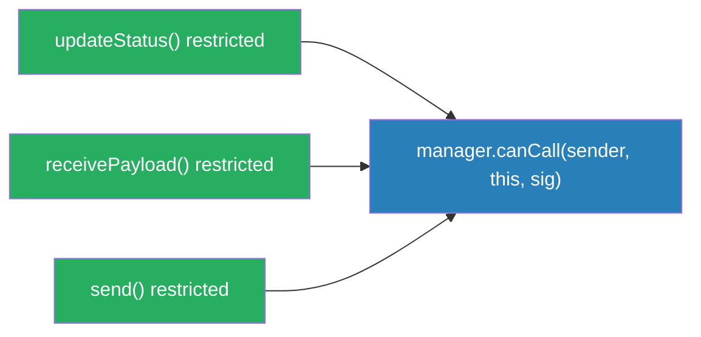

### RaylsAccessManaged Base Contract

```solidity
abstract contract RaylsAccessManaged {
    // ERC-7201 namespaced storage
    address private _authority;

    error RaylsAccessManaged__Unauthorized(address caller);
    error RaylsAccessManaged__MustSchedule(address caller, uint32 delay);
    error RaylsAccessManaged__ContractPaused();

    modifier restricted() {
        _checkCanCall(msg.sender, msg.sig);
        _;
    }

    function authority() public view returns (address) {
        return _authority;
    }

    function _checkCanCall(address caller, bytes4 selector) internal view {
        (bool allowed, uint32 delay, bool paused) = IRaylsAccessManager(_authority)
            .canCall(caller, address(this), selector);
        if (!allowed) {
            if (paused) revert RaylsAccessManaged__ContractPaused();
            if (delay != 0) revert RaylsAccessManaged__MustSchedule(caller, delay);
            revert RaylsAccessManaged__Unauthorized(caller);
        }
    }
}
```

### Consumer Contract Setup

To integrate a contract with the authorization system:

1. **Inherit** from `RaylsAccessManaged`
2. **Apply** the `restricted` modifier to all privileged functions
3. **Initialize** the authority to point to the `RaylsAccessManagerV1` address
4. **Configure** function-to-role mappings via `addFunctionAllowedRoles()`

### Token Handler Pattern (Dynamic Contracts)

Token handlers are deployed dynamically by factories or directly by users. They self-register with the AccessManager during construction via `selfRegisterManagedContract()`, which maps their function selectors to shared roles (`TOKEN_OWNER` for owner functions, `RELAYER` for relayer functions, `MESSAGE_EXECUTOR` for cross-chain receive functions) and designates the deployer as target authority.

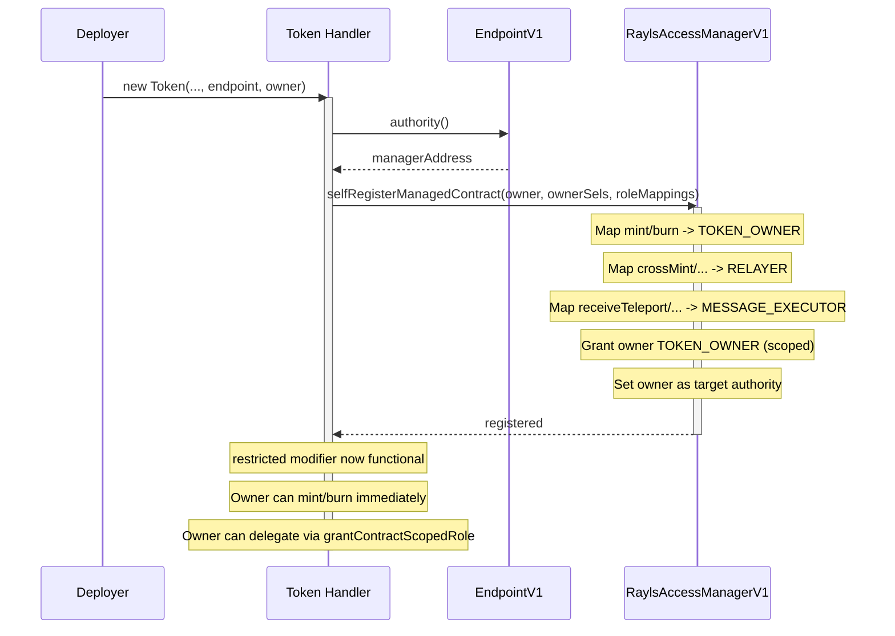

After deployment, all handler functions use the `restricted` modifier -- the same pattern as every other consumer contract.

### Cross-Chain Message Delivery Pipeline

The Rayls protocol delivers cross-chain messages through a fixed pipeline. Each link in the chain trusts exactly one predecessor. The Authorization System secures every link using the `restricted` modifier and the AccessManager.

#### Pipeline Overview

```mermaid
graph TD
    subgraph "Cross-Chain Message Delivery"
        R["Relayer<br/>(PN's relayer wallet)"]
        E["EndpointV1<br/>receivePayload()"]
        MR["MessageReceiver<br/>receivePayload()"]
        ME["RaylsMessageExecutorV1<br/>executeMessage()"]
        ML["MessageLib<br/>executeMessage()"]
        T["Managed Contract<br/>(Token Handler, TokenRegistryV1,<br/>ParticipantStorage, etc.)"]
    end

    R -->|"restricted: RELAYER"| E
    E -->|"onlyEndpoint<br/>(protocol address check)"| MR
    MR -->|"restricted: MESSAGE_RECEIVER"| ME
    ME -->|"internal call"| ML
    ML -->|"target.call(data + messageId + fromChainId + from)"| T
    T -->|"restricted: MESSAGE_EXECUTOR<br/>+ onlyFromPrivateHub (if PNH callback)"| T

    style R fill:#e67e22,color:#fff
    style E fill:#2980b9,color:#fff
    style MR fill:#27ae60,color:#fff
    style ME fill:#27ae60,color:#fff
    style ML fill:#95a5a6,color:#fff
    style T fill:#8e44ad,color:#fff
```

#### Pipeline with Roles and Holders

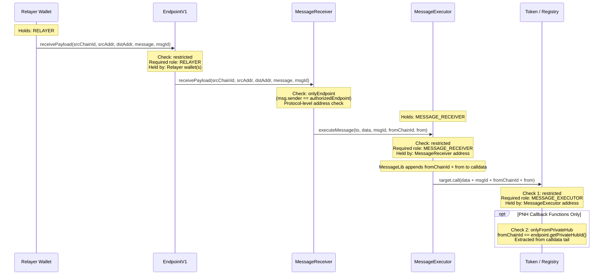

#### Role Summary for the Pipeline

| Pipeline Link | Check | Role Required | Role Held By | Scope |
|---|---|---|---|---|
| Relayer -> EndpointV1 | `restricted` | RELAYER | Relayer wallet address(es) | Governance -- relayer identity is an admin decision |
| EndpointV1 -> MessageReceiver | `onlyEndpoint` | (none -- address check) | EndpointV1 contract | Protocol -- exactly one endpoint per chain |
| MessageReceiver -> MessageExecutor | `restricted` | MESSAGE_RECEIVER | MessageReceiver address | Protocol -- exactly one receiver per chain |
| MessageExecutor -> Managed Contract | `restricted` | MESSAGE_EXECUTOR | MessageExecutor address | Protocol -- exactly one executor per chain |
| PNH callbacks on managed contract | `onlyFromPrivateHub` | (none -- calldata check) | PNH chain ID in calldata | Protocol -- validates message origin |

#### `onlyFromPrivateHub` -- Why It Is Not in the AccessManager

The `onlyFromPrivateHub` check validates **message content** (the `fromChainId` embedded in calldata by MessageLib), not the caller's identity. The AccessManager's `canCall(caller, contract, selector)` cannot inspect calldata -- it only checks the caller's role.

This check is applied directly in the contracts that receive PNH-originated cross-chain callbacks:

| Contract | Functions with PNH origin check | What it protects |
|---|---|---|
| **ParticipantStorageReplicaV1** | `addOrUpdateParticipants` (inline `require(fromChainId == ...)`) | PNH participant sync -- only messages originating from the PNH chain can update participant data |

This function also has `restricted` (MESSAGE_EXECUTOR) -- both checks apply. The `restricted` check verifies the caller is the MessageExecutor. The inline PNH check verifies the message originated from the PNH chain.

!!! note "TokenRegistryV1 (PN)"
    The PN `TokenRegistryV1` cross-chain callback functions (`activateToken`, `syncFrozenTokens`, `updateFrozenToken`, `removeFrozenToken`) use `restricted` (MESSAGE_EXECUTOR) but do **not** have an `onlyFromPrivateHub` or equivalent PNH origin check.

#### Functions Using `restricted` on Token Handlers

Token handlers use `restricted` for three categories of functions:

| Category | Role | Functions |
|---|---|---|
| **Cross-chain receives** | MESSAGE_EXECUTOR | `receiveTeleport`, `receiveTeleportAtomic`, `revertTeleportMint`, `revertTeleportBurn`, `unlock`, `receiveTeleportFromPublicChain`, `revertTeleportToPublicChain` |
| **Owner operations** | TOKEN_OWNER | `mint`, `burn`, `submitTokenUpdate`, `setSwapValidityTime` |
| **Relayer operations** (Enygma/DvP only) | RELAYER | `crossRevertMint`, `supplyUpdateRevert`, `dvpSwapCompleted`, `unlockFromDvp` |

## Gas Analysis

| Operation | Gas Cost | Notes |
|---|---|---|
| `canCall()` (warm, no delay) | ~5,200 | External view call to manager |
| `restricted` modifier (total) | ~5,500 | canCall + revert logic |

!!! info "PoA Gas Cost"
    On Rayls PoA networks where `gasPrice=0`, the authorization overhead is effectively free.

## Contract Inventory

### New Infrastructure Contracts

| Contract | Location | Purpose |
|---|---|---|
| `RaylsAccessManagerV1` | `src/privateHub/AccessControl/RaylsAccessManagerV1.sol` | Central authority (~1220 lines) -- role-to-function mapping, target-scoped grants, bitmap-based multi-role authorization |
| `RaylsAccessManaged` | `src/privateHub/AccessControl/RaylsAccessManaged.sol` | Abstract mixin (~123 lines) -- `restricted` modifier, ERC-7201 storage |
| `IRaylsAccessManager` | `src/privateHub/AccessControl/interfaces/IRaylsAccessManager.sol` | Manager interface |
| `IRaylsAccessManaged` | `src/privateHub/AccessControl/interfaces/IRaylsAccessManaged.sol` | Managed consumer interface |

### Consumer Contracts

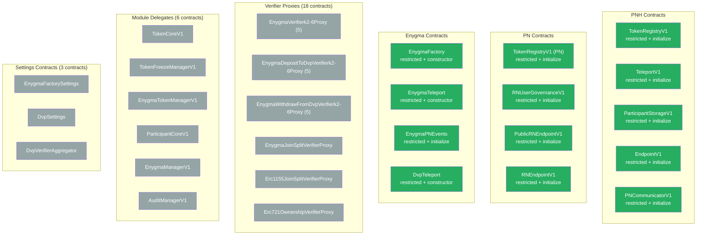

### Contracts with Mixed or Alternative Access Control

Most contracts in the system use the AccessManager via `RaylsAccessManaged` and the `restricted` modifier. A few categories use alternative or complementary access control mechanisms due to their position in the architecture.

#### Module Delegates (Dual Pattern)

The 6 module delegates under `TokenRegistryV1` and `ParticipantStorageV1` use a dual access control pattern. Their **operational functions** are gated by `onlyParent()` modifiers (direct address checks against the parent facade), while their **configuration functions** use `restricted` (AccessManager role-based).

| Parent Facade | Module | Operational Modifier | Also Uses `restricted`? |
|---|---|---|---|
| TokenRegistryV1 | `TokenCoreV1` | `onlyTokenRegistry()` | Yes (9 config functions) |
| TokenRegistryV1 | `TokenFreezeManagerV1` | `onlyTokenRegistry()` | Yes (2 config functions) |
| TokenRegistryV1 | `EnygmaTokenManagerV1` | `onlyTokenRegistry()` / `onlyTokenCore()` | Yes (3 config functions) |
| ParticipantStorageV1 | `ParticipantCoreV1` | `onlyParticipantStorage()` | Yes (1 config function) |
| ParticipantStorageV1 | `EnygmaManagerV1` | `onlyParticipantStorage()` | No |
| ParticipantStorageV1 | `AuditManagerV1` | `onlyParticipantStorage()` | No |

**Why `onlyParent()` instead of `restricted` for operational functions:** The parent facades (`TokenRegistryV1`, `ParticipantStorageV1`) enforce `restricted` on their external API. The modules are internal delegates -- the `onlyParent()` modifier ensures they can only be reached through the facade, which has already authorized the call. This avoids a redundant AccessManager check on the same call chain.

#### Factory-Created Enygma Contracts

`EnygmaV1` instances are deployed at runtime by factory contracts (`EnygmaCreator`, `DvpIntegrationCreator`). These contracts cannot use the AccessManager because they are created dynamically and need to validate callers against the factory address and the `ParticipantStorage` registry.

| Contract | Custom Modifiers | What They Check |
|---|---|---|
| `EnygmaV1` | `onlyFactory()` | `msg.sender == factory` (immutable, set at creation) |
| | `onlyIssuer()` | Validates via `IParticipantStorage.checkEnygmaIssuerAccountAllowed()` |
| | `onlyAllowed()` | Validates via `IParticipantStorage.checkEnygmaAccountAllowed()` |
| | `checkFreeze()` | Checks token freeze status via `TokenRegistryV1.isTokenFrozenForParticipant()` |

The factory contracts themselves (`EnygmaCreator`, `DvpIntegrationCreator`) are stateless deployment utilities with no privileged functions.


---

**Navigate:**

- [Back to Authorization Overview](index.md)
- [Roles and Permissions](roles-and-permissions.md)
- [Authorization Flows](authorization-flows.md)
