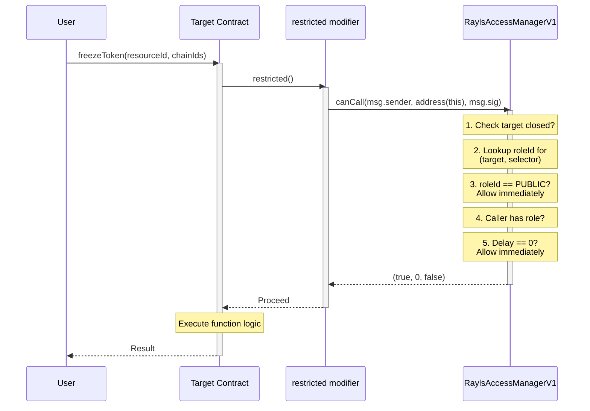
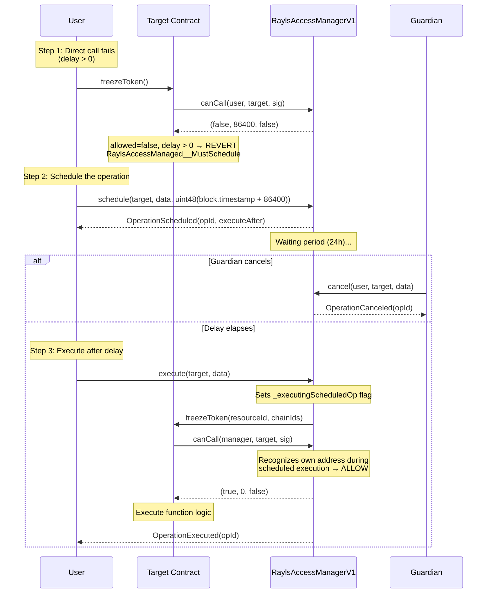
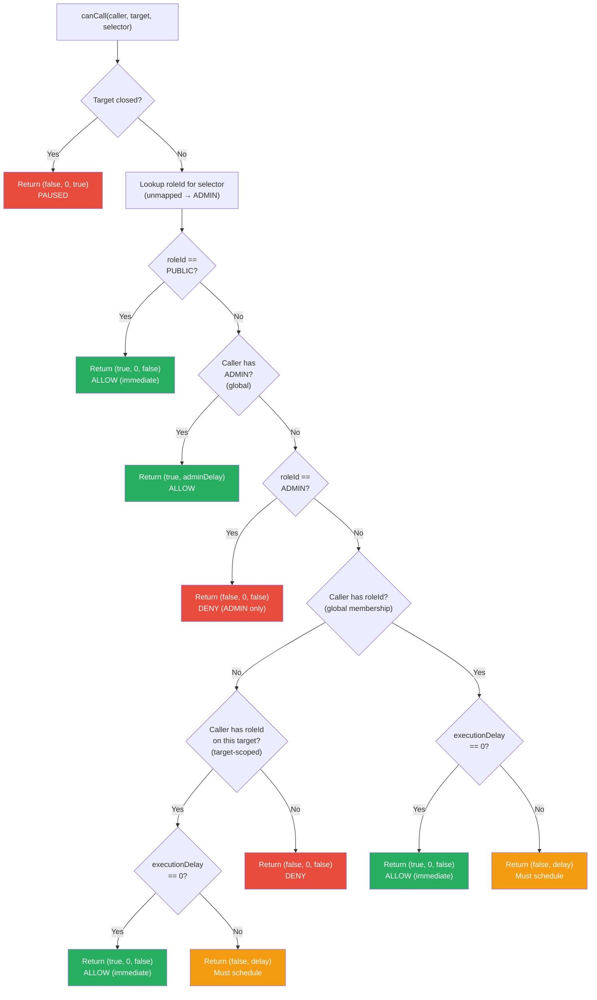
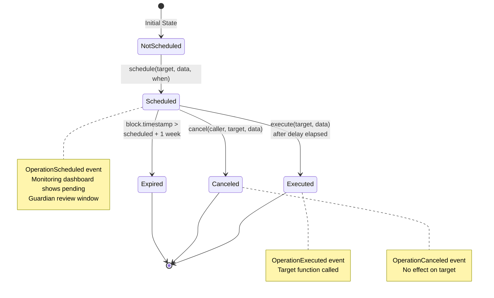
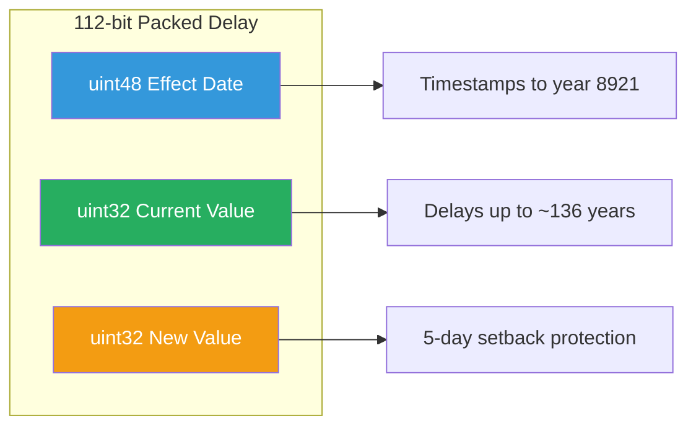
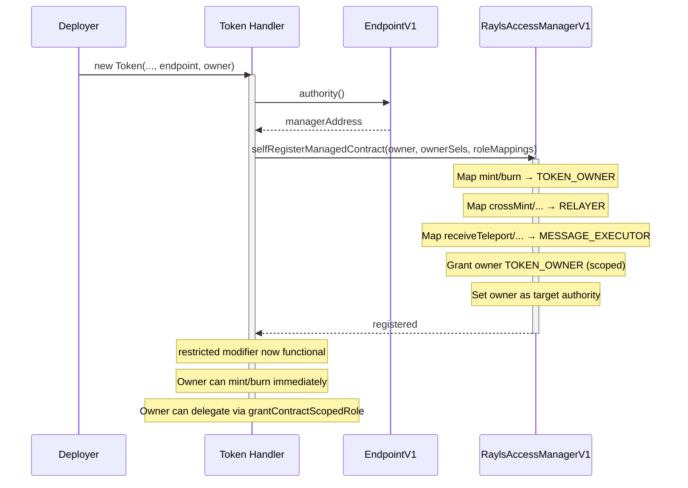

# Authorization Flows

The Authorization System governs every protected function call in the Rayls protocol at runtime. This page explains how the `canCall` check works end-to-end, from immediate execution through scheduled (delayed) operations, and covers the self-registration pattern that lets dynamically deployed tokens integrate with the Access Manager without operator intervention.

---

## Authorization Check (canCall)

Every function marked with the `restricted` modifier triggers a call to `RaylsAccessManagerV1.canCall(msg.sender, address(this), msg.sig)`. The manager returns one of three outcomes: allow immediately, require scheduling (delayed execution), or deny.

### Immediate Execution

When the caller holds the required role with zero execution delay, the call proceeds in a single transaction.



### Delayed Execution

When the caller's role carries a non-zero execution delay, the call must be scheduled first. A guardian role can cancel the operation during the waiting period.



### canCall Decision Tree

The following flowchart shows the full decision logic inside `canCall()`. Every `restricted` function call follows this path.



Key decisions in this tree:

- **Target paused** -- If the managed contract is emergency-paused (`emergencyPaused = true`), all `restricted` calls are blocked immediately. The consumer contract receives `paused = true` and reverts with `RaylsAccessManaged__ContractPaused()`.
- **PUBLIC role** -- When a function's allowed-role bitmap has the PUBLIC bit set, everyone can call it without any role grant. `grantRole(PUBLIC, ...)` always reverts -- PUBLIC is a function-level property, not a caller-level grant.
- **ADMIN bypass** -- ADMIN (role 0) is the only role with implicit permission inheritance. It bypasses all selector checks and can call any function on any managed contract.
- **Global vs scoped membership** -- The system checks global membership first (does the caller hold this role system-wide?), then falls back to contract-scoped membership (does the caller hold this role on this specific target?). Either path can satisfy the check.
- **Delay handling** -- If the caller has the required role but their `executionDelay > 0`, the call cannot proceed directly. The caller must schedule the operation through the Access Manager and execute it after the delay elapses.

!!! info "Admin-of vs permission inheritance"
    The "admin-of" relationship (e.g., PRIVACY_NODE_OPERATOR administers BANK_EMPLOYEE) does NOT grant permission inheritance. It only controls who can grant and revoke role membership. ADMIN is the sole exception -- it bypasses all checks by design.

---

## Scheduled Operations

Scheduled operations provide a time-lock mechanism for sensitive function calls. When a role holder has a non-zero execution delay, they must schedule the operation, wait for the delay to elapse, and then execute it. During the waiting period, a guardian can cancel the operation.

### Lifecycle State Machine



The lifecycle is straightforward:

1. **Schedule** -- The caller submits the operation (target address + calldata + delay). The manager stores the operation hash with an `executeAfter` timestamp and emits `OperationScheduled`.
2. **Wait** -- The operation sits in a pending state. The guardian role for the caller's role can cancel it during this window.
3. **Execute or expire** -- After the delay elapses, the caller executes the operation. The manager calls the target contract on the caller's behalf. If not executed within 7 days (`EXPIRATION`), the schedule expires and the caller must re-schedule.

### OZ Time.Delay Packed Layout

Delays are stored using OpenZeppelin's `Time.Delay` type, which packs three values into 112 bits of a single storage slot:



This packed layout allows delay changes to be time-locked themselves -- updating a delay does not take effect immediately but after a setback period, preventing an attacker who gains temporary access from reducing a delay and immediately exploiting the shortened window.

---

## Token Handler Self-Registration

### Background

Token handlers in the Rayls SDK are deployed dynamically -- by factories or directly by users. Their addresses are not known at chain deployment time, so they cannot be pre-configured in the Access Manager through deployment scripts. The Authorization System solves this with `selfRegisterManagedContract()`, a permissionless function that tokens call during construction to integrate themselves with the Access Manager.

### The selfRegisterManagedContract Pattern

The token's constructor calls an internal `_registerAccessControl()` function which:

1. Discovers the Access Manager address via `endpoint.authority()`
2. Sets the manager as its own authority
3. Calls `selfRegisterManagedContract()` on the manager, passing owner selectors and role mappings



The `selfRegisterManagedContract` function accepts a generic `SelectorRoleMapping` struct that scales to any number of roles without changing the function signature:

```solidity
struct SelectorRoleMapping {
    string roleName;       // Looked up via named role registry
    bytes4[] selectors;    // Function selectors to map to this role
}

function selfRegisterManagedContract(
    address deployer,
    bytes4[] calldata ownerSelectors,
    SelectorRoleMapping[] calldata roleMappings
) external;
```

Owner selectors are handled separately because they have unique semantics: they map to `TOKEN_OWNER` (a built-in constant), the deployer receives a contract-scoped grant, and they become the target authority. All other roles go through the generic `roleMappings` array and are resolved by name from the named role registry.

### Example: RaylsEnygmaHandler Registration

```solidity
function _registerAccessControl(address _owner) internal {
    address mgr = address(endpoint) != address(0) ? endpoint.authority() : address(0);
    if (mgr == address(0)) return;
    _setAuthority(mgr);

    bytes4[] memory ownerSels = new bytes4[](3);
    ownerSels[0] = this.mint.selector;
    ownerSels[1] = this.burn.selector;
    ownerSels[2] = this.setSwapValidityTime.selector;

    IRaylsAccessManager.SelectorRoleMapping[] memory mappings =
        new IRaylsAccessManager.SelectorRoleMapping[](2);

    bytes4[] memory relayerSels = new bytes4[](4);
    relayerSels[0] = this.crossMint.selector;
    relayerSels[1] = this.crossRevertMint.selector;
    relayerSels[2] = this.dvpSwapReceived.selector;
    relayerSels[3] = this.supplyUpdateRevert.selector;
    mappings[0] = IRaylsAccessManager.SelectorRoleMapping("RELAYER", relayerSels);

    bytes4[] memory executorSels = new bytes4[](4);
    executorSels[0] = this.receiveTeleport.selector;
    executorSels[1] = this.revertTeleportMint.selector;
    executorSels[2] = this.revertTeleportBurn.selector;
    executorSels[3] = this.unlock.selector;
    mappings[1] = IRaylsAccessManager.SelectorRoleMapping("MESSAGE_EXECUTOR", executorSels);

    IRaylsAccessManager(mgr).selfRegisterManagedContract(_owner, ownerSels, mappings);
}
```

At the end of construction, in a single transaction:

| What | State |
|---|---|
| Token authority | Set to Access Manager |
| Selector mappings | `mint`, `burn`, `setSwapValidityTime` -> TOKEN_OWNER; `crossMint`, etc. -> RELAYER; `receiveTeleport`, etc. -> MESSAGE_EXECUTOR |
| Deployer role | TOKEN_OWNER scoped to this token |
| Deployer as target authority | Can `grantContractScopedRole()` / `revokeContractScopedRole()` on this token |
| `restricted` modifier | Fully functional -- no fallback, no two-phase transition |

### Function Role Mappings

#### Owner functions -> TOKEN_OWNER (contract-scoped)

| Contract | Functions | Role |
|---|---|---|
| **RaylsEnygmaHandler** | `mint()`, `burn()`, `setSwapValidityTime()` | TOKEN_OWNER |
| **RaylsErc20Handler** | `mint()`, `burn()`, `submitTokenUpdate()` | TOKEN_OWNER |
| **RaylsErc721Handler** | `mint()`, `burn()`, `submitTokenUpdate()` | TOKEN_OWNER |
| **RaylsErc721DvpHandler** | `mint()`, `burn()`, `submitTokenUpdate()`, `setSwapValidityTime()` | TOKEN_OWNER |
| **RaylsErc1155Handler** | `mint()`, `burn()`, `submitTokenUpdate()` | TOKEN_OWNER |
| **RaylsErc1155DvpHandler** | `mint()`, `burn()`, `submitTokenUpdate()`, `setSwapValidityTime()` | TOKEN_OWNER |

#### Relayer functions -> RELAYER (global)

| Contract | Functions | Role |
|---|---|---|
| **RaylsEnygmaHandler** | `crossRevertMint()`, `crossMint()`, `dvpWithdrawReceived()`, `supplyUpdateRevert()`, `dvpSwapReceived()`, `dvpSwapCompleted()`, `notifySender()`, `notifySenderAndReceiver()` | RELAYER |
| **RaylsErc721DvpHandler** | `unlockFromDvp()`, `dvpSwapReceived()`, `notifySender()`, `notifySenderAndReceiver()` | RELAYER |
| **RaylsErc1155DvpHandler** | `unlockFromDvp()`, `dvpSwapReceived()`, `notifySender()`, `notifySenderAndReceiver()` | RELAYER |

#### Cross-chain functions -> MESSAGE_EXECUTOR (global)

| Contract | Functions | Role |
|---|---|---|
| **All token handlers** | `receiveTeleport()`, `receiveTeleportAtomic()`, `revertTeleportMint()`, `revertTeleportBurn()`, `unlock()` | MESSAGE_EXECUTOR |

### Benefits

1. **Delegation** -- Token deployers can grant `mint`/`burn` access to other addresses via contract-scoped TOKEN_OWNER grants.
2. **Granularity** -- RELAYER and MESSAGE_EXECUTOR are distinct roles with distinct function mappings.
3. **Delays and guardians** -- High-impact operations like `mint` and `burn` can be time-locked via execution delays.
4. **Unified auth model** -- All authorization goes through the Access Manager; no coexistence of `Ownable` and `restricted`.
5. **Audit trail** -- All permission changes emit events in the Access Manager.

### Safety Properties

- **Self-only** -- `msg.sender` is the token contract itself. A contract can only register itself, never another contract.
- **One-shot** -- The `selfRegistered` flag prevents re-registration. The deployer cannot remap selectors after construction to escalate privileges (e.g., changing `crossMint` from RELAYER to PUBLIC).
- **Scoped authority** -- The deployer gets TOKEN_OWNER scoped to their token and target authority over their token only. They cannot grant roles on other tokens, create new system roles, or modify system-wide configuration.
- **Auditable** -- The selector-to-role mapping is defined in the token's constructor, which is compiled Solidity -- visible, verifiable, and immutable in the deployed bytecode.

### Post-Deployment Delegation

After deployment, the deployer (as target authority) can delegate access to other wallets:

```
grantContractScopedRole(TOKEN_OWNER, alice, myToken)      // alice can now mint/burn on this token
grantContractScopedRole(TOKEN_OWNER, bob, myToken)        // bob too
revokeContractScopedRole(TOKEN_OWNER, alice, myToken)     // revoke alice without affecting bob
```

All through the standard Access Manager API, with the same event stream, the same delay/guardian mechanisms, and the same audit trail as every other contract in the system.

---

## Token Registration Lifecycle

The PN-side `TokenRegistryV1` manages the lifecycle of tokens from local registration through cross-chain activation. Its authorization model combines the Access Manager with a direct calldata check for PNH-originated callbacks.

### Authorization Model

| Function Category | Auth Check | Purpose |
|---|---|---|
| `registerToken` | `restricted` (BANK_EMPLOYEE) | PN-local token registration |
| `updatePrivacyNodeStatus`, `submitToHub`, `submitToPublicChain` | `restricted` (PRIVACY_NODE_OPERATOR) | PN approval and cross-layer submission |
| `activateToken` | `restricted` (MESSAGE_EXECUTOR) | PNH governance callback |
| `syncFrozenTokens`, `updateFrozenToken`, `removeFrozenToken` | `restricted` (MESSAGE_EXECUTOR) | PNH freeze state sync |

!!! info "Cross-chain registration is independent from access control"
    When a token is deployed and self-registers via `selfRegisterManagedContract()`, its access control is fully configured from that moment. The cross-chain registration through `registerToken()` / `activateToken()` is a separate concern. The activation callback only needs to handle cross-chain concerns: setting the resource ID, registering the resource in the endpoint, and granting `ENDPOINT_SENDER` scoped to `EndpointV1`. Access control (authority, selector mappings, deployer grant) was already handled at deployment time.

Tokens that never register for cross-chain work fully from the moment of deployment. The deployer has TOKEN_OWNER, can delegate via `grantContractScopedRole()`, and all functions are governed by the Access Manager. The only missing capability is `ENDPOINT_SENDER` (so `endpoint.send()` calls would revert), which is correct -- they have not registered for cross-chain.

---

## Cross-Chain Function Mapping

Cross-chain operations require specific function/selector mappings for each managed contract. These mappings are not created by the contracts themselves -- they are created by **deployment scripts** and **token constructors**, depending on the contract type.

### Singleton Contracts (Deployment Scripts)

Singleton contracts (one instance per chain) are configured by the deployer wallet during chain deployment. The deployer holds ADMIN and calls `addFunctionAllowedRoles()` for each function-to-role mapping.

#### PNH Deployment Mappings

| Managed Contract | Function(s) | Mapped Role | Purpose |
|---|---|---|---|
| EndpointV1 | `receivePayload` | RELAYER | Relayer delivers cross-chain messages |
| EndpointV1 | `send`, `sendBatch`, `sendToResourceId`, `sendBatchToResourceId`, `registerResourceId` | ENDPOINT_SENDER | Tokens and factories send cross-chain |
| TeleportV1 | `storeEncryptedDataBatch`, `addHeader`, `addSingleHeader`, `executeAtomicMessageBatch`, `revertAtomicMessageBatch`, `EmitAdditionalAtomicDataBatchFor` | RELAYER | Relayer stores encrypted data and headers |
| EnygmaTeleport | `enygmaTransferCompleted` | RELAYER | Relayer completes Enygma transfers |
| EnygmaTeleport | `transfer`, `enygmaSupplyUpdated`, `finalizeBalances`, `enygmaDvpBalanceUpdated` | ENYGMA_V1 | EnygmaV1 tokens call teleport functions |
| DvpTeleport | `emitCommitments`, `emitNullifier` | COIN_VAULT | Vault contracts emit DvP events |
| DvpTeleport | `ercDvpBalanceUpdated` | DVP_CONTRACT | DvP contract updates balances |
| DvpTeleport | `initiateTransferEncryptedData`, `initiateCalldata`, `executeCalldata`, `completeSwap`, `revertSwap`, `cancelSwap` | RELAYER | Relayer manages DvP flow |
| EnygmaFactory | `initiateEnygmaCreation` | ENYGMA_CREATOR | EnygmaTokenManager creates tokens |
| EnygmaRegistry | `registerEnygma`, `registerVault`, `registerMerkle`, `registerDvpIntegration` | ENYGMA_CREATOR | Factory registers Enygma components |
| ParticipantStorageV1 | `setChainViewData`, `setAuditInfo`, `setPaymentSpendPublicKey` | RELAYER | Relayer manages participant data |
| ParticipantStorageV1 | `broadcastCurrentParticipants` | MESSAGE_EXECUTOR | Cross-chain participant broadcast |
| TokenRegistryV1 | `addToken`, `updateTokenBalance`, `broadcastCurrentFrozenResourcesForNewParticipant`, `broadcastUnfrozenToken`, `broadcastFrozenToken` | MESSAGE_EXECUTOR | Cross-chain token operations |
| EnygmaPNHEvents | `enygmaPnTransferCompleted`, `mintCompleted` | MESSAGE_EXECUTOR | Cross-chain Enygma event delivery |
| ResourceManager | `handleWithResourceId` | MESSAGE_RECEIVER | Cross-chain resource handling |
| ResourceManager | `registerResourceId` | ENDPOINT_SENDER | Resource ID registration for cross-chain routing |
| Proofs | `addBatchHeaders`, `tryAddHeader`, `storeEncryptedStorageProofs` | RELAYER | Relayer stores proof data |
| RaylsMessageExecutorV1 | `executeMessage`, `executeMessageBatch` | MESSAGE_RECEIVER | MessageReceiver triggers execution |

#### PN Deployment Mappings

| Managed Contract | Function(s) | Mapped Role | Purpose |
|---|---|---|---|
| EndpointV1 | `send`, `sendBatch`, `sendToResourceId`, `sendBatchToResourceId`, `registerResourceId` | ENDPOINT_SENDER | Tokens send cross-chain |
| EndpointV1 | `receivePayload` | RELAYER | Relayer delivers cross-chain messages |
| RNEndpointV1 | `receivePayload` | RELAYER | PN endpoint receives messages |
| TokenRegistryV1 (PN) | `registerToken` | BANK_EMPLOYEE | PN-local token registration |
| TokenRegistryV1 (PN) | `updatePrivacyNodeStatus`, `submitToHub`, `submitToPublicChain` | PRIVACY_NODE_OPERATOR | PN approval and cross-layer submission |
| TokenRegistryV1 (PN) | `activateToken`, `syncFrozenTokens`, `updateFrozenToken`, `removeFrozenToken` | MESSAGE_EXECUTOR | Cross-chain PNH governance callbacks |
| EnygmaPNEvents | Runtime selectors (enygma operations) | ENDPOINT_SENDER | Enygma cross-chain send operations |
| EnygmaPNEvents | Creation selectors (`creation`, `dvp721Creation`, `dvp1155Creation`) | TOKEN_CREATOR | Enygma/DvP token creation events |
| PNCommunicatorV1 | `addSharedInfo` | ENDPOINT_SENDER | Communicator sends cross-chain |
| ParticipantStorageReplicaV1 | `addOrUpdateParticipants` | MESSAGE_EXECUTOR | Cross-chain participant sync |
| RaylsMessageExecutorV1 | `executeMessage`, `executeMessageBatch` | MESSAGE_RECEIVER | MessageReceiver triggers execution |
| ResourceManager | `handleWithResourceId` | MESSAGE_EXECUTOR | Cross-chain resource handling |
| ResourceManager | `registerResourceId` | ENDPOINT_SENDER | Resource ID registration for cross-chain routing |

#### Public Chain Deployment Mappings

| Managed Contract | Function(s) | Mapped Role | Purpose |
|---|---|---|---|
| PublicRNEndpointV1 | `receivePayload` | RELAYER | Public chain relayer receives messages |
| PublicRNEndpointV1 | `send`, `sendToAddress` | AUTHORIZED_SENDER | Token contracts send to privacy nodes |
| RNMessageExecutorV1 | (granted MESSAGE_EXECUTOR globally) | MESSAGE_EXECUTOR | Cross-chain message delivery to public chain tokens |

!!! info "AUTHORIZED_SENDER admin delegation"
    `AUTHORIZED_SENDER`'s admin is delegated to `RELAYER` (via `setRoleAdmin`) so the public chain relayer can grant it to newly deployed token contracts at runtime.

### Dynamically Deployed Tokens

Token handlers self-register during construction via `selfRegisterManagedContract()`. Different handler types map different functions to roles.

#### Standard Handlers (RaylsErc20Handler, RaylsErc721Handler, RaylsErc1155Handler)

| Selectors | Mapped Role | Notes |
|---|---|---|
| `mint`, `burn`, `submitTokenUpdate` | TOKEN_OWNER | Owner functions |
| `receiveTeleport`, `receiveTeleportAtomic`, `revertTeleportMint`, `revertTeleportBurn`, `unlock`, `receiveTeleportFromPublicChain`, `revertTeleportToPublicChain` | MESSAGE_EXECUTOR | Cross-chain message delivery |
| *(no RELAYER mappings)* | -- | Standard handlers do NOT map any functions to RELAYER |

#### Enygma Handler (RaylsEnygmaHandler)

| Selectors | Mapped Role | Notes |
|---|---|---|
| `mint`, `burn`, `setSwapValidityTime` | TOKEN_OWNER | Owner functions |
| `crossRevertMint`, `crossMint`, `crossTransferRevertBatch`, `supplyUpdateRevert`, `receiveWithdrawFromDvp`, `notifySenderWithPNCommunicator`, `notifySenderAndReceiverWithPNCommunicator`, `dvpSwapCompleted` | RELAYER | Relayer cross-chain operations |
| `crossTransferCheck` | MESSAGE_EXECUTOR | Cross-chain message delivery |

#### DvP Handlers (RaylsErc721DvpHandler, RaylsErc1155DvpHandler)

| Selectors | Mapped Role | Notes |
|---|---|---|
| `mint`, `burn`, `submitTokenUpdate`, `setSwapValidityTime` | TOKEN_OWNER | Owner functions |
| `unlockFromDvp`, `dvpSwapCompleted`, `notifySenderWithPNCommunicator`, `notifySenderAndReceiverWithPNCommunicator` | RELAYER | Relayer DvP operations |
| `unlock`, `MintFromSwapDvp` | MESSAGE_EXECUTOR | Cross-chain message delivery |

These mappings are hardcoded in each handler's `_registerAccessControl()` function -- they are compiled into the bytecode and cannot be changed after deployment.

!!! note "Resource ID delivery"
    Token handlers no longer expose a self-registration selector for the resource ID. The resource ID is delivered by the PN `TokenRegistryV1`'s `activateToken()` callback, which calls `setResourceId(bytes32)` on the handler's `RaylsApp` base. `setResourceId` is guarded by a direct token-registry check (the caller must equal the address registered under `RESOURCE_ID_TOKEN_REGISTRY`), not by a role mapping, so it does not appear in the handler's `selfRegisterManagedContract()` mappings.

### The Relayer's Role

The relayer does not create any mappings. It is purely a consumer of permissions:

1. **Deployment scripts register the role** -- `registerRole("RELAYER")` creates the role in the Access Manager.
2. **The relayer wallet is granted the role** -- `grantRole(RELAYER, relayerWallet, 0)` in the deployment script.
3. **The relayer verifies its authorization** -- It calls `hasRole(RELAYER, myAddress)` at startup to confirm it is authorized.
4. **The relayer calls mapped functions** -- `receivePayload`, `storeEncryptedDataBatch`, etc. The `restricted` modifier checks `canCall()` on each call.

### Summary: Who Creates What

| What | Who | When | How |
|---|---|---|---|
| Role registration | ADMIN wallet | Chain deployment | `registerRole("RELAYER")` etc. in deployment scripts |
| Singleton function mappings | ADMIN wallet | Chain deployment | `addFunctionAllowedRoles()` in deployment scripts |
| Token function mappings | Token contract itself | Token deployment (constructor) | `selfRegisterManagedContract()` |
| Global role grants | ADMIN or role admin wallet | Deployment + runtime | `grantRole()` |
| Contract-scoped grants | Contract authority (deployer) | Token deployment + runtime | `selfRegisterManagedContract()` + `grantContractScopedRole()` |

---

<div class="grid cards" markdown>

- [Back to Authorization Overview](index.md)
- [Access Manager](access-manager.md)
- [Roles and Permissions](roles-and-permissions.md)
- [Security Model](security-model.md)

</div>
