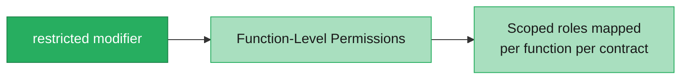
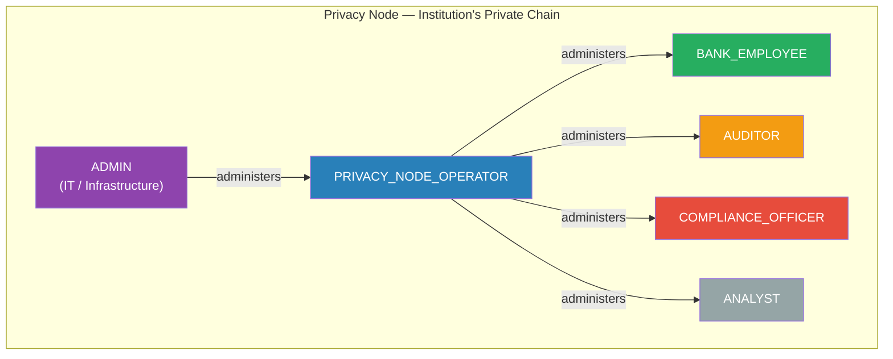

# Authorization

Rayls implements a unified, function-level authorization system built on OpenZeppelin's AccessManager pattern. Every privileged operation across the network is governed by a single permission model, enabling fine-grained role-based access control, third-party integration, and regulatory compliance.

---

## Overview

All consumer contracts use the `restricted` modifier, which delegates authorization decisions to a central `RaylsAccessManagerV1` contract. The AccessManager determines whether a caller is allowed to invoke a specific function on a specific contract, based on the caller's role membership.

---

## Key Capabilities

| Capability | Description |
|---|---|
| **Role-based access control** | Named roles with explicit function mappings |
| **Function-level permissions** | Each role can only call specific functions on specific contracts |
| **Target-scoped grants** | Permissions can be granted per-contract, not just globally |
| **Third-party integration** | External providers receive scoped roles (2-3 functions) instead of full admin access |
| **Execution delays** | Sensitive operations can require a cooling-off period before execution |
| **Per-contract emergency pause** | Individual contracts can be paused without affecting the rest of the network |
| **Unified audit trail** | 16 event types provide a complete on-chain authorization history |
| **Token handler self-registration** | Token contracts register their own permission mappings at deployment |

---

## Business Value

### Third-Party Integration

The authorization system enables integration with external providers by granting them scoped roles that limit access to the specific functions they need.

| Integration Partner | Functions Needed | Access Scope |
|---|---|---|
| Compliance/AML Engine | 2 functions | 2 functions, 1 contract |
| Custody Provider | 3 functions | 3 functions, 1 contract |
| Tokenization Platform | 1 function | 1 function, 1 contract |
| Audit Dashboard | Read-only | 0 write functions |

### Regulatory Compliance

- **Segregation of Duties** -- Different people handle different operations, enforced on-chain
- **Audit Trail** -- 16 event types, all recorded on-chain, queryable at any point in time
- **Temporal Controls** -- Cooling-off periods for sensitive operations (maker-checker pattern)
- **Emergency Pause** -- Per-contract circuit breaker for incident isolation

### Key Compromise Mitigation

If a role key is stolen, the attacker can only access the functions mapped to that role. Execution delays provide a detection window, and guardians can cancel pending operations before they execute.

---

## Personas

The authorization system maps business personas to on-chain roles with specific function permissions.

### Privacy Node Personas (Bank-Level)

| Persona | Role | Capabilities |
|---|---|---|
| **Privacy Node Operator** | `PRIVACY_NODE_OPERATOR` | Customer management, token management, access control, network configuration |
| **Bank Employee** | `BANK_EMPLOYEE` | Payment flows, DvP settlement, tokenization, user wallet operations |
| **Compliance Officer** | `COMPLIANCE_OFFICER` | Freeze/unfreeze tokens, compliance actions |
| **Auditor** | `AUDITOR` | Read-only access to all contract data |
| **Analyst** | `ANALYST` | Read-only access to analytics and reporting |

### Private Network Hub Personas (Network-Level)

| Persona | Role | Capabilities |
|---|---|---|
| **Private Network Operator** | `PRIVATE_NETWORK_OPERATOR` | Participant management, token registry, network configuration |
| **Network Auditor** | `NETWORK_AUDITOR` | Network-wide read-only access |

### Third-Party Integration Roles

| Role | Use Case | Access Scope |
|---|---|---|
| `COMPLIANCE_TOOL` | AML/KYC compliance engines | Freeze/unfreeze, compliance queries |
| `CUSTODY_MANAGER` | External custody providers | Token transfers, balance queries |
| `TOKENIZER` | Tokenization platforms | Token creation, minting |
| `DVP_SETTLEMENT` | Settlement engines | DvP deposit, withdrawal |

---

## Architecture Summary

The system consists of two core infrastructure contracts deployed on each chain:

| Contract | Purpose |
|---|---|
| **RaylsAccessManagerV1** | Central authority (~1220 lines). Manages roles, permissions, delays, and pausing. ERC-7201 storage, UUPS upgradeable. |
| **RaylsAccessManaged** | Consumer base contract (~123 lines). Provides the `restricted` modifier that delegates authorization checks to the AccessManager. |

Each chain (Private Network Hub, Privacy Node) has its own independent AccessManager instance with its own role set. This ensures authorization is isolated per chain -- a compromised Privacy Node cannot affect the Hub or other nodes.

For a detailed technical description, see [Access Manager](access-manager.md).

---

**Navigate:**

- [Access Manager](access-manager.md) - Core contract architecture and data model
- [Roles and Permissions](roles-and-permissions.md) - Role taxonomy, hierarchies, and permission matrices
- [Authorization Flows](authorization-flows.md) - How authorization checks work at runtime
- [Security Model](security-model.md) - Threat model, mitigations, and audit scope
- [Back to Governance Overview](../index.md)
