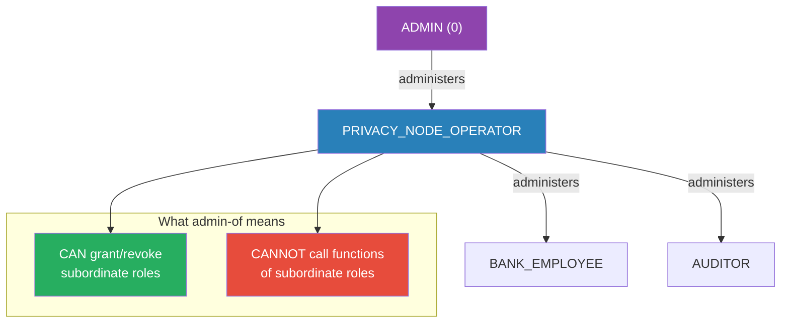
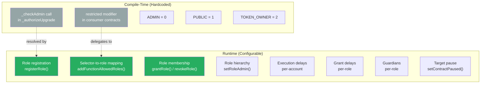
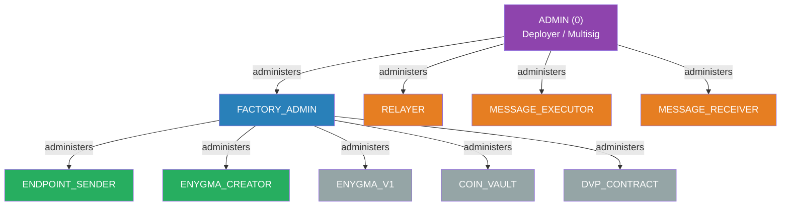
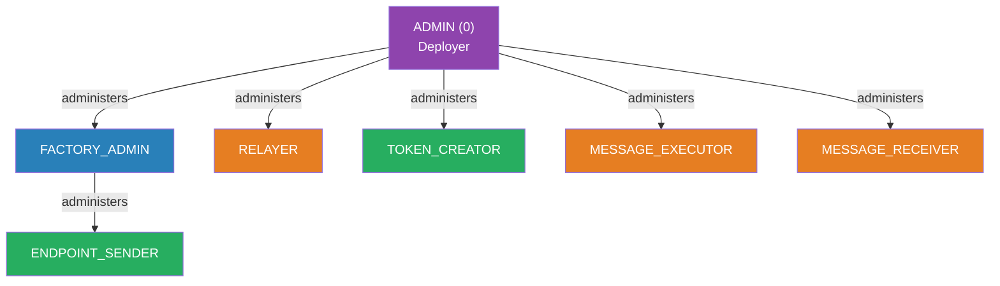
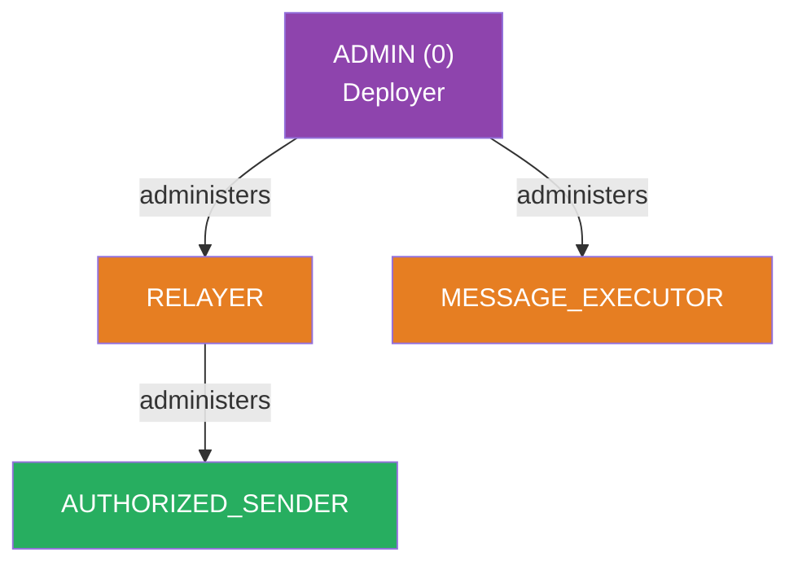
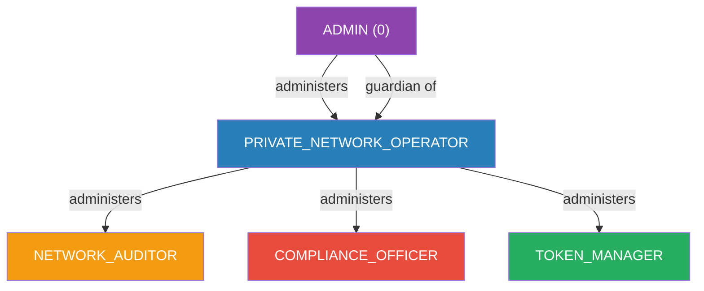
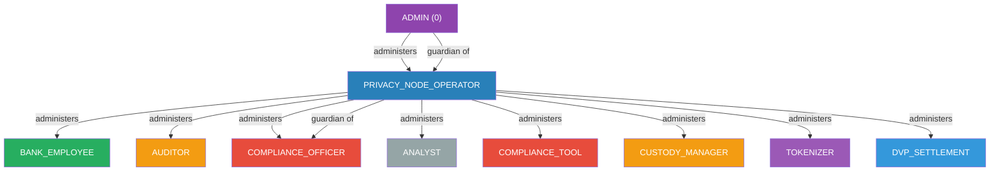

# Roles and Permissions

The Authorization System organizes access control through **named roles**, **hierarchies**, and **permission mappings**. Every function call on a managed contract is checked against the caller's role membership and the function's allowed-role mapping. This page covers how roles are defined, categorized, and composed into a coherent permission model across all chain types.

---

## Role Categories

Roles fall into three categories based on when and how they are created:

- **Built-in roles** are compile-time constants with special semantics in the Access Manager.
- **Infrastructure roles** are registered during chain deployment and are required for protocol operation.
- **Business roles** are activated at runtime via admin transactions, with zero code changes.

### Built-In Roles

These three roles are hardcoded constants in the Access Manager. They exist on every chain and have special behavior in the `canCall()` authorization check.

| Role | ID | Admin | Purpose | Special Behavior |
|---|---|---|---|---|
| `ADMIN` | 0 | Self | Global superuser | Bypasses all selector checks in `canCall()`. The only role with implicit permission inheritance. |
| `PUBLIC` | 1 | None | Open-access marker | Set on functions to make them callable by anyone. Cannot be granted to individual addresses. |
| `TOKEN_OWNER` | 2 | Target authority | Token deployer operations | Granted contract-scoped via `selfRegisterManagedContract()`. Controls `mint()`, `burn()`, and owner functions on a specific token. |

!!! info "ADMIN is unique"
    ADMIN (id=0) is the **only** role that bypasses selector-to-role mappings. All other roles, including TOKEN_OWNER, can only call functions explicitly mapped to them. There is no implicit permission inheritance beyond ADMIN.

!!! info "PUBLIC is not a membership role"
    PUBLIC cannot be granted to an address. It is a property of a function. When a function's allowed-role bitmap includes PUBLIC (bit 1), the Access Manager returns `allowed = true` for any caller, regardless of their role membership.

### Infrastructure Roles

Infrastructure roles are registered and mapped during contract deployment by the Chain Transaction Set (CTS). They are required for the protocol to function.

#### Private Network Hub (PNH) Roles

| Role | Admin | Granted To | Purpose |
|---|---|---|---|
| `ENDPOINT_SENDER` | FACTORY_ADMIN | TokenCore, TokenFreezeManager, ParticipantCore, + runtime grants | Call `send*()` on EndpointV1 |
| `ENYGMA_CREATOR` | FACTORY_ADMIN | EnygmaTokenManager | Call `initiateEnygmaCreation()` on EnygmaFactory |
| `FACTORY_ADMIN` | ADMIN | EnygmaFactory, DvpErc721Factory, DvpErc1155Factory | Grant sub-roles (ENYGMA_V1, COIN_VAULT, DVP_CONTRACT, ENDPOINT_SENDER, ENYGMA_CREATOR) to deployed contracts |
| `RELAYER` | ADMIN | Relayer addresses (via CTS) | Call `receivePayload()`, cross-chain event functions, protocol message delivery |
| `ENYGMA_V1` | FACTORY_ADMIN | Per-EnygmaV1 contract (runtime grant by factory) | Call EnygmaTeleport: `transfer`, `enygmaSupplyUpdated`, `finalizeBalances`, `enygmaDvpBalanceUpdated` |
| `COIN_VAULT` | FACTORY_ADMIN | Per-vault address (runtime grant by DvP factories) | Call DvpTeleport: `emitCommitments`, `emitNullifier` |
| `DVP_CONTRACT` | FACTORY_ADMIN | Dvp contract (static grant at deploy) | Call `ercDvpBalanceUpdated()` on DvpTeleport |
| `MESSAGE_EXECUTOR` | ADMIN | MessageExecutor contract | Deliver cross-chain messages to target contracts |
| `MESSAGE_RECEIVER` | ADMIN | MessageReceiver contract | Trigger message execution in RaylsMessageExecutorV1 |

#### Privacy Node (PN) Roles

| Role | Admin | Granted To | Purpose |
|---|---|---|---|
| `ENDPOINT_SENDER` | FACTORY_ADMIN | ParticipantStorage, TokenRegistryV1 (PN), + runtime grants to tokens | Call `send*()` on EndpointV1; call `registerResourceId()` on ResourceManager |
| `FACTORY_ADMIN` | ADMIN | RaylsContractFactory, TokenRegistryV1 (PN) | Grant ENDPOINT_SENDER to deployed contracts; call `deploy()` on factories |
| `RELAYER` | ADMIN | Relayer addresses (via CTS) | Call `receivePayload()`, token handler cross-chain operations |
| `TOKEN_CREATOR` | ADMIN | EnygmaPNEvents | Call `creation()`, `dvp721Creation()`, `dvp1155Creation()` on EnygmaPNEvents |
| `MESSAGE_EXECUTOR` | ADMIN | MessageExecutor, RN MessageExecutor | Deliver cross-chain messages to target contracts |
| `MESSAGE_RECEIVER` | ADMIN | MessageReceiver | Trigger message execution in RaylsMessageExecutorV1 |

#### Public Chain (PC) Roles

| Role | Admin | Granted To | Purpose |
|---|---|---|---|
| `RELAYER` | ADMIN | Relayer addresses | Call `receivePayload()` on PublicRNEndpointV1 |
| `AUTHORIZED_SENDER` | RELAYER | Authorized addresses | Call `send()`, `sendToAddress()` on PublicRNEndpointV1 |
| `MESSAGE_EXECUTOR` | ADMIN | RN MessageExecutor | Deliver cross-chain messages to target contracts |

### Business Roles

Business roles can be activated at any time via admin transactions (`registerRole` + `addFunctionAllowedRoles` + `grantRole`) without any Solidity code changes, recompilation, or redeployment.

#### Persona Roles (PN-Level)

| Role | Proposed ID | Admin Role | Target Persona | Purpose |
|---|---|---|---|---|
| `PRIVACY_NODE_OPERATOR` | TBD | ADMIN | Bank Operator | PN governance: user/customer and token management |
| `BANK_EMPLOYEE` | TBD | PRIVACY_NODE_OPERATOR | Bank Employee | PN operations: payments, DvP, tokenization |
| `AUDITOR` | TBD | PRIVACY_NODE_OPERATOR | PN auditor | PN read-only access and future audit initiation |
| `COMPLIANCE_OFFICER` | TBD | PRIVACY_NODE_OPERATOR | Compliance staff | Token freeze/unfreeze with optional execution delay |
| `ANALYST` | TBD | PRIVACY_NODE_OPERATOR | PN analyst | Read-only dashboards and reporting |

#### Persona Roles (PNH-Level)

| Role | Proposed ID | Admin Role | Target Persona | Purpose |
|---|---|---|---|---|
| `PRIVATE_NETWORK_OPERATOR` | TBD | ADMIN | Network Operator | PNH governance: participant and token management |
| `NETWORK_AUDITOR` | TBD | PRIVATE_NETWORK_OPERATOR | Network Auditor | PNH read-only monitoring and compliance reports |

#### Third-Party Integration Roles

| Role | Proposed ID | Admin Role | Target Persona | Purpose |
|---|---|---|---|---|
| `COMPLIANCE_TOOL` | TBD | PRIVACY_NODE_OPERATOR | 3rd party AML engine | Scoped freeze/unfreeze (2 functions on 1 target) |
| `CUSTODY_MANAGER` | TBD | PRIVACY_NODE_OPERATOR | 3rd party custody provider | User lifecycle: createUser, addAddressPair, approveUser |
| `TOKENIZER` | TBD | PRIVACY_NODE_OPERATOR | 3rd party tokenization platform | Token registration only: registerToken (1 function on 1 target) |
| `DVP_SETTLEMENT` | TBD | PRIVACY_NODE_OPERATOR | 3rd party settlement engine | DvP operations: depositIntoDvp, withdrawFromDvp, swap, exchange |

---

## Role Hierarchies

### Admin-Of vs Permission Inheritance

The role hierarchy in the Authorization System uses an **admin-of** relationship, not permission inheritance. When role A administers role B, it means:

- A **can** grant and revoke membership in B
- A **cannot** call functions mapped to B

This is a critical distinction. Being the admin of a subordinate role does not grant you the ability to call that role's functions. You must hold the role yourself to call its mapped functions.



!!! info "Exception: ADMIN bypasses everything"
    ADMIN (id=0) is the only role with implicit permission inheritance. It bypasses all selector checks and can call any function on any target. All other roles can only call functions explicitly mapped to them.

### Compile-Time vs Runtime

The Authorization System separates what is fixed in code from what is configurable at runtime:



Consumer contracts contain zero references to specific roles. Adding a new business role is a **pure admin transaction sequence** -- zero Solidity changes, zero recompilation, zero redeployment.

### PNH Role Hierarchy



FACTORY_ADMIN is the only infrastructure role that administers sub-roles. It allows factory contracts to grant ENYGMA_V1, COIN_VAULT, and DVP_CONTRACT to newly deployed contracts at runtime -- without requiring ADMIN intervention.

### PN Role Hierarchy



### PC Role Hierarchy



On Public Chains, RELAYER administers AUTHORIZED_SENDER -- the relayer controls which addresses can send messages through the public endpoint.

### Business Role Hierarchies

When business roles are activated, they extend the hierarchy with human-operator and integration roles.

#### PNH Business Hierarchy



#### PN Business Hierarchy



The PRIVACY_NODE_OPERATOR administers all PN business and integration roles. ADMIN serves as the guardian of PRIVACY_NODE_OPERATOR, and PRIVACY_NODE_OPERATOR serves as the guardian of COMPLIANCE_OFFICER -- providing an emergency revocation path for sensitive freeze/unfreeze operations.

---

## Target-Scoped Grants

### The Global Membership Problem

The Access Manager's role membership is **global, not target-scoped** by default. When `grantRole(TOKEN_OWNER, alice, 0)` is called, Alice becomes a member of that role across the entire manager -- not scoped to a specific token. If both tokenA and tokenB map `mint.selector` to `TOKEN_OWNER`, Alice can mint on both.

The root cause is in `canCall()`:

```
Step 1: roleId = _targets[target].allowedRoles[selector]   <-- per-target lookup
Step 2: member = _roles[roleId].members[caller]             <-- GLOBAL lookup
```

Step 1 is target-specific (each token can map selectors to different roles), but Step 2 is global (role membership is shared across all targets).

This affects any role shared by multiple contract instances:

| Role | Holders | Legitimate Target(s) | Instance Count | Scoping Value |
|---|---|---|---|---|
| `COIN_VAULT` | Vault contracts (1 per token) | DvpTeleport only | 10+ per chain | **Critical** |
| `ENYGMA_V1` | EnygmaV1 contracts (1 per token) | EnygmaTeleport only | 10+ per chain | High |
| `RELAYER` | Relayer EOAs | DvpTeleport, EnygmaTeleport | Few accounts, 2 targets | High |
| `ENDPOINT_SENDER` | Token handlers, factories | EndpointV1 only | 10+ per chain | Medium |
| `FACTORY_ADMIN` | Factory contracts | RaylsAccessManagerV1 (grantRole) | 1-2 per chain | None -- admin role |
| `ADMIN` | Chain admin(s) | All targets | 1-2 accounts | None -- by design |

### Solution: Target-Scoped Membership

The Access Manager extends role membership with **target-scoped grants**, where a role grant can be bound to a specific target contract. Instead of "Alice has TOKEN_OWNER everywhere", it becomes "Alice has TOKEN_OWNER on tokenA."

This keeps shared functional roles (`TOKEN_OWNER`, `RELAYER`, etc.) as system-wide definitions of *what* an address can do, while scoping *where* they can do it per-target.

### How It Works

The `canCall()` function checks both global and target-scoped membership:

```
1. roleId = _targets[target].allowedRoles[selector]     <-- per-target (unchanged)
2. Check _roles[roleId].members[caller]                  <-- global (for system roles)
3. Check _roles[roleId].targetMembers[caller][target]    <-- target-scoped
4. Allow if either check passes
```

Two new functions manage target-scoped grants:

- `grantContractScopedRole(roleId, account, target, executionDelay)` -- requires target authority
- `revokeContractScopedRole(roleId, account, target)` -- requires target authority

### What Uses Target-Scoped Grants

| Role | Scoped To | How |
|---|---|---|
| `TOKEN_OWNER` | Each token contract | `selfRegisterManagedContract()` in token constructor |
| `COIN_VAULT` | DvpTeleport | `grantContractScopedRole()` by factories after vault deployment |
| `ENYGMA_V1` | EnygmaTeleport | `grantContractScopedRole()` by EnygmaFactory after deployment |
| `ENDPOINT_SENDER` | EndpointV1 | `grantContractScopedRole()` by RaylsContractFactory |

### What Does NOT Need Scoping

These roles are global by design:

| Role | Reason |
|---|---|
| `ADMIN` | Global superuser; scoping defeats the purpose |
| `FACTORY_ADMIN` | An admin-of role that calls `manager.grantRole()`; the target is the manager itself, which is a singleton |
| `RELAYER` | Few accounts, global across all targets |
| `MESSAGE_EXECUTOR` / `MESSAGE_RECEIVER` | Singleton system contracts, global by design |
| Singleton consumer contracts | Only one instance per chain (TokenRegistryV1, ParticipantStorageV1, etc.), so global membership is already effectively scoped |

### Self-Registration Pattern

Tokens register their own role mappings at construction time via `selfRegisterManagedContract()`. This function maps selectors to roles, grants `TOKEN_OWNER` to the deployer (scoped to the token), and sets the deployer as the target authority -- all in a single transaction during the constructor. The deployer can then delegate access to others via `grantContractScopedRole()`.

For a detailed walkthrough of self-registration and the token deployment lifecycle, see [Authorization Flows](authorization-flows.md).

---

## Bitmap Architecture

### Overview

Each function on each managed contract can be mapped to **multiple roles** simultaneously. Authorization is resolved via a bitwise AND between the selector's allowed-role bitmap and the caller's membership bitmap. If any bit overlaps, the caller holds at least one allowed role.

This removes the one-role-per-selector constraint entirely. For example, `freezeToken()` can be mapped to both `COMPLIANCE_OFFICER` and `COMPLIANCE_TOOL` -- each with their own independent scope.

### The Core Idea: One Bit Per Role

A `uint256` has 256 bits. Each bit position corresponds to a roleId. If a bit is set to 1, it means "this role is present."

**Example -- mapping `freezeToken()` to both COMPLIANCE_OFFICER (role 3) and COMPLIANCE_TOOL (role 10):**

```
The "allowed roles" bitmap for freezeToken():

                          role 10          role 3
                            |                |
Allowed roles:    ...0000 0100 0000 0000 0000 1000
                         bit 10              bit 3

This single uint256 says: "roles 3 AND 10 are both allowed to call freezeToken()."
```

**Example -- a caller who holds COMPLIANCE_TOOL (role 10):**

```
The "held roles" bitmap for this caller address:

                          role 10
                            |
Held roles:       ...0000 0100 0000 0000 0000 0000
                         bit 10

This single uint256 says: "this address holds role 10."
```

**The authorization check -- do the caller's roles overlap with the function's allowed roles?**

```
Allowed roles:    ...0000 0100 0000 0000 0000 1000   (roles 3 and 10 can call freezeToken)
Held roles:       ...0000 0100 0000 0000 0000 0000   (caller holds role 10)
                  ----------------------------------------
AND result:       ...0000 0100 0000 0000 0000 0000   != 0 --> ALLOW

The AND picks out only the bits that are set in BOTH bitmaps.
If the result is non-zero, the caller holds at least one role that is allowed.
```

**Example -- a caller who holds BANK_EMPLOYEE (role 2) but NOT role 3 or 10:**

```
Allowed roles:    ...0000 0100 0000 0000 0000 1000   (roles 3 and 10 can call freezeToken)
Held roles:       ...0000 0000 0000 0000 0000 0100   (caller holds role 2)
                  ----------------------------------------
AND result:       ...0000 0000 0000 0000 0000 0000   == 0 --> DENY

No bits overlap. The caller's role (BANK_EMPLOYEE) is not in the function's allowed set.
```

**Cost: 2 storage reads + 1 AND = ~4,200 gas. Always. Whether 1 role or 200 roles are allowed.**

### Two-Level Bitmap for Scaling Beyond 256 Roles

A single `uint256` supports 256 roles. To support more without losing O(1) performance, the Authorization System uses a **two-level bitmap** with a summary.

Instead of one `uint256`, multiple `uint256` values are stored -- each covering a **segment** of 256 roles:

```
roleBitmap[0] --> one uint256 covering roles 0 through 255     (segment 0)
roleBitmap[1] --> one uint256 covering roles 256 through 511   (segment 1)
roleBitmap[2] --> one uint256 covering roles 512 through 767   (segment 2)
...
```

To locate a role in this structure, divide the roleId:

```
roleId = 300

Which segment?   300 / 256 = 1      --> roleBitmap[1]   (segment 1)
Which bit?       300 mod 256 = 44   --> bit 44 inside segment 1
```

More examples:

```
roleId = 5     --> segment 0, bit 5
roleId = 255   --> segment 0, bit 255
roleId = 256   --> segment 1, bit 0     (first role in the second segment)
roleId = 600   --> segment 2, bit 88
roleId = 1000  --> segment 3, bit 232
```

### The Summary Bitmap

A naive multi-segment check would need to load and AND every segment -- O(n) in the number of segments. The solution is a **summary bitmap**: one extra `uint256` where each bit indicates whether the corresponding segment has any roles set:

```
Summary uint256:
  bit 0 = 1   -->  "segment 0 has at least one role"
  bit 1 = 1   -->  "segment 1 has at least one role"
  bit 2 = 0   -->  "segment 2 is completely empty -- skip it"
  bit 3 = 0   -->  "segment 3 is completely empty -- skip it"
  ...

Since the summary is itself a uint256 with 256 bits,
it can index 256 segments x 256 roles per segment = 65,536 roles.
```

The summary AND tells you which single segment to load. You never scan segments.

### Complete Example: Checking `freezeToken()` with Role 300

**Setup:**

```
Roles registered in this chain's Access Manager:
  ADMIN                   = 0
  PRIVACY_NODE_OPERATOR   = 1
  BANK_EMPLOYEE           = 2
  COMPLIANCE_OFFICER      = 3
  ...
  COMPLIANCE_TOOL         = 300   (a third-party integration)

freezeToken() is mapped to both COMPLIANCE_OFFICER (3) and COMPLIANCE_TOOL (300).
```

**Selector storage for `freezeToken()`:**

```
Summary:     ...00000011
                     ||
                     |+-- bit 0 = 1: "segment 0 has roles" (COMPLIANCE_OFFICER = role 3)
                     +--- bit 1 = 1: "segment 1 has roles" (COMPLIANCE_TOOL = role 300)

Segment 0:   ...00000000 00000000 00000000 00001000
                                                |
                                                +-- bit 3 = role 3 (COMPLIANCE_OFFICER)

Segment 1:   ...00000000 00010000 00000000 00000000
                              |
                              +-- bit 44 = role 300 (300 mod 256 = 44)
```

**Caller storage (holds only COMPLIANCE_TOOL = role 300):**

```
Summary:     ...00000010
                      |
                      +--- bit 1 = 1: "segment 1 has roles"
                           (bit 0 = 0: "segment 0 is empty -- caller has no roles 0-255")

Segment 1:   ...00000000 00010000 00000000 00000000
                              |
                              +-- bit 44 = role 300
```

**The O(1) check:**

```
Step 1: Load both summaries (2 storage reads)

  "Which roles can call freezeToken()?"
  Allowed-roles summary:  ...00000011   (segments 0 and 1 have allowed roles)

  "Which roles does this caller hold?"
  Caller-roles summary:   ...00000010   (only segment 1 has roles)

Step 2: AND the summaries -- "which segments have roles on BOTH sides?"

  AND result:             ...00000010   (only segment 1 overlaps)

  --> Segment 0: freezeToken allows COMPLIANCE_OFFICER (role 3) there,
      but the caller holds no roles in segment 0 -- SKIP entirely.
  --> Segment 1: both sides have roles -- check the detail.

Step 3: Load ONLY segment 1 from both sides (2 storage reads)

  Allowed-roles segment 1:  ...00010000 00000000 00000000   (bit 44 = role 300)
  Caller-roles segment 1:   ...00010000 00000000 00000000   (bit 44 = role 300)

Step 4: AND the detail segments

  AND result:                ...00010000 00000000 00000000   != 0 --> MATCH

  --> Bit 44 is set in both --> role 300 (COMPLIANCE_TOOL) is held by the caller
      AND is allowed by freezeToken(). Authorization granted.
      Look up execution delay from MemberData.
```

**Total: 4 storage reads + 2 AND operations.** The same cost whether there are 5 roles or 50,000. Segments with no overlap are skipped entirely.

### Performance

| Case | Storage Reads | Gas |
|---|---|---|
| No overlap (fast deny) | 2 (summaries only) | ~4,200 |
| Match found (typical) | 4 (2 summaries + 2 segment detail) | ~8,400 |
| Match + delay lookup | 5 (above + MemberData) | ~10,500 |

These numbers are **fixed** -- they do not grow with the number of roles, the number of segments, or the number of mappings. The existing single-role check costs ~6,300 gas in the worst case. The bitmap approach costs ~8,400 for multi-role matching -- only ~2,100 gas more -- while removing the one-role-per-selector limitation entirely.

### Maximum Role Capacity

| Bitmap Design | Max Roles Per Chain | Storage Reads | Gas Cost | Use Case |
|---|---|---|---|---|
| Single `uint256` | **256** | 3-4 | ~8,400 | Sufficient for most deployments |
| **Two-level** (implemented) | **65,536** | 4-5 | ~10,500 | Long-term scalability for hundreds of integrations |
| Three-level (theoretical) | **16,777,216** | 6-7 | ~12,600 | 16 million roles; exceeds any known system |

!!! info "Roles are per-chain, not shared across chains"
    Each Privacy Node and each Private Network Hub deploys its own independent `RaylsAccessManagerV1` with its own role registry. Role IDs on one chain have no relationship to role IDs on another chain. The 65,536 limit applies independently to each chain. A typical Privacy Node today uses around 20 roles -- 0.03% of the two-level capacity. Token deployments via `selfRegisterManagedContract` do **not** create new roles; they map selectors to pre-existing shared roles.

---

<div class="grid cards" markdown>

- [Back to Authorization Overview](index.md)
- [Access Manager](access-manager.md)
- [Authorization Flows](authorization-flows.md)

</div>
