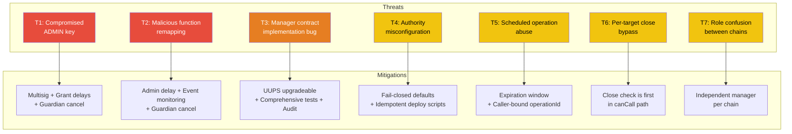
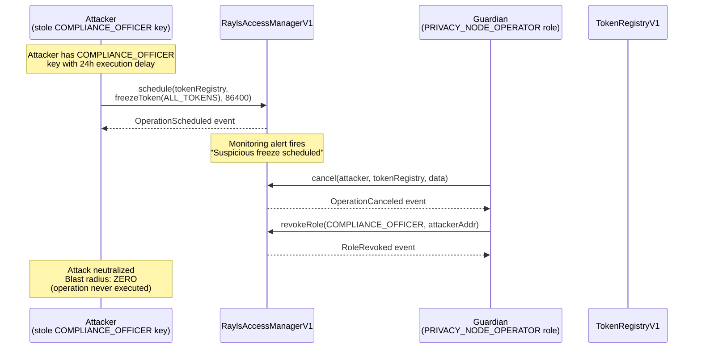
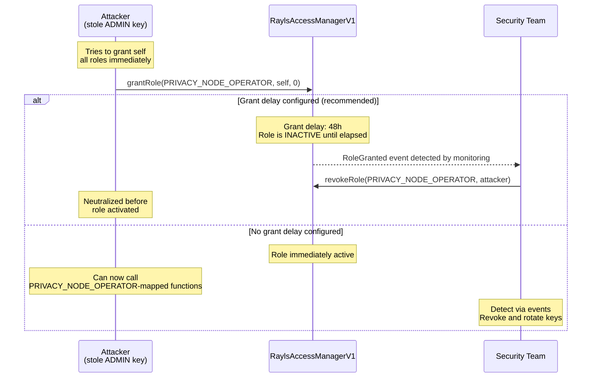
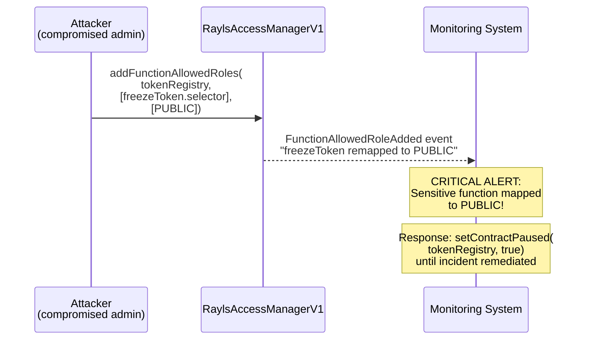
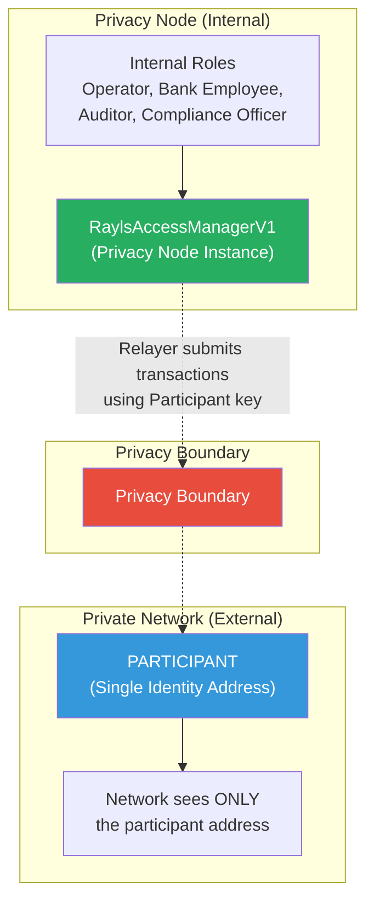
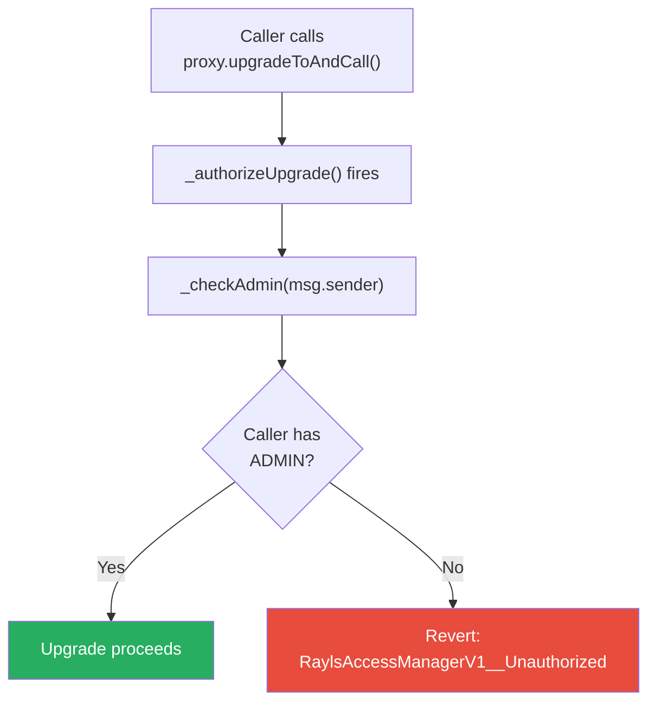

# Security Model

The authorization system implements defense-in-depth with multiple independent security layers. Each layer provides protection against specific attack vectors, and together they create a robust security posture for the entire Rayls network.

---

## Threat Model

### Threat Landscape

### Threat-Mitigation Matrix

| # | Threat | Severity | Likelihood | Mitigations | Residual Risk |
|---|---|---|---|---|---|
| T1 | Compromised ADMIN key grants attacker all roles | Critical | Medium | Multisig for ADMIN, grant delays prevent instant escalation, guardian can cancel pending operations | Low (with multisig) |
| T2 | Malicious function mapping (e.g., map freezeToken to PUBLIC) | Critical | Low | Admin delay on addFunctionAllowedRoles, event monitoring detects remapping, guardian can cancel config changes | Low |
| T3 | Manager implementation bug (canCall bypass, storage corruption) | High | Low | UUPS upgrade path for fix-forward, comprehensive Forge test coverage, professional audit recommended | Low (post-audit) |
| T4 | Authority misconfiguration (target contract points to wrong manager) | High | Medium | Fail-closed default (canCall returns false for unknown targets), deploy script validation | Low |
| T5 | Scheduled operation executed by different caller or replayed | Medium | Low | operationId includes caller address, expiration window (1 week default), schedule deletion after execution prevents replay | Very Low |
| T6 | Per-target close bypassed via alternative code path | High | Very Low | Close check is the first check in canCall, no alternative path exists in the modifier | Very Low |
| T7 | Role confusion between Private Network Hub and Privacy Node roles | Medium | Low | Independent manager instance per chain, no cross-chain role references, role IDs are local | Very Low |
| T8 | Over-permission from role sharing | Low | Low | `addFunctionAllowedRoles()` maps multiple independent roles per function. Each integration gets its own role with minimal blast radius. Two-level bitmap provides O(1) checks. | Very Low |

---

## Defense-in-Depth

### Security Layers

```mermaid
graph TD
    subgraph "Layer 1: Access Control"
        L1A["restricted modifier<br/>on all protected functions"]
        L1B["canCall() check<br/>role to target and selector mapping"]
        L1C["Fail-closed default<br/>unmapped selectors require ADMIN"]
    end

    subgraph "Layer 2: Temporal Controls"
        L2A["Execution delays<br/>for sensitive operations"]
        L2B["Grant delays<br/>prevent instant privilege escalation"]
        L2C["Operation expiration<br/>(1 week default window)"]
    end

    subgraph "Layer 3: Monitoring and Response"
        L3A["16 indexed event types<br/>all permission changes logged"]
        L3B["Guardian role<br/>can cancel scheduled operations"]
        L3C["Per-target close<br/>emergency kill switch"]
    end

    subgraph "Layer 4: Infrastructure"
        L4A["UUPS upgradeable<br/>fix-forward capability"]
        L4B["ERC-7201 namespaced storage<br/>no upgrade collisions"]
        L4C["Independent manager per chain<br/>blast radius isolation"]
    end

    L1A --> L1B --> L1C
    L2A --> L2B --> L2C
    L3A --> L3B --> L3C
    L4A --> L4B --> L4C

    style L1A fill:#e74c3c,color:#fff
    style L1B fill:#e74c3c,color:#fff
    style L1C fill:#e74c3c,color:#fff
    style L2A fill:#e67e22,color:#fff
    style L2B fill:#e67e22,color:#fff
    style L2C fill:#e67e22,color:#fff
    style L3A fill:#f1c40f,color:#000
    style L3B fill:#f1c40f,color:#000
    style L3C fill:#f1c40f,color:#000
    style L4A fill:#3498db,color:#fff
    style L4B fill:#3498db,color:#fff
    style L4C fill:#3498db,color:#fff
```

### Security Properties

| Property | Implementation | Verification |
|---|---|---|
| **Fail-closed** | Unmapped functions default to ADMIN | `canCall()` returns false for unknown selectors |
| **Least privilege** | Each role maps to specific (target, selector) pairs | `addFunctionAllowedRoles()` granularity |
| **Defense in depth** | `restricted` with `MESSAGE_EXECUTOR` for executor paths + origin chain policies | Unified check via AccessManager |
| **Audit trail** | 16 indexed event types | All permission changes logged on-chain |
| **Emergency response** | `setContractPaused()` per-contract kill switch | Instant disable without revoking roles |
| **Upgrade safety** | UUPS with ADMIN + ERC-7201 storage | No storage collisions on upgrade |

---

## Attack Scenarios

### Scenario 1: Compromised Role Key

An attacker steals the key for a role with execution delays configured. The delay provides a detection window, and the guardian can cancel the operation before it executes.

### Scenario 2: Compromised ADMIN Key (Worst Case)

Even in the worst case of ADMIN key compromise, grant delays provide a detection window for the security team to respond.

### Scenario 3: Malicious Function Remapping

An attacker remaps a sensitive function to the PUBLIC role, making it callable by anyone. Event monitoring detects the change immediately.

---

## Identity Isolation

Each Privacy Node deploys its own `RaylsAccessManagerV1` that manages internal roles locally. The Private Network Hub only sees the Participant address (the relayer's signing key). Internal role assignments are never exposed to the network layer.

---

## Upgrade Authorization

Contract upgrades are protected by the authorization system. The `_authorizeUpgrade` hook calls `_checkAdmin(msg.sender)` directly, requiring the caller to hold the ADMIN role. This is a direct storage check -- it does not go through the `canCall` bitmap path.

---

## Best Practices

- ADMIN should be a Gnosis Safe or equivalent multisig
- Set grant delays for critical roles (ADMIN: 72h, PRIVACY_NODE_OPERATOR: 48h)
- Set execution delays for destructive operations (freeze: 24h, upgrade: 72h)
- Configure guardian roles for all delayed roles
- Monitor all authorization events via the Governance API
- Conduct regular role membership reviews (quarterly)
- Professional audit before production deployment of business roles
- Document delay policy decisions and rationale

---

**Navigate:**

- [Back to Authorization Overview](index.md)
- [Access Manager](access-manager.md) - Core contract architecture and data model
- [Roles and Permissions](roles-and-permissions.md) - Role taxonomy and hierarchies
- [Authorization Flows](authorization-flows.md) - How authorization checks work at runtime
